import { Breadcrumb, BreadcrumbItem } from "carbon-components-react";

<Breadcrumb>
  <BreadcrumbItem href="https://pages.github.ibm.com/cdai-design/pal/components/data-table/overview">Overview</BreadcrumbItem>
  <BreadcrumbItem
    isCurrentPage
    href="/components/data-table/column-customization"
  >
    Column Customization
  </BreadcrumbItem>
</Breadcrumb>

<PageDescription>

Users need a way to customize their data table display, so that they can see the columns that provide the most value to them in the order that they want. The user should have the flexibility of selecting one or multiple columns to show or hide. The customized setting can improve users' workflow, especially if they are using the data table often and need to check or monitor specific columns of interest.

</PageDescription>

### When to use

- to personalize and customize a data table view
- to focus on specific columns and hide one or multiple columns from view
- to rearrange and reorder columns in a specific order
- to compare two columns in a data table side-by-side
- to bring a hidden column back in view

### When not to use

Don't use this pattern, if there is no need for the user to modify or customize the table view to perform their task - some data tables may need to remain in a fixed order based on how the data is stored.

### Hide one or multiple items from table display

A user needs a way to hide one or multiple columns in their table view. The default table view displays all columns in the data table. The user clicks on "customize display" and a modal pops up so that the user stays in context, and focus on the task without an overload of information. The pattern uses checkboxes since multi-select is an option, and the user can hide or unhide multiple columns in one setting. If no changes are made, the primary action button is disabled. When the user selects a column, the save button is active.

1. **Entrypoint**: The column icon in the data table header is the entry point for customising columns. When the user clicks on the icon, it opens up the modal.

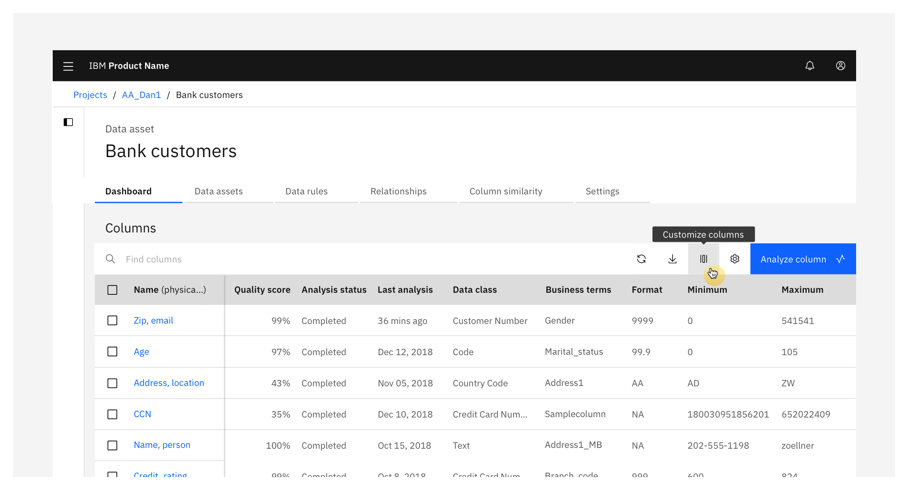

2. The user can de-select or select items with the checkbox to hide or show them from view.
3. After the user made a change, the **Save**-button turns from disabled into active:

<Row>

<Column colMd={6} colLg={6}>

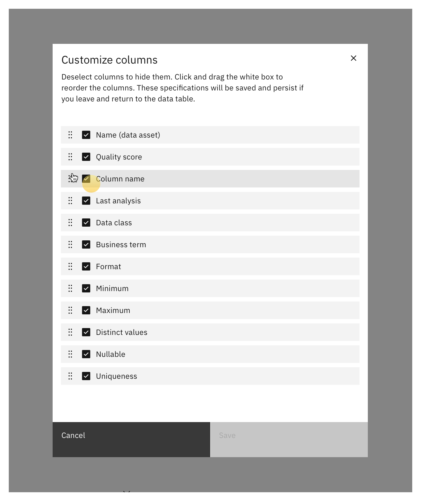

</Column>

<Column colMd={6} colLg={6}>

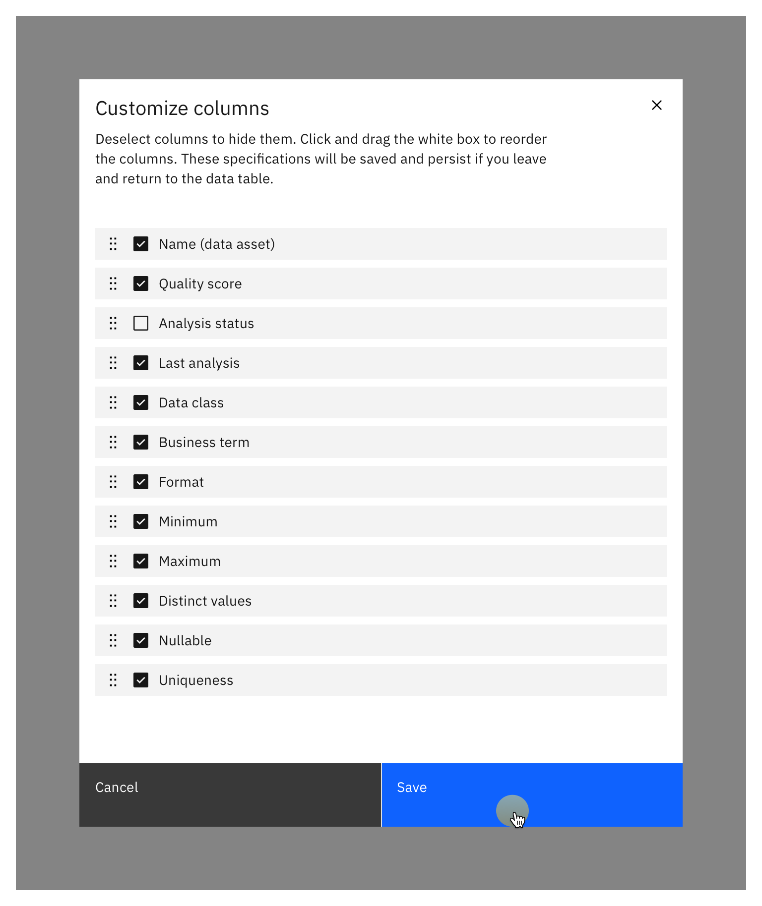

</Column>

</Row>

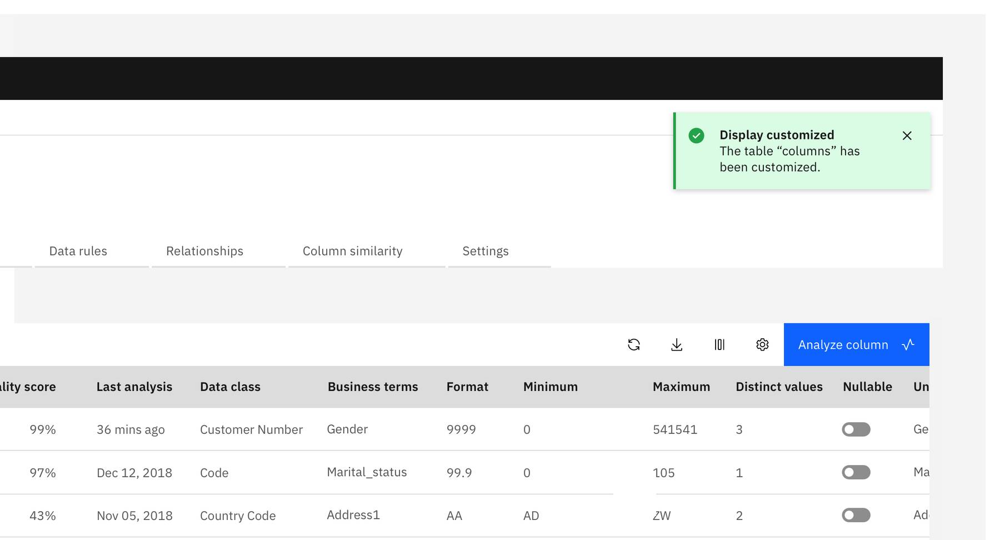

4. The table will appear in the new customized view and a notification pops-up up to confirm the action. The customized view will persist if a user leaves and returns.

- If a user makes changes, columns should stay in place while the user edits. After the user closes the modal, the dialogue updates so that the selected columns are at top.

<Row>

<Column colMd={6} colLg={6}>

</Column>

</Row>

### Large amount of data table columns

When a modal has more than 12 columns, and all items are not viewable in the modal a search bar is needed. Even if a modal has less than 12 columns but the number of columns is not fixed and may increase, include a search bar so that the design can scale.

- For large amount of columns in data tables a search bar is required, so that the user can easily find specific columns. The user is able to enter a search term and gets a filtered list based on the search input. From here the user can select / or deselect specific columns and save the new display. As soon as the user enters a search – the user cannot reorder the columns anymore – Drag & Drop is disabled in that case.

<Row>

<Column colMd={6} colLg={6}>

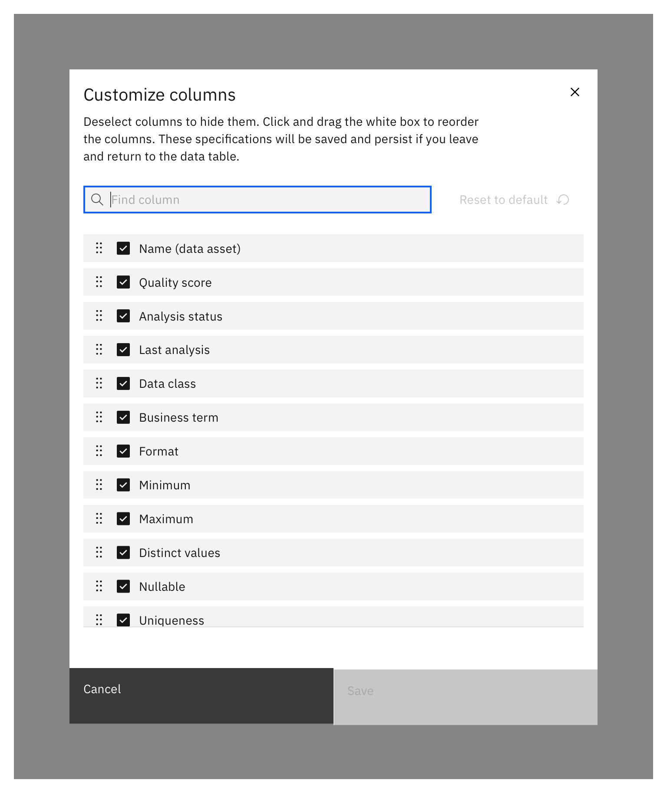

</Column>

<Column colMd={6} colLg={6}>

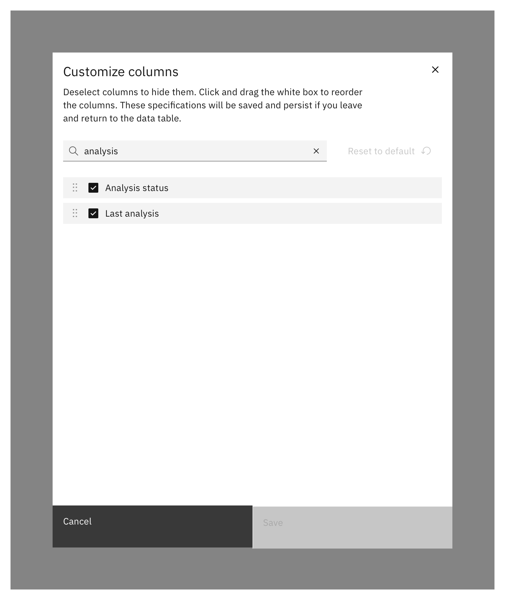

</Column>

</Row>

### Reorder columns in table display 

Our users also need a way to reorder columns in the table display. The default table display order is based on the underlying data and can be done via drag & drop. Note: If the search is active – reorder is not possible for the user.

- Each item in the modal list includes the option to drag & drop items to a different position. The user is able to use the drag icon to rearrange columns.

- Once the user clicks and holds any item/row or the drag icon, it a shadow appears to communicate that it is draggable. (Dragging is not only possible by clicking on the drag icon, also clicking on the whole row performs the action).

<Row>

<Column colMd={6} colLg={6}>

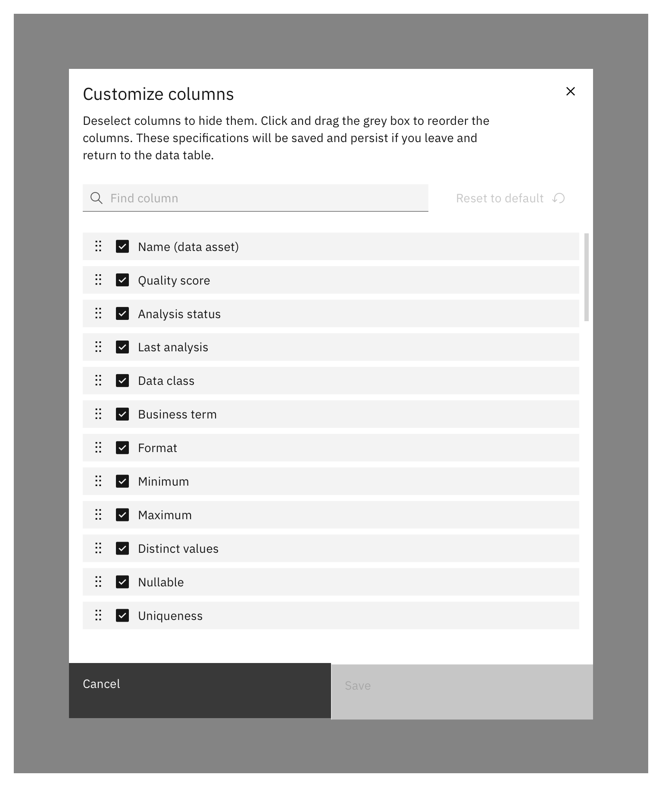

</Column>

<Column colMd={6} colLg={6}>

</Column>

</Row>

- The user gets a visual indication of the dragging starting point and target end point

<Row>

<Column colMd={6} colLg={6}>

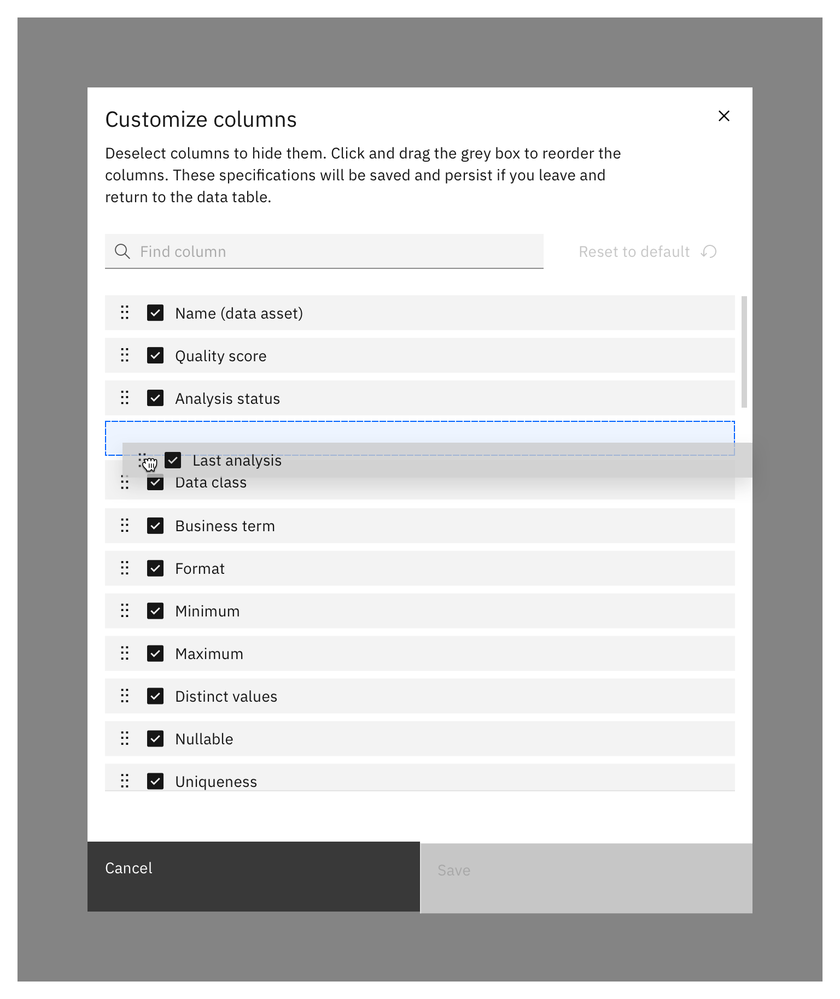

</Column>

<Column colMd={6} colLg={6}>

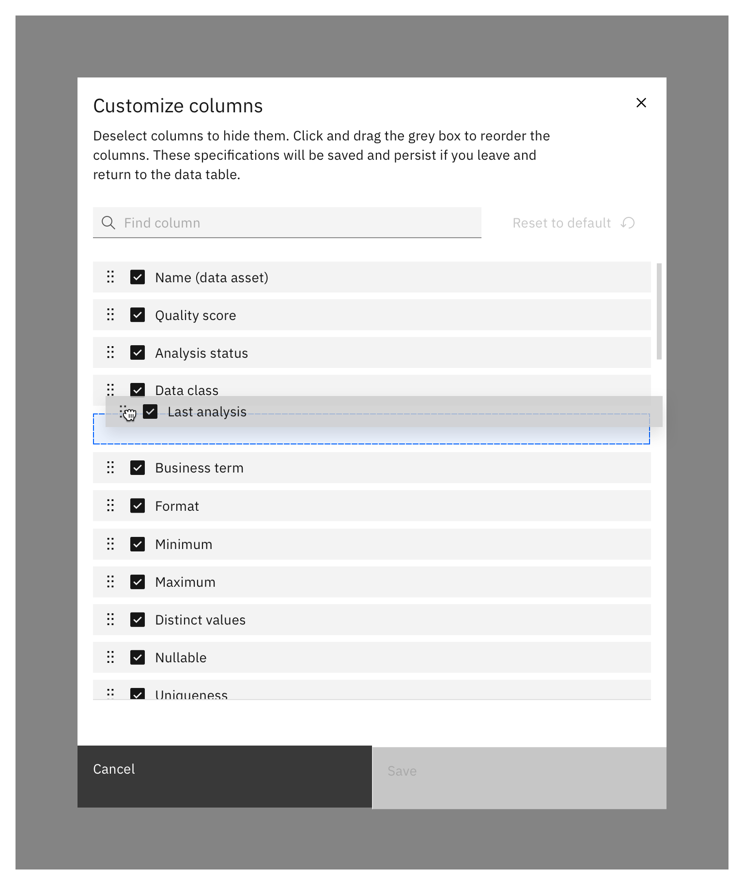

</Column>

</Row>

- The item is placed in the new desired state, and the save button turns active because a change has been made. The user can save the reorder and also receives a confirmation message afterwards.

<Row>

<Column colMd={6} colLg={6}>

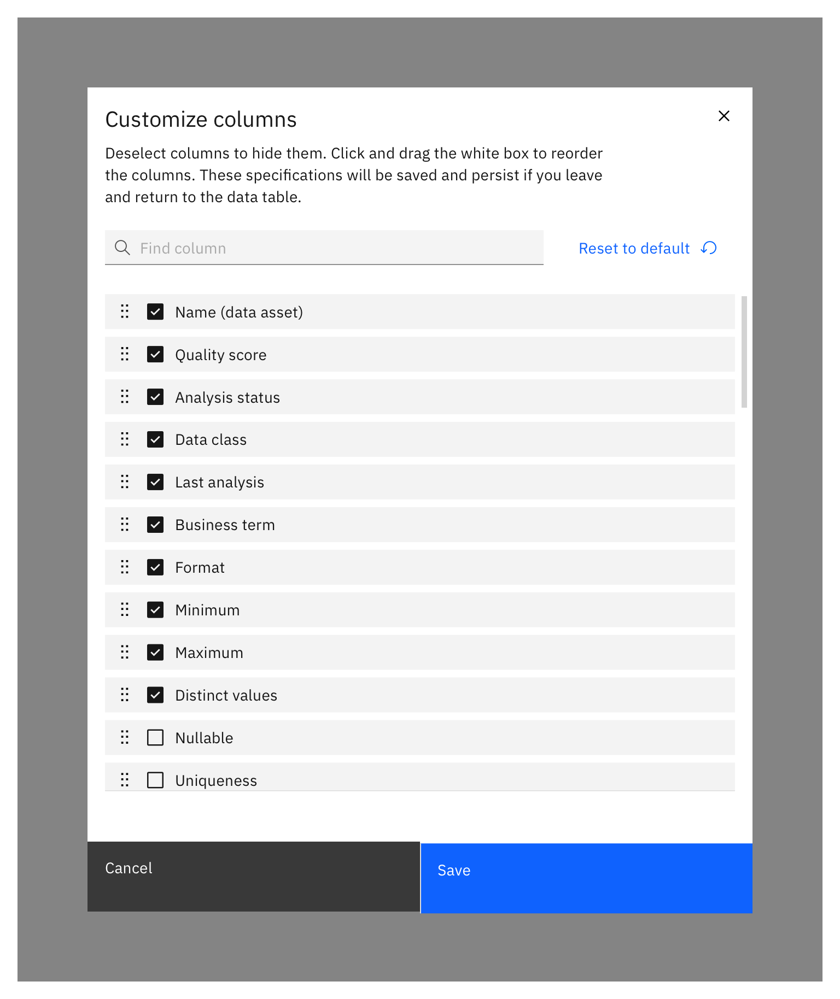

</Column>

</Row>

_For keyboard interactions and accessibility see section Accessibility at the bottom of this page._

## Behaviors, structure, and functionality 

- If no changes were made, the primary action button is disabled until the user has modified something in the modal.
- When a user saves the data table column modifications, a notification pops up to confirm that the table was customized and columns are in a special order or hidden from view based on the last changes made.
- Users are able to reset the settings to default within the modal.

### Scrolling behavior 

For many applications the user needs a way to load more elements in the list as there can be thousands of items and loading them all initially and in some cases this can slow down the loading of the modal. Users should not need to select a 'load more' button to view more items while in a selection mode. Therefore, their intent to look for more items in the list (scrolling) is used to trigger an automatic loading of more items when they pass 2/3 of the available scroll area.

The header is fix on scroll and the list content scrolls behind. Loading is indicated by a skeleton representing three list entries. Usually column loading shouldn’t take long – only rare cases need skeletons here). To hint scrolling the pattern hints half a row behind a fix white bar with a height of 48 px and with a 1 px grey line at the top.

<Row>

<Column colMd={6} colLg={6}>

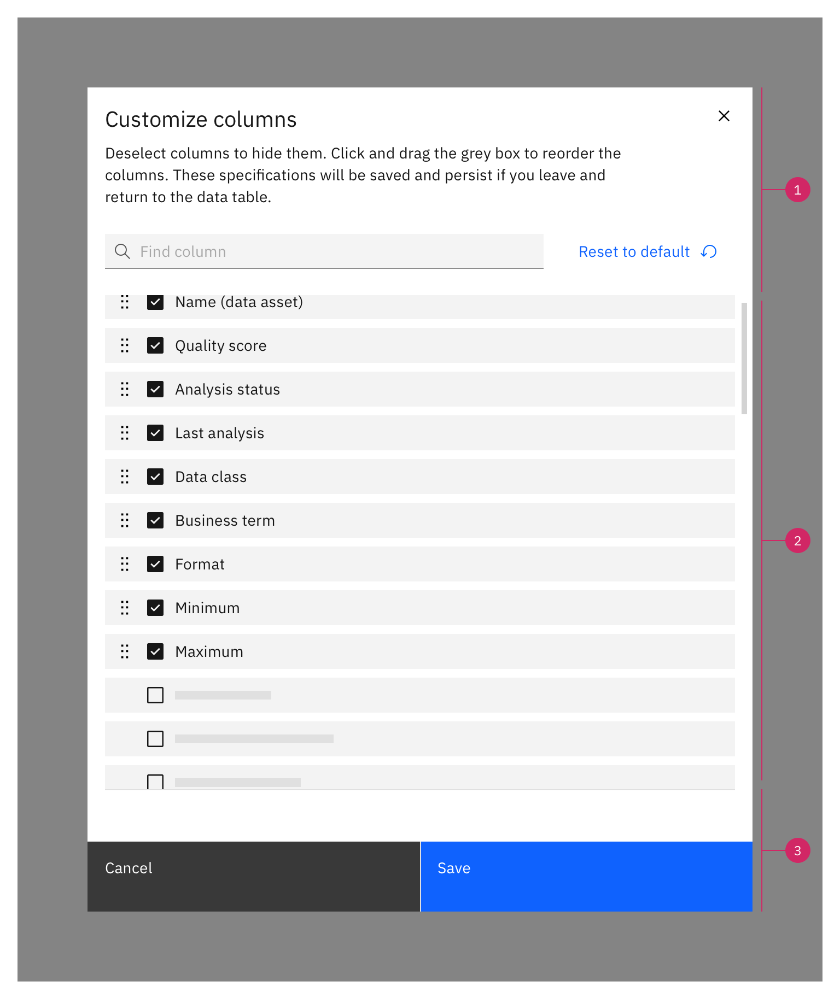

</Column>

</Row>

1. Fix header
2. Scrollable area with skeleton indicating 3 list items
3. Fix footer

### Visual Specs

**Spacing tokens**

<Row>

<Column colMd={6} colLg={6}>

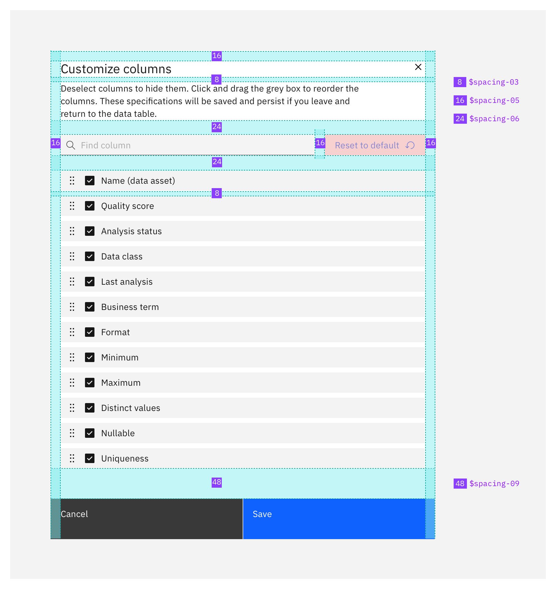

</Column>

</Row>

**Themes**

## Accessibility

When a user tabs to the list, their **focus** will be placed on the **first list item, Name (data asset)**. 
Users can navigate the list with the **arrow keys**:

Tell the user they can navigate the list with the arrow keys. “Listbox”

- The number of items in the list. “1 of 12.”
- The currently focused item is “Name (data asset)”.
- The hidden text, “Press Spacebar to Reorder”, tells the user that reordering the list is a possibility.

Now our user **presses** the **spacebar**.

This call to the live region will provide three pieces of information:

- Confirmation that we have grabbed the Name (data asset) item.
- The position in the list where Name (data asset) currently resides.
- Details on how to operate the drag and drop control using the keyboard, including how to cancel the operation.

Now our user **presses** the **down arrow key**. 
The “Name (data asset)” item is moved down one step in the list.

- The interaction is complete. This live text update confirms the final state:
- The item has been dropped.
- The item is now in position 2 of 4.

See Pattern #1: [Sorting a List](https://medium.com/salesforce-ux/4-major-patterns-for-accessible-drag-and-drop-1d43f64ebf09)

## Related

- [Reorder pattern](hhttps://pages.github.ibm.com/cdai-design/pal/wip/reordering/)
- [Add-select modal pattern](https://ibm.ent.box.com/notes/574380001581?s=vldtegn7sphu7h19et40907f903wnqrt)
