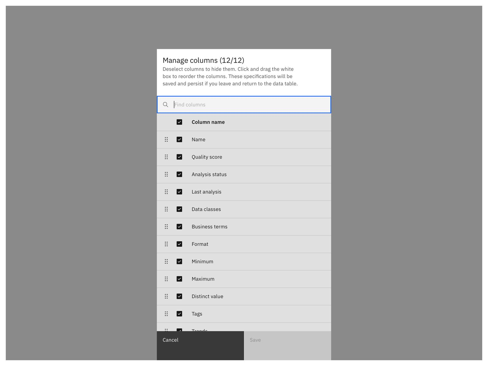
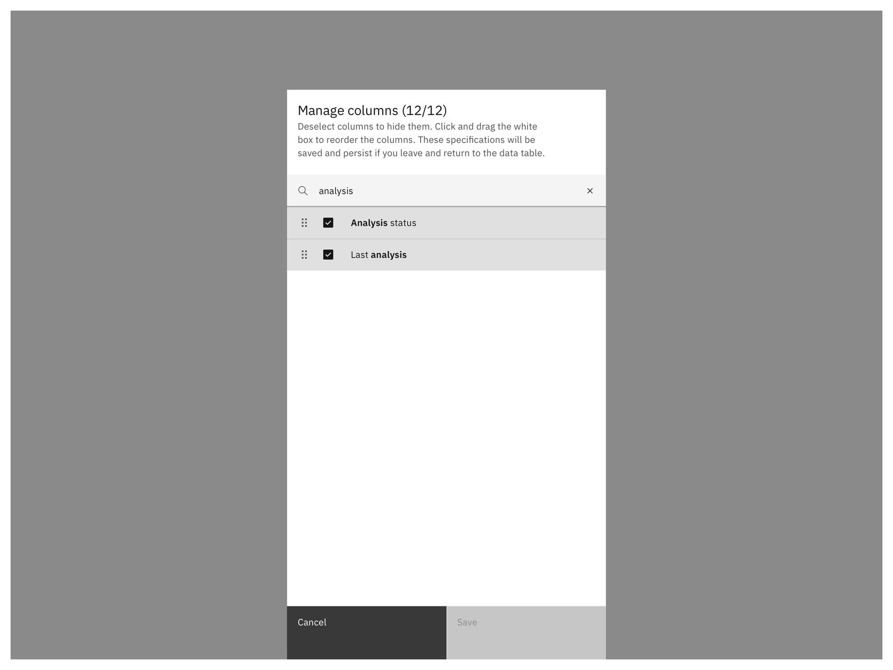

<- [Back to data table overview](https://pages.github.ibm.com/cdai-design/pal/components/data-table/overview) 

<PageDescription>

Users need a way to customize their data table display, so that they can see the columns that provide the most value to them in the order that they want. A customized setting can improve users’ workflow, especially if they are using the data table often and need to check or monitor specific columns of interest. 

</PageDescription>

<AnchorLinks>
   <AnchorLink>Overview</AnchorLink>
   <AnchorLink>Anatomy</AnchorLink>
   <AnchorLink>Behaviors</AnchorLink>
   <AnchorLink>Style</AnchorLink>
   <AnchorLink>Accessibility</AnchorLink>
   <AnchorLink>Related</AnchorLink>
</AnchorLinks>

 

## Overview

Allowing the user to manage the table view, helps to enhance users’ workflow and increase efficiency. Unneccessary columns can be hidden and users can put focus on columns that provide the most value to them. The user should have the flexibility of selecting one or multiple columns to show or hide or rearrange the column order. 

### When to use

- to personalize and customize a data table view
- to focus on specific columns and hide one or multiple columns from view
- to rearrange and reorder columns in a specific order
- to compare two columns in a data table side-by-side
- to bring a hidden column back in view

### When not to use

Don't use this pattern, if there is no need for the user to modify or customize the table view to perform their task – some data tables may need to remain in a fixed order based on how the data is stored.

 

## Anatomy

To manage columns, use the narrow tearsheet component. 

1. Header: Includes a title, description and optional a label. The title should be brief and clearly describe the user’s task or purpose. Use a number count in brackets to indicate how many columns are currently shown in the table display.
2. Search: To find columns in the list.
3. Title: User is able to select all columns at once by selecting the checkbox.
4. Drag & drop icon: To reorder the columns in the list.
5. Active column: Users can select the checkbox to show columns in the table display.
6. Hidden column: Users can deselect the checkbox to hide columns in the table display.
7. Actions: The primary action is Save, and Cancel aborts the task.

## Behaviors 

<AnchorLinks>
   <AnchorLink>Entrypoint</AnchorLink>
   <AnchorLink>Show and hide columns</AnchorLink>
   <AnchorLink>Search</AnchorLink>
   <AnchorLink>Reorder columns</AnchorLink>
   <AnchorLink>Edit column values</AnchorLink>
   <AnchorLink>Fixed column</AnchorLink>
   <AnchorLink>Scrolling</AnchorLink>
</AnchorLinks>

### Entrypoint

The column icon in the data table header is the entry point for managing columns. When the user clicks on the icon, it opens the tearsheet.

### Show and hide columns

A user needs a way to hide one or multiple columns in their table view. The default table view displays all columns in the data table. The user clicks on “manage columns” and a tearsheet pops up so that the user stays in context, and focus on the task without an overload of information. The pattern uses checkboxes since multi-select is an option, and the user can hide or unhide multiple columns in one setting. If no changes are made, the primary action button is disabled. When the user selects a column, the save button is active.

By clicking the checkbox in the title, the user can select all columns at once. When all items are deselected, the primary action button “Save” turns disabled. Deselecting can be a helpful shortcut, if users want to select only 3 of 100 columns. 

If no changes were made, the primary action button is disabled until the user has modified something in the tearsheet.  After the user made a change, the “Save”-button turns from disabled into active:

When a user saves the data table column modifications, the table will appear in the new customized view, a notification pops up to confirm that the table was customized and columns are in a special order or hidden from view based on the last changes made.

If a user makes changes, columns should stay in place while the user edits. After the user closes the tearsheet, the dialogue updates so that the selected columns are at top. 

### Search

For large amount of columns in data tables a search bar is required, so that the user can easily find specific columns and the user is able to enter a search term. In general it is recommended to add a search bar when a table has more than 12 columns, or items are not visible in the viewport anymore.

After entering a search term, the user gets a filtered list based on the search input. From here the user can select / or deselect specific columns and save the new display. As soon as the user enters a search – the user cannot reorder the columns anymore – Drag & Drop is disabled in that case. 

### Reorder columns

Users also need a way to reorder columns in the table display. The default table display order is based on the underlying data and can be done via drag & drop. The user is able to use the drag icon to rearrange columns.

*Note: If the search is active – reorder is not possible for the user.*

The user gets a visual indication of the dragging starting point and for the target.

When the item is placed in the new desired state, the save button turns active because a change has been made. The user can save the reorder and also receives a confirmation message afterwards.

*Note: For keyboard interaction and accessibility see section Accessibility at the bottom of this page.
*

### Edit column values

In some use cases we need to allow users to edit column values in the tearsheet while doing other modifications such as reorder. The user gets icons for editing indicated on hovering the row. Follow the guidance for [https://pages.github.ibm.com/cdai-design/pal/components/data-table/inline-editing](url).

When the user needs an ability to view (or edit) further column info such as the data type, a second column can be introduced to list the info next to the column name. 

### Fixed column

Some tables require the option to freeze the left most column to the side of a horizontally scrolling data table. This allows information in the fixed column to remain visible even when scrolling through the data set. This can be particularly useful if you wish to show a large number of columns. Those freezing columns have to be indicated for the user in the tearsheet during managing. We use the disabled state as well as the “lock”-icon to show the user that actions or modifications can’t be done for a fixed column.

### Scrolling

For many applications the user needs a way to load more elements in the list as there can be thousands of items and loading them all initially and in some cases this can slow down the loading of the tearsheet. Users should not need to select a 'load more' button to view more items while in a selection mode. Therefore, their intent to look for more items in the list (scrolling) is used to trigger an automatic loading of more items when they pass 2/3 of the available scroll area. The header and search bar is fix on scroll and the list content scrolls behind. Loading is indicated by a skeleton representing three list entries. Usually column loading shouldn’t take long – only rare cases need skeletons here.

## Style

Follow the guidance described for tearsheets. The styling and interactions of the list follows the Carbon data table rows.

## Accessibility

When a user tabs to the list, their **focus** will be placed on the **first list item, Name (data asset)**. 
Users can navigate the list with the **arrow keys**:

Tell the user they can navigate the list with the arrow keys. “Listbox”

- The number of items in the list. “1 of 12.”
- The currently focused item is “Name (data asset)”.
- The hidden text, “Press Spacebar to Reorder”, tells the user that reordering the list is a possibility.

Now our user **presses** the **spacebar**.

This call to the live region will provide three pieces of information:

- Confirmation that we have grabbed the Name (data asset) item.
- The position in the list where Name (data asset) currently resides.
- Details on how to operate the drag and drop control using the keyboard, including how to cancel the operation.

Now our user **presses** the **down arrow key**. 
The “Name (data asset)” item is moved down one step in the list.

- The interaction is complete. This live text update confirms the final state:
- The item has been dropped.
- The item is now in position 2 of 4.

See Pattern #1: [Sorting a List](https://medium.com/salesforce-ux/4-major-patterns-for-accessible-drag-and-drop-1d43f64ebf09)

## Related

- [Reorder pattern](https://pages.github.ibm.com/cdai-design/pal/wip/reordering/)
- [Data tables](https://www.carbondesignsystem.com/components/data-table/usage/)
- [Tearsheet](https://pages.github.ibm.com/cdai-design/pal/components/tearsheet/usage)
