<- [Back to data table overview](https://pages.github.ibm.com/cdai-design/pal/components/data-table/overview) 

<PageDescription>

Table filtering allows a user to add or remove data items from a data table by selecting or clearing predefined attributes. 

</PageDescription>

<AnchorLinks>
    <AnchorLink>Overview</AnchorLink>
    <AnchorLink>Variations</AnchorLink>
    <AnchorLink>Anatomy</AnchorLink>
    <AnchorLink>Behaviors</AnchorLink>
    <AnchorLink>Styling</AnchorLink>
    <AnchorLink>Responsive</AnchorLink>
    <AnchorLink>Other filter applications</AnchorLink>
    <AnchorLink>Accessibility</AnchorLink>
</AnchorLinks>

## Overview

Table filtering allows a user to add or remove data items from a data table by selecting or clearing predefined attributes. 
Filters can help a user find something they’re looking for, view available options within a certain set of criteria, and decide 
between many options. These guidelines are an extension of [Carbon's filter documentation](https://www.carbondesignsystem.com/patterns/filtering/).

Filtering results in a table is a different type of action from searching. While both actions can help the user narrow results down, 
searching is meant to help the user find a specific result, whereas filtering allows users to trim results according to its attributes.

Applied filters can affect both the data that is visible in the table and also data that might not be displayed in the columns 
available in the table. Filter options can be displayed in many form components, including [dropdowns](https://www.carbondesignsystem.com/components/dropdown/usage),
 [text inputs](https://www.carbondesignsystem.com/components/text-input/usage), [checkboxes](https://www.carbondesignsystem.com/components/checkbox/usage), 
[radio buttons](https://www.carbondesignsystem.com/components/radio-button/usage), and [date range pickers](https://pages.github.ibm.com/ai-applications/design/components/datetime/overview).

<Row>
<Column colMd={8} colLg={8}>

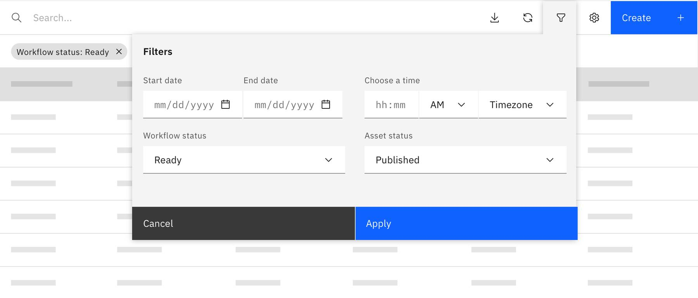

</Column>
</Row>

## Variations

Two different filter variations are currently available for different data table use cases to improve usability and user efficiency. Choose the filtering option that works best for your use case. Consider the data that your users are looking at, what they are trying to achieve, and how they might intuitively narrow down the data.
 

<strong>Note</strong>: Try to use a consistent filter pattern across your product for a familiar experience.

| Type                            | Description                                                                                                                          | 
| ------------------------------- | ---------------------------------------------------------------------------------------------------------------------------------------------------------------------------------------------- | 
| Filter flyout                   | The filter flyout is best used when filtering is not a common action for users, and more filters are available in addition to the columns displayed in the data table. The flyout can include a mix of simple and advanced filter options. The filter flyout is the most common filter pattern.                                    |
| Filter panel                    | The filter panel is best used when users need to see the filters be applied to the data to help them make further decisions to narrow down the data. More filters, in addition to the filters that are visible in the data table, can be displayed in the filter panel so the users can further refine their filtering criteria.   |
| External filters                | To come... |
| Column filters                  | To come... |

#### Filter summary

A filter summary is displayed after filters are applied to the table data. The filter summary is displayed between the table toolbar and the table to provide context to the user about which filters are applied to the information displayed in the filtered table.

## Anatomy

The table filter variations use similar components that are displayed in a different layout. For specific anatomy information, see the variations.

### Filter flyout

<Row>
<Column colMd={8} colLg={8}>

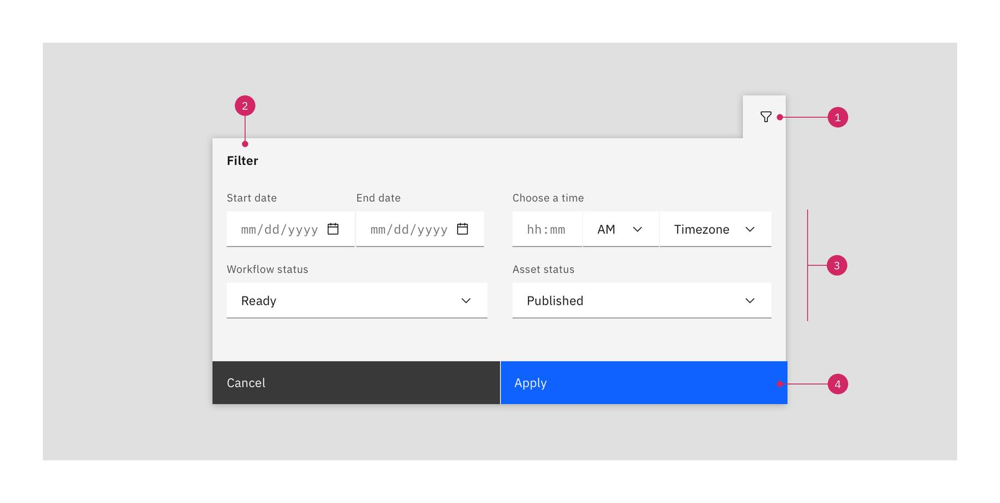

</Column>
</Row>

1. **Filter button:** Icon button that is used to open the flyout and display all available filter options.
2. **Filter header:** Defines the function of the filter flyout or panel.
3. **Filters:** - Options that are provided for users to filter information in the data table. Multiple options can be selected.
4. **Action buttons:** Buttons to trigger the action to apply the selected filters to the data table or cancel the action. 
Buttons should only be used for batch filtering, they can be omitted for live filtering - see section on instant or batch filtering.

<DoDontRow>

<DoDont caption="Do use up to two columns of filters.">

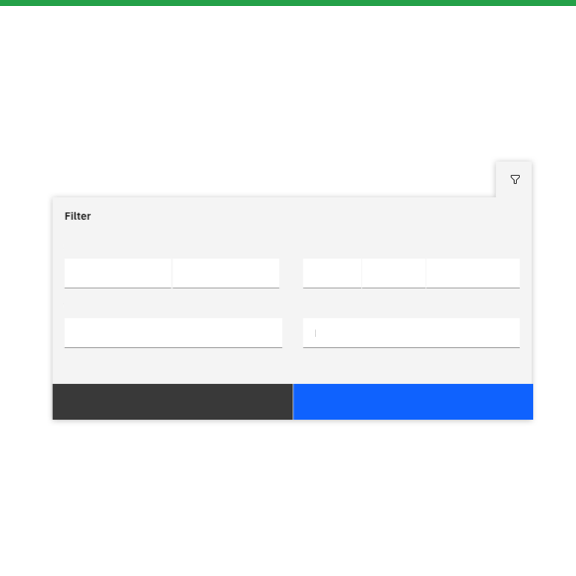

</DoDont>

<DoDont type="dont" caption="Don't display more than two columns of filters.">

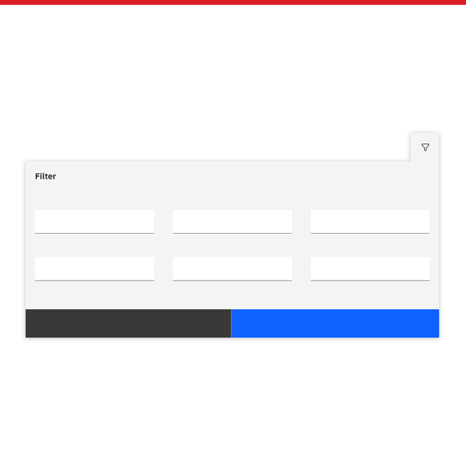

</DoDont>

</DoDontRow>

### Filter panel
<Row>
<Column colMd={12} colLg={12}>

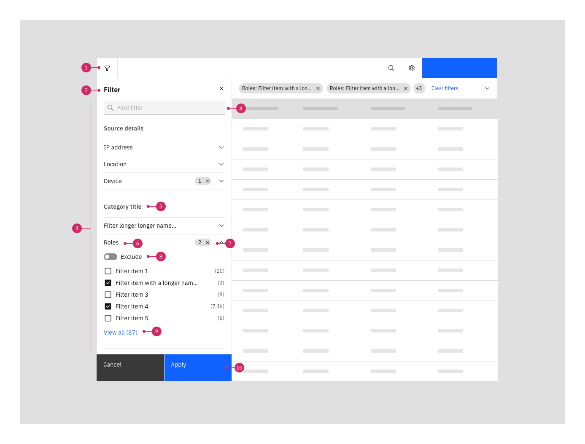

</Column>
</Row>

1. **Filter button:** Icon button that is used to open the flyout and display all available filter options.
2. **Filter header:** Defines the function of the filter flyout or panel.
3. **Accordion (optional):** Collapsible sections that allows up to 10 filter values to be displayed.
4. **Search filters (optional):**Allows the user to search for filter values within the panel.
5. **Categories (optional):** Category headings can be provided to organize related sections. Multiple filter categories can be applied to the same data set.
6. **Filters:** Options that are provided for users to filter information in the data table. Multiple options can be selected.
7. **Filter count (optional):** The number of selected filters for the particular filter section.
8. **Exclude (optional / exploratory):** Displays only results that do not match filter selections.
9. **View all (optional):** Use when the number of filter values exceeds 10. List the first five values in alphanumeric order and then include a **View all (n)** ghost button, where _n_ is the total number of filter values. Launches a tearsheet that contains the complete alphabetized list of filter values.
10. **Action buttons (if batch filtering):** Buttons to trigger the action to apply the selected filters to the data table or cancel the action. The button labels depend on whether the panel is set up for instant or batch filtering.
11. **Tearsheet (optional):** If the number of options for a particular filter are too many to list in the panel, use the tearsheet* to 
show a scrollable list of filter values.

*Follow the [Add & select pattern documentation](https://pages.github.ibm.com/cdai-design/pal/patterns/add-and-select/usage).

<Row>
<Column colMd={12} colLg={12}>

</Column>
</Row>

### Filter summary

<Row>
<Column colMd={12} colLg={12}>

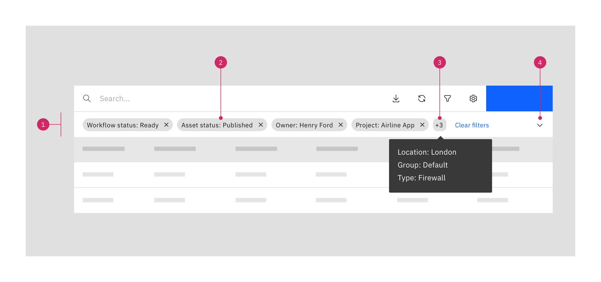

</Column>
</Row>

1. **Filter bar:** Dedicated space to display the filters that are applied to the table.
2. **Filter tags:** Each filter applied to the table with the option to remove the filter. 
3. **Overflow count:** Number of additional filter tags that are applied to the table but are not currently visible in the collapsed state. The overflow is only applicable if all of the currently applied filter tags are not displayed in the collapsed state. The count displays a list of tags on hover.
4. **List all button:** Expands the filter summary to show up to two lines of filters tags. This button only appears if applied filters exceed one line.

<DoDontRow>

<DoDont caption="Do include only one filter per tag so filters can be removed individually.">

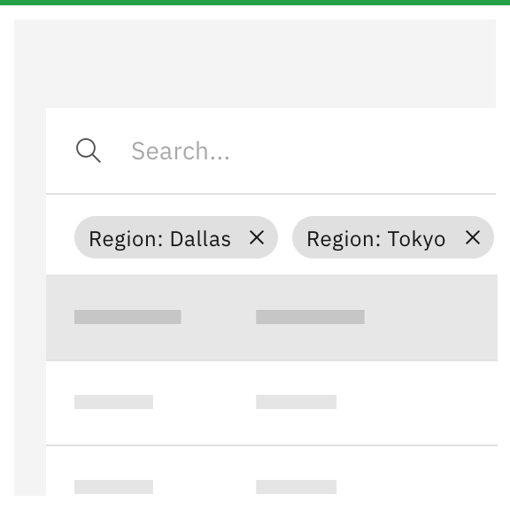

</DoDont>

<DoDont type="dont" caption="Don't group multiple filters together in one tag.">

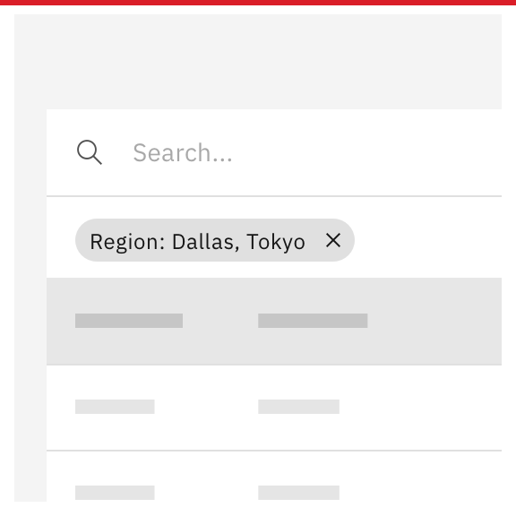

</DoDont>

</DoDontRow>

<DoDontRow>

<DoDont caption="Do include the filter label in the selection tag using a key: value format.">

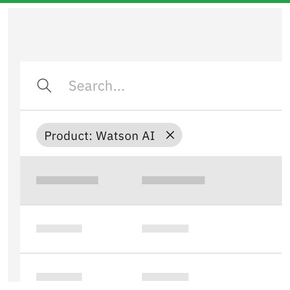

</DoDont>

<DoDont type="dont" caption="Don't display a filter value without its label.">

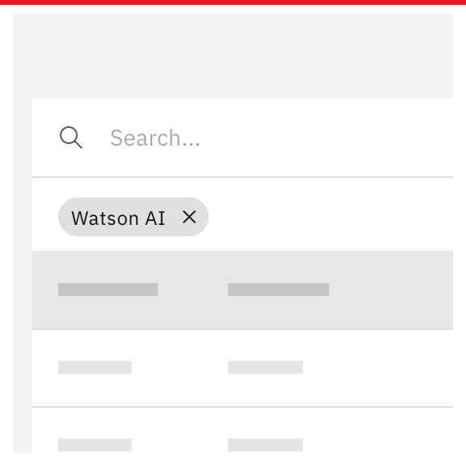

</DoDont>

</DoDontRow>

## Behaviors

### Update methods
Filters can be set to accommodate both [instant](https://www.carbondesignsystem.com/patterns/filtering/#multiple-filters-with-instant-updates) 
or [batch updates](https://www.carbondesignsystem.com/patterns/filtering/#multiple-filters-with-batch-updates). 

<Row>
<Column colMd={8} colLg={8}>

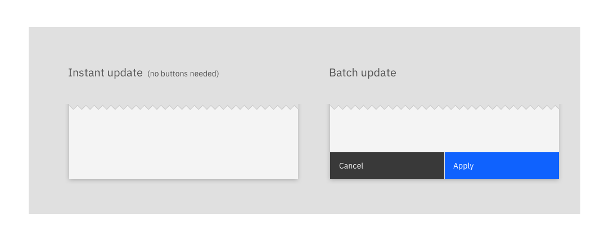

</Column>
</Row>

#### Instant updates
The instant update method returns results after each individual selection is made. This method is preferred because it allows users to 
instantly see updated results. No action buttons are needed for instant updates.

#### Batch updates
The batch update method returns results only after the user clicks **Apply** at the end of the selection process. Batch filtering is 
a good solution for slow data-return speeds because it can prevent the user from waiting for the data to load after every selection. 
The action buttons for batch filtering are **Cancel** and **Apply**. The designer can decide whether to always show these buttons in a filter panel and 
keep them disabled until a selection change is detected or to hide the buttons until a change is detected. 

### Multiselect and batch actions

[Batch actions](https://www.carbondesignsystem.com/components/data-table/usage/#multi-select-and-batch-action) are functions that can 
be performed on multiple items within a table. After the user selects at least one row from the table, the batch action bar is displayed 
at the top of the table, presenting the user with actions that they can take. 

When a data table includes filters, the batch action bar overlays the table toolbar. The filter summary is visible but the user cannot 
add or remove filter selection tags without exiting the batch action mode. 

<Row>
<Column colMd={8} colLg={8}>

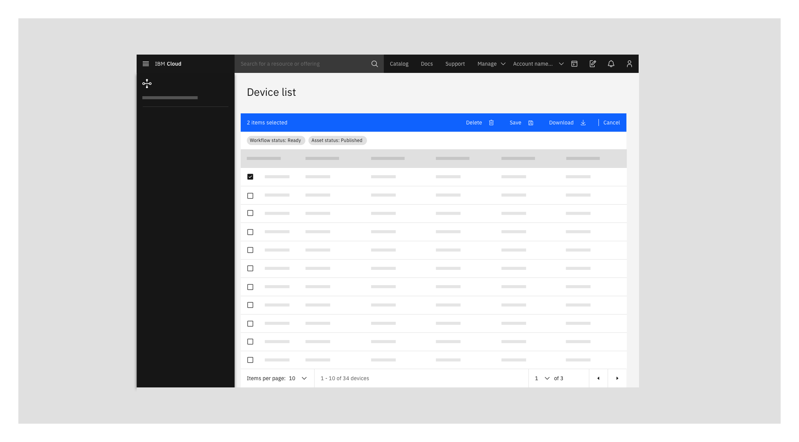

</Column>
</Row>

### Expand and collapse
Follow Carbon's motion guidelines for expanding and collapsing the filter panel. The filter panel will maintain its state (i.e. 
expanded/collapsed accordions and button states) when collapsing and reopening).

<Row>
<Column colMd={8} colLg={8}>

<Video src="images/Filters_08-ExpandCollapseBehavior.mp4" autoPlay loop>
  <track kind="captions" src="images/Filters_08-ExpandCollapseBehavior.mp4" />
</Video>

</Column>
</Row>

### Scrolling 

The filter panel scrolls independently from the table. When a table shows many entries, independent scrolling allows the user to 
still see the filters as they scroll to the end of the table. Do not include any additional scrolling sections within the panel to 
avoid creating a scroll trap. 

If the filter search field is used, include a 1 px rule that is displayed 16 px under the search field when the user scrolls the panel. 

When the filters are applied, the scroll must reset to the top of the table and filter panel. However, any accordions that were opened 
or closed must each remain in their most recent state to avoid confusion. 

<Row>
<Column colMd={8} colLg={8}>

<Video src="images/Filters_09-FilterPanelScroll.mp4" autoPlay loop>
  <track kind="captions" src="images/Filters_09-FilterPanelScroll.mp4" />
</Video>

</Column>
</Row>

### Search

If the user can filter by many options, you can include a search field at the top of the panel to help users find and select filters 
more quickly. As the user types in the field, all matching options for a filter are displayed as checkboxes in a dropdown for that 
filter name. When filters are selected from a filter section, that filter section updates the number in the filter count tag. 

<Row>
<Column colMd={6} colLg={6}>

<Video src="images/Filters_10-FilterPanelSearch.mov" autoPlay loop>
  <track kind="captions" src="images/Filters_10-FilterPanelSearch.mov" />
</Video>

</Column>
</Row>

### Empty state versus no results

The flyout or panel filter is only available to open when potential filter results exist. Therefore, if the page opens and the 
table has an empty state because no results are available, the filter trigger is disabled. However, if the user filters the results 
and the table is empty because there are no matching results, the filter flyout or panel button is enabled so the user can adjust 
the filters to produce results in the table.

### Exclude filters (BETA)
<InlineNotification kind="info">
NOTE: The exclude toggle is considered "Beta", as it has not been sufficiently user tested in different scenarios. Designers who need 
to implement exclude functionality should include a round of usability testing around this pattern in context (and are asked to share 
back findings so we can implement feedback into the pattern). 
</InlineNotification>

For use cases where being able to narrow down to specific items by excluding certain options is important, use the Exclude toggle. The 
Exclude toggle is a filter setting that enables users to select items to INCLUDE or EXCLUDE (e.g. Show items with a Workflow status 
set to Ready, but the Owner is NOT Henry Ford).

<Row>
<Column colMd={8} colLg={8}>

<Video src="images/Filters_11-FilterPanelExcludeBehavior.mp4" autoPlay loop>
  <track kind="captions" src="images/Filters_11-FilterPanelExcludeBehavior.mp4" />
</Video>

</Column>
</Row>

When the Exclude toggle is ON for an individual filter, all items that were already selected will have a strikethrough, and any 
additional items selected will receive a strikethrough when selected. Items not selected will not have a strikethrough to enable 
users to more easily read items they haven't selected. Upon applying the filters, any that have the exclude toggle on will be shown 
in the tags with a NOT in the tag. 

When the Exclude toggle is OFF, no strikethroughs are shown, and the selected values will be included in the results when the filters 
are applied.

<Row>
<Column colMd={8} colLg={8}>

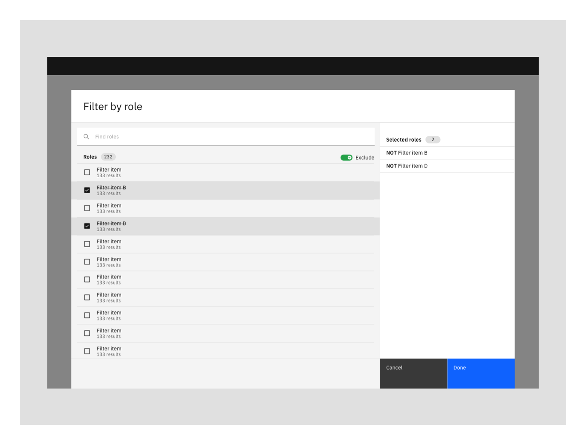

</Column>
</Row>

<InlineNotification kind="info">
Note: This documentation does not cover use cases where being able to select values to both include AND exclude for a given filter is 
needed (i.e. where there is more than one value within a filter). For example, for a Tags filter, where each row can contain more than 
one tag, allow the user to show all results that contain a tag value of Blue but exclude any results that also have a tag value of Red. 
</InlineNotification>

## Styling

### Sizing

#### Filter flyout

The filter flyout can vary in size, depending on how many filter options are available. These recommended sizes are defined by the 
Carbon 16-column grid, and align with other Carbon component sizes such as the modal. Choose the appropriate size based on how many 
filter options you need, maintaining Carbon spacing within the flyout. Avoid using more than two columns of filters or exceeding 70% 
of the table width at any breakpoint.

<Row>
<Column colMd={12} colLg={12}>

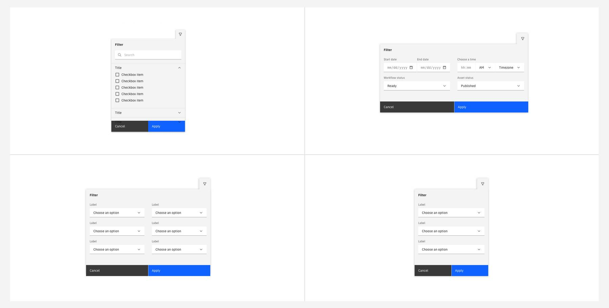

</Column>
</Row>

#### Filter panel
The filter panel has a fixed width of 320px when expanded. The section containing the table and panel should have a height equal to 
the tallest component (i.e. if the data table is taller than the panel, the section will be as tall as the table, but if the filter 
panel contents are longer than the data table, then the section will be as tall as the filter panel). 

If filters are batch applied, the buttons will be fixed to the bottom of the browser window unless the browser is scrolled down to the 
end of the section containing the table and filter panel (at which point the buttons will sit at the bottom of the section). The panel 
has a minimum height of 21rem (336px), and the buttons will stop sticking to the bottom of the browser at this point so as to not overlap 
too much of the panel content.

<Row>
<Column colMd={8} colLg={8}>

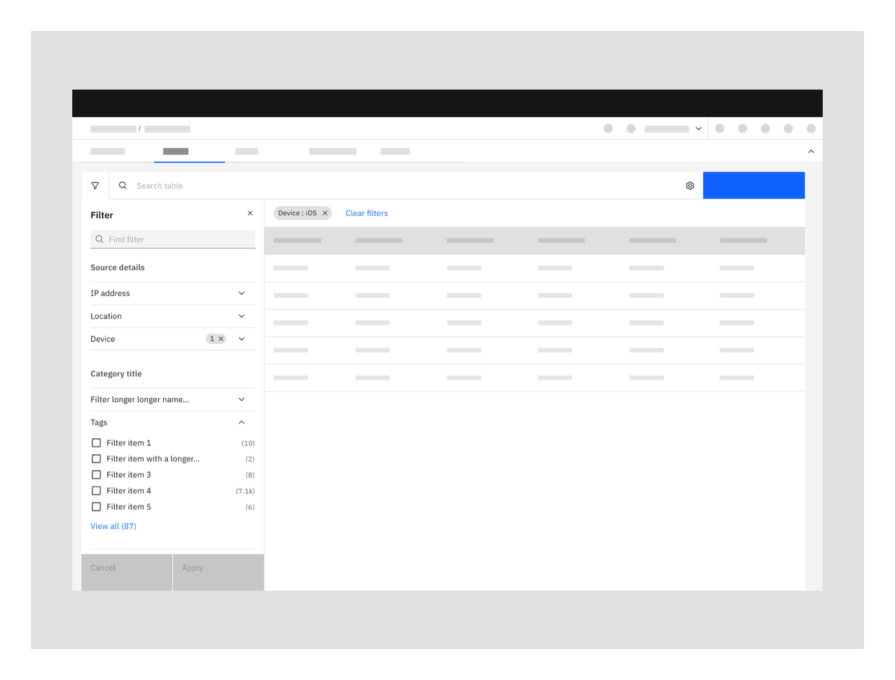

</Column>
</Row>

#### Filter summary
The filter summary has two height options. The 48 px height should be used with the medium, large, and extra large row heights. The 32px 
height should be used with extra small and small row heights. 

### Padding

#### Filter flyout
 
<Row>
<Column colMd={12} colLg={12}>

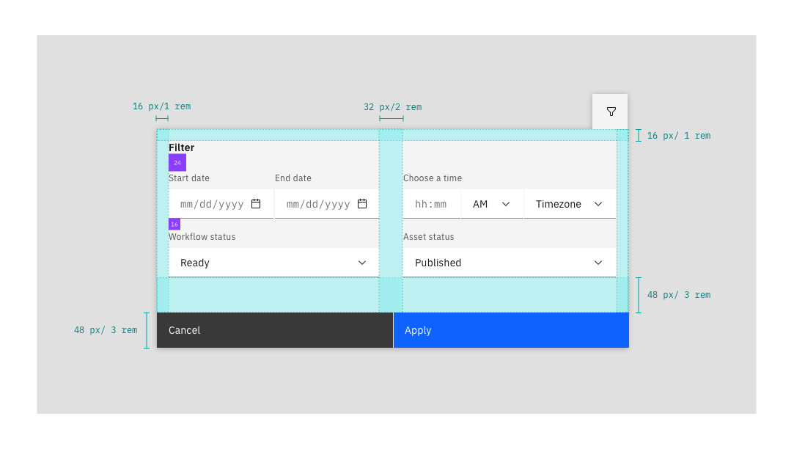

</Column>
</Row>

#### Filter panel
 
<Row>
<Column colMd={12} colLg={12}>

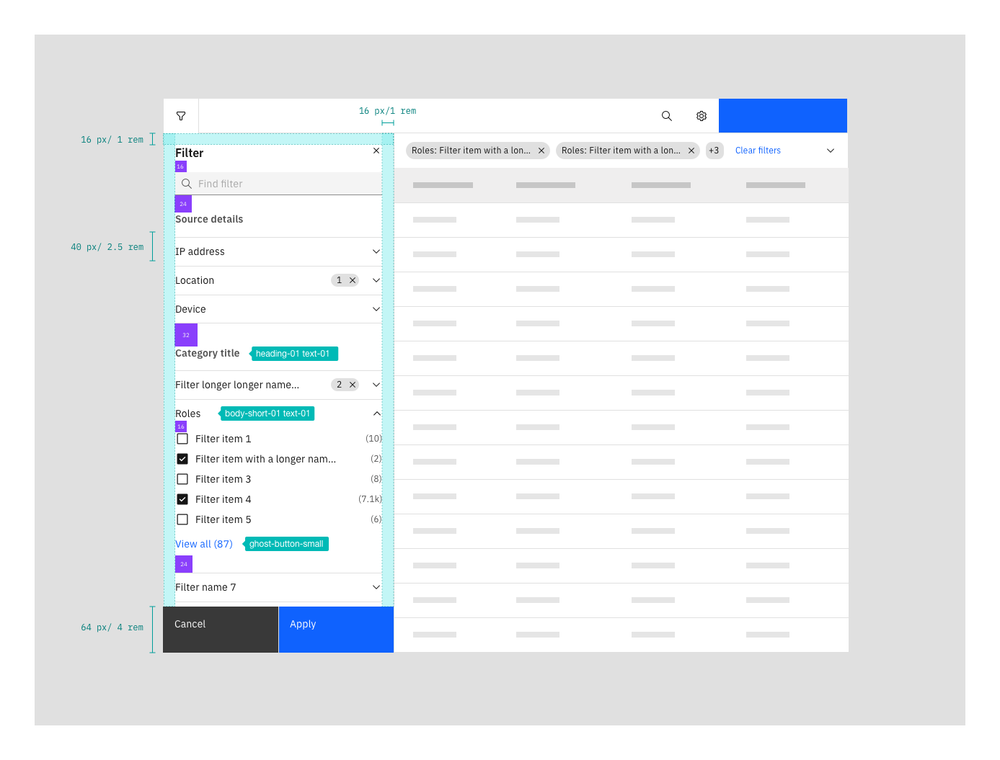

</Column>
</Row>

#### Filter summary
 
<Row>
<Column colMd={12} colLg={12}>

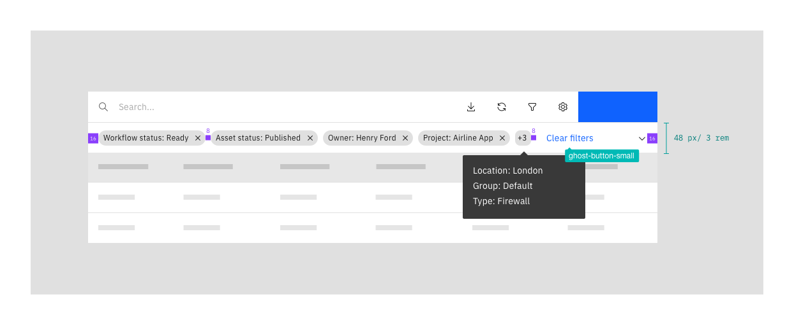

</Column>
</Row>

### Placement

#### Filter flyout
If filtering is not a common user action, the filter button is placed with other table actions in the table toolbar to trigger the 
filter flyout.

<Row>
<Column colMd={8} colLg={8}>

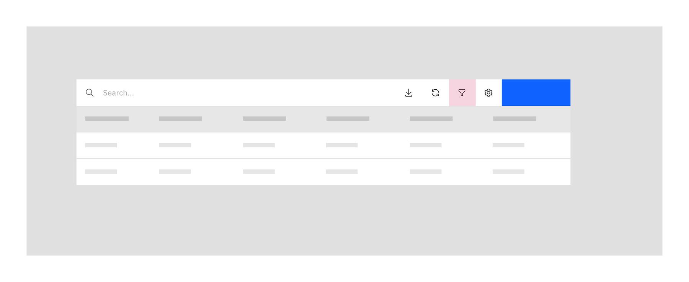

</Column>
</Row>

#### Filter panel
If filtering is a common action and users need to see the filters be applied to the table as they are making their selection, the 
filter button is placed in a separate area on the left of the table. The filter button triggers the display of the filter panel. 

<Row>
<Column colMd={8} colLg={8}>

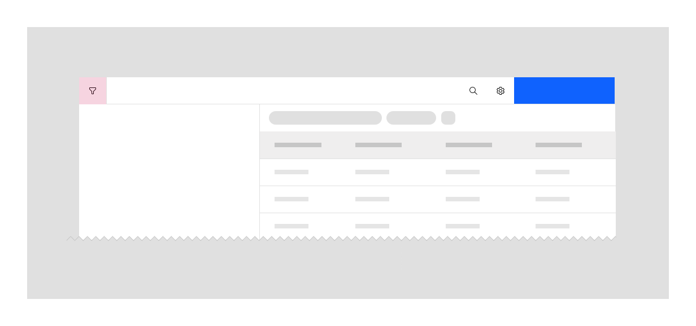

</Column>
</Row>

#### Filter summary
The filter summary is placed between the toolbar and table body.

## Responsive

#### Filter flyout 
The filter flyout width can either be set for different breakpoints, with filters reflowing into a single column as needed. On 
mobile viewports the filter is triggered from the combo button and takes over the screen using the mobile modal. If filters are 
selected, the filter summary will display a filter count. 

<Row>
<Column colMd={8} colLg={8}>

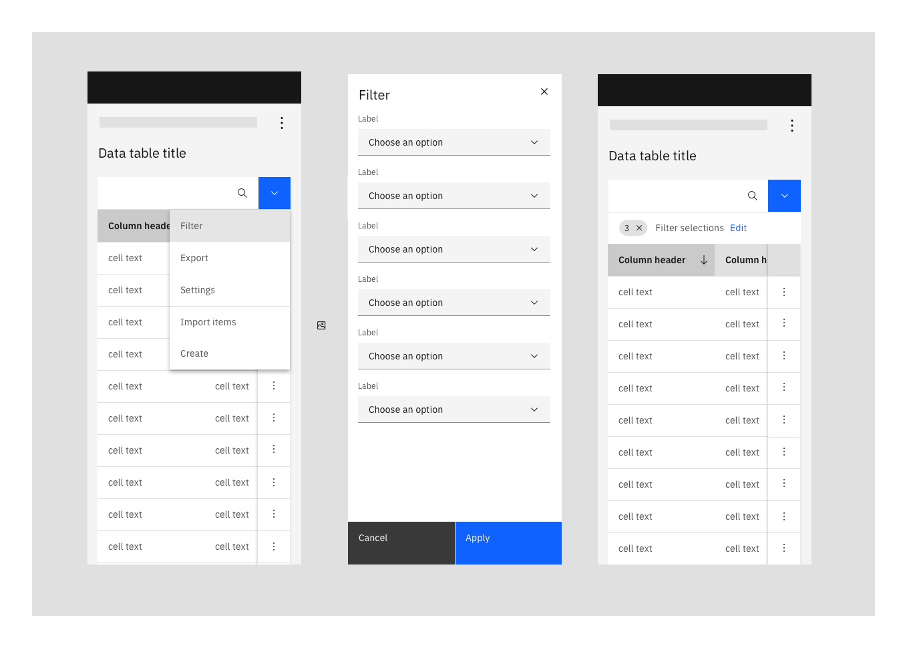

</Column>
</Row>

#### Filter panel

On mobile viewports the filter is triggered from the combo button and takes over the screen using the mobile modal. If filters are 
selected, the filter summary will display a filter count.

<Row>
<Column colMd={8} colLg={8}>

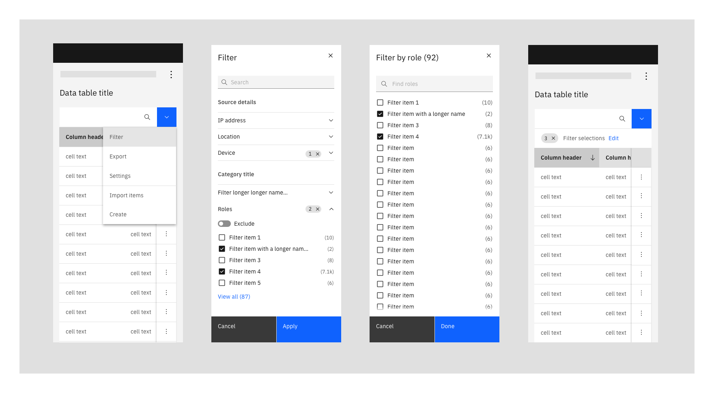

</Column>
</Row>

For more information see [horizontal scrolling and responsive behavior](#).

## Accessibility

- All filter components are keyboard accessible using tab and enter keys.
- Filter labels should be clear and concise.
- Avoid very long names for filter options.

Learn more about [data table accessibility](https://www.carbondesignsystem.com/components/data-table/accessibility).

## Contributors

- Ashley Bock
- Marion Brülls
- Morgana D'Alameida
- Shelley Dignum
- Amanda Furukawa
- Josh Kimmell
- John Livingston
- Virginia Nichoson
- Unnati Shukla
- Diana Tran