import { Breadcrumb, BreadcrumbItem } from "carbon-components-react";
import { Link } from "gatsby";

<Breadcrumb>
  <BreadcrumbItem href="https://pages.github.ibm.com/cdai-design/pal/components/data-table/overview">Overview</BreadcrumbItem>
  <BreadcrumbItem isCurrentPage href="/patterns/data-table/inline-editing">
    Inline editing
  </BreadcrumbItem>
</Breadcrumb>

<PageDescription>

Data table inline editing allows a user to edit the content of cells inline. This may include editing support for all fields or only a subset.

</PageDescription>

<AnchorLinks>
  <AnchorLink>Overview</AnchorLink>
  <AnchorLink>Edit mode</AnchorLink>
  <AnchorLink>Autosave</AnchorLink>
  <AnchorLink>Complex cells</AnchorLink>
  <AnchorLink>Data types</AnchorLink>
  <AnchorLink>Compact columns</AnchorLink>
  <AnchorLink>Validation</AnchorLink>
  <AnchorLink>Cell states & structure</AnchorLink>
  <AnchorLink>Row sizes</AnchorLink>
  <AnchorLink>Light and dark theme</AnchorLink>
  <AnchorLink>Accessibility</AnchorLink>
</AnchorLinks>

## Overview

Inline editing in a data table allows a user to edit the contents of cells inline. This may include editing support for all fields or only a subset. Editing is done inline and in-context to enable quick changes. Inline editing includes editing data types such as text, numbers, dates or selecting a value in a dropdown menu.

### When to use

Use inline editing when users have the ability to edit directly in a data table.

**For example:**

- Change the names of instances in a table
- Setting up keys and values in a table with variables
- Changing permission roles in a table of users
- Changing online statuses in a table of servers
- Provide a spreadsheet-like grid
- Changing a date in a row of data

## Edit mode

#### Inline editing

By default, the user can enter edit mode by any of the following interactions:

- Clicking on the cell
- Pressing `Enter + F2` or `Space` on the keyboard when a cell is focused
- For text and number cells: Start typing while cell is focused. Cell will enter edit mode and replace the current content with the typed character/digit

Inline editing is disabled and hidden when batch edit mode is enabled

- If the user has the ability to multi-select in the data table, inline editing will be hidden (not just disabled, but completely removed from view). This aligns with the guidance for actions in batch edit mode for the data table.

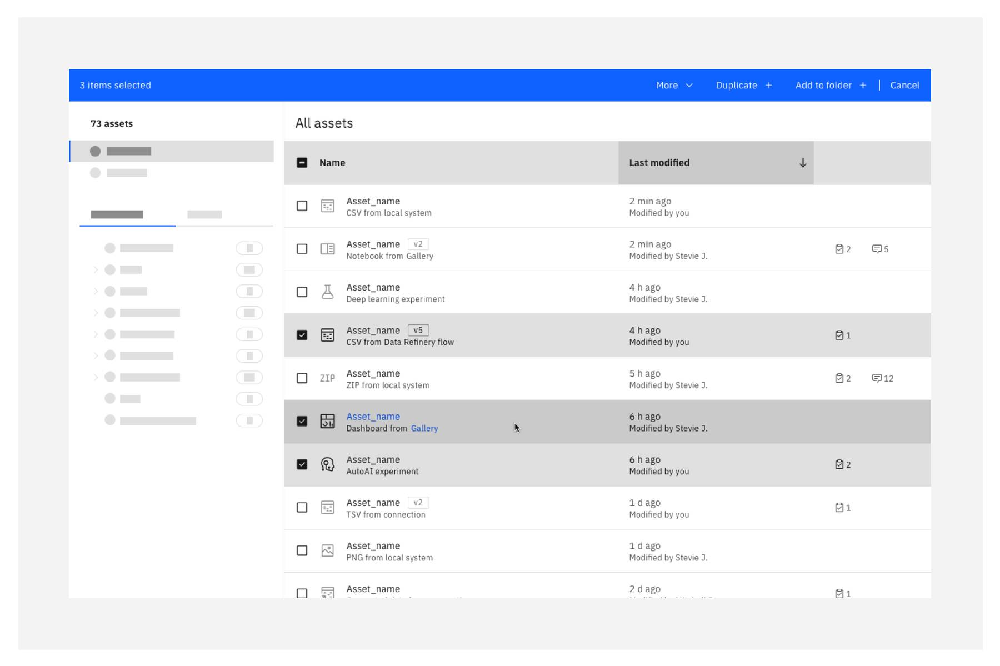

## Auto save

When making inline changes in a cell, changes will be autosaved.

#### Undo and Redo

In auto-save a user should be able to undo/redo changes they have made to a cell by pressing `cmd/ctrl + Z`  to undo, `cmd+shift+z/ctrl + Y` to redo on the keyboard. An "undo" "redo" in the table's toolbar could also be added.

- When they are editing in a cell, the undo and redo captures each time the user types a string into the cell.
- When the user clicks outside of a cell, undo and redo will capture what was in the cell before the edits they made. This does not apply when they confirm changes to a cell in a modal/tearsheet or side panel.

### Undo and redo keyboard shortcuts

**Mac**

- Undo: `cmd+z`
- Redo: `cmd+shift+z`

**PC**

- Undo: `ctrl+z`
- Redo: `ctrl+y`

### When not use

- When the data can't be edited inline and it requires a special interface such has having more than one input field. Use a [transactional modal](https://www.carbondesignsystem.com/components/modal/usage/#transactional-modal) or a [tearsheet](https://pages.github.ibm.com/cdai-design/pal/components/tearsheet/usage/) to edit the changes in, but still following the hover states for inline editing.
- When editing the data in a cell has a wider impact. The [high impact edit pattern](https://www.carbondesignsystem.com/community/patterns/edit-pattern/#high-impact-edit) is typically used when editing has a wider impact. Inform users of the likely consequences of the edit to their system, and inform them that editing cannot be undone. Include a warning stage.

Example of a transactional modal used to edit the data instead of inline.

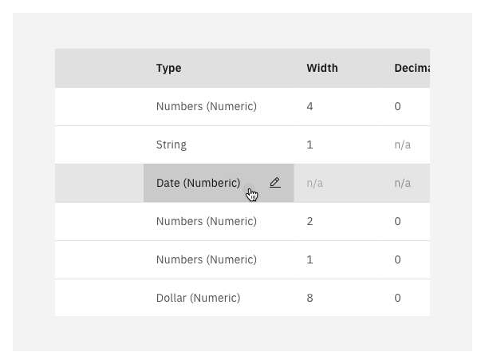
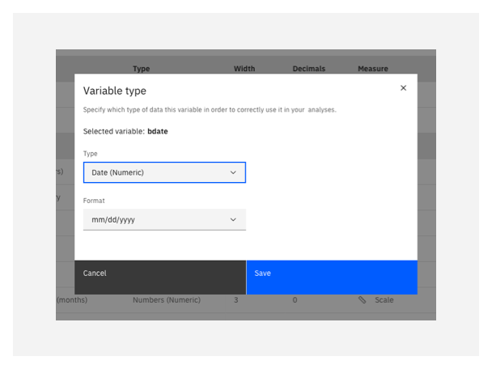

## Complex cells

A complex cell may have one or more more clickable links in one cell.

In the example below, the user has the ability to edit the asset_name, click on the asset_name to open the asset, and click on the location path of the asset, which will bring them to where that asset lives. It has an edit icon that appears closer to the content of a cell. To edit the name, the user will need to click on the icon to enable the inline editing.

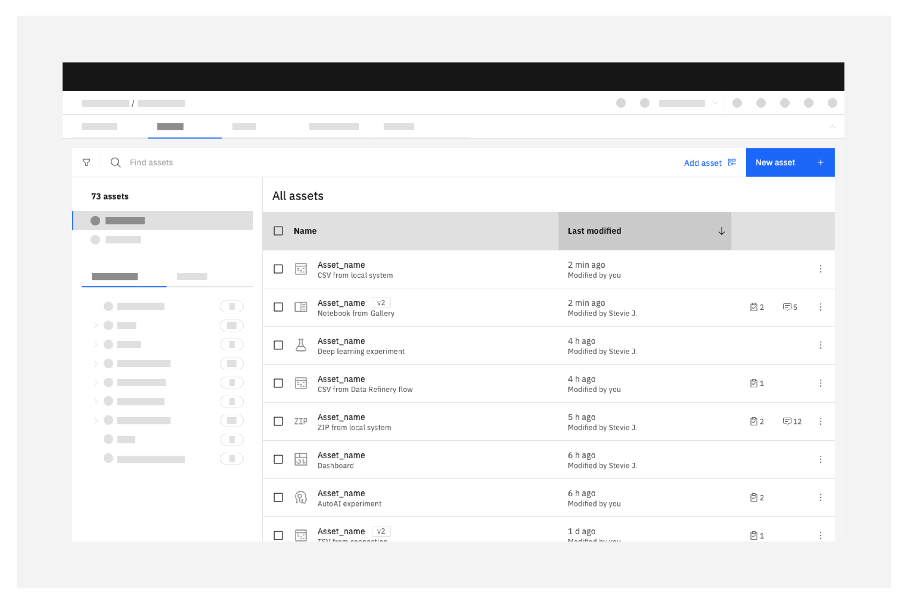
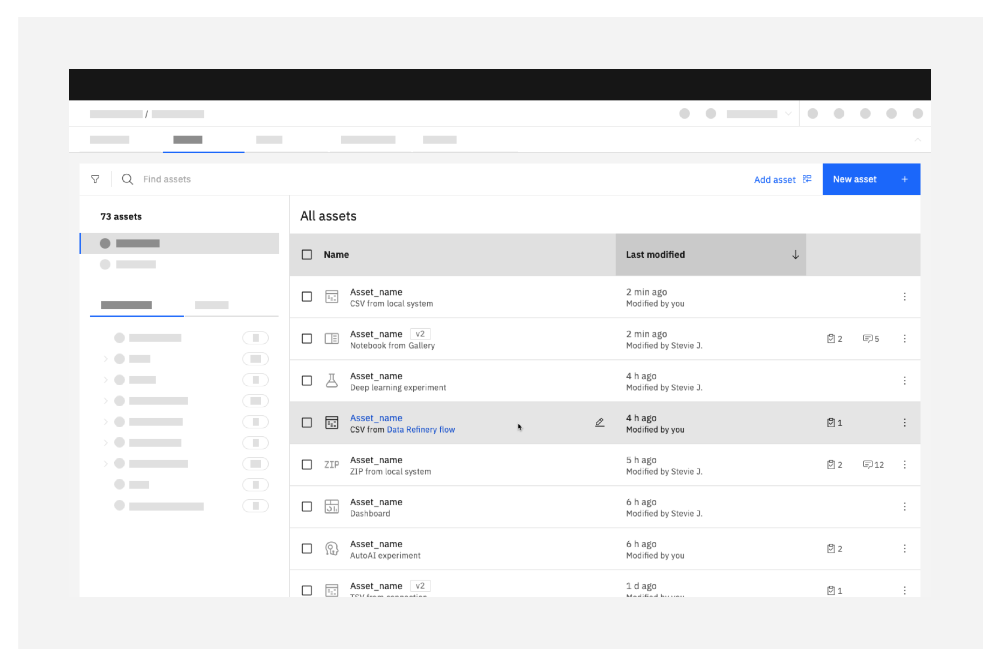
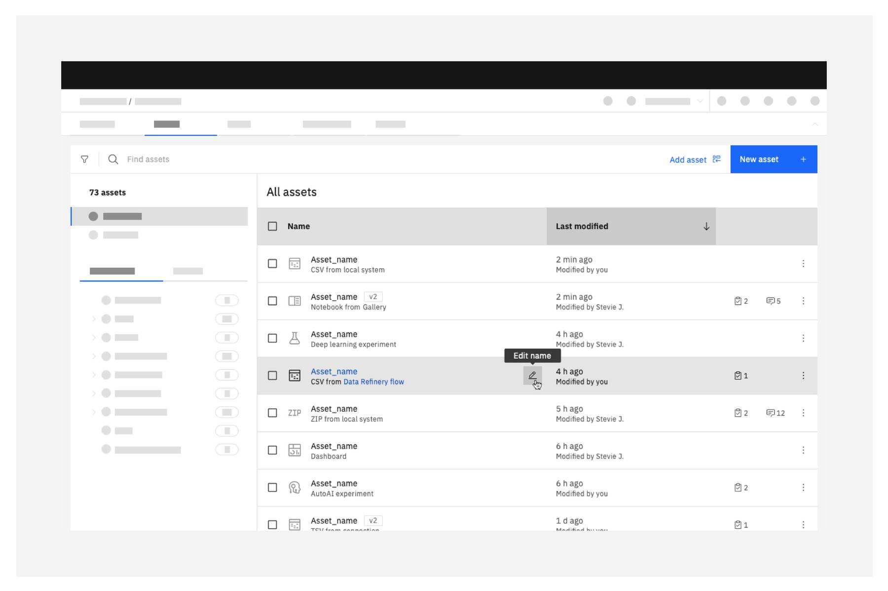
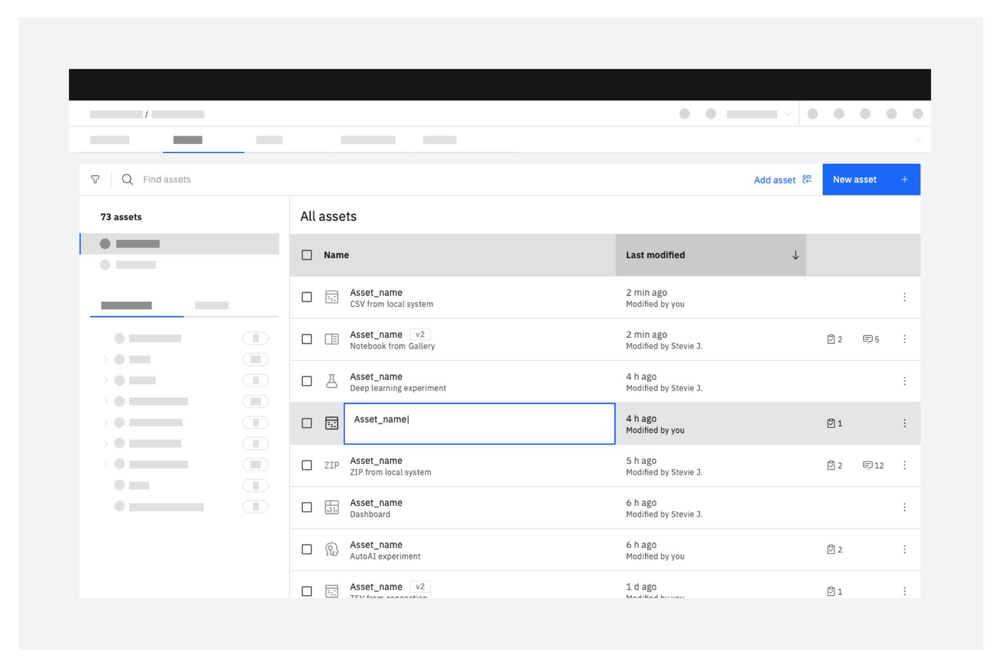

## Data types

There are 4 data types which can be edited directly inside the data table.

**Data types:**

- Default
- Selection
- Date
- Number input without steppers
- Number input with steppers

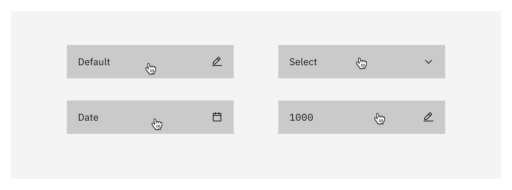

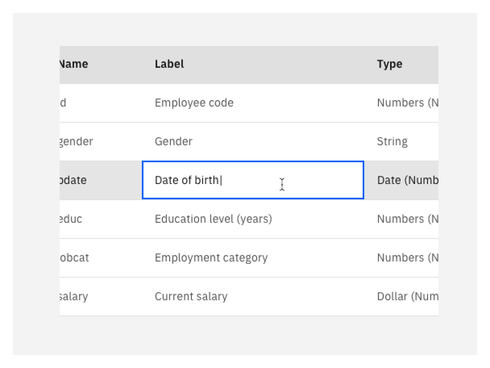

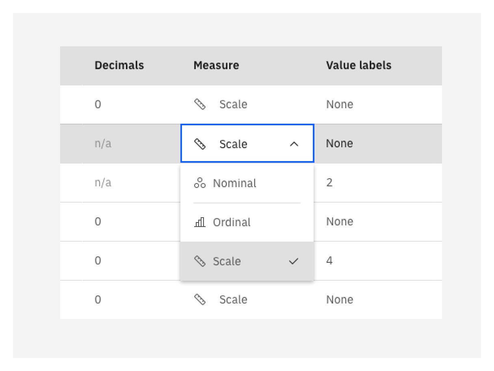
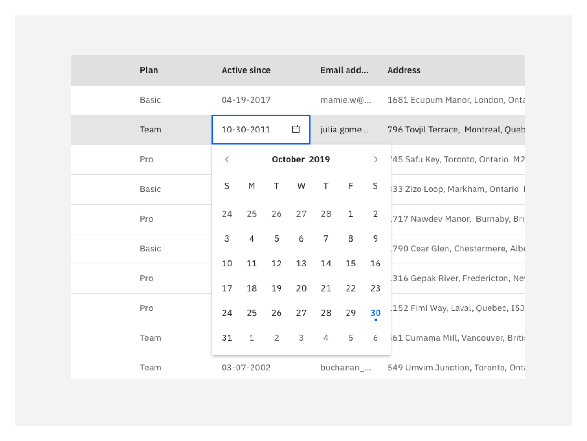
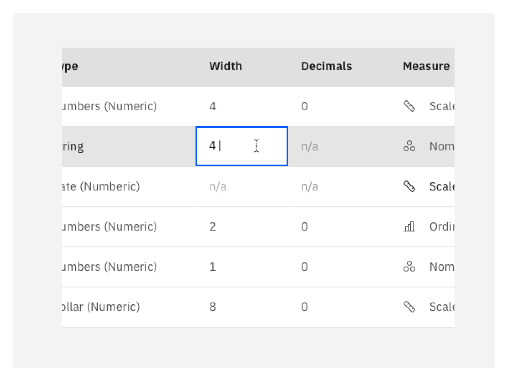
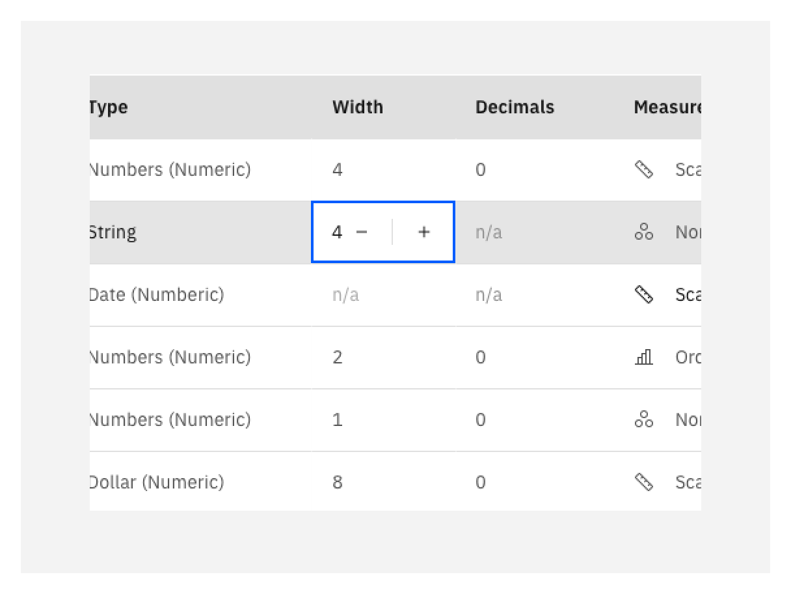

### Number input

The number input could be used without the stepper. Do not use the steppers when large value changes are expected. They work best for making small, incremental changes that require only a few clicks.

The default type can be used to either inline edit, trigger a modal or a side pane if needed.

| Name      | Icon            | Handling component(s)                                  |
| --------- | --------------- | ------------------------------------------------------ |
| Default   | `Edit16`        | TextInput, Transactional modal, Side panel, Tear sheet |
| Selection | `ChevronDown16` | Dropdown, Multi-select, Combobox, Select               |
| Date      | `Calendar16`    | DatePicker                                             |
| Number    | `Edit16`        | NumberInput                                            |

## Compact columns

When a column has been resized to a compact size where the cells are truncated, if the user clicks on the cell to activate edit mode, the cell will expand the width of the longest value in that column with a max-width of 40rem (640px). Once the user has saved the changes they have made to the cell, it will revert back to the column size it was before editing.

When editing a compact column, the column will resize. Once the user has finished editing the data, the column width will revert back to it's original width.

When a compact column appears on the very right edge of the table, the cell will remain in view and the columns on the left side of the column will push left.

| Compact column max-widths | Width         |
| ------------------------- | ------------- |
| Max-width                 | 40rem (640px) |

## Overflow content in a cell

When inline editing in a cell, if the text exceeds the width of the cell it will begin to push the text left.

## Validation

### Cell validation

Input validation is communicated in the active cell and an error state. If an error is present, the user won't be able to confirm their change with Enter or Tab. The user will need to enter the valid input in order for the error to disappear.

If the user loses focus without resolving the issue, the change is automatically discarded and the cell's content is reverted to its previous value.

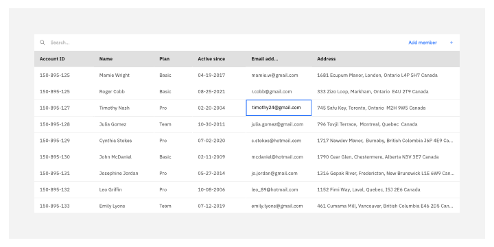

### System errors

If any error has occurred in the back end while a user was inline editing. An inline notification will appear above the table to let the user know that there was an error and the edit they just made was not saved. The guidance follows the inline notification, which requires the user to dismiss the error.

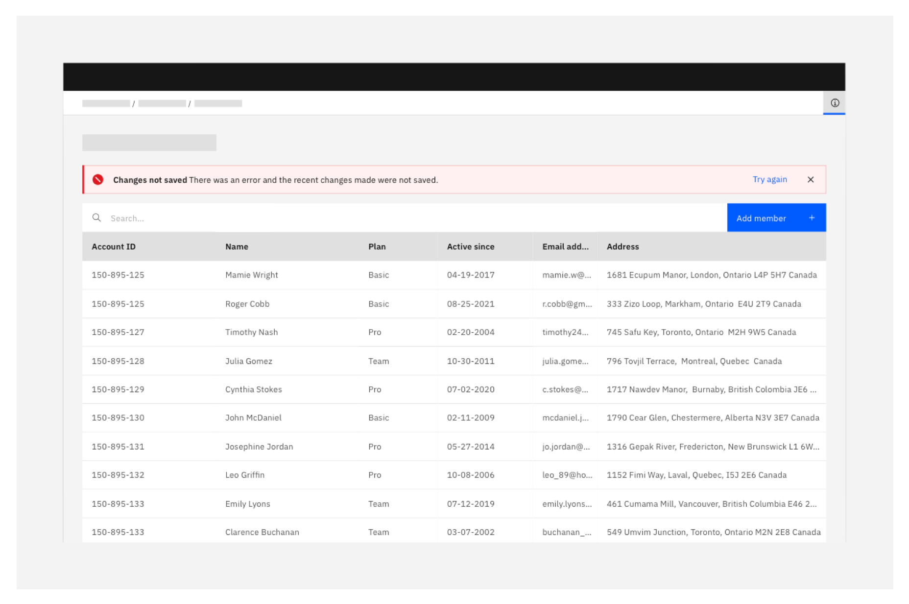

## Cell states and structure

- Editable cells
- Rows with a checkbox
- Complex cells

#### Cell states

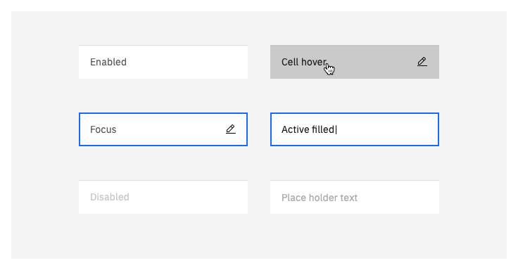

| Interactive states | Background Tokens                |
| ------------------ | -------------------------------- |
| Editable cell      | Background: `$field-01`          |
| -                  | Text color: `$text-02`           |
| -                  | Icon: `$icon-02`                 |
| Cell Hover         | Background: `$hover-selected-ui` |
| -                  | Text color: `$text-01`           |
| -                  | Edit icon: `$icon-01`            |
| -                  | Cursor: `hand`                   |
| Active filled cell | Background: `$active-ui`         |
| -                  | Focus border: `$focus`           |
| -                  | Text color: `$text-01`           |
| -                  | Cursor: `Text`                   |
| Focus cell         | Background: `$field-01`          |
| -                  | Focus border: `$focus`           |
| -                  | Text color: `$text-02`           |
| -                  | Edit icon: `$icon-02`            |
| Disabled cell      | Background: `$field-01`          |
| -                  | Text color: `$disabled-02`       |

#### Structure

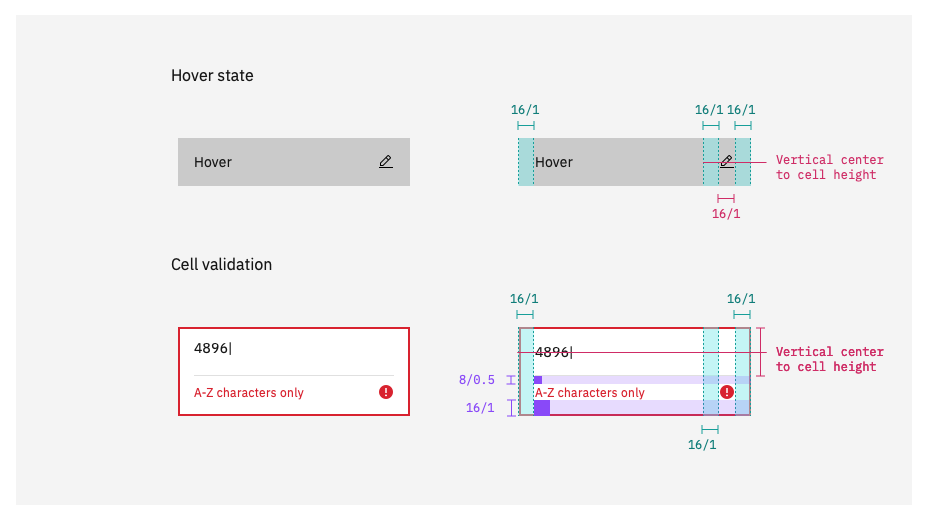

#### Rows with selection (checkbox)

The hover state of a row that is selected with editable cells have a different hover state style. The hover state style is a border on the row in `$ui-05`.

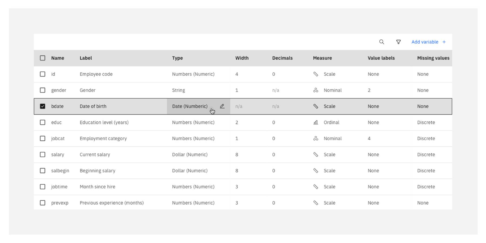

| Interactive states | Background Tokens |
| ------------------ | ----------------- |
| Selected row hover | Border: `$ui-05`  |

#### Complex cell states

Complex cell states follow the style of clickable rows. Here are the row states along with the active inline edit.

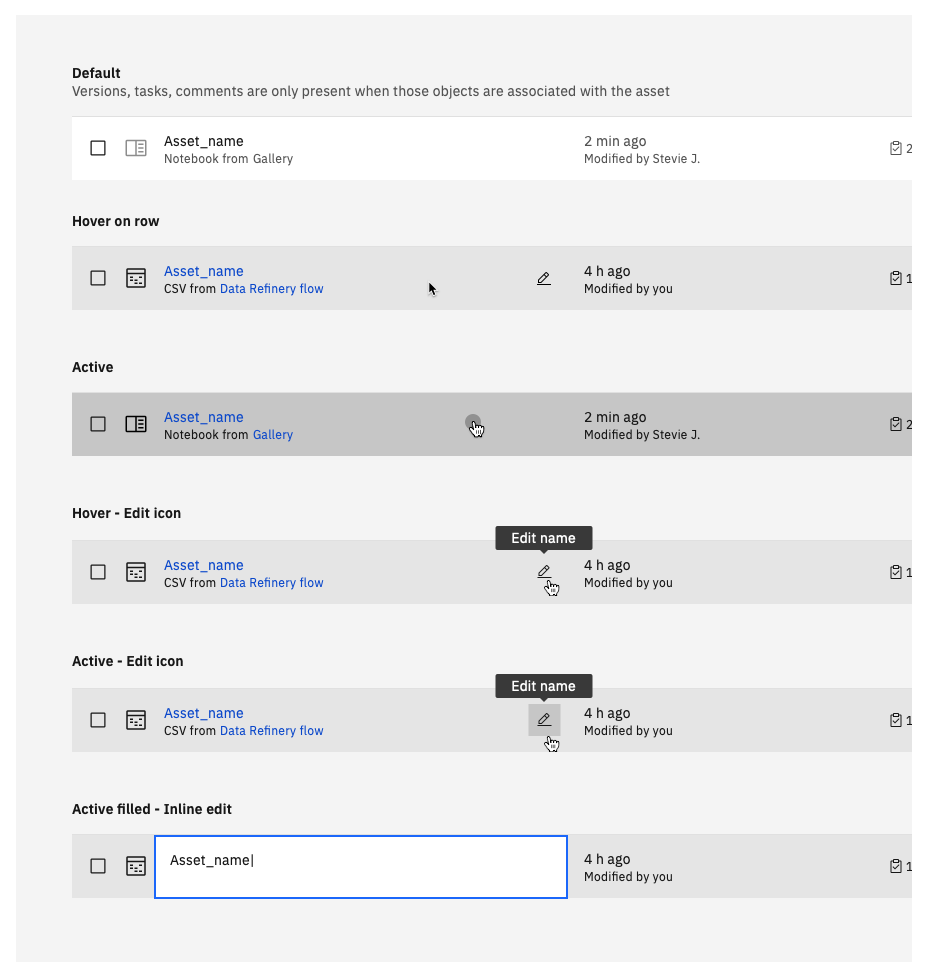

| Interactive states          | Background Tokens                 |
| --------------------------- | --------------------------------- |
| Hover on row                | Background: `$hover-ui`           |
| -                           | Text color: `$text-01`            |
| -                           | Icon: `$icon-01`                  |
| -                           | Cursor: `default`                 |
| Hover on edit icon          | Ghost button icon only: `$hover`  |
| -                           | Cursor: `hand`                    |
| Active - Edit icon          | Ghost button icon only: `$active` |
| -                           | Cursor: `hand`                    |
| -                           | Text color: `$text-01`            |
| -                           | Cursor: `Text`                    |
| Active filled - Inline edit | Background: `$active-ui`          |
| -                           | Focus border: `$focus`            |
| -                           | Text color: `$text-02`            |
| -                           | Text color: `$text-01`            |
| -                           | Cursor: `Text`                    |

#### Structure

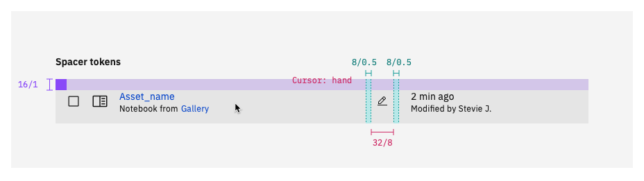

| Interactive states | Background Tokens            |
| ------------------ | ---------------------------- |
| Edit icon          | Small ghost button icon only |

## Row sizes

Inline editing scales across the 3 different data table row sizes, which are 32 short, 48 default and 64 tall.

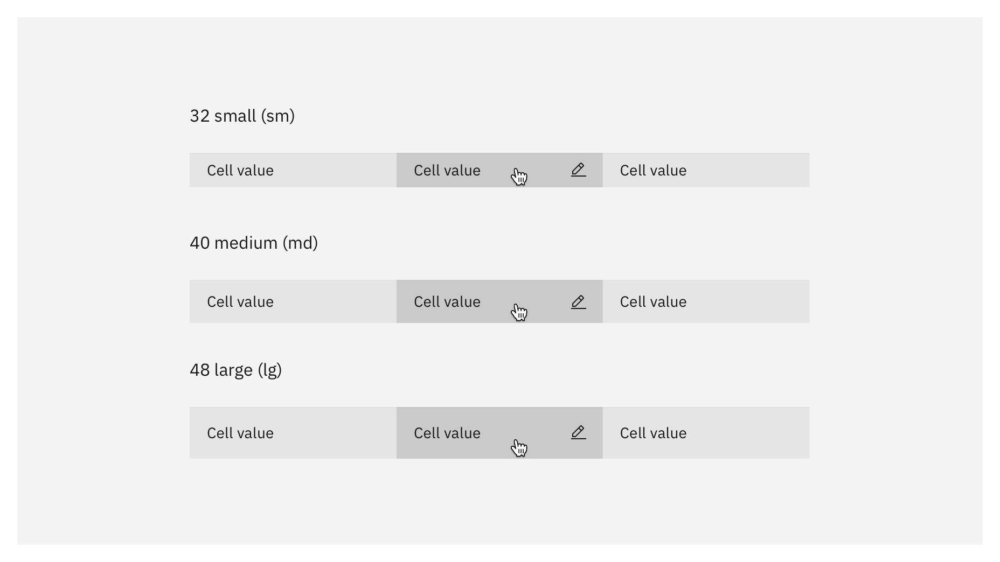
