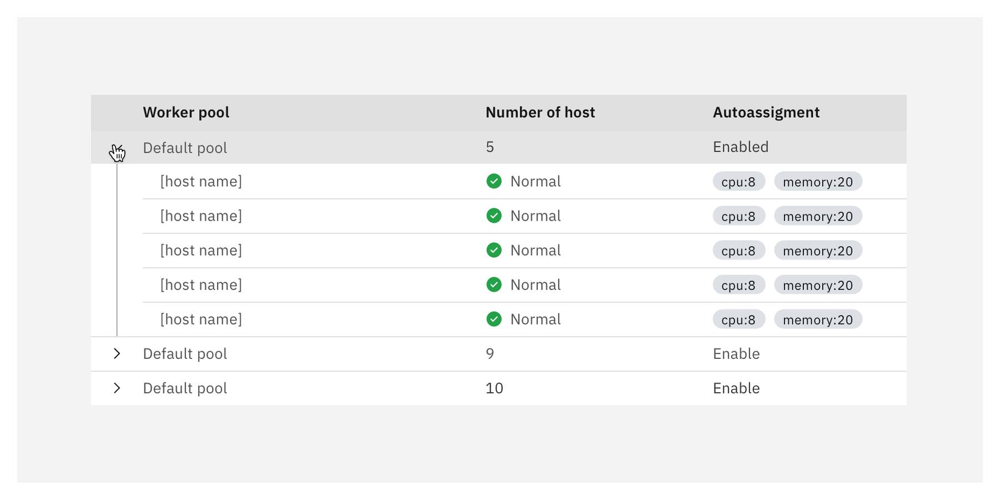

import { Link } from "gatsby";

<- [Back to data table overview](https://pages.github.ibm.com/cdai-design/pal/components/data-table/overview) 

<PageDescription>

Nested rows allow disclosing content in data tables progressively by displaying primary data first (parent row) and enabling users to navigate secondary information levels (child rows).

</PageDescription>

<AnchorLinks>
  <AnchorLink>Overview</AnchorLink>
  <AnchorLink>Anatomy</AnchorLink>
  <AnchorLink>Spacing, alignment and size</AnchorLink>
  <AnchorLink>Nesting levels</AnchorLink>
  <AnchorLink>Behaviors</AnchorLink>
  <AnchorLink>Best practices</AnchorLink>
  <AnchorLink>Related</AnchorLink>
</AnchorLinks>

## Overview

Data tables can organize and display complex and dense data in the UI. This complexity sometimes includes multiple relationships, hierarchies or categories that need to be presented in a digestible way for our users to consume or take action on. 
Nested rows display sublevel rows that follow the primary table's structure (columns). Examples of nested rows include the display of categories and child-to-parent relationships.

<Row>
<Column colMd={8} colLg={8}>

<GifPlayer color='dark'>

</GifPlayer>
</Column>
</Row>

### When to use

Nested rows help to progressively disclose sublevels of information inside a data table and allowing the user to compare data within context.

- Use nested rows when the data sublevels do not need to be always on view and collapsing rows do not affect the user's workflow.
- Use nested rows when users need to compare various data within the table context.
- Use nested rows when you need to organize rows in a child-to-parent relationships. Children rows must have the same type and number of columns.

### When not to use

**Reviewing data requires focus and a bigger viewport**. If it is not necessary to compare data within one table, we recommend evaluating if a different UX pattern might be the better choice. Nested rows make sense if users want to compare data in one place but can also lead to scalability issues when there are multiple sub-levels in a row. Sometimes users prefer to see only a focused view and bigger viewports to accomplish their task, and comparing data to another might in one view might not be the priority. (Patterns like a [Tearsheet](/components/tearsheet/usage/), a [cascading list](https://developer.apple.com/design/human-interface-guidelines/macos/windows-and-views/column-views/) (or column view) or Tree view can be an alternative option in that case).
- Do not use Nested rows if your data within the expandable area **does not follow the date table column structure**. Consider using a <Link to="/components/data-table/expandable-rows/">simple expandable row</Link> instead for information that provides more details about the primary row. If the details feel cramped in an expandable area, consider taking the user to a side panel or a new page. 
- Do not use if the nested rows need a **different header than the main table**.
- Do not use nested rows to categorize or group **single items that do not have more than one column**. Consider using a data tree or accordions instead.
- Do not use nested rows if your **data goes deeper than four levels of nesting**. Consider exploring other user experiences like column views (cascade navigation) for deep nesting.
- Do not use this pattern for data tables populated with a **vast number of nested rows**. Remember that this pattern's primary intent is to allow the user to maintain context and compare data. With long scrolling, rows can't no be compared with each other.

## Anatomy

Nested rows should follow the primary row structure, which should align with Carbon's data table guidelines. Although the content in the rows can vary depending on the table's intention, you must clearly indicate the relationship and hierarchies within nested rows by using the following elements.

#### 1. Parent 

The expansion row and the first level of data. The information contained in this row should provide enough information to understand its relationship with the rows nested underneath.

#### 2. Children

The expanded area and secondary level of data. Child rows follow the parent row's column structure. Children are indented below their parent rows to indicate hierarchy.

#### 3. Expansion indicator (displays on hover)

The expansion indicator outlines the area of expansion when hovering on the expanded parent row. It serves to help the user identify which rows belong to each expansion, especially when there are multiple levels of nesting.

#### 4. Chevron (right-down orientation)

The chevron is the action icon to expand or collapse a row. It also indicates if the row is expanded or not by pointing to the **right when it is collapsed** and pointing **down when it is expanded**.

## Spacing, alignment and size

### Single nesting 

Nested rows should be indented 48px aligning with the text of its parent row. The expansion indicator line should have a 24px margin to the left aligning to the chevron center.
Maintain the regular 16px padding of the Carbon data table cell.

#### Default rows

<Row>
<Column colMd={8} colLg={8}>

  

</Column>
</Row>

#### Selectable rows

<Row>
<Column colMd={8} colLg={8}>

  

</Column>
</Row>

### Multilevel nesting 

<Row>
<Column colMd={8} colLg={8}>
If using multiple nesting levels, each expandable child should indent 32px after the first expandble child, aligning with its direct parent text or checkbox (for selectable rows). Always align the expansion indicator line with its related chevron. Maintain Carbon's data table spacing between chevron, checkbox, and text within rows. 
</Column>

</Row>

#### Default multilevel

<Row>
<Column colMd={8} colLg={8}>

  

</Column>

<Column colMd={2} colLg={3} offsetMd={1} offsetLg={1}>
    
  <Aside>
    Consider using a different pattern if your table needs more than four levels
    of nesting. As nesting goes into multiple sublevels, the size of the column
    reduces.
  </Aside>
</Column>

</Row>

#### Selectable multilevel

<Row>
<Column colMd={8} colLg={8}>

  

</Column>
</Row>

### Row size

<Row>
<Column colMd={8} colLg={8}>
Nested rows should match the size used in the data table. Keep consistency across the data tables in the same layout. 
  Do not mix different row sizes within a table.
</Column>

<Column colMd={2} colLg={3} offsetMd={1} offsetLg={1}>
<Aside>
 Use compact nesting when the number of nested rows considerably increments the height of the table. 
</Aside>
</Column>
</Row>

<Tabs>
<Tab label="Compact">
<Column colLg='8' noGutterMdLeft>

</Column>

</Tab>

<Tab label="Short">
<Column colLg='8' noGutterMdLeft>

</Column>

</Tab>
<Tab label="Default">
<Column colLg='8' noGutterMdLeft>

</Column>
</Tab>

<Tab label="Tall">
<Column colLg='8' noGutterMdLeft>

</Column>
</Tab>
</Tabs>

## Nesting levels

<Row>
<Column colMd={8} colLg={8}>
Although it is not the most common use case, multi-level nesting can be used when there is a need to categorize secondary data into deeper hierarchy levels. However, as nesting levels go deeper, the data table's complexity and navigation increase, and the first column becomes wider.

Avoid using more than four sublevels of nesting. If your data requires more levels of nesting, it is a good indication to consider another pattern or have your data table directing the user to a side panel or a new page.

  

</Column>
</Row>

## Behaviors

<Accordion>
<AccordionItem title="Chevron">
<Row>
<Column colMd={8} colLg={8} noGutterSm>

Following Carbon X guidelines for expandable rows, the user must click on the chevron to expand or collapse the row. Given that nested rows have a similar use case to a tree structure in which there are multiple parent-child relationships in one component, the chevron’s orientation has been adjusted in this pattern to a right-down direction. The chevron icon also serves to signify the expandable row state. If the row is expanded, the chevron points towards the nested rows (down), and if the row is collapsed, it points towards the parent row text (right).

</Column>
</Row>
</AccordionItem>

<AccordionItem title="Hover states & expansion indicator">

Hover states in parent rows help your user visually scan the columns of data in a row (following [Carbon X behavior guidelines](https://www.carbondesignsystem.com/components/data-table/usage/#behaviors) ).
When hovering on a parent row, the row should display its hover state and the expansion indicator line to support users' navigation and data readability.
Parent rows should not direct the user to a side panel or new page in addition to expanding its nested rows.

  
Expansion indicator styles:

| Color      | Button size (px/rem) |
| :--------- | :------------------- |
| $active-ui | 1 / 0.06             |

  

_Hover on collapsed row_

  
<Row>
<Column colMd={8} colLg={8} noGutterSm>

</Column>
</Row>
  
  

_Hover on chevron_

  
<Row>
<Column colMd={8} colLg={8} noGutterSm>

</Column>
</Row>
  
  

_Hover on expanded row, indicator line displays_

  
<Row>
<Column colMd={8} colLg={8} noGutterSm>

</Column>
</Row>
  
  

_Hover on child row_  
_The background extends to the left side of the table in every child row_

  
<Row>
<Column colMd={8} colLg={8} noGutterSm>

</Column>
</Row>

</AccordionItem>

<AccordionItem title="Scrolling">
<Row>
<Column colMd={8} colLg={8} noGutterSm>
Nested rows scroll with the table, they should not have inline scrolling. Nested rows with overflowing information can give the illusion of completeness, misleading users to think they see all the available information.  
Inline scrolling also increases the complexity of the table while affecting accessibility as scrolling within a small scroll target is difficult. 
Consider using a different pattern if the number of nested rows is significant and your layout doesn't allow your table to grow its height as rows expand. 
</Column>
</Row>
  
<Row>
<Column colMd={8} colLg={8}>

<GifPlayer color='dark'>

</GifPlayer>
</Column>
</Row>

</AccordionItem>

<AccordionItem title="Pagination">
<Row>
<Column colMd={8} colLg={8} noGutterSm>
If your data table requires pagination, use only simple page pagination without including the option to select the number of items per page. Nested rows are not part of the primary table overview, and the number of rows varies as the user expands or collapses the rows. Using items per page can cause nested rows to break into two different pages affecting the component's usability and comparing data within the context.
  
Do not use a separate pagination for the nested rows.

  

</Column>
</Row>
</AccordionItem>

<AccordionItem title="Batch expansion">
<Row>
<Column colMd={8} colLg={8} noGutterSm>

Follow Carbon X guidelines on [Expansion loading](https://www.carbondesignsystem.com/components/data-table/usage/#behaviors) .
Avoid using batch expansions.
Keeping secondary data in nested rows saves loading time by postponing some data queries until needed. If your use case requires batch expansion, make sure loading times do not affect the user's experience and use skeleton states instead of spinners.

</Column>
</Row>
</AccordionItem>
</Accordion>

## Best Practices

### Do's

- Do use nested rows to allow the user to compare data within rows.
- If parent-child relationships go deeper than four sublevels, consider using another experience.
- Consider adapting the data table into a tree list on narrow screens where only a few columns will fit.

### Don'ts

- Do not use this pattern when the amount of data in nested rows is vast that scrolling won't allow the user to compare data anymore.
- Do not use more than four levels of nesting.
- Avoid using inline vertical or horizontal scrolling.

### Other best practices

<DoDontRow>

<DoDont caption="Do use nested rows when the data structure follows the main table.">

</DoDont>

<DoDont type="dont" caption="Do not use nested rows for data that differs from the main table structure and need a separate header.">

</DoDont>

</DoDontRow>

<DoDontRow>

<DoDont caption="Use a data tree if secondary and primary data don't need more than one column.">

</DoDont>

<DoDont type="dont" caption="Do not use nested rows to categorize or group items that do not need a table structure.">

</DoDont>

</DoDontRow>

<DoDontRow>

<DoDont caption="Use the same row size for nested and parent rows.">

</DoDont>

<DoDont type="dont" caption="Don't mix multiple sizes across nesting levels. If matching parent rows with a smaller row size, keep it consistent across nesting levels and layouts.">

</DoDont>

</DoDontRow>

## Related

- [Data table](https://www.carbondesignsystem.com/components/data-table/usage/)
- [Expanded rows](https://pages.github.ibm.com/cdai-design/pal/components/data-table/expandable-rows)
- [Tree view](https://react.carbondesignsystem.com/?path=/story/experimental-unstable-treeview--default)

<Row className="resource-card-group">
  <Column colMd={4} colLg={4}>
    <ResourceCard
      subTitle="Sketch kit"
      href="https://ibm.box.com/s/xw43b70j7si4r474jhpr4mg6tqagp66s"
    ></ResourceCard>
  </Column>
</Row>
