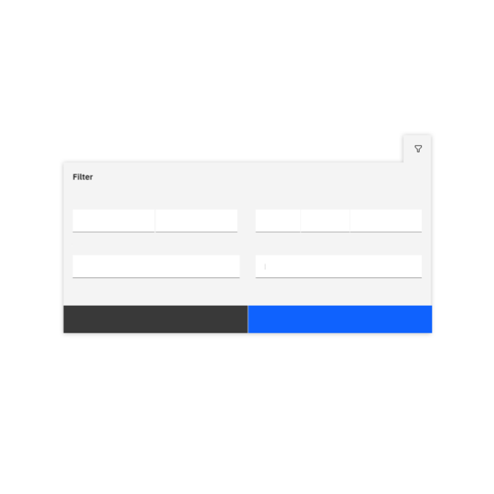

import { Tag } from "carbon-components-react";

  <Tag type="purple">Carbon 11 (v2)</Tag><Tag type="blue">Carbon 10 (v1)</Tag>

<Row>
<Column colMd={5} colLg={8}>

<PageDescription>

Data tables are used to organize and display data efficiently. The **datagrid** provides a compact layout for viewing and managing large quantities of data while extending Carbon capabilities.

</PageDescription>

The data table component from IBM Products, also known as the **datagrid**, is based on the Carbon data table. It allows for customization with additional functionality, as needed by your product’s users. The datagrid’s features are ideal for organizing and displaying data in a UI and provide a large range of possible capabilities.

</Column>

<Column colMd={2} colLg={3} offsetMd={1} offsetLg={1}>

  <Aside>

  These pages are not intended to replace the Carbon documentation. They are meant to provide guidance, structure, and consistency for products under the Carbon for IBM Products portfolio.

   

  **Last updated** 
  Dec 2023

  </Aside>

</Column>
</Row>

## Overview

The standard Carbon data tables have been delivered as a set of common components, as such these are flexible in the way they can be implemented. The carbon guidelines can be found here.

This documentation is a set of guidelines on how to implement these components to ensure a consistent experience across our portfolio and provide users with a similar, uniform experience.

<Row className="image-card-group">

<Column colMd={3} colLg={3} noGutterSm>

<ImageCard 
sub-title="Header"
sub-titleColor="dark"
hoverColor="dark"
href="/components/data-table/headers/usage">

</ImageCard>

<ImageCard
sub-title="Expandable rows"
sub-titleColor="dark"
hoverColor="dark"
href="/components/data-table/expandable-rows/usage">

</ImageCard>

<ImageCard
sub-title="Column alignment"
sub-titleColor="dark"
hoverColor="dark"
href="/components/data-table/column-alignment/usage">

</ImageCard>

<ImageCard
sub-title="Scrolling"
sub-titleColor="dark"
hoverColor="dark"
href="/components/data-table/scrolling/usage">

</ImageCard>

</Column>

<Column colMd={3} colLg={3} noGutterSm>

<ImageCard 
sub-title="Settings"
sub-titleColor="dark"
hoverColor="dark"
href="/components/data-table/settings/usage">

</ImageCard>

<ImageCard
sub-title="Nested rows"
sub-titleColor="dark"
hoverColor="dark"
href="/components/data-table/nested-rows/usage">

</ImageCard>

<ImageCard
sub-title="Inline editing"
sub-titleColor="dark"
hoverColor="dark"
href="/components/data-table/inline-editing/usage">

</ImageCard>

<ImageCard
sub-title="Filtering"
sub-titleColor="dark"
hoverColor="dark"
href="/components/data-table/filters">

</ImageCard>

</Column>

<Column colMd={3} colLg={3} noGutterSm>

<ImageCard
sub-title="Row action buttons"
sub-titleColor="dark"
hoverColor="dark"
href="/components/data-table/row-action-buttons/usage">

</ImageCard>

<ImageCard
sub-title="Resizable columns"
sub-titleColor="dark"
hoverColor="dark"
href="/components/data-table/resizable-columns/usage">

</ImageCard>

<ImageCard
sub-title="Clickable rows items"
sub-titleColor="dark"
hoverColor="dark"
href="/components/data-table/clickable-row-items/usage">

</ImageCard>

</Column>

<Column colMd={3} colLg={3} noGutterSm>

<ImageCard
sub-title="Batch actions"
sub-titleColor="dark"
hoverColor="dark"
href="/components/data-table/batchactions/usage">

</ImageCard>

<ImageCard
sub-title="Column customization"
sub-titleColor="dark"
hoverColor="dark"
href="/components/data-table/column-customization/usage">

</ImageCard>

<ImageCard
sub-title="Empty state"
sub-titleColor="dark"
hoverColor="dark"
disabled
href="https://www.carbondesignsystem.com/">

</ImageCard>

</Column>

</Row>
