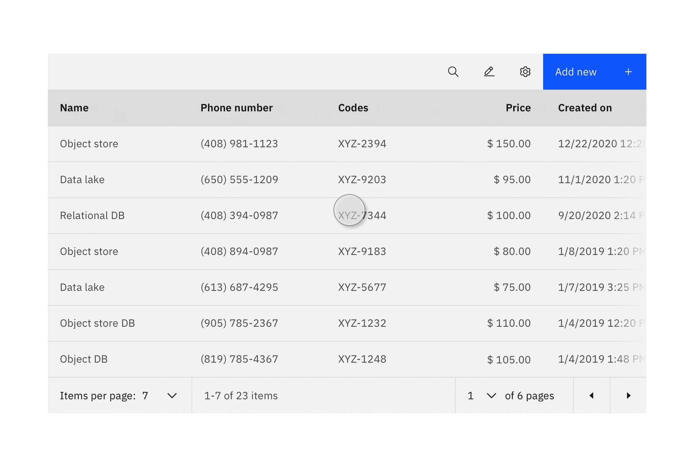
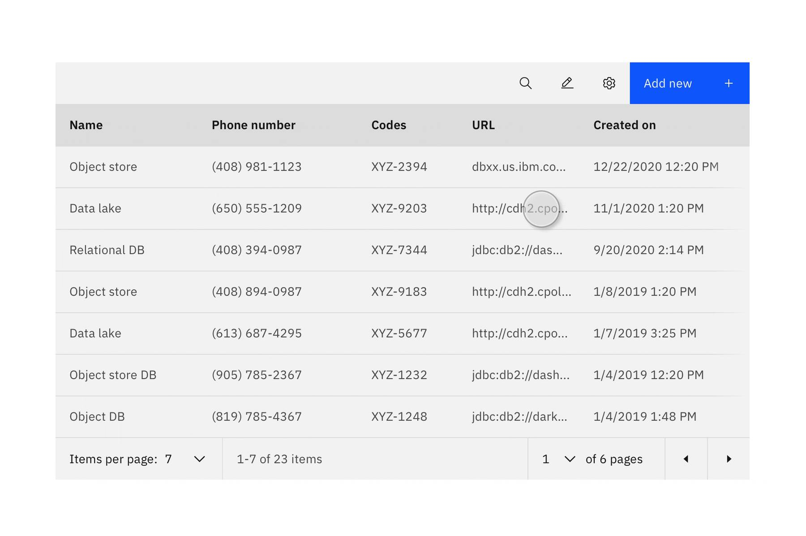
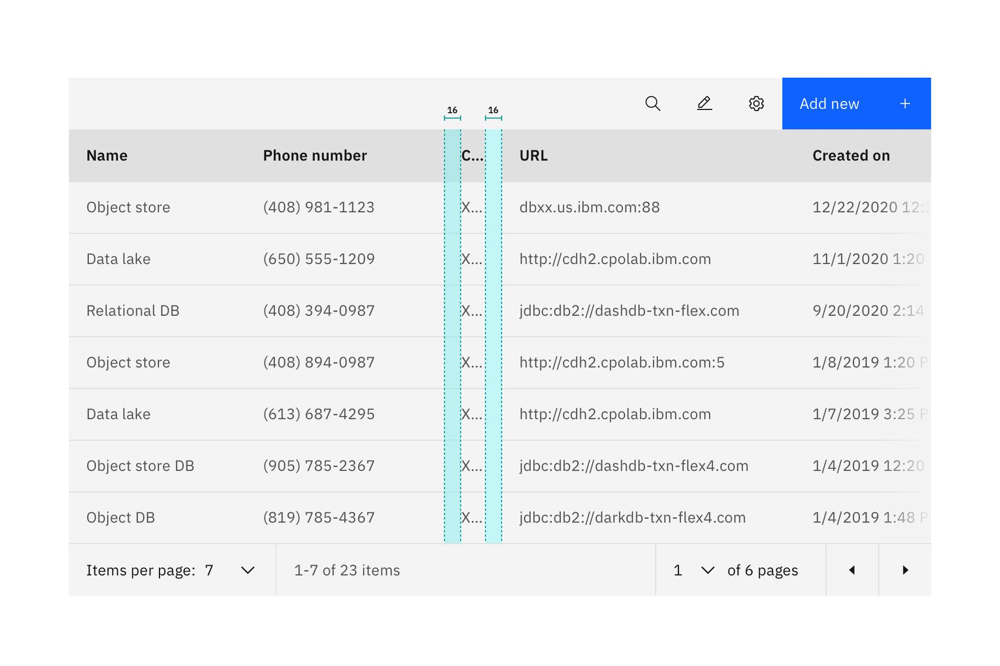
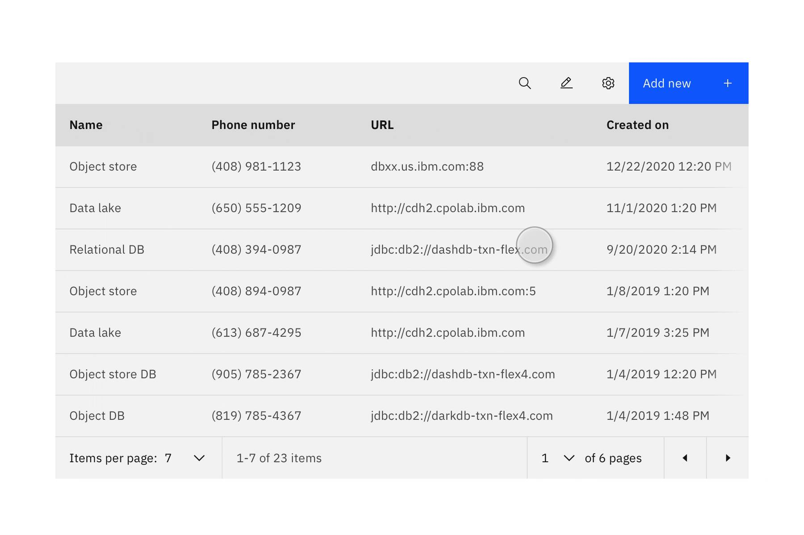

<- [Back to data table overview](https://pages.github.ibm.com/cdai-design/pal/components/data-table/overview) 

<PageDescription>

Data tables display sets of data that can span across numerous columns of various sizes. They attempt to lay out columns in an optimal format based on the individual data in thier cells. Users need the flexibility to adjust the widths of individual columns so that they can see more or less of these to improve their workflows.

</PageDescription>

## Resizing columns

Data tables attempt to lay out their information in an optimal format based on the individual data in the cells. As the data changes, it can sometimes be useful to recalculate this layout based on users' needs. Users can manually adjust the width of each data table column. 

### Individual columns

<GifPlayer color='dark'>

</GifPlayer>

1. Over the right side of the column header until a horizontal split cursor appears.
2. Drag the column line.
3. The column is resized to the set width.

### Multiple columns

Resizing multiple columns at once is applied to the visible columns only. If your table requires horizontal scrolling to show more columns, you will need to resize those hidden columns as they become visible.

<GifPlayer color='dark'>

</GifPlayer>

1. Hold Shift, and hover over the right side of any column header until a horizontal split cursor appears.
2. To manually define the width that will be applied to all visible columns, drag the column line to set the desired width.
4. To resize all visible columns to fit the content, double-click the column line.

### Resize column to fit its content

<GifPlayer color='dark'>

</GifPlayer>

1. Hover over the right side of the column header until a horizontal split cursor appears.
2. Double-click the column line.
3. The column is resized to fit the contents.

## Content behaviors

The column width is usually reflective of the content inside each cell and requires a minimum spacing between them. While re-sizing a column may be useful to some user workflows, we should always reveal a minimum of one letter in each cell. 

### Column headers

When column headers are resized and the title is too long, it will wrap the text into two lines and then truncate the rest of the text. The full text should be shown in a tooltip on hover. When using compact data tables, the title or content inside the cells will truncate and not wrap into two lines.

<GifPlayer color='dark'>

</GifPlayer>

### Content with labels and icons

When resizing columns that contain labels and icons, the label will first truncate until it reaches the minimum width of a column and reveal only the icon. 

<GifPlayer color='dark'>

</GifPlayer>

### Resize behaviors

Resizing data table columns is intended to help users with better consume their content. Resizing columns will push all of the columns to the right of it and they will retain their current widths. If the content gets pushed outside the data table's visible area, a horizontal scroll bar will appear as a visual signifier to the user. Refer to horizontal scrolling in the data table

<GifPlayer color='dark'>

</GifPlayer>

### Padding

The minimum gap between columns should be 16 px. Columns should always reveal at least one letter to keep users in context.

### When to use

- to personalize and customize a data table view
- to focus on specific columns
- to rearrange columns for a specific need
- to reveal more or less content

### When not to use
- Don’t use this pattern, if there is no need for the user to modify or customize the table view to perform their task - some data tables may need to remain in a fixed order based on how the data is stored. 

## Accessibility

#### Focus

Shift the focus to the Data table when triggered.
- The initial focus should be set on the first focusable element in the data table.

#### Keyboard navigation
- tab: navigates the user to the different interactive elements
- space bar: triggers the selected element
- enter: triggers the selected element
- left & right arrow keys: resize column left or right

#### Tab order
The first interactive element in the body area.
- Proceed left to right and top to bottom through the rest of the body elements.
- Primary cell
- Secondary resize handle
- Secondary cell
