import { Link } from "gatsby";

<- [Back to data table overview](https://pages.github.ibm.com/cdai-design/pal/components/data-table/overview) 

<PageDescription>

Scrolling options help users to easily scan large data sets without losing the context provided by elements such as a table header or an identifying column.

</PageDescription>

<AnchorLinks>
   <AnchorLink>Overview</AnchorLink>
   <AnchorLink>Horizontal scrolling</AnchorLink>
   <AnchorLink>Truncation and text wrap</AnchorLink>
   <AnchorLink>Frozen columns</AnchorLink>
   <AnchorLink>Styling</AnchorLink>
   <AnchorLink>Responsive behavior</AnchorLink>
   <AnchorLink>Accessibility </AnchorLink>
</AnchorLinks>

## Horizontal scrolling

Horizontal scrolling is used when a table contains more columns than fit on screen. When horizontal scrolling is active, a scrollbar appears on table hover to indicate the presence of additional information. 

All Carbon tables scroll horizontally once content exceeds a three-line text wrap, but CDAI data tables offer several additional settings to improve the user experience:

- Truncation and text wrap
- Frozen columns
- Resizable columns

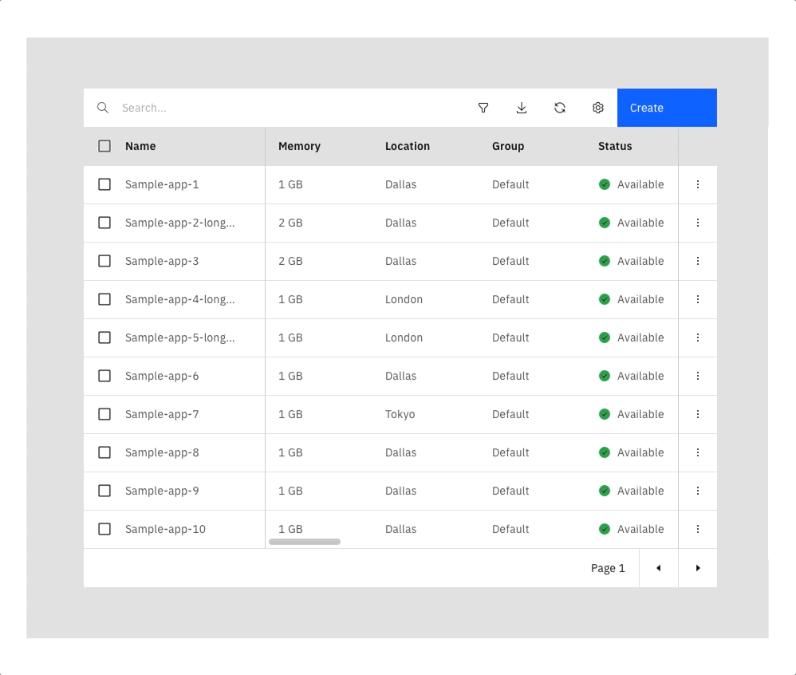

## Truncation and text wrap 

If horizontal scrolling is important to your use case (or if a user can add columns), consider setting your table to either truncate at one line or wrap to two lines before starting to scroll. Work with your developer to set these options.

#### Two-line text wrap 
This setting limits the table text wrap to two lines before scrolling horizontally (the default Carbon behavior is to wrap to three lines).

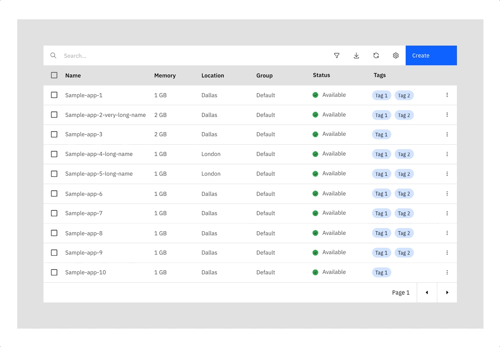

#### Truncation
When truncation is enabled, text will truncate at one line instead of line wrapping. Once any column hits its minimum width, the table will start to scroll horizontally. 

Text should be truncated optically, not in the underlying code (technical truncation). This ensures that data is preserved and accessible to screen readers. On hover, truncation should display a Carbon tooltip (Carbon tooltips afford more control over delay and placement). 

#### When to use these settings:

- When columns do not fit the viewport
- When content is long or length varies widely  
- When scannability and information density are important 
- When users can resize or add table columns

<Row>
<Column colMd={4} colLg={4}>
<DoDontExample type="do" caption="Truncate optically and provide tooltips.">

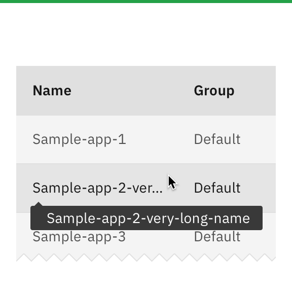

</DoDontExample>
</Column>
<Column colMd={4} colLg={4}>
<DoDontExample type="dont" caption="Truncate in the code or omit tooltips; truncate where full content is critical">

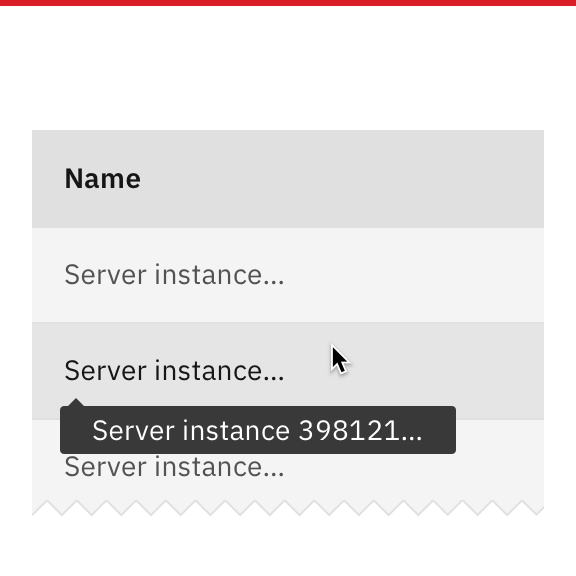
</DoDontExample>
</Column>
</Row>

## Frozen columns

Frozen columns are useful when the user wants to persistently view the content of a column when a horizontal scroll is used on the data table.

There are three main options for frozen columns:

- Frozen last column (default)
- Frozen first column
- Combination

#### Frozen last column (default) 
The last column often contains key content such as [row actions](https://pages.github.ibm.com/cdai-design/pal/components/data-table/row-action-buttons/usage) or a sum of previous columns. Freezing this column enables the user to maintain context while scanning table data. This option is recommended as the default because it works at all screen sizes. Because the table loads with the identifier column visible, the user can start off seeing both columns. 

*Note: If your table is displaying row actions on hover, if you freeze the action column those actions will be moved into a persistent overflow menu once horizontal scrolling kicks in and the frozen action column appears.*

#### Frozen first column
The first column of the table often contains a name or other identifying attribute and is frozen so that users can maintain context as they scroll. 

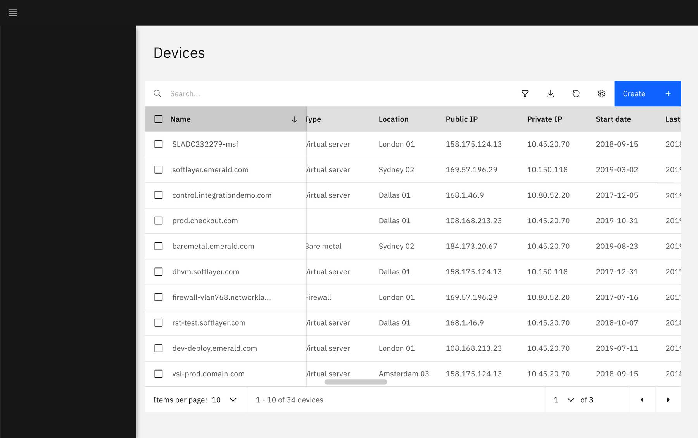

#### Best practices

If a table contains a column for row count or a checkbox (for batch actions) include those in the freeze
Unfreeze the identifier column at mobile screen sizes to avoid blocking other columns
Do not use the frozen identifier column with expandable rows
Consider using truncation or text wrap settings to avoid freezing an extremely wide identifier column

<Row>
<Column colMd={4} colLg={4}>
<DoDontExample type="do" caption="Freeze only the identifier column and directly associated elements, such as checkboxes">

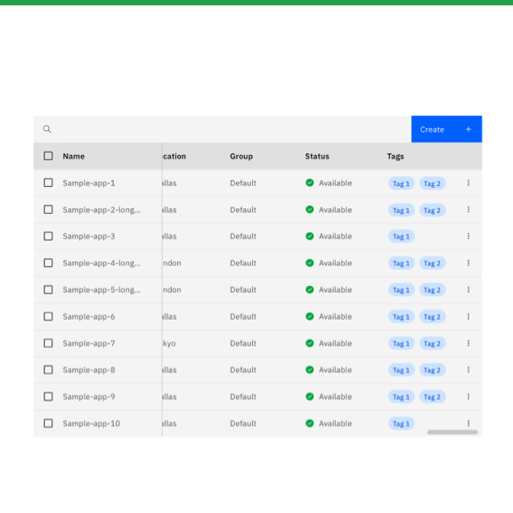
</DoDontExample>
</Column>
<Column colMd={4} colLg={4}>
<DoDontExample type="dont" caption="Freeze middle columns or freeze more than the first and last columns">

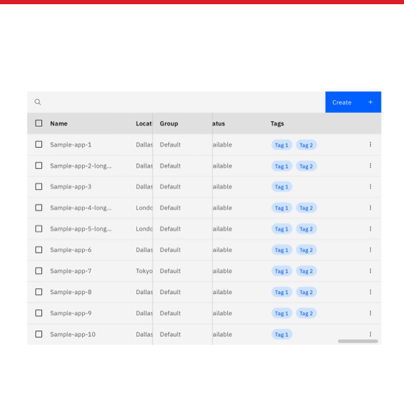
</DoDontExample>
</Column>
</Row>

<Row>
<Column colMd={4} colLg={4}>
<DoDontExample type="do" caption="Avoid freezing the identifier column on tables with expandable rows – try a frozen actions column instead">

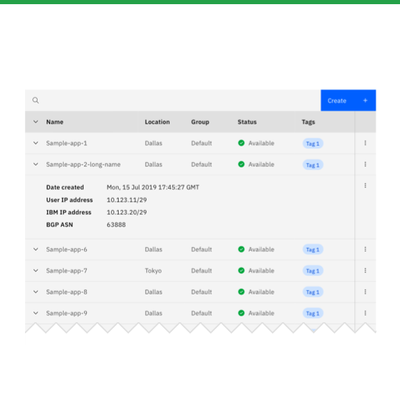
</DoDontExample>
</Column>
<Column colMd={4} colLg={4}>
<DoDontExample type="dont" caption="Freeze the identifier column on tables with expandable rows">

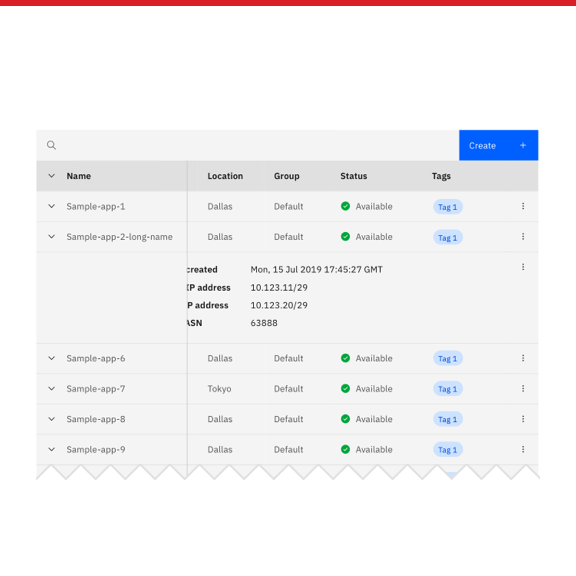
</DoDontExample>
</Column>
</Row>

#### Combination of frozen first and last columns
The frozen identifier and action columns can be combined in use cases where both elements are essential for maintaining the user's context. However, note that the identifier column should still unfreeze at the mobile viewport size.

## Styling

The CDAI table is coded to display a scrollbar on table hover to indicate the presence of additional scrollable content. Avoid adding extra elements such as floating action buttons, drop shadows, and scrollable gradients. Frozen columns should have a simple 1px border `$active-light-ui`.

<Row>
<Column colMd={4} colLg={4}>
<DoDontExample type="do" caption="Use table scrollbar to indicate scrollability">

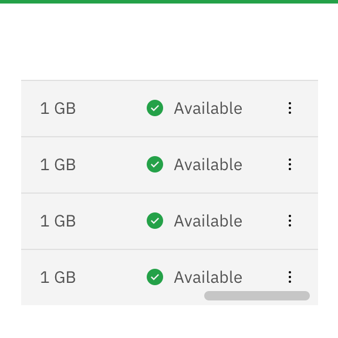
</DoDontExample>
</Column>
<Column colMd={4} colLg={4}>
<DoDontExample type="dont" caption="Add additional elements to indicate scrollability">

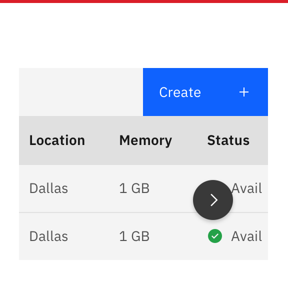
</DoDontExample>
</Column>
</Row>

<Row>
<Column colMd={4} colLg={4}>
<DoDontExample type="do" caption="Maintain right page padding">

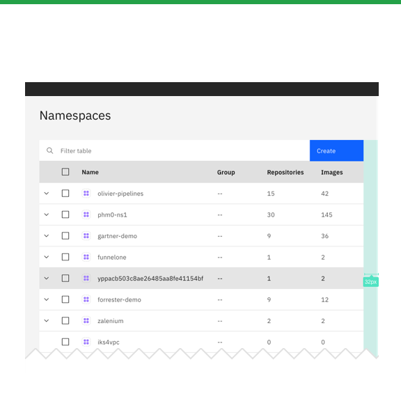
</DoDontExample>
</Column>
<Column colMd={4} colLg={4}>
<DoDontExample type="dont" caption="Bleed table to right edge of page">

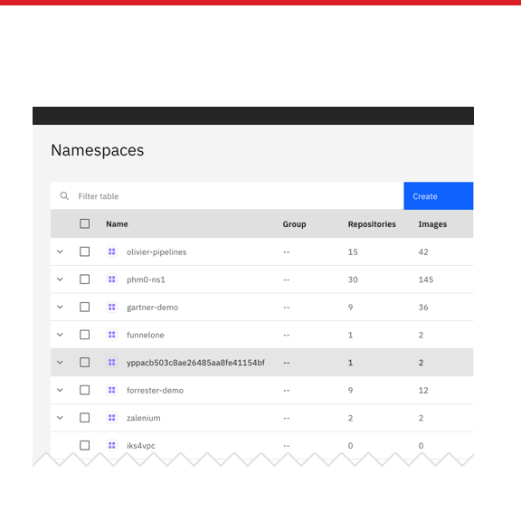
</DoDontExample>
</Column>
</Row>

## Responsive behavior

The default responsive pattern for Carbon tables is to horizontally scroll once table content no longer fits with a three-line text wrap. CDAI data tables are further optimized to maintain scrollability at smaller viewport sizes:

#### Mobile:
Frozen last columns can continue to be frozen
Toolbar icons and buttons move under a single "combo" button and search is collapsed to right
Toolbar interactions such as filters and settings appear in a mobile modal dialogue
Frozen identifier columns are unfrozen for viewports below 672px

**Toolbar at mobile**
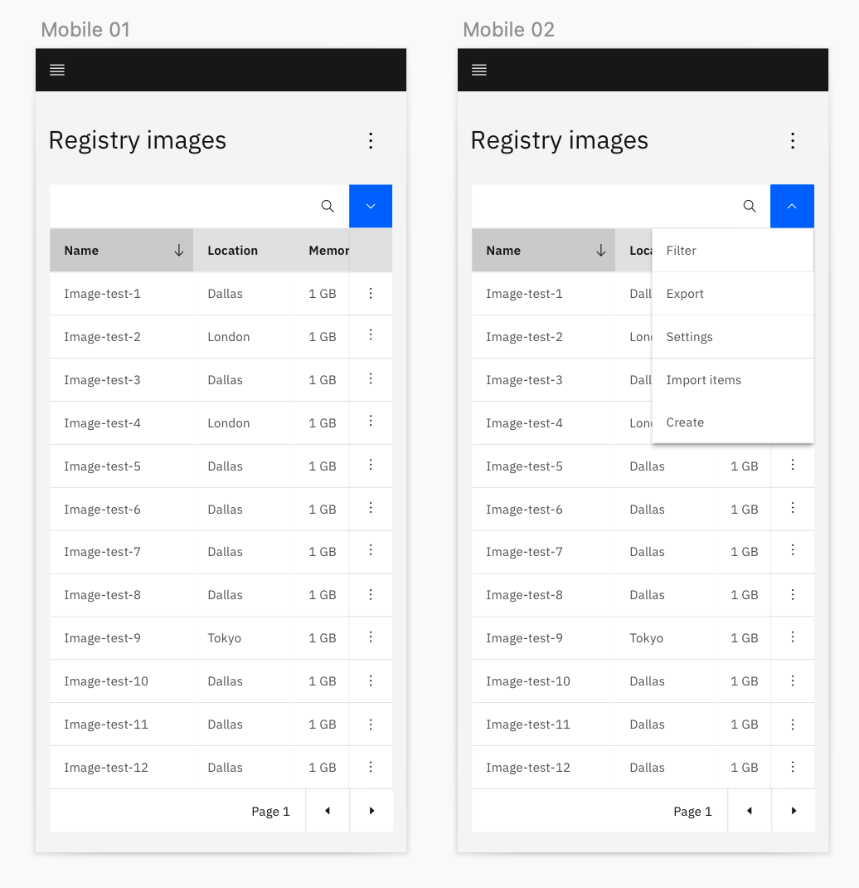

- Table tool icons go under the combo button
- Table button CTA or CTAs go in "important" section underline 

**Filters and settings on mobile**
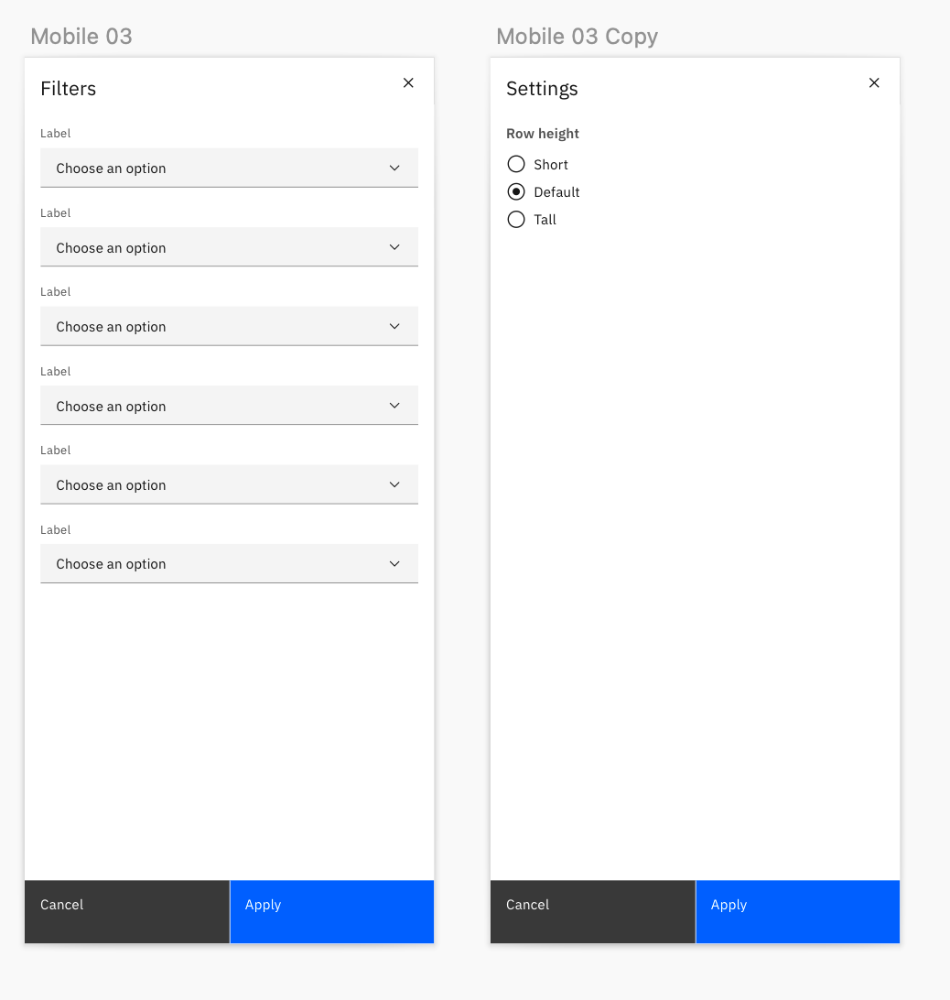

- Items like filter and settings take over screen

## Accessibility 

Table row actions and toolbar items work the same in these responsive formats as they do in desktop view.

