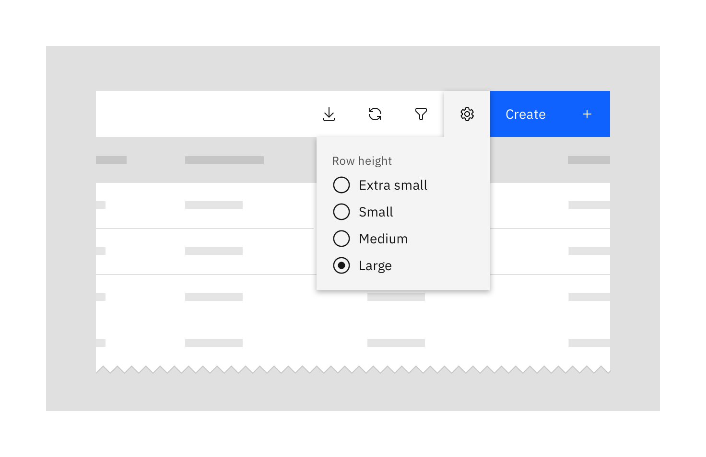
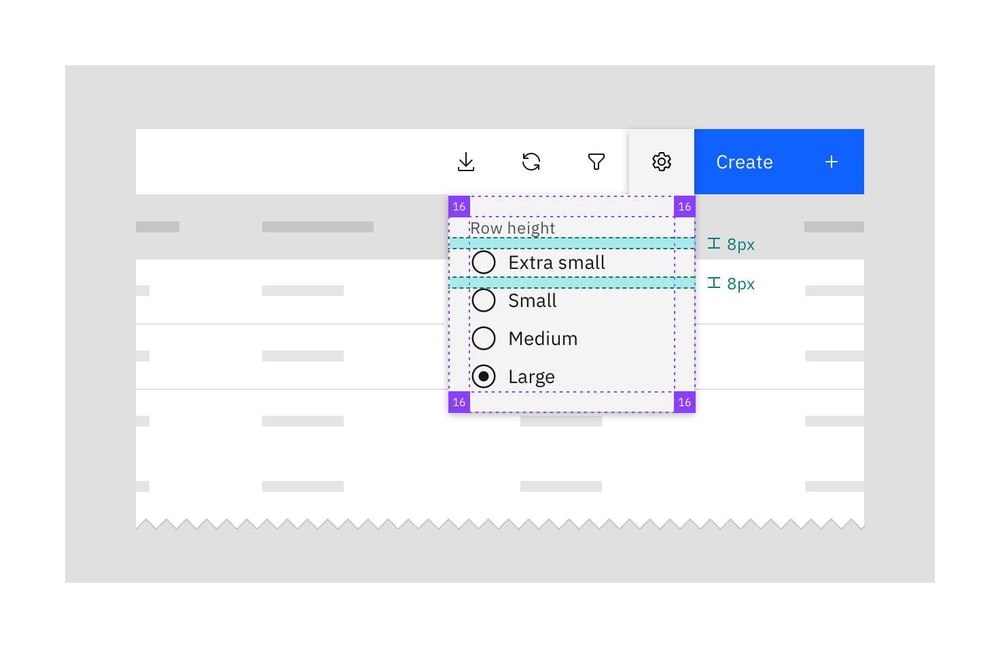
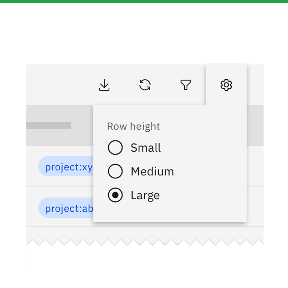
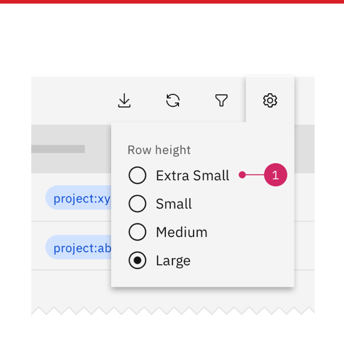
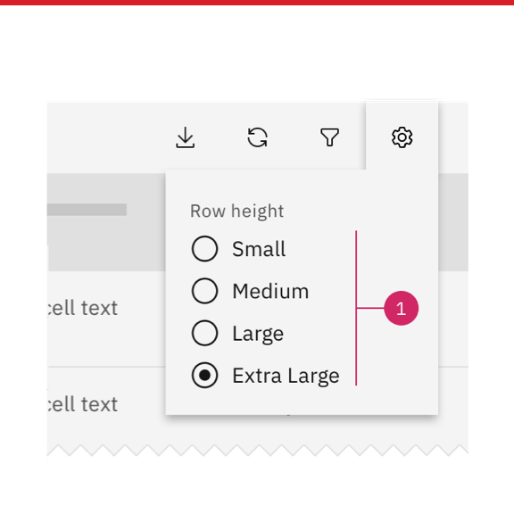
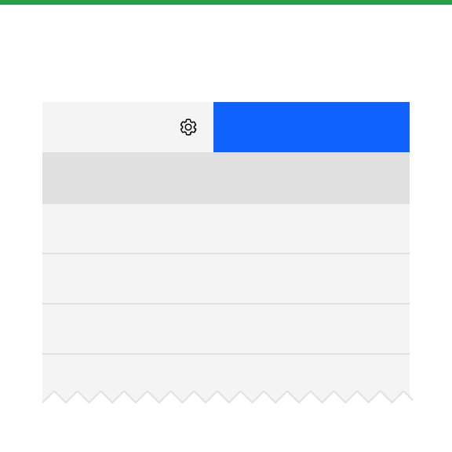
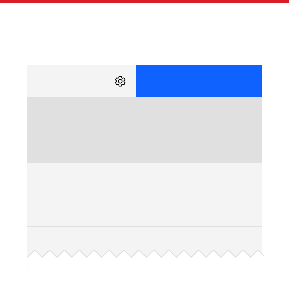

<PageDescription>

The table settings action is an optional tool on the table toolbar that allows the user to change the table’s row height. 

<AnchorLinks>
   <AnchorLink>Overview</AnchorLink>
   <AnchorLink>Styling</AnchorLink>
   <AnchorLink>Placement</AnchorLink>
   <AnchorLink>Best practices</AnchorLink>
   <AnchorLink>Related</AnchorLink>
</AnchorLinks>

</PageDescription>

## Overview

The table settings action gives users the ability to choose their information density. Designers can decide whether or not to provide this functionality to users, as well as which row heights to include in the flyout.

In Carbon there are different possible row height settings:

#### Carbon 10:
- Extra small (compact) 24px
- Small (short) 32px
- Large (normal) 48px
- Extra large (tall) 64px 

#### Carbon 11:
- Extra small (xs) 24px
- Small (sm) 32px
- Medium (md) 40px (NEW!)
- Large (lg) 48px
- Extra Large (xl) 64px 

*Note: The Extra Large height should only be used when there are two lines of text within a single row.*

## Styling

The settings flyout is based on the new Carbon popover component, which has 16px padding at the edges and 8px padding between content elements.

## Placement

The settings icon should be placed to the right, directly to the left of any CTA button or flush to the table edge. The flyout stays open until the user closes it by clicking on the icon or outside the flyout.

## Best practices

### When to use

The table setting tool is an option for most tables, especially tables with very neutral content that can adjust to any row height. It's especially useful to offer this option in situations where some users prefer a higher density view. 

### When not to use 

Avoid table settings or offer a limited selection of row heights when your content will not fit certain heights:

The extra small height (24px) does not accommodate tags, since tags are 24px high. 
Icons or other elements may have trouble fitting into the small or extra small heights.
Do not offer the option to change row heights if using the extra large height with two lines of text.

<Row>
<Column colMd={4} colLg={4}>
<DoDontExample type="do" caption="Do offer row heights that accommodate content such as tags or icons.">

</DoDontExample>
</Column>
<Column colMd={4} colLg={4}>
<DoDontExample type="dont" caption="Don't offer smaller row heights if your table contains tags or other fixed height content.">

</DoDontExample>
</Column>
</Row>

<Row>
<Column colMd={4} colLg={4}>
<DoDontExample type="do" caption="Do use the extra large row height if you need to display two lines of text in a single row.">

</DoDontExample>
</Column>
<Column colMd={4} colLg={4}>
<DoDontExample type="dont" caption="Don’t offer the option to change row heights if using the extra large height with two lines of text.">

</DoDontExample>
</Column>
</Row>

Work with your developers to make sure that when a user changes their row height, the data table toolbar also switches (the toolbar has a small and a large height). Carbon currently offers only a single height for the pagination bar.

<Row>
<Column colMd={4} colLg={4}>
<DoDontExample type="do" caption="Do work with your developer to switch to the table toolbar height closest to the selected row height ">

</DoDontExample>
</Column>
<Column colMd={4} colLg={4}>
<DoDontExample type="dont" caption="Do not display conflicting toolbar and row heights.">

</DoDontExample>
</Column>
</Row>

## Related

See responsive behavior and horizontal scrolling for details on how toolbar actions behave at smaller viewport sizes.