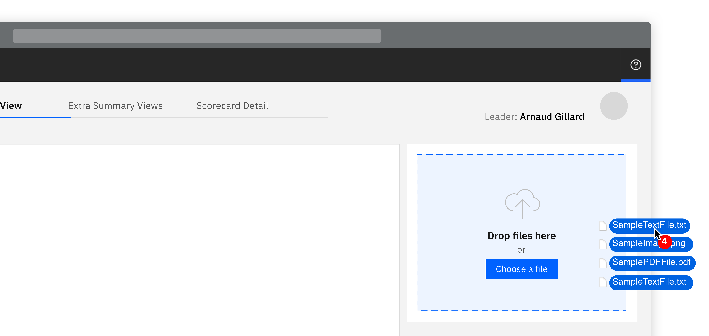
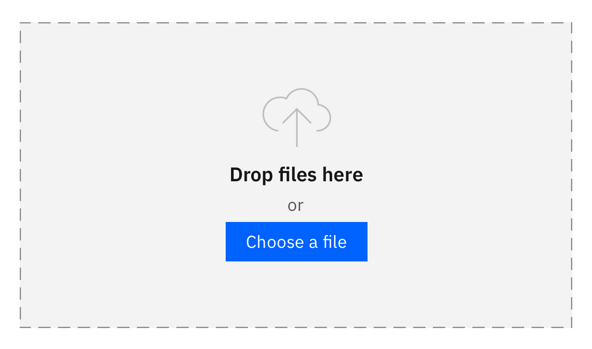
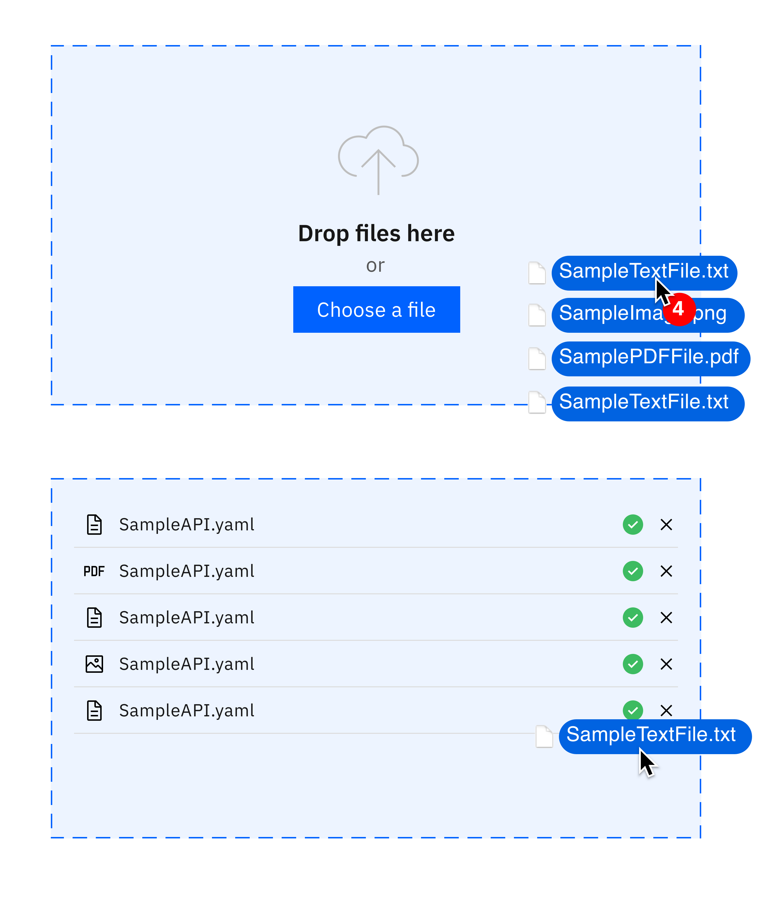

import { Launch16 } from '@carbon/icons-react';

<PageDescription>

Allow users the ability to drag and drop files.

</PageDescription>

<Row>
  <Column colLg={8}>

  </Column>
</Row>

## Component Details

Component created that allows users the ability to drag and drop files, in
addition to the traditional method of browsing and selecting from a file browser.

### States

<AnchorLinks>
 <AnchorLink>Empty</AnchorLink>
 <AnchorLink>Adding</AnchorLink>
 <AnchorLink>Populated</AnchorLink>
</AnchorLinks>

## Empty

- Illustration
- ‘Drop files here’ text
- Carbon file uploader component

<Row>
  <Column colMd={6} colLg={6}>

  </Column>
</Row>

## Adding

When adding files and holding them over the drop zone it should change in
colour to indicate that the files are in the active zone. This is true in
the situation where where there are no files already there or if there are
existing files in there already.

<Row>
  <Column colMd={6} colLg={6}>

  </Column>
</Row>

## Populated

Files should be displayed in the component with file type icon on the left,
followed by file name and extension. Indication of the validity of the file
and the ability to remove it should be on the right.

<Row>
  <Column colMd={4} colLg={4}>

  </Column>
</Row>

## Linked to

[Downloading](../../common-patterns/downloading)

 <a href="https://www.carbondesignsystem.com/components/file-uploader/usage">
  File Uploader in Carbon <Launch16 fill="currentColor" style="vertical-align:middle"/>
 </a>

