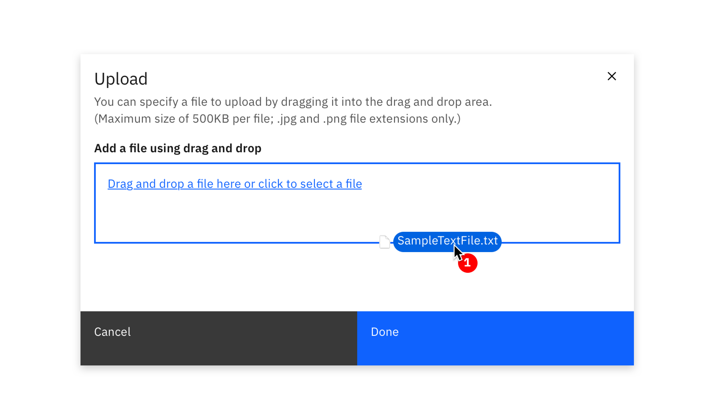
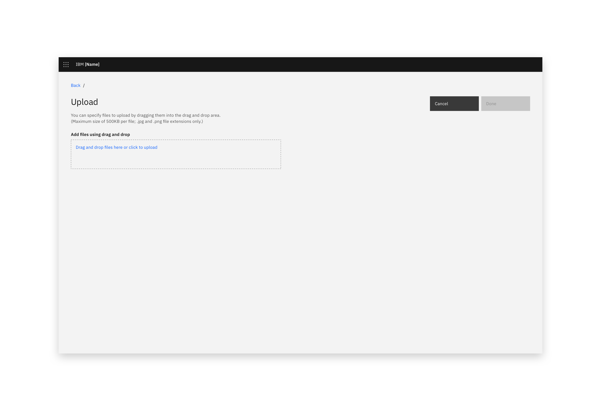
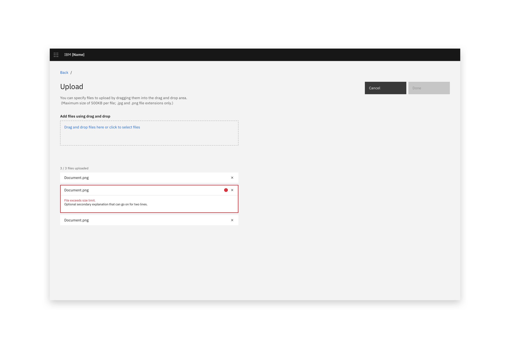
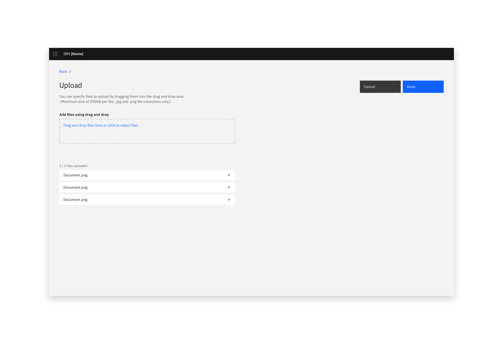
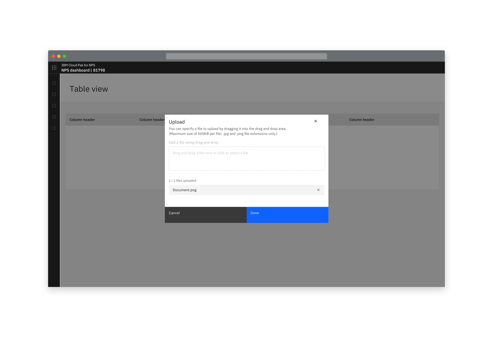
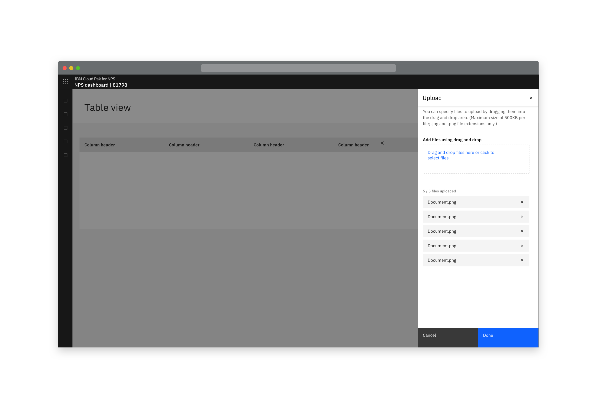
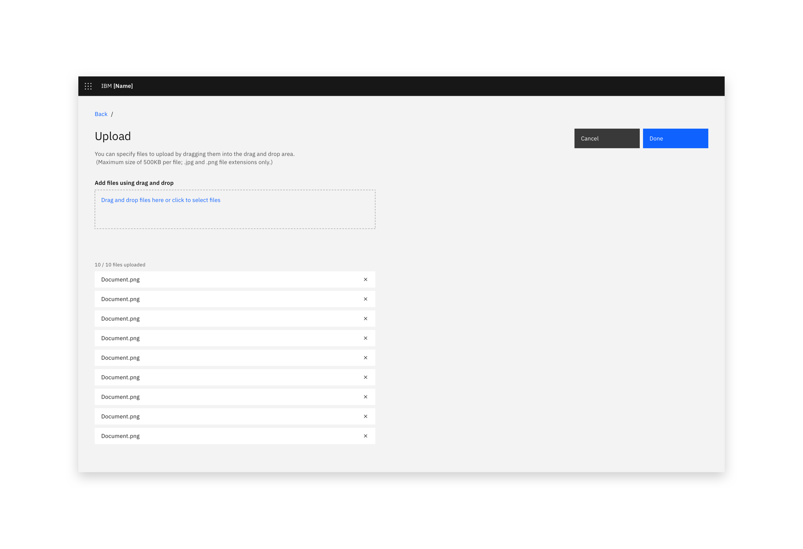

<InlineNotification kind="warning">

  This page provides usage guidelines to be used in conjunction with the [Carbon File uploader component](https://www.carbondesignsystem.com/components/file-uploader/usage).  
  
</InlineNotification>

### Uploading is transferring a resource from a local system to a remote system.

<Row>
  <Column colLg={8}>

  </Column>
</Row>

### Things to consider

- Is the action uploading or is it importing?
- How many files are likely to be uploaded?

### Overview

The action of uploading should always be the result of a user action.
The action of uploading a file could be done by selecting an action button
to open a modal or inline in a full page form, slide-in or slide-over panel.

<Row>
 <Column colLg={8}>

<Caption>The user lands in an upload view</Caption>

 </Column>
</Row>
<Row>
 <Column colLg={8}>

<Caption>Uploaded files are listed below the controls and are validated against requirements.</Caption>

 </Column>
</Row>
<Row>
 <Column colLg={8}>

<Caption>The user can continue when the required file(s) are uploaded.</Caption>

 </Column>
</Row>

### Location options

Upload can take place in a modal, full page view, or in a side panel. 
Do not use upload in a modal when multiple files are uploaded. 

<Row>
 <Column colLg={8}>

<Caption>Uploading in a modal with a maximum of one file.</Caption>

 </Column>
</Row>
<Row>
 <Column colLg={8}>

<Caption>There is no maximum number of files in a side panel upload.</Caption>

 </Column>
</Row>

<Row>
 <Column colLg={8}>

<Caption>There is no maximum number of files in a full page upload.</Caption>

 </Column>
</Row>