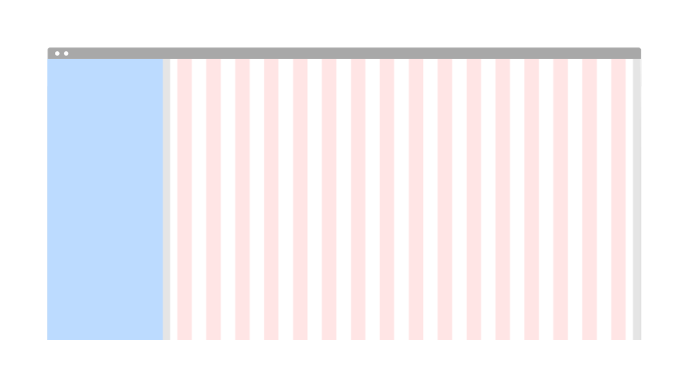
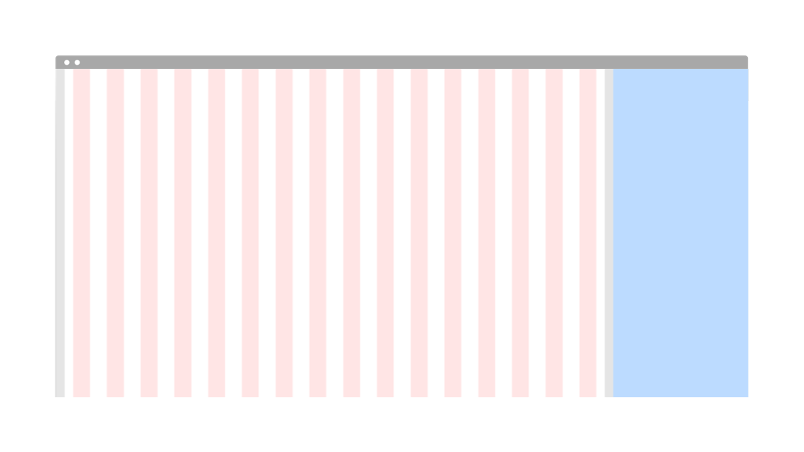
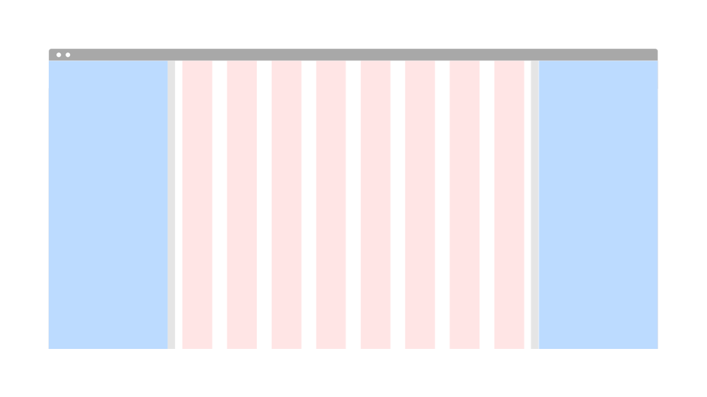
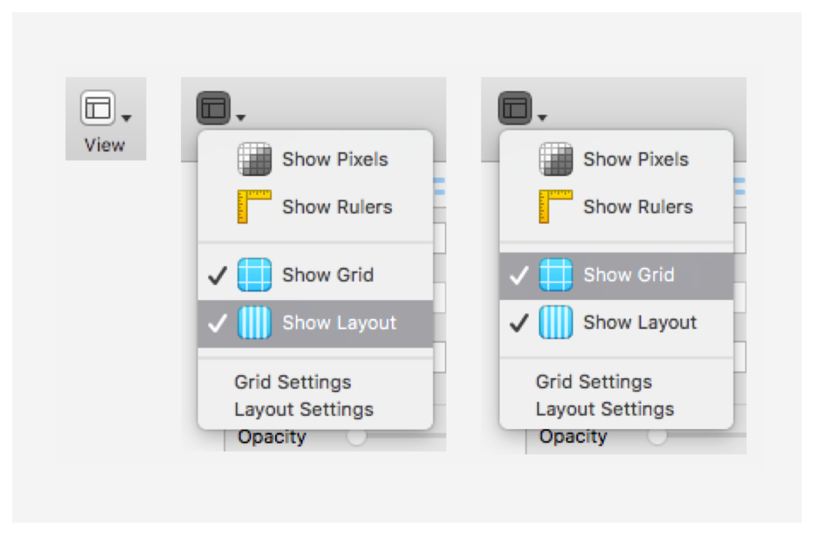
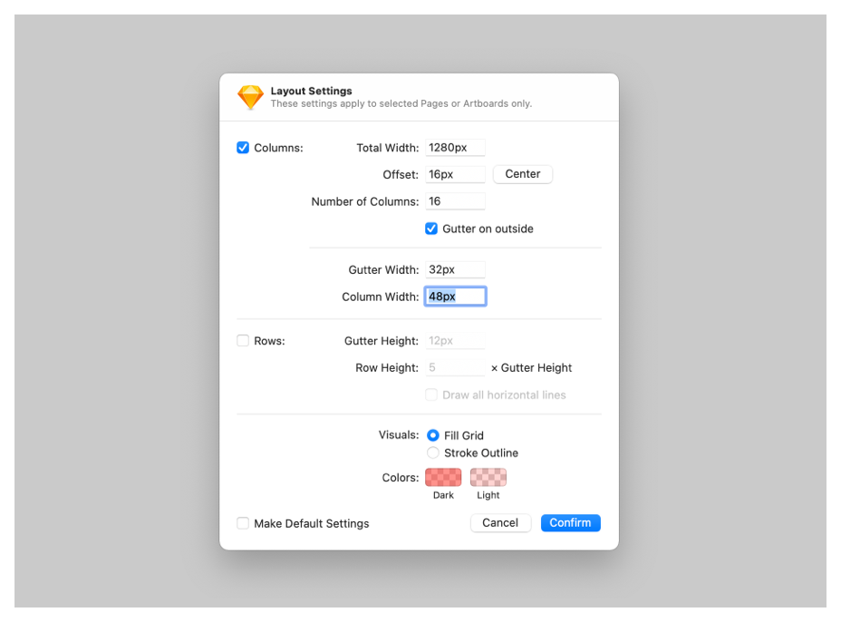

<PageDescription>

It’s fundamental to everything we design. The 2x Grid is the geometric foundation of all the visual elements of IBM Design, from typography to columns, boxes, icons, and illustrations. It provides structure and guidance for all creative decision-making.

</PageDescription>

<AnchorLinks>
  <AnchorLink>Overview</AnchorLink>
  <AnchorLink>Basic page grid</AnchorLink>
  <AnchorLink>Page grids with influencer panels</AnchorLink>
  <AnchorLink>Large tearsheet grids</AnchorLink>
  <AnchorLink>Setting up your sketch file</AnchorLink>
  <AnchorLink>Resources</AnchorLink>
  <AnchorLink>Related</AnchorLink>
</AnchorLinks>

## Overview
As a designer, we always craft and maintain the quality of the work. We provide a major set of breakpoints for you to start with. We should always consider and care how your design works across screen sizes. Ignoring one of the artboards will lead to poor user experiences. 

We also provide additional breakpoints for conveying content/layout adjustments.

You are welcome to minimally divide the primary columns by two as needed. You are strongly encouraged to use the mini units for designing on the artboard.

Below are grid specifications for all breakpoints. Use these sets of standard breakpoints to maintain layout integrity across screen sizes. For best results, test designs and code at each of these standard breakpoints.

## Basic page grid

This basic page grid is not affected by any influencers and would simply react to the product's breakpoints. To learn how the 2x grid works visit [Carbon](https://www.carbondesignsystem.com/guidelines/2x-grid/overview/). Every layout and break points are included in the Sketch file under resources.

### Breakpoints

The layout settings change depending on which size screen you are designing for. Carbon gives us the requirements for standard breakpoints.

| Breakpoint        |      Value (px/rem)      |   Columns | Size (%)        |      Size      |   Padding |  Margin |
| -------------     | -----------              | -----     | -------------   | -----------    | -----     |-----    |
| Small         |   320 / 20               |     4  |            25%  |           80 px  |      16 px  |    0  |
| Medium       |   672 / 42               |      8  |            12.5%  |           80 px  |      16 px   |    16 px   |
| Large          |   1056 / 66               |     16  |            6.25%  |           64 px  |      16 px   |    16 px   |
| X-Large      |   1312 / 82               |      16  |            6.25%  |           80 px  |      16 px   |    16 px   |
| Max         |   1584 / 99               |      $16  |            6.25%  |           94 px  |     16 px   |    24 px   |

For best results, test designs and code at each of these standard breakpoints.

## Page grids with influencer panels

An influencer is a component that affects the content on the page. It can either appears on a page as the result of a user action or be part of your product's page. These influencers affect the grid and column which scale and resize its content. To learn more about the side panel see the [component](https://pages.github.ibm.com/cdai-design/pal/components/side-panel/usage).

<Row>
  <Column colMd={4} colLg={4}>

Left hand grid influencer

  </Column>

  <Column colMd={4} colLg={4}>

Right hand grid influencer

  </Column>

  <Column colMd={4} colLg={4}>

Left and right grid influencer

  </Column>

</Row>

### Left influencer breakpoints
<Accordion>
  <AccordionItem title="Extra small">

  | sm-320px _Margin: 0px_                 | md-672px _Margin: 16px_    |   lg-1056px _Margin: 16px_  |  xlg-1312px _Margin: 16px_  | max-1584px _Margin: 24px_   |
  | ------------------                     | -----------                | -----                       | -------------               | -----------                 |
  | _n/a Will turn into slide-over_        |   # of Col: 8              |    # of Col: 8              |    # of Col: 16             | # of Col: 16                |
  | —                                      |   Width: 384px / 24rem     |    Width: 768px / 48rem     |    Width: 1024px / 64rem    | Width: 1280px / 80rem       |
  | —                                      |   Offset: 272px / 17rem    |    Offset: 272px / 17rem    |    Offset: 272px / 17rem    | Offset: 280px / 17.5rem     |
  | —                                      |   Gutter: 32px / 2rem      |    Gutter: 32px / 2rem      |    Gutter: 32px / 2rem      | Gutter: 32px / 2rem         |
  | —                                      |   Column: 16px / 1rem      |    Column: 64px / 4rem      |    Column: 32px / 2rem      | Column: 48px / 3rem         |

</AccordionItem>
  <AccordionItem title="Small">

  | sm-320px _Margin: 0px_                 | md-672px _Margin: 16px_   | lg-1056px _Margin: 16px_    |  xlg-1312px _Margin: 16px_   | max-1584px _Margin: 24px_    |
  | -------------                          | -----------               | -----                       | -------------                | -----------                  |
  | _n/a Will turn into slide-over_        |   # of Col: 4             |   # of Col: 8               |    # of Col: 8               |   # of Col: 16               |
  | —                                      |   Width: 320px / 20rem    |   Width: 704px / 44rem      |    Width: 960px / 60rem      |   Width: 1216px  / 76rem     |
  | —                                      |   Offset: 336px / 21rem   |   Offset: 336px / 21rem     |    Offset: 336px / 21rem     |   Offset: 344px / 21.5 rem   |
  | —                                      |   Gutter: 32px / 2rem     |   Gutter: 32px / 2rem       |    Gutter: 32px / 2rem       |   Gutter: 32px / 2rem        |
  | —                                      |   Column: 48px / 3rem     |   Column: 56px / 3.5rem     |    Column: 88px / 5.5rem     |   Column: 44px / 2.75rem     |

  </AccordionItem>
  <AccordionItem title="Medium">

  | sm-320px _Margin: 0px_                 | md-672px _Margin: 16px_              | lg-1056px _Margin: 16px_       | xlg-1312px _Margin: 16px_    | max-1584px _Margin: 24px_    |
  | -------------                          | -----------                          | -----                          | -------------                | -----------                  |
  | _n/a Will turn into slide-over_        |   _n/a Will turn into slide-over_    |   # of Col: 8                  |    # of Col: 8               |   # of Col: 16               |
  | —                                      |   —                                  |   Width: 544px / 34rem         |    Width: 800px / 50rem      |   Width: 1056px / 66rem      |
  | —                                      |   —                                  |   Offset: 496px / 31rem        |    Offset: 496px / 31rem     |   Offset: 504px / 31.5       |
  | —                                      |   —                                  |   Gutter: 32px / 2rem          |    Gutter: 32px / 2rem       |   Gutter: 32px / 2rem        |
  | —                                      |   —                                  |   Column: 36px / 2.25rem       |    Column: 68px / 4.25rem    |   Column: 34px / 2.125rem    |

  </AccordionItem>
  <AccordionItem title="Large">

  | sm-320px _Margin: 0px_                 | md-672px _Margin: 16px_              | lg-1056px _Margin: 16px_       | xlg-1312px _Margin: 16px_    | max-1584px _Margin: 24px_    |
  | -------------                          | -----------                          | -----                          | -------------                | -----------                  |
  | _n/a Will turn into slide-over_        |   _n/a Will turn into slide-over_    |   # of Col: 4                  |    # of Col: 8               |    # of Col: 8               |
  | —                                      | —                                    |   Width: 384px / 24rem         |    Width: 640px / 40rem      |    Width: 896px / 56rem      |
  | —                                      | —                                    |   Offset: 656px / 41rem        |    Offset: 656px / 41rem     |    Offset: 664px / 41rem     |
  | —                                      | —                                    |   Gutter: 32px / 2rem          |    Gutter: 32px / 2rem       |    Gutter: 32px / 2rem       |
  | —                                      | —                                    |   Column: 64px / 4rem          |    Column: 48px / 3rem       |    Column: 80px / 5rem       |

  </AccordionItem>
  <AccordionItem title="Max">

  Not available as all panels using the Max panel size would slide-over panels. To learn more about slide-over panels visit the [Side panel component guidelines](https://pages.github.ibm.com/cdai-design/pal/components/side-panel/usage).

  </AccordionItem>
</Accordion>

### Right influencer breakpoints
<Accordion>
  <AccordionItem title="Extra small">

| sm-320px _Margin: 0px_                 |    md-672px _Margin: 16px_           |   lg-1056px _Margin: 16px_       |  xlg-1312px _Margin: 16px_         |    max-1584px _Margin: 24px_    |
| -------------                          | -----------                          | -----                            | -------------                       | -----------                           |
| _n/a Will turn into slide-over_        |   # of Col: 8                        |      # of Col: 8                 |    # of Col: 16                     |           # of Col: 16                |
|                  -                      |   Width: 384px / 24rem               |    Width: 768px / 48rem          |            Width: 1024px / 64rem    |           Width: 1280px / 80rem       |
|                 -                       |   Offset: 16px / 1rem                |      Offset: 16px / 1rem         |            Offset: 16px / 1rem      |           Offset: 24px / 1.5rem       |
|                -                        |   Gutter: 32px / 2rem                |      Gutter: 32px / 2rem         |            Gutter: 32px / 2rem      |           Gutter: 32px / 2rem         |
|               -                         |   Column: 16px / 1rem                |      Column: 64px / 4rem         |            Column: 32px / 2rem      |           Column: 48px / 3rem         |

</AccordionItem>
  <AccordionItem title="Small">

| sm-320px _Margin: 0px_                 |    md-672px _Margin: 16px_           |   lg-1056px _Margin: 16px_       |  xlg-1312px _Margin: 16px_         |    max-1584px _Margin: 24px_    |
| -------------                          | -----------                          | -----                            | -------------                       | -----------                           |
| _n/a Will turn into slide-over_        |   # of Col: 4                        |      # of Col: 8                 |    # of Col: 8                     |           # of Col: 16                |
|               -                         |   Width: 320px / 20 rem             |    Width: 704px / 44rem         |            Width: 960px / 60 rem   |           Width: 1216px / 76rem       |
|              -                          |   Offset: 16px / 1rem               |      Offset: 16px / 1rem        |            Offset: 16px / 1rem      |           Offset: 24px / 1.5rem       |
|             -                           |   Gutter: 32px / 2rem              |      Gutter: 32px / 2rem         |            Gutter: 32px / 2rem     |           Gutter: 32px / 2rem         |
|            -                            |   olumn: 16px / 1rem            |      Column: 56px / 3.5 rem        |            Column: 88px / 5.5rem     |           olumn: 44px / 2.75rem         |

  </AccordionItem>
  <AccordionItem title="Medium">

| sm-320px _Margin: 0px_                 |    md-672px _Margin: 16px_           |   lg-1056px _Margin: 16px_       |  xlg-1312px _Margin: 16px_         |    max-1584px _Margin: 24px_    |
| -------------                          | -----------                          | -----                            | -------------                       | -----------                           |
| _n/a Will turn into slide-over_        |   _n/a Will turn into slide-over_    |      # of Col: 8                 |    # of Col: 8                     |           # of Col: 16                |
|                  -                      |                       -               |  Width: 544px / 34rem        |            Width: 800px / 50rem    |           Width: 1056px / 66rem      |
|                 -                       |                      -                 |      Offset: 16px / 1rem       |            Offset: 16px / 1rem    |           Offset: 24px / 1.5rem    |
|                -                        |                     -                 |      Gutter: 32px / 2rem       |           Gutter: 32px / 2rem    |           Gutter: 32px / 2rem     |
|               -                         |                    -                 |      Column: 36px / 2.25rem       |            Column: 68px / 4.25rem      |          Column: 34px / 2.125rem       |

  </AccordionItem>
  <AccordionItem title="Large">

| sm-320px _Margin: 0px_                 |    md-672px _Margin: 16px_           |   lg-1056px _Margin: 16px_       |  xlg-1312px _Margin: 16px_         |    max-1584px _Margin: 24px_    |
| -------------                          | -----------                          | -----                            | -------------                       | -----------                           |
| _n/a Will turn into slide-over_        |   _n/a Will turn into slide-over_    |      # of Col: 4                 |    # of Col: 8                     |           # of Col: 8                |
|                   -                     |               -                       |   Width: 384px / 24rem         |            Width: 640px / 40rem    |           Width: 896px / 56rem       |
|                  -                      |              -                         |     Offset: 16px / 1rem      |            Offset: 16px / 1rem   |           Offset: 24px / 1.5rem     |
|                 -                       |             -                         |     Gutter: 32px / 2rem      |            Gutter: 32px / 2rem    |          utter: 32px / 2rem       |
|                -                        |            -                         |      Column: 64px / 4rem       |            Column: 48px / 3rem     |          Column: 80px / 5rem       |

  </AccordionItem>
  <AccordionItem title="Max">

  Not available as all panels using the Max panel size would slide-over panels. To learn more about slide-over panels visit the [Side panel component guidelines](https://pages.github.ibm.com/cdai-design/pal/components/side-panel/usage).

  </AccordionItem>
</Accordion>

### Influencer breakpoints when using both left and right

<Accordion>
  <AccordionItem title="Extra small on left; extra small on right">

| sm-320px _Margin: 0px_                 |    md-672px _Margin: 16px_           |   lg-1056px _Margin: 16px_       |  xlg-1312px _Margin: 16px_         |    max-1584px _Margin: 24px_    |
| -------------                          | -----------                          | -----                            | -------------                       | -----------                           |
| _n/a Will turn into slide-over_        |   _n/a Will turn into slide-over_    |      # of Col: 4                 |    # of Col: 8                     |           # of Col: 8                |
|                   -                     |                 -                     |   Width: 512px / 32rem         |            Width: 768px / 48rem    |           Width: 1024px / 64rem       |
|                  -                      |                -                       |     Offset: 272px / 17rem      |            Offset: 272px / 17rem    |           Offset: 280px / 17.5rem     |
|                 -                       |               -                       |     Gutter: 32px / 2rem      |            Gutter: 32px / 2rem     |          Gutter: 32px / 2rem      |
|                -                        |              -                       |      Column: 96px / 6rem     |            Column: 64px / 4rem    |          Column: 96px / 6rem       |

  </AccordionItem>
  <AccordionItem title="Extra small on left; small on right">

| sm-320px _Margin: 0px_                 |    md-672px _Margin: 16px_           |   lg-1056px _Margin: 16px_       |  xlg-1312px _Margin: 16px_         |    max-1584px _Margin: 24px_    |
| -------------                          | -----------                          | -----                            | -------------                       | -----------                           |
| _n/a Will turn into slide-over_        |   _n/a Will turn into slide-over_    |      # of Col: 4                 |    # of Col: 8                     |           # of Col: 8                |
|          -                              |               -                       |  Width: 448px / 28rem         |            Width: 704px / 44rem    |           Width: 960px / 60rem       |
|         -                               |                -                       |     Offset: 272px  / 17rem      |            Offset: 272px / 17rem    |           Offset: 280px /17.5rem     |
|        -                                |                 -                     |     Gutter: 32px / 2rem      |            Gutter: 32px / 2rem     |          Gutter: 32px / 2rem      |
|       -                                 |                  -                   |      Column: 80px / 5rem   |            Column: 56px / 3.5rem   |          Column: 88px / 5.5rem       |

  </AccordionItem>
  <AccordionItem title="Extra small on left; medium on right">

| sm-320px _Margin: 0px_                 |    md-672px _Margin: 16px_           |   lg-1056px _Margin: 16px_       |  xlg-1312px _Margin: 16px_         |    max-1584px _Margin: 24px_    |
| -------------                          | -----------                          | -----                            | -------------                       | -----------                           |
| _n/a Will turn into slide-over_        |   _n/a Will turn into slide-over_    |      _n/a Will turn into slide-over_                 |    # of Col: 4                     |           # of Col: 8                |
|        -                                |     -                                 |    -       |            Width: 544px / 34rem    |           Width: 800px / 50rem       |
|       -                                 |      -                                 |  -         |            ffset: 272px / 17rem    |           Offset: 280px / 17.5rem     |
|      -                                  |       -                               |  -         |            Gutter: 32px / 2rem     |          Gutter: 32px / 2rem      |
|     -                                   |        -                             |  -       |            Column: 104px / 6.5rem   |          Column: 68px / 4.25rem       |

  </AccordionItem>
  <AccordionItem title="Extra small on left; large on right">

| sm-320px _Margin: 0px_                 |    md-672px _Margin: 16px_           |   lg-1056px _Margin: 16px_       |  xlg-1312px _Margin: 16px_         |    max-1584px _Margin: 24px_    |
| -------------                          | -----------                          | -----                            | -------------                       | -----------                           |
| _n/a Will turn into slide-over_        |   _n/a Will turn into slide-over_    |      _n/a Will turn into slide-over_                 |    # of Col: 4                     |           # of Col: 4                |
|       -                                 |               -                       |      -     |            Width: 384px / 24rem    |           Width: 640px / 40rem       |
|          -                              |                -                       |       -    |            ffset: 272px / 17rem    |           Offset: 280px / 17.5rem     |
|    -                                    |                -                      |        -   |            Gutter: 32px / 2rem     |          Gutter: 32px / 2rem      |
|       -                                 |                 -                    |       -  |            Column: 64px / 4rem   |          Column: 128px       |

  </AccordionItem>
</Accordion>

## Large tearsheet grids
A tearsheet is a mostly full-screen type of dialog that keeps users in-context and focused by bringing actionable content front and center while revealing parts of the UI behind it. The large tearsheet has a a separate grid from the page level grid because it only covers a portion of the the page.

### Basic grid breakpoints

  | sm-320px _Margin: 0px_                                | md-672px _Margin: 16px_                            | lg-1056px _Margin: 40px_       | xlg-1312px _Margin: 40px_    | max-1584px _Margin: 40px_    |
  | -------------                                         | -----------                                        | -----                          | -------------                | -----------                  |
  | _n/a Will turn into full page, see basic grid_        | _n/a Will turn into full page, see basic grid_     |   # of Col: 8                  |    # of Col: 16              |    # of Col: 16              |
  | —                                                     | —                                                  |   Width: 896px / 56rem         |    Width: 1120px / 70rem     |    Width: 1280px / 80rem     |
  | —                                                     | —                                                  |   Offset: 96px / 6rem          |    Offset: 96px / 6rem       |    Offset: 168px / 10.5rem   |
  | —                                                     | —                                                  |   Gutter: 32px / 2rem          |    Gutter: 32px / 2rem       |    Gutter: 32px / 2rem       |
  | —                                                     | —                                                  |   Column: 80px / 5rem          |    Column: 40px / 2.5rem     |    Column: 48px / 3rem       |

### Left influencer breakpoints

  | sm-320px _Margin: 0px_                                                | md-672px _Margin: 16px_                                               | lg-1056px _Margin: 40px_     | xlg-1312px _Margin: 40px_    | max-1584px _Margin: 40px_    |
  | -------------                                                         | -----------                                                           | -----                        | -------------                | -----------                  |
  | _n/a Will turn into full page, see extra small left influencer grid_  | _n/a Will turn into full page, see extra small left influencer grid_  |   # of Col: 8                |    # of Col: 8               |    # of Col: 16              |
  | —                                                                     | —                                                                     |   Width: 608px / 38rem       |    Width: 864px / 54rem      |    Width: 992px / 62rem      |
  | —                                                                     | —                                                                     |   Offset: 352px / 22rem      |    Offset: 352px / 22rem     |    Offset: 424px / 26.5rem   |
  | —                                                                     | —                                                                     |   Gutter: 32px / 2rem        |    Gutter: 32px / 2rem       |    Gutter: 32px / 2rem       |
  | —                                                                     | —                                                                     |   Column: 48px / 3rem        |    Column: 80px / 5rem       |    Column: 32px / 2rem       |

  ### Right influencer breakpoints

    | sm-320px _Margin: 0px_                                                | md-672px _Margin: 16px_                                               | lg-1056px _Margin: 40px_     | xlg-1312px _Margin: 40px_    | max-1584px _Margin: 40px_    |
    | -------------                                                         | -----------                                                           | -----                        | -------------                | -----------                  |
    | _n/a Will turn into full page, see small right influencer grid_       | _n/a Will turn into full page, see small right influencer grid_       |   # of Col: 8                |    # of Col: 8               |    # of Col: 16              |
    | —                                                                     | —                                                                     |   Width: 608px / 38rem       |    Width: 864px / 54rem      |    Width: 992px / 62rem      |
    | —                                                                     | —                                                                     |   Offset: 96px / 6rem        |    Offset: 96px / 6rem       |    Offset: 168px / 10.5rem   |
    | —                                                                     | —                                                                     |   Gutter: 32px / 2rem        |    Gutter: 32px / 2rem       |    Gutter: 32px / 2rem       |
    | —                                                                     | —                                                                     |   Column: 48px / 3rem        |    Column: 80px / 5rem       |    Column: 32px / 2rem       |

## Setting up your sketch file

To get started with your design, copy and paste the artboards to the right into your new document. You can toggle seeing the columns on Sketch at “**View → Show layout***” and the units at “**View → Show grid**”.

Slide-in panels influence the page layout grid; below are some of the specifications for panel combinations and how they impact the grid at all sizes.

- Breakpoint Width* = **Artboard Width**
- Breakpoint Gutter* = **Left and Right Outside Margins**
- Total Panel Width (“sidebar nav”) + Left outside margin + Right outside margin = **Total Margins**
- Artboard Width - Total Margins = **Total Width**
- Total Panel Width + Left margin = **Offset**

_*Since we are following the Carbon Design responsive guidelines, we referenced this [table](https://www.carbondesignsystem.com/guidelines/2x-grid/implementation#responsive-options) to determine our common breakpoint widths and respective gutter specs._

**Example**

Let’s say we want to create a custom grid for a new design that uses the extra small panel (256px wide) on our x-large 1312px breakpoint. Applying the formula above, your calculations would look like this

- Breakpoint Width (1312px) = 1312px wide artboard
- Breakpoint gutter (32px) = 32px Left outside margin and 32px Right outside margin
- Total Panel Width (256px) + 16px Left + 16px Right = 288px Total Margins
- Artboard Width (1312px) - Total Margins (272px) = **1,056px Total Width**
- Total Panel Width (256px) + 16px Left = **272px Offset**

_*If the grid influencer would cause the content view size to be smaller than 1056, then it would follow the next grid breakpoint setting the columns to 8. Which also avoids columns that are smaller than 32._

## Resources

<Row className="resource-card-group">
  <Column colMd={4} colLg={4} noGutterSm>
    <ResourceCard
      subTitle="IBM grid template"
      href="https://sketch.cloud/s/ngV7z">

  </ResourceCard>
  </Column>
  <Column colMd={4} colLg={4} noGutterSm>
    <ResourceCard
      subTitle="Sketch file"
      href="https://ibm.box.com/s/du4xu2wd2mdbcq17v5rf55yk89p1bvzj">

  

  </ResourceCard>
  </Column>
</Row>

## Related

[Side panel](https://pages.github.ibm.com/cdai-design/pal/components/side-panel/usage)

[Tearsheet](https://pages.github.ibm.com/cdai-design/pal/components/tearsheet/usage)

[2x Grid](https://www.carbondesignsystem.com/guidelines/2x-grid/overview/)
