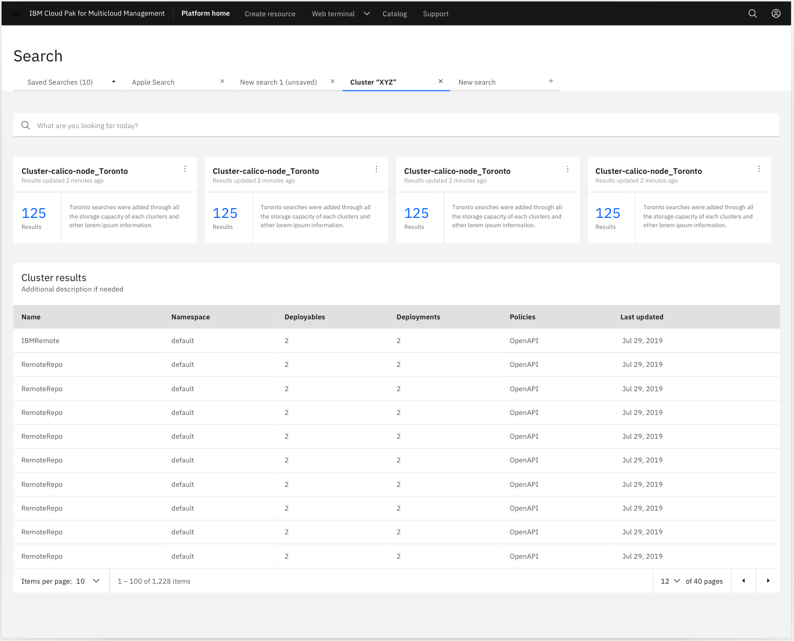
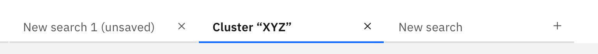
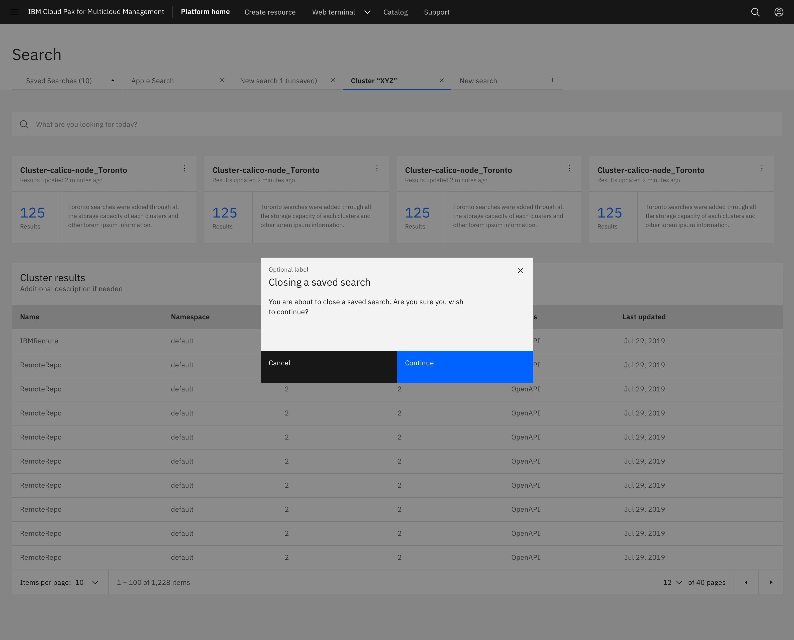

<PageDescription>

Modified tabs are used to quickly add or remove tabs. They allow users to view multiple pages of their product in one browser window.

</PageDescription>

<AnchorLinks>
  <AnchorLink>Overview</AnchorLink>
  <AnchorLink>Behavior</AnchorLink>
  <AnchorLink>Accessibility</AnchorLink>
  <AnchorLink>Related</AnchorLink>
  <AnchorLink>Feedback</AnchorLink>
</AnchorLinks>

## Overview

Modified tabs are an extension of the carbon tabs component to allow the creation of new tabs and the closing of existing ones. They allow users to view multiple pages of their product in one browser window.

## Behavior

Often times users are those who work with code. These users may prefer to operate the product with code rather than by the UI. The Web Terminal component gives these users the option to use a web terminal and code instead of the UI of the page.

**When to use**

Use this pattern when you want the user to have the ability to:

- Add tabs to display a page of their choice
- View multiple product pages in one browser window
- Create/drill down based on a specific data set
- Customize the tabs on the page
- Close tabs of pages they do not want/need

**When not to use**

- If normal tabs are sufficient
- If you do not want users able to close or add tabs
- The tabs on a page should not be removed and doing so would negatively alter the functionality of the page

## Structure and functionality 

**New search tab**

- Users can add a new tab by going to the last tab listed on the far right. This tab is labeled **New search** with an add icon. (In this case the tab is labeled “new search” but could more generally be labeled “new tab” for other use cases)
- If you click not the “new search” tab, a new tab will appear in line with the other tabs to directly to the left of the “new search” tab
- Hover and selected state for this tab adheres to carbon guidelines. The new aspect of the tab, the “add” icon, will always be the same color as the text on the tab and change accordingly.
- The “new search” tab will move to the right and remain at the end of the line of tabs

**Close tab feature**

- Each tab will have a “close” icon to the right side of the tab for users to close the tab at any time
- When the user clicks the "x" on the right side of the tab to close it, a modal will appear in the center of the screen to confirm the user wants to close this tab (see mock up of modal above as well as in the InVision prototype)
- Hover and selected state for this tab adheres to carbon guidelines. The new aspect of the tab, the “close” icon, will always be the same color as the text on the tab and change accordingly.

**Tab overflow**

- Carbon states no more than 6 tabs at a time and the tabs shown are just most recent. The tabs are in order of when you last opened them so the first tab when you reach 6 will go into overflow (saved searches tab) and the new tab will be added, plus the “new tab” at the end. There will only ever be 6 tabs present now matter how many searches you have open.

**Rearranging / Dragging tabs**

- Currently that is not a functionality available. We are ordering tabs by most recently opened.

### Best practices

- Do consider if the user actually needs this feature
- Do consider how the feature would effect the use and functionality of a page
- Do not use the modified tabs in every case as a replacement for regular tabs

## Accessibility

This component uses existing Carbon 10 color combinations and font sizes so the accessibility is unchanged.

## Related

- The screen is in Carbon Gray 10 theme; all the components are in Gray 10 theme
- The tabs are just as listed in the Carbon Gray 10 kit however a close icon was added to the right side of each tab (or an add icon for the case of the “new search” tab)
- The icons are 16 px from the right edge of the tab, and centered in the tab vertically
- The icons are the same gray as the text according to the state of the tab (inactive, hover, active)- 

## Feedback

Help us improve this pattern by providing feedback, asking questions, and leaving any other comments on GitHub.
