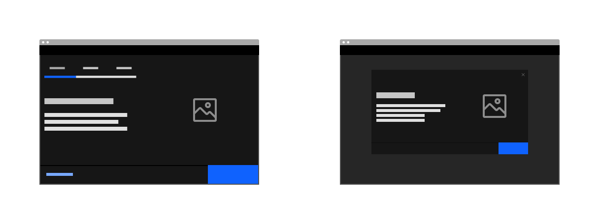
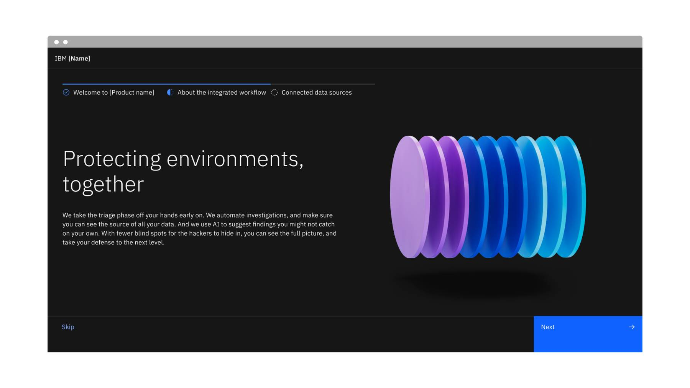
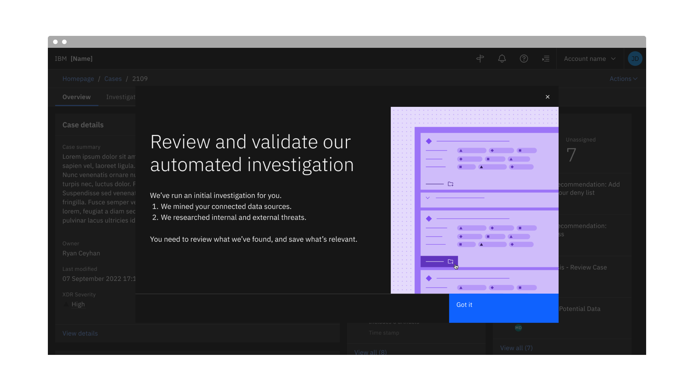
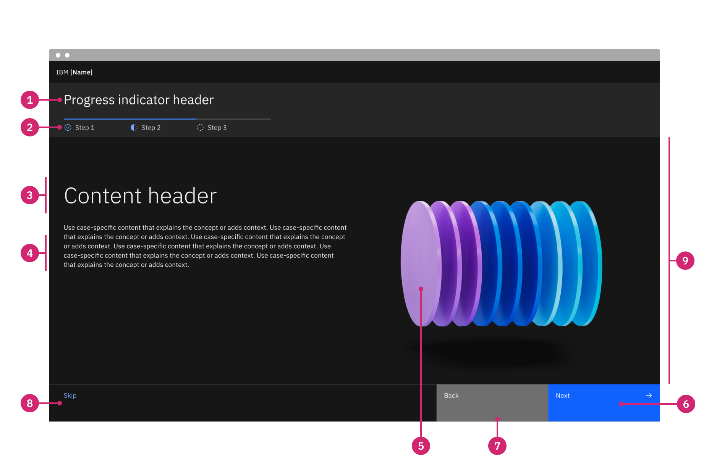
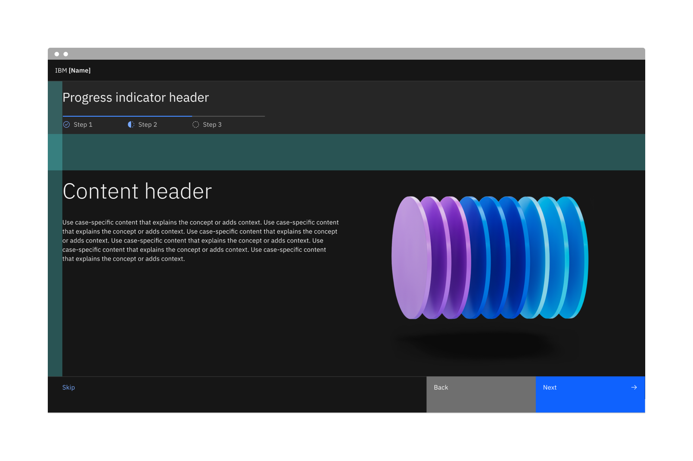
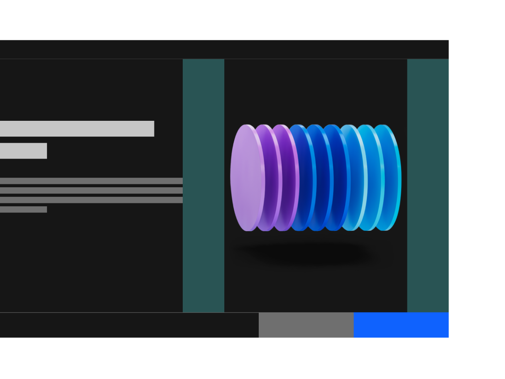

← [Back to Onboarding components overview](/components/onboarding/overview#carbon-components)

<PageDescription>

The interstitial screen introduces users to a new experience and sets their expectations for the key value they will encounter. 

</PageDescription>

<AnchorLinks>
   <AnchorLink>Overview</AnchorLink>
   <AnchorLink>Example</AnchorLink>
   <AnchorLink>Variants</AnchorLink>
   <AnchorLink>Formatting</AnchorLink>
   <AnchorLink>Content</AnchorLink>
   <AnchorLink>Illustration</AnchorLink>
   <AnchorLink>Related</AnchorLink>
</AnchorLinks>

## Overview

Interstitial screens can be a full page or an overlay, and are shown on the first time a user accesses a new experience 
(e.g. upon first login or first time opening a page where a newly purchased capability is presented).

<Row>
<Column colMd={8} colLg={8}>

</Column>
</Row>

### When to use

- To welcome new users to an app and set their expectations around the value the app provides.
- To introduce a newly purchased add-on or significant update. 
- To allow the user to tailor their experience to their interests or preferences.

### When not to use

- Do not use to inform users of a minor update to the app/experience.
- Do not use to highlight a feature that has already been available in the app.

## Variants

| Variant                 | Purpose                                                                                                                           |
| ---------               | --------------------------------------------------------------------------------------------------------------------------------- |
| [Full page](#full-page) | Introduces users to new applications or welcomes users to new application add-ons.                                                                      |
| [Overlay](#overlay)     | Introduces users to new experiences inside an application. |

### Full page

The full page interstitial should appear the first time a user has logged into an application, before they land on the product’s 
homepage. It can have up to 5 steps to outline the key value of the product. When stepped, always allow the user to skip the interstitial flow entirely with a "Skip" button.

<Row>
<Column colMd={12} colLg={12}>

</Column>
</Row>

### Overlay

The overlay version of the interstitial should behave much like a modal upon the first time accessing a page where a newly purchased capability or significant update is presented. An illustration to accompany the message should be used if possible. Users can choose to continue to the page by clicking “Got it” or the close button. In usability testing, interstitial overlays performed better when the illustration related to the UI (as opposed to abstract concepts) and the language was direct, succinct, and about what the user needed to do (as opposed to more value-focused language, which was disregarded as an ad). 

The overlay can also have up to 5 steps to outline the key value of the product. When stepped, always allow the user to skip the interstitial flow entirely with a “Skip” button.

<Row>
<Column colMd={12} colLg={12}>

</Column>
</Row>

## Formatting

### Anatomy

<Row>
<Column colMd={12} colLg={12}>

</Column>
</Row>

1. **Progress indicator header (optional):** The progress indicator header should explain what the progress steps are aiming to deliver to the user. It should be clear and descriptive enough to get the main idea across.
2. **Progress indicator (optional):** If the interstitial uses steps, use the progress indicator to show the user where they are in the flow.
3. **Content header:** The header highlights the key value or main message. 
4. **Body content:** The body content should provide additional context to the header.
5. **Media:** An animated illustration can be used in order to provide additional context to the content.
6. **Primary button:** The primary button is used to navigate to the next step (if stepped) and/or to continue to the app or page.
7. **Back button:** If the interstitial uses steps, the back button is needed to navigate to the previous step.
8. **Skip button:** If the interstitial uses steps, the skip button is used to navigate directly to the homepage (if full page) or 
page (if overlay).
9. **Content area:**  The layout provided in the component can be used to display content. Alternatively, the content area can be treated as an open canvas with a layout that will best display the intent of the content. Use [Carbon’s 16 column grid](https://carbondesignsystem.com/guidelines/2x-grid/overview) as a guide to ensure consistency.

### Alignment

The illustration should always sit at the right side of of the text. The footer (which contains the buttons) should expand 
the full width of the page or overlay.

For interstitials with steps, the progress indicator should align with the text below it.

<Row>
<Column colMd={12} colLg={12}>

</Column>
</Row>

## Content

### Main elements

#### Progress indicator heading
The interstitial progress indicator heading should explain what the progress steps are aiming to deliver to the user. It should be clear and descriptive enough to get the main idea across.

#### Heading
The interstitial screen heading for the full page variant should be value-oriented and as brief as possible, while still being clear and descriptive enough 
to get the main idea across. For overlays, it should be as direct and informative as possible to avoid being perceived as an ad. When writing the heading, 
you should assume the user will not read the body content, so try to ensure the heading will accurately communicate the message you want to deliver. 

#### Body content
The body content should contain information that provides additional detail or context to the heading, without repeating the heading 
itself. For the full page, it should aim to build the user’s anticipation and pique their interest about what they will be able to do in the product. For the 
overlay, it should be direct and succinct regarding what the user needs to know or do when they access the page.

## Illustrations

Illustrations within interstitial screens visually enhance the content of the page and should help highlight the value (for full page) or re-enforce the 
concept or action being communicated in the text (for overlay). They serve as the initial introduction to an experience a user is accessing for the first time. 

<Row>
<Column colMd={8} colLg={8}>

</Column>
</Row>

### Illustration best practices

- Interstitial illustrations should complement the content of the displaying step.
- Refer to [IBM Design Language Illustration Guidance](https://www.ibm.com/design/language/illustration/overview/).
- Animations should be kept brief, as they are meant to complement and not distract from written content. Refer to 
[IBM Design Language Animation Guidance](https://www.ibm.com/design/language/animation/overview/) if incorporating motion to these 
illustrations. 
- [Lottie](https://airbnb.design/lottie/) powers the animated SVGs, so it is recommended to use After Effects to create the vector 
animation and export using the [Bodymovin](https://aescripts.com/bodymovin/) plugin. 
- [Lottiefiles.com](https://lottiefiles.com/) is a good resource to check the integrity of the animation post-export.

## Related

– [Progress indicator](https://carbondesignsystem.com/components/progress-indicator/usage/)
