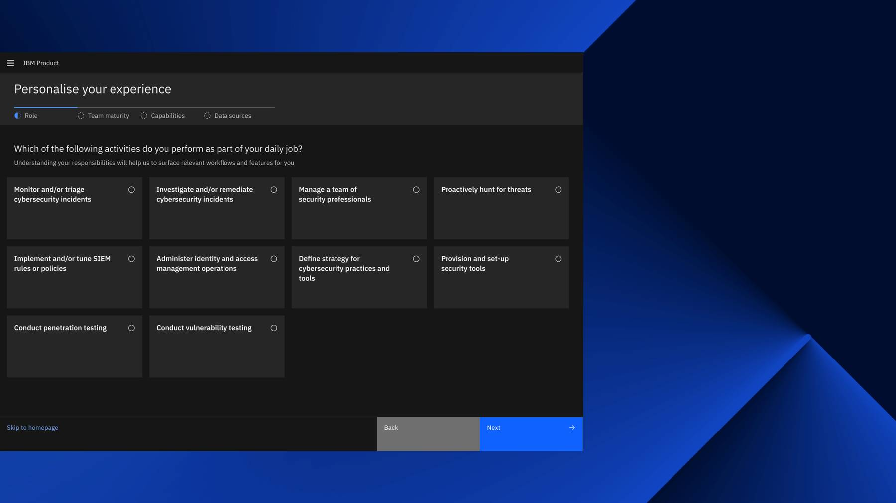

<PageDescription>

Onboarding components are built to equally support those who want to get in and ‘figure it out’ on their terms, asking for support when and if they need it, as well as those who are seeking more explicit guidance via step-by-step learning paths and tutorials. 

</PageDescription>

<AnchorLinks>
   <AnchorLink>Carbon components</AnchorLink>
   <AnchorLink>WalkMe components</AnchorLink>
   <AnchorLink>Assist Me panel</AnchorLink>
   <AnchorLink>Using Carbon onboarding components, WalkMe, and Assist Me</AnchorLink>
</AnchorLinks>

## Carbon components

The following onboarding-specific components are designed to choreograph with each other and natively embed within product experiences.

<Row className="image-card-group">

<Column colMd={3} colLg={3} noGutterSm>

<ImageCard 
sub-title="Checklist"
sub-titleColor="dark"
hoverColor="dark"
href="/components/onboarding/checklist/usage">

</ImageCard>

<ImageCard
sub-title="Inline tip"
sub-titleColor="dark"
hoverColor="dark"
href="/components/onboarding/inline-tip/usage">

</ImageCard>

</Column>

<Column colMd={3} colLg={3} noGutterSm>

<ImageCard 
sub-title="Coachmark"
sub-titleColor="dark"
hoverColor="dark"
href="/components/onboarding/coachmark/usage">

</ImageCard>

<ImageCard 
sub-title="Interstitial"
sub-titleColor="dark"
hoverColor="dark"
href="/components/onboarding/interstitial/usage">

</ImageCard>

</Column>

<Column colMd={3} colLg={3} noGutterSm>

<ImageCard
sub-title="Guide banner"
sub-titleColor="dark"
hoverColor="dark"
href="/components/onboarding/guide-banner/usage">

</ImageCard>

<ImageCard
sub-title="Nonlinear reading"
sub-titleColor="dark"
hoverColor="dark"
href="/components/onboarding/nonlinear-reading/usage">

</ImageCard>

</Column>

</Row>

## WalkMe components

IBM uses a third-party tool called [WalkMe](https://www.walkme.com/) to deploy getting started and trial experiences on top of our products. WalkMe components can be used in conjunction with the other onboarding components.

<Row className="image-card-group">

<Column colMd={3} colLg={3} noGutterSm>

<ImageCard 
sub-title="Launcher"
sub-titleColor="dark"
hoverColor="dark"
href="/components/onboarding/launcher/usage">

</ImageCard>

<ImageCard
sub-title="ShoutOut"
sub-titleColor="dark"
hoverColor="dark"
href="/components/onboarding/shoutout/usage">

</ImageCard>

</Column>

<Column colMd={3} colLg={3} noGutterSm>

<ImageCard 
sub-title="SmartTip"
sub-titleColor="dark"
hoverColor="dark"
href="/components/onboarding/smarttip/usage">

</ImageCard>

<ImageCard 
sub-title="Smart walk-thru"
sub-titleColor="dark"
hoverColor="dark"
href="/components/onboarding/smart-walk-thru/usage">

</ImageCard>

</Column>

</Row>

### WalkMe usage guidance

For more detailed WalkMe guidance, refer to the link below.

<CardGroup>
  <MiniCard
    title="WalkMe overview"
    href="/components/onboarding/walkme-guide/main/overview"
    actionIcon="arrowRight"
  />
</CardGroup>

## Assist Me panel

The Assist Me panel serves many functions relating to onboarding, including a destination for just-in-case access to 1st time use and continued learning material. It provides a permanent home for users to access onboarding tasks, tours, and support patterns at anytime, anywhere they are within the product experience.

<Row className="image-card-group">

<Column colMd={3} colLg={3} noGutterSm>

<ImageCard 
sub-title="Assist Me"
sub-titleColor="dark"
hoverColor="dark"
href="/components/onboarding/assistance-panel/usage">

</ImageCard>

</Column>

</Row>

## Using Carbon onboarding components, WalkMe, and Assist Me

There are several advantages to using third party tools, like WalkMe, in conjunction with native Carbon components. Third party tools give us a head start towards meeting key experience needs. They come out-of-the-box with an established technical foundation and staffed support. Having our own Carbon experiences, as a hybrid ecosystem, enables us to adapt, build upon, and innovate. It gives us the ability to leverage third party tools without having to compromise experience limits, providing the flexibility to iteratively improve and expand experiences to meet our user’s ever-evolving needs.

**Carbon components, WalkMe components, and Assist Me all fulfill onboarding, support, and education needs. They work better, together.**

**WalkMe** provides a robust set of onboarding and support capabilities, packaged as a “no-code” solution. The capabilities including onboarding tours, feature walk-throughs, guided steps, in-app assistance, and surveys. **Carbon onboarding components** augment WalkMe capabilities, designed to directly “integrate” within the UI experience where native just-in-time placement is key, particularly for users who are interested in exploring the product on their own terms. They offer the ability to contextually surface adoption-focused guidance with activation prompts driving to onboarding success. **Assist Me** is a Carbon-native just-in-case hub providing easy access to onboarding and support material. It’s an all-in-one “help” panel that allows users to initiate a search, continue onboarding tasks, launch guided paths, start a chat with an advisor, view recommended articles, and explore additional support options.

### A holistic experience, working together

<Row className="resource-card-group">
  <Column colMd={4} colLg={4} noGutterSm>
    <ResourceCard
      subTitle="Experience ecosystem diagram"
      actionIcon="launch"
      aspectRatio="2:1"
      href="https://ibm.box.com/s/dsrz6pkabrkeu0hhmnc19m80tti1w1hm">

  </ResourceCard>
  </Column>
  <Column colMd={4} colLg={4} noGutterSm>
    <ResourceCard
      subTitle="Experience ecosystem deck"
      actionIcon="launch"
      aspectRatio="2:1"
      href="https://ibm.box.com/s/kosh03v5c2iy19664e792mssmjw1m377">

  </ResourceCard>
  </Column>
</Row>

### Onboarding patterns

For guidance about using the components as choreographed patterns, working together to address onboarding needs, refer to the broader onboarding pattern guidance.

<FeatureCard
  title="Onboarding patterns"
  actionIcon="arrowRight"
  href="/patterns/onboarding/overview"
  color="light">

</FeatureCard>