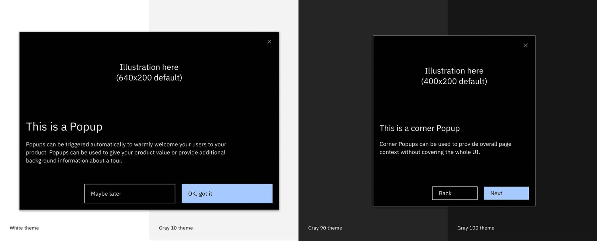

← [Back to Onboarding components overview](/components/onboarding/overview#walkme-components)

<PageDescription>

ShoutOuts have multiple uses from setting tour context to introducing new UI experiences.

</PageDescription>

## Overview

ShoutOuts are designed to draw user’s attention and provide context for a subsequent experience. ShoutOuts are effective as a means to welcome a new user to the product, make announcements–like new features or updates, provide overall page context without covering the whole UI using corner popups, embed videos in tours to provide even more information, or wrap up and end a tour to give users the next call to action.

<Row>
<Column colMd={8} colLg={8}>

</Column>
</Row>

### Usage guidance

For expansive shoutOut usage guidance, follow the resource link to visit WalkMe’s documentation.

<Row className="resource-card-group">
  <Column colMd={4} colLg={4} noGutterSm>
    <ResourceCard
      subTitle="ShoutOut guidance"
      actionIcon="launch"
      aspectRatio="2:1"
      href="https://support.walkme.com/knowledge-base/shoutouts-overview/">

  </ResourceCard>
  </Column>
</Row>