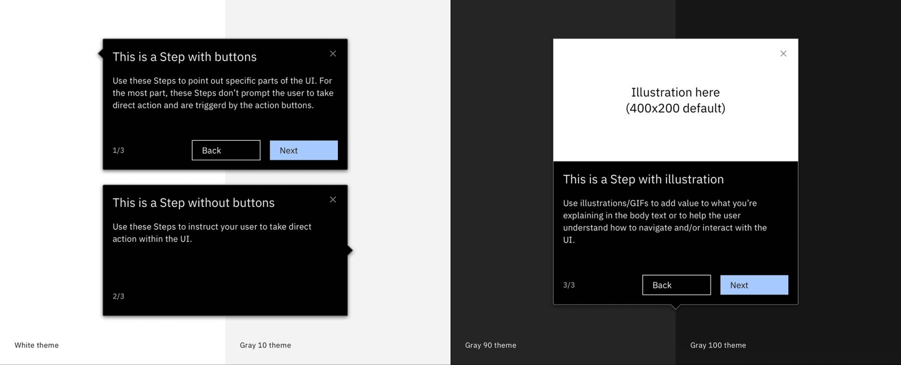

← [Back to Onboarding components overview](/components/onboarding/overview#walkme-components)

<PageDescription>

Smart walk-thrus provide step-by-step guidance to users so they can better understand the product and complete tasks successfully.

</PageDescription>

## Overview

Smart walk-thrus function to create guided paths that provide interactive, stepped sequences to help users learn and retain information. Guided paths aim to decrease cognitive load and increase the level of understanding by breaking up concepts into more consumable pieces, making the information memorable.

The understanding the user attains by going through guided paths helps the user to achieve a specific milestone or goal.

<Row>
<Column colMd={8} colLg={8}>

</Column>
</Row>

### Usage guidance

For expansive smart walk-thru usage guidance, follow the resource link to visit WalkMe’s documentation.

<Row className="resource-card-group">
  <Column colMd={4} colLg={4} noGutterSm>
    <ResourceCard
      subTitle="Smart walk-thru guidance"
      actionIcon="launch"
      aspectRatio="2:1"
      href="https://support.walkme.com/knowledge-base/smart-walk-thrus/">

  </ResourceCard>
  </Column>
</Row>