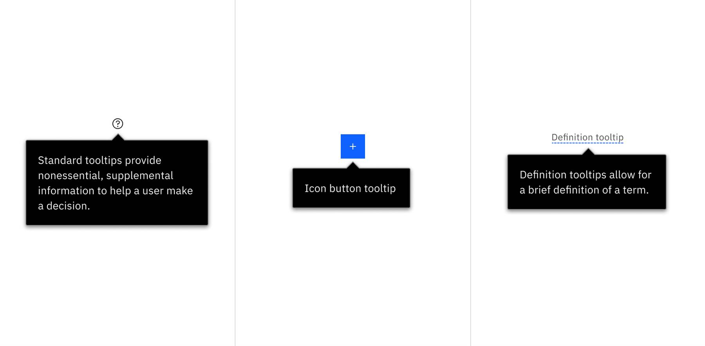

← [Back to Onboarding components overview](/components/onboarding/overview#walkme-components)

<PageDescription>

SmartTips are advanced tooltips that display additional information upon hover or focus that is contextual, helpful, and nonessential while providing the ability to communicate and give clarity to a user.

</PageDescription>

## Overview

The smartTip is an effective alternative to the Carbon tooltip, where it is necessary to implement inline guidance independent of development cycles. SmartTips typically consist of a launcher and balloon.

<Row>
<Column colMd={8} colLg={8}>

</Column>
</Row>

### Usage guidance

For expansive smartTip usage guidance, follow the resource link to visit WalkMe’s documentation.

<Row className="resource-card-group">
  <Column colMd={4} colLg={4} noGutterSm>
    <ResourceCard
      subTitle="SmartTip guidance"
      actionIcon="launch"
      aspectRatio="2:1"
      href="https://support.walkme.com/knowledge-base/smarttips/">

  </ResourceCard>
  </Column>
</Row>