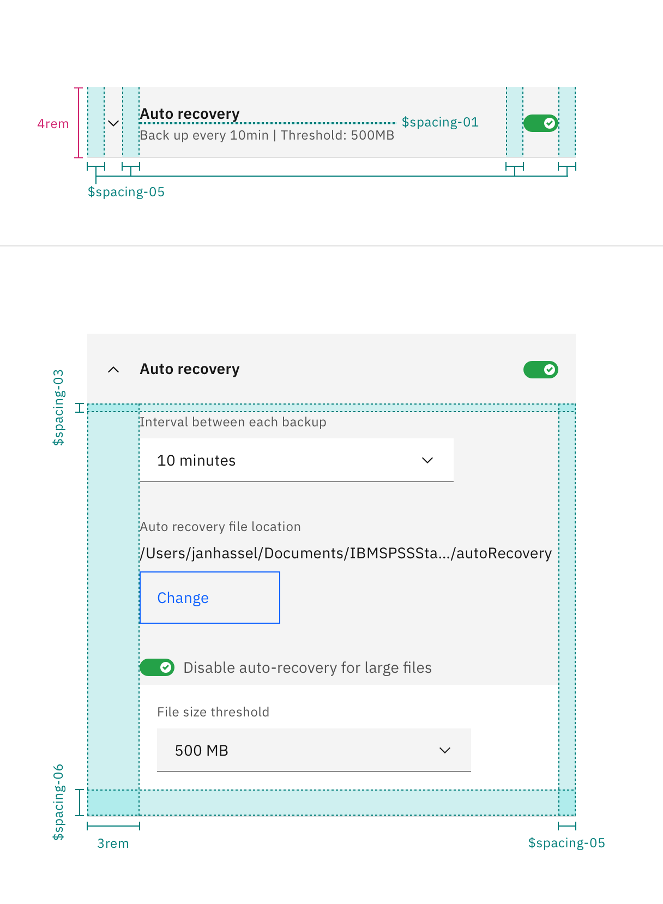
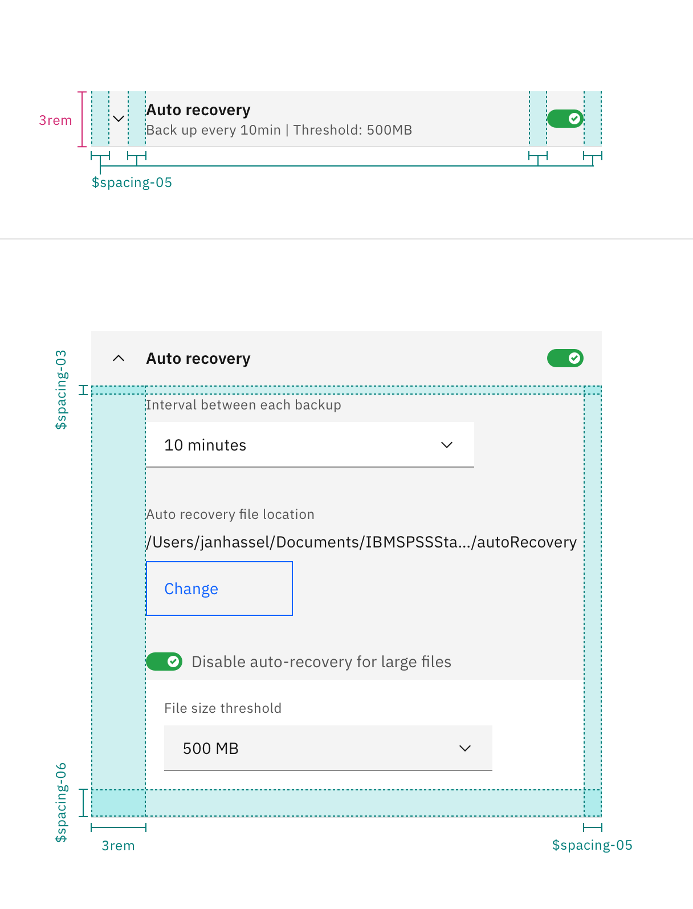

## Color

| Element | Property | Color token |
| :- | :- | :- |
| Tile | `background-color` | `$ui-01` |
| | `border-bottom-color` | `$ui-03` |
| Chevron | `fill` | `$icon-01` |
| Heading | `color` | `$text-01` |
| Summary | `color` | `$text-02` |

### Interactive states

| State | Element | Property | Color token |
| :- | :- | :- | :- |
| Hover | Header | `background-color` | `$hover-ui` |
| Focus | Header | `outline-color` | `$focus` |
| Invalid | Summary | `color` | `$support-01` |
| | Summary icon | `fill` | `$support-01` |
| Warning | Summary | `color` | `$text-01` |
| | Summary icon | `fill` | `$support-03` |
| Locked | Summary icon | `fill` | `$icon-02` |

## Typography

| Element | Type style |
| :- | :- |
| Heading | `productive-heading-01` |
| Summary | `helper-text-01` |

## Structure

The elements in the header are vertically centered at all time.

| Size variant | Element | Property | px / rem | Spacing token |
| :- | :- | :- | :- | :- |
| All | Chevron | `padding-left`, `padding-right` | - | `$spacing-05` |
| | Header | `padding-right` | - | `$spacing-05` |
| | Heading | `padding-right` | - | `$spacing-05` |
| | Summary | `padding-right` | - | `$spacing-05` |
| | Summary icon | `padding-right` | - | `$spacing-02` |
| | Content | `padding-top` | - | `$spacing-03` |
| | | `padding-right` | - | `$spacing-05` |
| | | `padding-bottom` | - | `$spacing-06` |
| | | `padding-left` | 48 / 3 | - |
| ExtraLarge | Header | `height` | 64 / 4 | - |
| | Summary | `margin-top` | - | `$spacing-01` |
| Large | Header | `height` | 48 / 3 | - |

#### Extra large

<Row>
  <Column colLg={8}>

  </Column>
</Row>

#### Large

<Row>
  <Column colLg={8}>

  </Column>
</Row>
