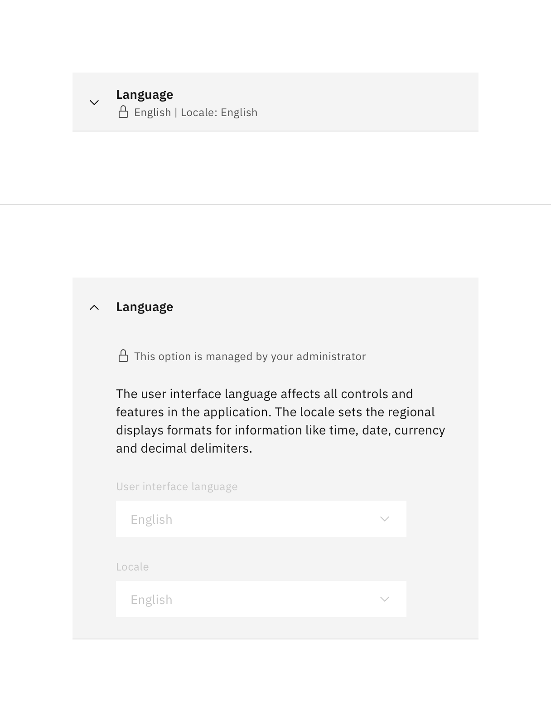

<PageDescription>

An options tile can contain information, controls or tables which, when collapsed, is summarized. It can be paired with a toggle to quickly enable or disable the option.

</PageDescription>

<AnchorLinks>
  <AnchorLink>Overview</AnchorLink>
  <AnchorLink>Variants</AnchorLink>
  <AnchorLink>Formatting</AnchorLink>
  <AnchorLink>Content</AnchorLink>
  <AnchorLink>Universal behaviours</AnchorLink>
</AnchorLinks>

## Overview

The options tile is a disclosure widget, grouping a set of related controls or information while providing a summary of its contents when collapsed. It is used to avoid overwhelming the user with too many choices and elements when they're likely not interested in all available options, but only a subset. 

An options tile can also be paired with a toggle to enable or disable an entire set of features with ease.

### When to use

- To organize related information.
- To shorten pages and reduce scrolling when content is not crucial to read in full.
- When space is at a premium and long content cannot be displayed all at once, like on a mobile interface or in a side panel.
- When the state of all belonging options can be changed by a single toggle.

### When not to use

- When the user is most likely interested in all available options on a page, the additional step of expanding each tile can be perceived as a burden. Consider using normal headers to organize content.

## Variants

| Variant | Purpose |
| :- | :- |
| Expandable | Tile containing a set of related controls or information. Can be paired with a toggle if the content can be enabled or disabled. |
| Static | Tile for a single option that can be enabled or disabled with a toggle. |

<Row>
  <Column colLg={8}>

  </Column>
</Row>

## Formatting

### Anatomy

#### Collapsed

<Row>
  <Column colLg={8}>

  </Column>
</Row>

1. **Chevron (only applies to expandable tiles):** Indicates whether the tile is expanded or not
2. **Heading:** The title of the options tile used to describe all included content
3. **Summary (optional):** A short summary of the current state of the content
4. **Toggle (optional):** Single toggle to enable or disable the entire feature / option

#### Expanded

<Row>
  <Column colLg={8}>

  </Column>
</Row>

1. **Header:** See above (anatomy in collapsed state). Note: the summary is not visible when the tile is expanded
2. **Content:** All related controls or information this option tile includes

## Content

### Main elements

#### Chevron (only applies to expandable tiles)
- Expandable options tiles contain a chevron to indicate whether they're expanded or collapsed.

#### Title
- Always use a clear and concise title.
- Limit the title to a single line.

#### Summary (optional)
- The summary should reflect the currently applied settings of the options tile content.
- Show exact values of options up to a maximum of 3 options.
- A summary text should summarize the content or can be used as an additional helper text.
- The summary needs to be short and in sentence style.
- Separate multiple value summaries with a vertical bar / pipe: `|`
- Limit the summary to a single line.

#### Toggle (optional)
- Use options tiles with a toggle when the entire content can be changed between enabled and disable state.
- The tile can still be expanded when the toggle is turned off but all controls inside should be disabled.

## Universal behaviours

### States

The options tile component has two main states: collapsed and expanded. The chevron icon at the left side indicates which state the options tile is in. The chevron points down to indicate collapsed and up to indicate expanded. Options tiles are collapsed by default.

A user can independently expand and collapse each options tile, allowing for multiple expanded tiles on the same page.

The options tile header receives interactive states for hover and focus.

<Row>
  <Column colLg={8}>

  </Column>
</Row>

### Interactions

#### Mouse
By clicking anywhere on the header of an options tile, it expands when it was collapsed and collapses when it was expanded.
When paired with a toggle, the toggle can be clicked to enable or disable the option. Clicking on the toggle in the header does not expand or collapse the tile.

#### Keyboard
The header element is in the tab order and recives focus. Pressing either <kbd>Space</kbd> or <kbd>Enter</kbd> will expand or collapse the options tile.
All interactive controls inside the tile are then also in the browser's tab order and can therefore be accessed sequentially by pressing the <kbd>tab</kbd> key.

When paired with a toggle, the toggle element receives focus before the header element.

#### Screen readers
- **VoiceOver:** Users can expand or collapse the tile by pressing <kbd>Control</kbd>+<kbd>Option</kbd>+<kbd>Space</kbd>, <kbd>Enter</kbd> or <kbd>Space</kbd> while the header has screen reader fcous
- **JAWS:** Users can expand or collapse the tile by pressing <kbd>Enter</kbd> or <kbd>Space</kbd> when the header has screen reader focus
- **NVDA:** Users can expand or collapse the tile by pressing <kbd>Enter</kbd> or <kbd>Space</kbd> when the header has screen reader focus

### Validation

#### Default
The header can contain an optional summary of the tile's contents and current settings.

<Row>
  <Column colLg={8}>

  </Column>
</Row>

#### Error
When a control inside the options tile is in an invalid state, the summary line in the header is replaced with a customizable error message.

<Row>
  <Column colLg={8}>

  </Column>
</Row>

#### Warning
When a control inside the options tile is in a warning state, the summary line in the header is replaced with a customizable warning message.

<Row>
  <Column colLg={8}>

  </Column>
</Row>

#### Locked
When all controls inside an options tile are disabled due to lack of permission, a lock icon is displayed next to the summary line. Additionally, when expanded, the reason for the locked state is explained to the user.

<Row>
  <Column colLg={8}>

  </Column>
</Row>

#### Hierarchy
- If there is both, a warning and an error state inside the tile, the header will receive the error state as it has the highest priority.
- A locked tile cannot receive an error or warning state.

### UX considerations

#### Saving options

All options should be instantly saved / applied when changed by the user. Avoid placing a "Save" button or waiting until the tile is collapsed unless absolutely necessary. If the impact of an option is too high to save instantly, consider using a different UX pattern where the user is guided through the settings flow and explicitly confirms with a "Save" or "Apply" button.

#### Grouping

If multiple options tiles are related to each other, consider placing them directly adjacent / underneath each other to create a visual group and seperate multiple groups by additional spacing and ideally a heading describing the group.
