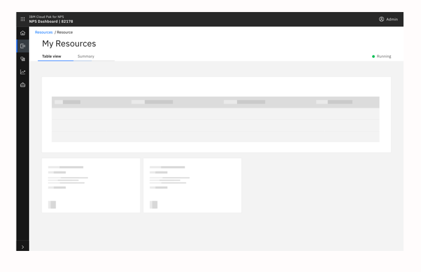
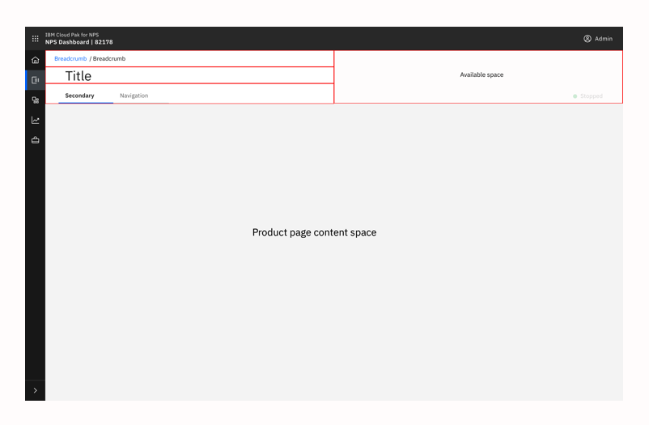
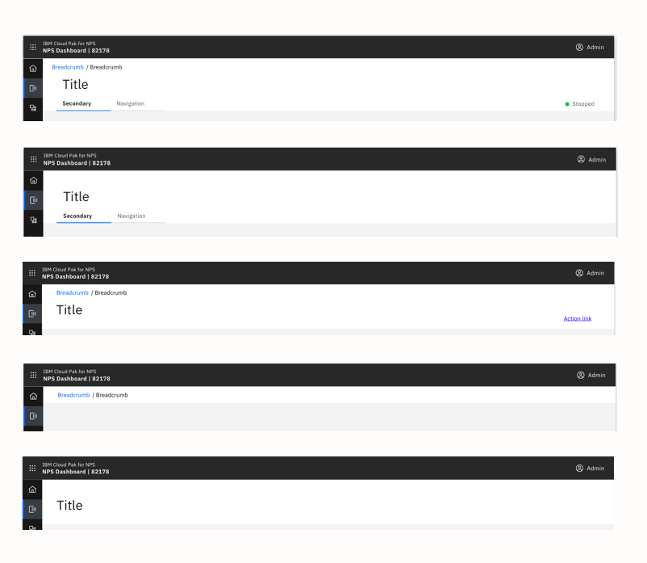

<Row>
 <Column colLg={8}>

 </Column>
</Row>

## General guidance

The page header allows consistency in the spacing and location of items inside
page headers within a product and across products.  This avoids users
experiencing jarring movement and jumping of headers when navigating among
product content.

## Format

The page header comprises of 4 areas, all of which are optional, allowing for
flexibility to include (or exclude) areas depending on the context and needs
of the page.

<Row>
 <Column colLg={8}>

 </Column>
</Row>

### Breadcrumb

The placement for a  breadcrumb to be displayed if required.

### Title

The placement for a page title to be displayed.  Optionally an icon could be
displayed to the left of the title text.

### Secondary navigation

The placement for a form of secondary navigation within a page to be displayed
e.g. tabs, content switcher etc.

### Available space

This space allows products to use it to contain anything they deem necessary
at this level e.g. action button,  link, status etc.

## Variations

All elements of the header are optional so any combination can be used.
Some examples are shown below.

<Row>
 <Column colLg={8}>

 </Column>
</Row>
