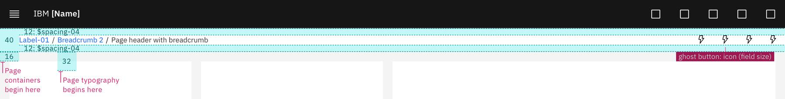
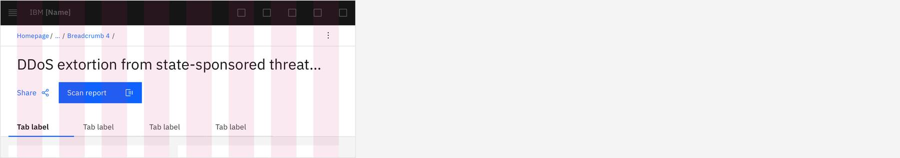
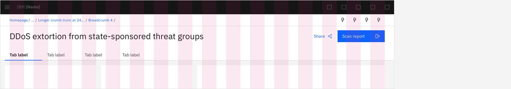
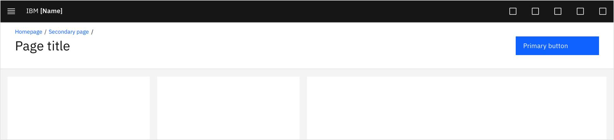

## Structure

The page header delivers consistent spacing and uniform content placement. This avoids jarring movement and unexpected behavior when navigating within the offering and across the portfolio.

### Page header with background

The page header with background is the default expression and should be used when possible.

### Page header with bar only

### Page header without background

### Grid

#### Zones

The page header is structured in percentage-based zones to balance content hierarchy and choreography at various browser view widths.

#### Breakpoints

The page header is responsive and adjusts accordingly to optimally format at each 2x Grid breakpoint.

Small (320 - 672px)

Medium (672 - 1056px)

Large (1056 - 1312px)

X-Large (1312 - 1584px)

Max (1584px +)

Optionally, the page header can be set to span the full browser view width to match content that also exceeds the max limit (This should only be used if your product requires exceeding the max 2x Grid width of 1584).

## Typography

Page titles and subtitles should be [sentence case](https://www.carbondesignsystem.com/guidelines/content/guidance/#use-sentence-case-capitalization), with only the first word and proper nouns capitalized.

|                 | Carbon token            | rem  | px |
|-----------------|-------------------------|------|----|
| Breadcrumbs     | `$label-01`             | .75  | 12 |
| Title           | `$productive-heading-04`| 1.75 | 28 |
| Subtitle        | `$body-long-01`         | .875 | 14 |

 

## Color 

The page header is available for both **gray 10** and **gray 100** themes. 

