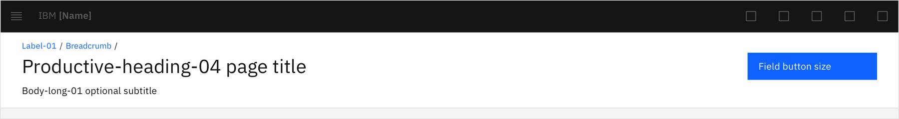

## Structure

The page header delivers consistent spacing and uniform content placement. This avoids jarring movement and unexpected behavior when navigating within the offering and across the portfolio.

### Page header without background

### Page header with background

### Page header with bar only

## Typography

Page titles and subtitles should be [sentence case](https://www.carbondesignsystem.com/guidelines/content/guidance/#use-sentence-case-capitalization), with only the first word and proper nouns capitalized.

|                 | Carbon token            | rem  | px |
|-----------------|-------------------------|------|----|
| Breadcrumbs     | `$label-01`             | .75  | 12 |
| Title           | `$productive-heading-04`| 1.75 | 28 |
| Subtitle        | `$body-long-02`         | 1    | 16 |

 

## Color 

The page header is available for both **gray 10** and **gray 100** themes. 

