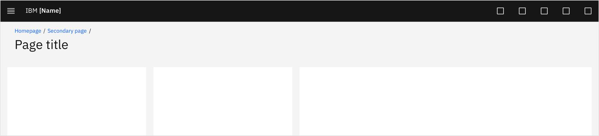
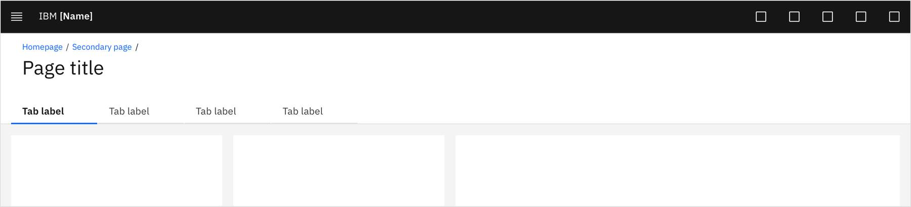
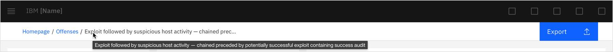

`Cross-org aligned`

<PageDescription>

The page header serves as a companion to the global header, providing a beacon to orient users in the UI. This guidance outlines the qualities that make a page header familiar and usable.

</PageDescription>

<AnchorLinks>
  <AnchorLink>Overview</AnchorLink>
  <AnchorLink>Types</AnchorLink>
  <AnchorLink>Behavior</AnchorLink>
  <AnchorLink>Best practices</AnchorLink>
  <AnchorLink>Related</AnchorLink>
</AnchorLinks>

## Overview

The page header is a consistent workhorse that sets the stage for each page within the offering. It informs the user of exactly where they are as well as provides in-page navigation and actions. The consistency of the page header layout acts as a familiar means to navigate the current page and way-find away from it. It can also be used to surface metadata or functionality that applies to the entire experience below the page header.

### Anatomy of the page header

The page header is comprised of 6 zones, allowing for the flexibility to include (or exclude) areas depending on the context and needs of the page.

1. **Breadcrumbs:** This zone is for the breadcrumb component to be displayed. Breadcrumbs should typically be displayed if there are navigable pages that precede the current page.
2. **Page title:** This zone is for a page title to be displayed. Optionally an icon can be included to the left of the title text.
3. **Subtitle / description (optional):** This zone is for the inclusion of a subtitle or description to provide additional context to identify the current page.
4. **Available space (optional):** This zone is for placing high-level content above page tabs.
5. **Tabs (optional):** This zone is for placing navigation within a page. e.g. tabs, content switcher etc.
6. **Actions (optional):** This zone is for placing critical page actions.

## Types

There are two main structural types of page headers. One with a background and one without.

### Page header without background
The simplest expression of the page header. A background-less page header should be used if only the breadcrumb, title, actions, and/or simple status are required.

### Page header with background
The more complex expression of the page header. The background provides structurality and aids in establishing hierarchy for page headers with more items. The page header with a background should be used if tabs, subtitles, and/or more global items are required.

### Examples without background

#### Page title only
This is the base of the page header, establishing spacing/title structure that all other sans background page headers follow. The base is best used to accommodate simple requirements, including page title only, or page title + buttons.

#### With breadcrumbs
This variant of the page header accounts for page title, buttons, breadcrumbs, and occasionally icons and metadata.

#### With status indicator
Structured similarly to the examples above, this variant is for the inclusion of a page level status indicator.

### Examples with background

#### With tabs
Tabs are positioned underneath the page title and sit flush at the base of the page header background.

#### With tags
Tags are positioned underneath the page title and sit above the base of the page header background.

#### With tabs & tags
If both tabs & tags need to be present, tabs should be remain left aligned with the page and tags reposition over to the right side of the screen.

#### With subtitle
Subtitles, if necessary, are placed directly below the page title. Page headers with subtitles use the background to create hierarchy and to separate it from type placed within the page.

#### With summary details
Page content with global page hierarchy can be placed above tabs within the page header. This is an example. The actual page content should be determined by the offering team.

#### With breadcrumb + actions toolbar
If the page header contains action icons, the default state includes a toolbar designated for the breadcrumbs and action icons.

## Behavior

### Page title length

#### Character count
To maintain page titles that are efficient to read and avoid crowding within the page header, the title length should be no more than ~56 characters.

#### Truncation
Page titles should remain on a single line instead of wrapping to multiple lines. Use truncation for titles that must exceed the 56 character count and/or stages with narrow widths. If the titles become truncated, ensure browser tooltips over the page title are used on hover to display the full string.

#### Subtitles
If titles are frequently longer than ~56 characters, consider using a generic title and include a subtitle for dynamic, descriptive use.

<Caption>If a unique URL page ID or an informative breadcrumb string is required, consider using a more descriptive page title and truncate as needed.</Caption>

### Scrolling

#### Default
The page title scrolls with the rest of the page content. Once the page title scrolls out of view, the current page title appends to the end of the breadcrumbs.

<Video src="images/page-header-transition-1.mov" autoPlay loop>
  <track kind="captions" src="images/page-header-transition-1.mov" />
</Video>

#### With button(s)
The button transition accompanies the default scrolling behavior. If a button or set of buttons is included in the page header, they should scroll with the page until they meet the base of the global header. The button(s) then stays in that position for the remainder of the page scroll. Scrolling back to the top of the page puts the transition in reverse.

<Video src="images/page-header-transition-2.mov" autoPlay loop>
  <track kind="captions" src="images/page-header-transition-2.mov" />
</Video>

#### With action toolbar + button(s)
If the page header includes a toolbar, the buttons scroll with the page next to the page title. As the buttons scroll out of view, they should fade in to view in the toolbar next to the actions.

<Video src="images/page-header-transition-3.mov" autoPlay loop>
  <track kind="captions" src="images/page-header-transition-3.mov" />
</Video>

#### With tabs
The page title transition remains the same. After this initial transition, the tabs push the breadcrumbs out of view as the page is scrolled further. As soon as the page is scrolled towards the top, the breadcrumb row reveals again stacked above the tabs. 

<Video src="images/page-header-transition-4.mov" autoPlay loop>
  <track kind="captions" src="images/page-header-transition-4.mov" />
</Video>

## Best practices
### Do's
- Follow the breadcrumb component for proper usage of breadcrumbs
- Where possible, move metadata out of header and either onto the page or a “details” button
- Include sentence-case for page titles. Reference the [voice & tone guidance](https://www.carbondesignsystem.com/guidelines/content/guidance/#use-sentence-case-capitalization)

### Dont's
- Metadata or actions that don’t apply to the entire experience should not be placed in the header
- Filters should not be placed in the page header component but rather underneath

## Related
#### Components
- [Breadcrumb](https://www.carbondesignsystem.com/components/breadcrumb/usage)
- [Button](https://www.carbondesignsystem.com/components/button/usage)
- ReturnTo banner
- [Status icons](http://localhost:8000/patterns/status-icons)
- [Tabs](https://www.carbondesignsystem.com/components/tabs/usage)
- [Tag](https://www.carbondesignsystem.com/components/tag/usage)
- Toolbar
