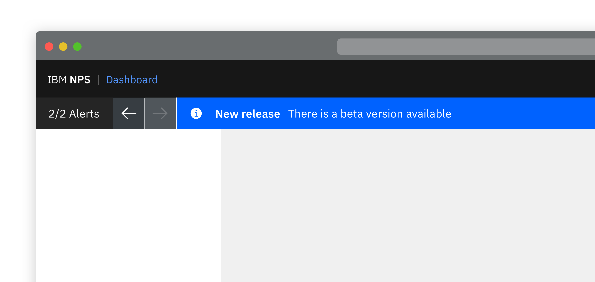
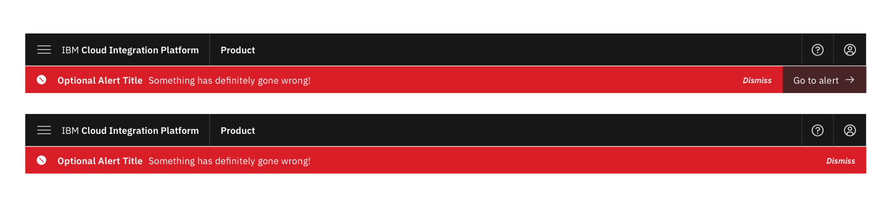
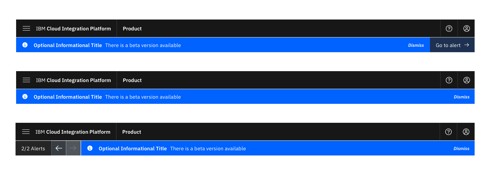
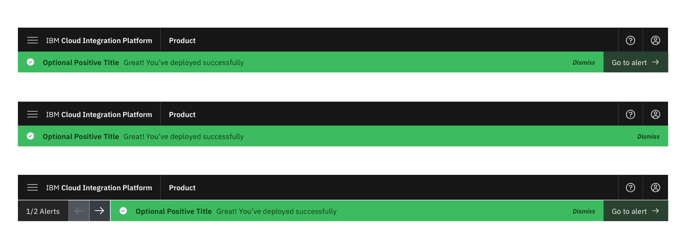
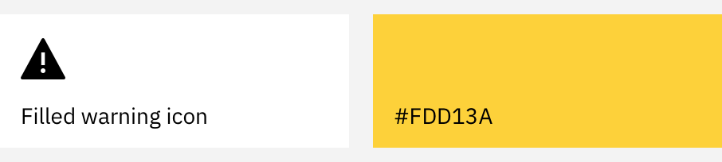
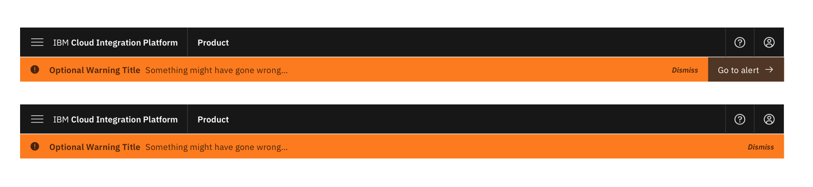
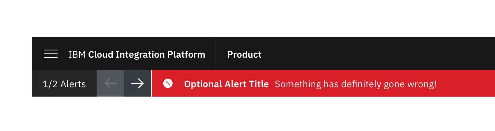

<InlineNotification kind="warning">

  Please note this pattern is still under review.
  
</InlineNotification>

<Row>
 <Column colLg={8}>

 </Column>
</Row>

#### Options

<AnchorLinks>
  <AnchorLink>Severity</AnchorLink>
  <AnchorLink>Dismiss action</AnchorLink>
  <AnchorLink>Go to action</AnchorLink>
  <AnchorLink>Stacking</AnchorLink>
</AnchorLinks>

## Severity

The level of severity of the information to be displayed in the banner will
determine the colour and icon used in it.

### Subsections

<AnchorLinks>
  <AnchorLink>Error alert</AnchorLink>
  <AnchorLink>Information alert</AnchorLink>
  <AnchorLink>Positive alert</AnchorLink>
  <AnchorLink>Warning alert</AnchorLink>
  <AnchorLink>Second level warning alert</AnchorLink>
</AnchorLinks>

#### Error alert

“Something has definitely gone wrong”

<Row>
  <Column colMd={6} colLg={6}>

  </Column>
</Row>
<Row>
  <Column colLg={10}>

  </Column>
</Row>

#### Information alert

We want to inform you about something.

<Row>
  <Column colMd={6} colLg={6}>

  </Column>
</Row>
<Row>
  <Column colLg={10}>

  </Column>
</Row>

#### Positive alert

You've successfully done something / something has been successful.

<Row>
  <Column colMd={6} colLg={6}>

  </Column>
</Row>
<Row>
  <Column colLg={10}>

  </Column>
</Row>

#### Warning alert

Something may have gone wrong (only got one warning level).

<Row>
  <Column colMd={6} colLg={6}>

  </Column>
</Row>
<Row>
  <Column colLg={10}>

  </Column>
</Row>

#### Second level warning alert

Something may have gone wrong (if you need more than one warning level).

<Row>
  <Column colMd={6} colLg={6}>

  </Column>
</Row>
<Row>
  <Column colLg={10}>

  </Column>
</Row>

## Dismiss action

Depending upon the nature of the alert there is the ability to optionally
include a Dismiss option.  Whilst the ability to dismiss an alert is usually
recommended, there may be situations where the severity of the alert means it
should not be manually dismissible, instead dismisses itself once the
situation has been rectified.

<Row>
  <Column colLg={8}>

  </Column>
</Row>

## Go to action

Depending upon the alert there is the ability to optionally include a go to
action. The text and destination of this is customisable and determined by
the product on a case by case basis.

<Row>
  <Column colLg={8}>

  </Column>
</Row>

## Stacking

Having multiple high level banner alerts isn't recommended however there may
be situations in which it is necessary.  In this situation they should be
stacked in severity order, with the number of alerts and the to ability
navigate between them on the left.

<Row>
  <Column colLg={8}>

  </Column>
</Row>
