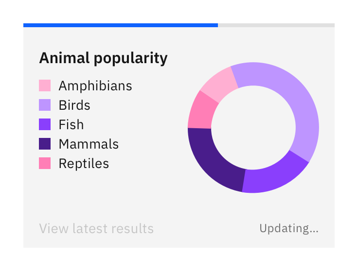
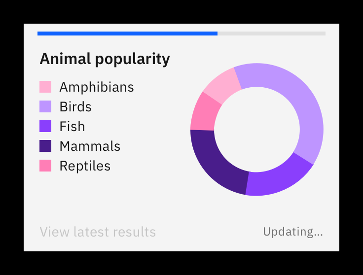

<PageDescription>

  The progressive loading bar is used when data is being retrieved, or some other form of load is happening, and a loading spinner or skeleton load is not deemed suitable. 
  
</PageDescription>

<AnchorLinks>
  <AnchorLink>Overview</AnchorLink>
  <AnchorLink>Live demo</AnchorLink>
  <AnchorLink>Design</AnchorLink>
  <AnchorLink>Dos and don'ts</AnchorLink>
  <AnchorLink>Related</AnchorLink>
  <AnchorLink>Research</AnchorLink>
</AnchorLinks>

## Overview

The progressive loading component is *not* to be confused with the [Progress indicator](https://www.carbondesignsystem.com/components/progress-indicator/usage) or any other step wizard pattern, but should be considered alongside the [Carbon loading pattern](https://www.carbondesignsystem.com/patterns/loading-pattern/).

Once triggered, the loading bar will begin by showing an indeterminate *back and forth* motion while data is being gathered during the first stages of the load. This bar then changes to a determinate indicator (finishing from left to right) when enough information is gathered to complete the load animation. The final determinate stage of the load is used to visually indicate the completion of the task to the user.  

#### Use a loading bar when:
- A loading spinner or skeleton load aren't suitable
- Space or layout does not permit disruption in the form of a loading spinner
- Information can be gathered to determine the end time of the load
- This information is quantitative (e.g. percentage). This can be displayed as the bar animates.

#### Use cases can include:
- Uploading (e.g. uploading a large file where it would be valuable to show the percentage to the user)
- Importing
- Updating information in a dynamic form where information from the backend must be retrieved before the user can proceed.

## Live demo

[PUT LIVE CODE HERE IF POSSIBLE]

## Design

| Size   | Height  |
| ------ | ------- |
| Small  | 4px     |
| Large  | 8px     |

#### Placement
At the top of a container, spanning the full width.

#### Elements

<Row>
  <Column colLg={12}>

  

  </Column>
</Row>

1. **The bar** This is the active (moving) part of the component.  
  Color: $interactive-01
2. **The track** The static part of the component. This is the ‘runway’ for the bar. Color: $ui-03
3. **Percentage indicator (optional)** If you are able to provide this additional information and it would be beneficial for the user, then show the real-time percentage of the load as it completes.  
  Text style: $body-short-01, text-02 (right aligned to the edge of the track)

## Dos and don'ts  
#### Do
- Fill an entire space (e.g. a tile or card) with the track.
- Use the sizes consistently. Don't mix small and large bars unnecessarily.

#### Don't
- Use progressive loading for every single step in a flow. This could make the experience feel longer than it actually is.
- Use a loading bar for full page loads before anything has loaded. This should be taken care of by a loading spinner or skeleton load.

<Row>
  <Column colMd={4} colLg={6}>
  <DoDontExample type="do" caption="Do make sure the track spans the entire width of where it is placed (for example, the top of a card).">

  
  </DoDontExample>
  </Column>
  <Column colMd={4} colLg={6}>
  <DoDontExample type="dark" caption="Don't leave awkward margins around the track.">

  
  </DoDontExample>
  </Column>
</Row>

## Related
[Loading (component)](https://www.carbondesignsystem.com/components/loading/usage/)  
[Loading (pattern)](https://www.carbondesignsystem.com/patterns/loading-pattern/)

## Research
[Material – progress indicators](https://material.io/components/progress-indicators)  
[Polaris – progress bar](https://polaris.shopify.com/components/feedback-indicators/progress-bar)  
[Apple – progress indicators](https://developer.apple.com/design/human-interface-guidelines/ios/controls/progress-indicators/)  
[Luna – progress indicator](https://luna.sainsburys.co.uk/components/progress-indicator)
