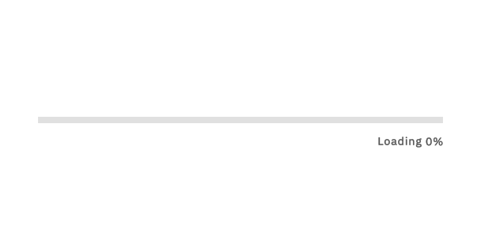
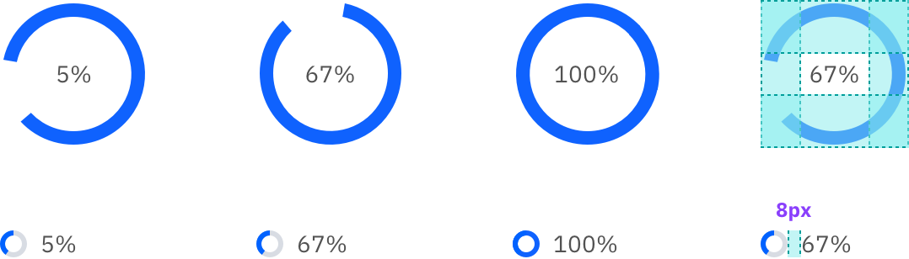

<InlineNotification kind="warning">

**Deprecated**  
This component has been enhanced and added to the Carbon Design System. Please use the [Progress bar](https://carbondesignsystem.com/components/progress-bar/usage/) instead.   

It will be removed in the next major version.

</InlineNotification> 

<PageDescription>

The progressive loading bar is used when data is being retrieved, or some other form of load is happening, and a loading spinner or skeleton load is not deemed suitable.

</PageDescription>

<AnchorLinks>
  <AnchorLink>Overview</AnchorLink>
  <AnchorLink>Design</AnchorLink>
  <AnchorLink>Progressive loading spinners</AnchorLink>
  <AnchorLink>Dos and don'ts</AnchorLink>
  <AnchorLink>Related</AnchorLink>
  <AnchorLink>Research</AnchorLink>
</AnchorLinks>

## Overview

The progressive loading component is not to be confused with the [Progress indicator](https://www.carbondesignsystem.com/components/progress-indicator/usage) or any other step wizard pattern, but should be considered alongside the [Carbon loading pattern](https://www.carbondesignsystem.com/patterns/loading-pattern/).
There are two types of loading bar: indeterminate and determinate.

### Indeterminate

Once triggered, the loading bar will begin by showing an indeterminate back and forth motion while data is being gathered during the first stages of the load. This bar then changes to a determinate indicator (finishing from left to right) when enough information is gathered to end the load animation. The final determinate stage of the load is used to visually indicate the completion of the task to the user. In this scenario, a percentage indicator would not be present.

<Row>
  <Column colLg={12}>

  </Column>
</Row>

### Determinate

This is for situations when the loading progress can be tracked and translated into a percentage indicator from the very start. The entire animation moves from the left to the right — with no back and forth motion. The percentage can be added to accompany the bar animation.

<Row>
  <Column colLg={12}>

  </Column>
</Row>

### Use cases

**Use a loading bar when**

- A loading spinner or skeleton load aren’t suitable
- Space or layout does not permit disruption in the form of a loading spinner
- One or more elements on the page are being impacted and could change due to a load
- Information can be gathered to determine the end time of the load
- This information is quantitative (e.g. percentage). This can be displayed as the bar animates.

**Use cases can include**

- Uploading (e.g. uploading a large file where it would be valuable to show the percentage to the user)
- Importing or adding one or more assets
- Updating information in a dynamic form where one or more fields are impacted by a change, and the user cannot proceed until these fields are updated.

## Design

<Row>
  <Column colLg={8}>

  </Column>
</Row>

### Elements

1. **The bar** This is the active (moving) part of the component.
   Color: `$interactive-01`
2. **The track** The static part of the component. This is the ‘runway’ for the bar.
   Color: `$ui-03`
3. **Percentage indicator (optional)** If you are able to provide this additional information and it would be beneficial for the user, then show the real-time percentage of the load as it completes.
   Text style: `$body-short-01`, `$text-02` (right aligned to the edge of the track, 16px below).

### Placement and width

The loading bar would appear at the top of a container — or at least above the information that is being impacted — spanning the full width. The loading bars ideally won’t span the entire width of a page, unless the entire page was being updated and a spinner and/or skeleton loads weren't suitable. The bar should span the width of a side panel or card, or the editable zone of a tearsheet, with no margins around it.

In this example, the loading bar has appeared when the user has chosen a different currency, meaning that all of the pricing information displayed needs to be converted to accurately reflect the new selection. The loading bar is placed above the information affected by the load, and will disappear when the load has completed.

<Row>
  <Column colMd={6} colLg={8}>

  </Column>
</Row>

## Progressive loading spinners

The progressive loading element can also be used with Carbon’s loading spinner component.

<Row>
  <Column colLg={8}>

  </Column>
</Row>

### Behavior

Animate the spin whilst the load is happening and the percentage is counting. Create a complete blue ring when the load is finished and 100% is reached.

### Component specifications

| Type    | Size  | Percentage location (optional) |
| ------- | ----- | ------------------------------ |
| Spinner | Large | Inside the spinner             |
| Spinner | Small | To the right of the spinner    |
| Bar     | Large | Below, on the right edge       |
| Bar     | Small | Below, on the right edge       |

**Large spinner**

- 24px left + right spacing (`$spacing-06`)
- 32px top + bottom spacing (`$spacing-07`)
- Text style: `$body-short-01`, `$text-02`, centered inside spinner to maintain a consistent layout.

**Small spinner**

- 8px margin between spinner and percentage text (`$spacing-03`)
- Text style: `$body-short-01`, `$text-02`

## Dos and don'ts

**Do**

- Fill an entire space (e.g. a tile or card) with the track.
- Use the sizes consistently. Don’t mix small and large bars within the same experience unnecessarily.
- Use components consistently. For example, if a spinner is used to reflect a load for one action, a bar should not be used for the same action elsewhere in the experience.
- Make sure the bar is directly above the information it is referring to.

**Don’t**

- Use progressive loading for every single step in a flow. This could make the experience feel longer than it actually is.
- Use a loading bar for full page loads before anything has loaded. This should be taken care of by a loading spinner or skeleton load(s).

<Row>
  <Column colMd={4} colLg={6}>
  <DoDontExample type="do" caption="Do make sure the track spans the entire width of where it is placed (for example, the top of a card).">

  </DoDontExample>
  </Column>
  <Column colMd={4} colLg={6}>
  <DoDontExample type="dark" caption="Don’t leave awkward margins around the track.">

  </DoDontExample>
  </Column>
</Row>

## Related

[Loading (component)](https://www.carbondesignsystem.com/components/loading/usage/)  
[Loading (pattern)](https://www.carbondesignsystem.com/patterns/loading-pattern/)

## Research

[Material – progress indicators](https://material.io/components/progress-indicators)  
[Polaris – progress bar](https://polaris.shopify.com/components/feedback-indicators/progress-bar)  
[Apple – progress indicators](https://developer.apple.com/design/human-interface-guidelines/ios/controls/progress-indicators/)  
[Luna – progress indicator](https://luna.sainsburys.co.uk/components/progress-indicator)
