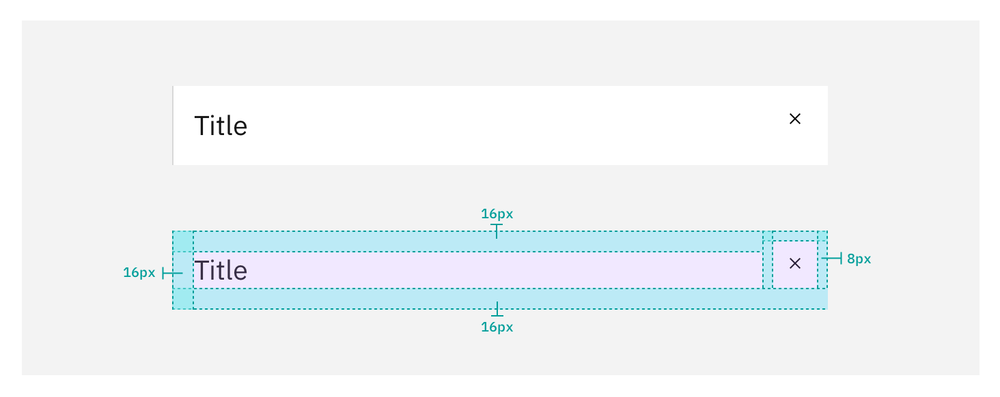
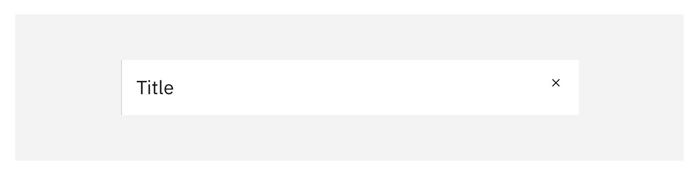
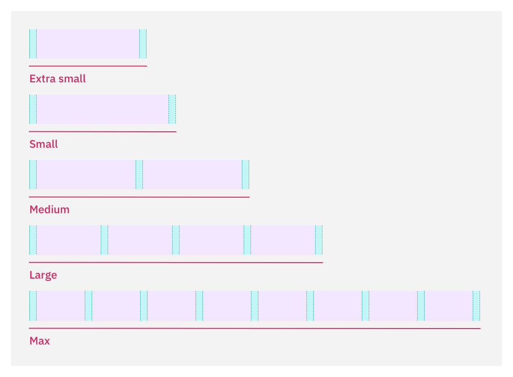
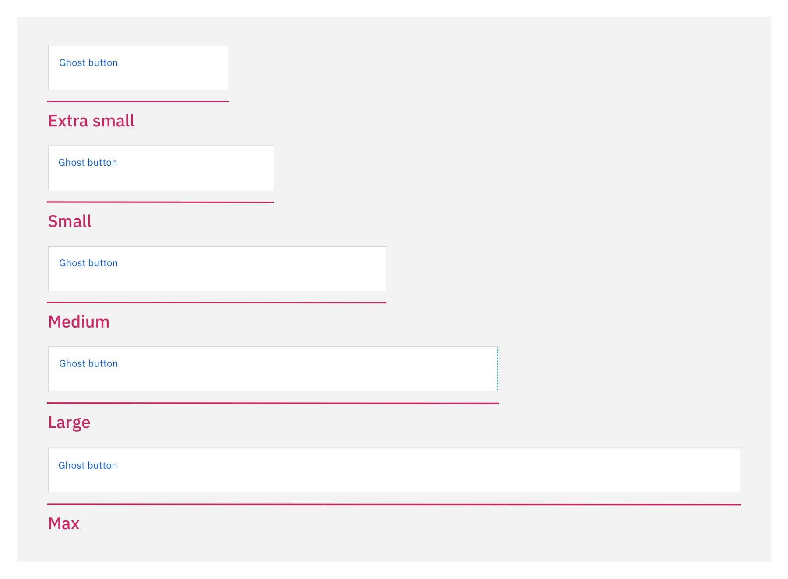

  <AnchorLinks>
    <AnchorLink>Structure</AnchorLink>
    <AnchorLink>Theming</AnchorLink>
    <AnchorLink>Layout influencer</AnchorLink>
  </AnchorLinks>

## Structure
<Row>
<Column colMd={8} colLg={8}>

</Column>
</Row>

### 1. Title block (optional)

The title block contains navigational elements such as closing, go back, and pop out, along with header text, labels and description that describes the side panel's purpose. 

<Accordion>
  <AccordionItem title="Spacing & alignment">

_Simple_
  
<Row>
<Column colMd={8} colLg={8} noGutterSm>

</Column>
</Row>

  
  
  

_With subtitle_
  
<Row>
<Column colMd={8} colLg={8} noGutterSm>

</Column>
</Row>

  
  
  

_With subtitle & navigation_
  

<Row>
<Column colMd={8} colLg={8} noGutterSm>

</Column>
</Row>

  </AccordionItem>

  <AccordionItem title="Styling">

_Default_

By default, the panel title should be using `$productive-heading-03`. 
  
  <Row>
  <Column colMd={8} colLg={8} noGutterSm>

  

  </Column>
  </Row>

  
  
  

_Condensed_

Use the condensed type styling for extra small panels, navigational/filtering experiences, and if your product is using a condensed type scale all around for maximizing screen real-estate. The type style to use for this is `$productive-heading-02`.
  
<Row>
<Column colMd={8} colLg={8} noGutterSm>

</Column>

</Row>

  

The spacing and alignment specifications remains the same for each type style. To learn more about type styles visit Carbon's [typography guidelines](https://www.carbondesignsystem.com/guidelines/typography/productive).

  </AccordionItem>

  <AccordionItem title="Button">

  _Button specifications_
    

<Row>
<Column colMd={8} colLg={8} noGutterSm>

</Column>
</Row>

  

| Button name    | Button type | Button size      | Icon         |
| :------------- | :---------- | :--------------- | :----------- |
| Back           | Ghost-icon  | Small:  32 / 2   | arrow--left  |
| Close          | Ghost-icon  | Small:  32 / 2   | close        |

  
  
  

_Button tooltip specifications_
  

<Row>
<Column colMd={8} colLg={8} noGutterSm>

</Column>
</Row>

  

| Button name    | Tooltip type | Tooltip alignment     |
| :------------- | :----------  | :---------------------|
| Back           | Icon tooltip | arrow middle / left   |
| Close          | Icon tooltip | arrow middle / right  |

  </AccordionItem>
</Accordion>

### 2. Action toolbar (optional)

The action toolbar is a set of global secondary action buttons the user can perform with the side panel's content.

<Accordion>
  <AccordionItem title="Spacing & alignment">

  _Icon button leading_
  
<Row>
<Column colMd={8} colLg={8} noGutterMdLeft>

</Column>
</Row>

  
  
  

  _Tertiary button leading_
  
<Row>
<Column colMd={8} colLg={8} noGutterMdLeft>

</Column>
</Row>

  
  
  

  _Ghost button leading_
  

<Row>
<Column colMd={8} colLg={8} noGutterSm>

</Column>
</Row>

  </AccordionItem>

  <AccordionItem title="Button size">

_Button specifications_
    

<Row>
<Column colMd={8} colLg={8} noGutterSm>

</Column>
</Row>

  

| Button type       | Button size (px/rem)   | Icon size (px/rem)|
| :---------------- | :--------------------- | :-----------------|
| Ghost-icon        | Small:  32 / 2         | 16 / 1            |
| Ghost             | Small:  32 / 2         | —                 |
| Tertiary          | Small:  32 / 2         | —                 |

  </AccordionItem>
</Accordion>

### 3. Body content

The body content area displays various informational and editable elements based on the use-case. This is the only scrollable area within the side panel.  Depending on the component there is a full bleed allowed in the content area.

<Accordion>
  <AccordionItem title="Spacing & alignment">

  _All inset components_
  
<Row>
<Column colMd={8} colLg={8} noGutterLg>

</Column>
</Row>

  
  
  

  _With full bleed components_
  
<Row>
<Column colMd={8} colLg={8} noGutterLg>

</Column>
</Row>

  </AccordionItem>

  <AccordionItem title="Panel grid">

  _Grids by panel size_
  
<Row>
<Column colMd={8} colLg={8} noGutterLg>

</Column>
</Row>

  

| Panel        | Width (px/rem) | Columns | Margin (px) | Gutters (px) |
| :----------- | :------------- | :------ | :------------ | :--------- |
| Extra small  | 256 / 16       | 1       | 16            | 16         |
| Small        | 320 / 20       | 1       | 16            | 16         |
| Medium       | 480 / 30       | 2       | 16            | 16         |
| Large        | 640 / 40       | 4       | 16            | 16         |
| Max          | up to 75%      | 8       | 16            | 16         |

  </AccordionItem>

</Accordion>

### 3. Primary actions (optional)

<Row>
<Column colMd={8} colLg={8}>

This area is for significant actions the user needs to take on within the sidebar; they are useful in creating, editing, and confirmation use-cases. The primary actions will always remain visible to the user.

</Column>
<Column colMd={2} colLg={3} offsetMd={1} offsetLg={1}>
  <Aside>
Do not use Tertiary or Icon button styles for primary actions.
  </Aside>
</Column>
</Row>
<Accordion>
  <AccordionItem title="Button size">

_Default size_

By default, the button size should be full bleed.

  

<Row>
<Column colMd={8} colLg={8} noGutterSm>

</Column>
</Row>

  
  
  

_Condensed size_

Use the condensed button size if your product uses a condensed interface all around, and  if your user base has negative sentiments for large components due to misuse of screen real-estate. 
  
<Row>
<Column colMd={8} colLg={8} noGutterSm>

</Column>
</Row>

  

  _Button specifications_

  

| Button size | Height (px/rem)   | Use case |
| :---------- | :---------------- | :------------- |
| Full bleed  | 64 / 4            | Use when buttons bleed to the edge of a component, like in side panels and modals. |
| Default     | 48 / 3            | Use as primary page actions and other standalone actions. |

  </AccordionItem>

  <AccordionItem title="Combinations, spacing & alignment">

<Row>
<Column colMd={8} colLg={8}>

_Singular primary_

Alignment of a singular primary or secondary button with always be to the right on larger panels.

  
Button widths

| Extra small | Small | Medium | Large | Max |
| :---------- | :---- | :----- | :---- | :-- |
| 100%        | 100%  | 100%   | 50%   | 25% |

</Column>
</Row>

  
  
  

<Row>
<Column colMd={8} colLg={8}>

_Singular ghost_

Alignment of a gohst button in the primary actions block will always align to the left.

  

Button widths

| Extra small | Small | Medium | Large | Max |
| :---------- | :---- | :----- | :---- | :-- |
| 100%        | 100%  | 100%   | 50%   | 25% |

</Column>
</Row>

  
  
  

<Row>
<Column colMd={8} colLg={8}>

_Primary and secodnary_

When using multiple buttons in the panel the panel width drives the alignment of the buttons. When the panel width is too narrow to maintain buttons side by side the buttons will stack with the most primary button on the top.

  

Button widths

| Extra small | Small | Medium | Large | Max |
| :---------- | :---- | :----- | :---- | :-- |
| 100%        | 100%  | 50%    | 50%   | 25% |

</Column>
</Row>

  
  
  

<Row>
<Column colMd={8} colLg={8}>

_3 buttons: varient 1_

In the case where three buttons are needed, each is 25% of the dialog width and aligned to the right side of the panel or stacked in smaller panels. If all three actions have the same weight then all three should be secondary buttons.

  

Button widths

| Extra small | Small | Medium | Large | Max  |
| :---------- | :---- | :----- | :---- | :--- |
| 100%        | 100%  | 100%   | 25%   | 25%   |

</Column>
</Row>

  
  
  

<Row>
<Column colMd={8} colLg={8}>

_3 buttons: varient 2_

This 3 button varient is usually found in creation flows and are limited to larger panels. For more guidance around side panel creation flows please see the [create flows pattern](https://www.carbondesignsystem.com/community/patterns/create-flows/).

  

Button widths

| Extra small | Small | Medium | Large | Max  |
| :---------- | :---- | :----- | :---- | :--- |
| —        | —  | —   | 25%   | 25%   |

</Column>
</Row>

  
  
  

<Row>
<Column colMd={8} colLg={8}>

_4 buttons_

While this combination is rare, it can be found in create flows and is limited to the larger panels. For more guidance around side panel creation flows please see the [create flows pattern](https://www.carbondesignsystem.com/community/patterns/create-flows/).

  

Button widths

| Extra small | Small | Medium | Large | Max  |
| :---------- | :---- | :----- | :---- | :--- |
| —        | — | —   | 25%   | 25%   |

</Column>
</Row>

  </AccordionItem>

  <AccordionItem title="Styling">

  

  | BG-color | Border-color   | Border-size (px)  |
  | :------- | :------------- | :------------- |
  | $ui-01   | $decorative-01 |1|

  </AccordionItem>

</Accordion>

## Theming

Side panels use the same UI tokens for Grey 10 and Grey 100 themes. For more guidance around themes visit [Carbon's color guidelines](https://www.carbondesignsystem.com/guidelines/color/usage).

<Row>
<Column colMd={8} colLg={8}>

  

| Panel          | BG-color | Border-color   | Shadow              |
| :------------- | :------- | :------------- | :------------------ |
| Slide-in       | $ui-01   | $decorative-01 | —                   |
| Slide-over     | $ui-01   | $decorative-01 | $ui-05 | 0, 4, 8, 0 |

</Column>
</Row>

## Layout influencer

<Row>
<Column colLg='8'>
<GifPlayer color='dark'>

</GifPlayer>
</Column>
<Column colMd={2} colLg={3} offsetMd={1} offsetLg={1}>
  <Aside>
When the page layout width is 320px or smaller, panels should become full screen experiences and should follow mobile UX guidelines.
  </Aside>
</Column>
</Row>

### Grid speficiations

Slide-in panels influence the page layout grid; below are the specifications for _panel combinations_ and how they impact the grid at all sizes. For more information around the 2x grid visit [Carbon's guidelines](https://www.carbondesignsystem.com/guidelines/2x-grid/overview).

<Accordion>
  <AccordionItem title="Extra small">

<Row>
<Column colMd={8} colLg={8}>

_Left-aligned_

| Grid        | Columns | Layout width (px/rem) | Offest (px/rem) | Gutter (px/rem)| Column width (px/rem)|
| :---------- | :------ | :-------------------- | :-------------- | :-------------- | :------------------ |
| Medium      | 8       | 384 / 24              | 272 / 17        | 32 / 2          | 16 / 1              |
| Large       | 8       | 768 / 48              | 272 / 17        | 32 / 2          | 64 / 4              |
| Extra large | 16      | 1024 / 64             | 272 / 17        | 32 / 2          | 32 / 2              |
| Max         | 16      | 1280 / 80             | 280 / 17.5      | 32 / 2          | 48 / 3              |

_Right-aligned_

| Grid        | Columns | Layout width (px/rem) | Offest (px/rem) | Gutter (px/rem)| Column width (px/rem)|
| :---------- | :------ | :-------------------- | :-------------- | :-------------- | :------------------ |
| Medium      | 8       | 384 / 24              | 16 / 1          | 32 / 2          | 16 / 1              |
| Large       | 8       | 768 / 48              | 16 / 1          | 32 / 2          | 64 / 4              |
| Extra large | 16      | 1024 / 64             | 16 / 1          | 32 / 2          | 32 / 2              |
| Max         | 16      | 1280 / 80             | 24 / 1.5        | 32 / 2          | 48 / 3              |

</Column>
</Row>

  </AccordionItem>

  <AccordionItem title="Small">

  <Row>
  <Column colMd={8} colLg={8}>

  _Left-aligned_

  | Grid        | Columns | Layout width (px/rem) | Offest (px/rem) | Gutter (px/rem)| Column width (px/rem)|
  | :---------- | :------ | :-------------------- | :-------------- | :-------------- | :------------------ |
  | Medium      | 4       | 320 / 20              | 336 / 21        | 32 / 2          | 48 / 3              |
  | Large       | 8       | 704 / 44              | 336 / 21        | 32 / 2          | 56 / 3.5            |
  | Extra large | 8       | 960 / 60              | 336 / 21        | 32 / 2          | 88 / 5.5            |
  | Max         | 16      | 1216 / 76             | 344 / 21.5      | 32 / 2          | 44 / 2.75           |

  _Right-aligned_

  | Grid        | Columns | Layout width (px/rem) | Offest (px/rem) | Gutter (px/rem)| Column width (px/rem)|
  | :---------- | :------ | :-------------------- | :-------------- | :-------------- | :------------------ |
  | Medium      | 4       | 320 / 20              | 16 / 1          | 32 / 2          | 48 / 3              |
  | Large       | 8       | 704 / 44              | 16 / 1          | 32 / 2          | 56 / 3.5            |
  | Extra large | 8       | 960 / 60              | 16 / 1          | 32 / 2          | 88 / 5.5            |
  | Max         | 16      | 1216 / 76             | 24 / 1.5        | 32 / 2          | 44 / 2.75           |

  </Column>
  </Row>

  </AccordionItem>

  <AccordionItem title="Medium">

  <Row>
  <Column colMd={8} colLg={8}>

  _Left-aligned_

  | Grid        | Columns | Layout width (px/rem) | Offest (px/rem) | Gutter (px/rem)| Column width (px/rem)|
  | :---------- | :------ | :-------------------- | :-------------- | :-------------- | :------------------ |
  | Large       | 8       | 544 / 34              | 496 / 31        | 32 / 2          | 36 / 2.25           |
  | Extra large | 8       | 800 / 50              | 496 / 31        | 32 / 2          | 68 / 4.25           |
  | Max         | 16      | 1056 / 66             | 504 / 31.5      | 32 / 2          | 34 / 2.125          |

  _Right-aligned_

  | Grid        | Columns | Layout width (px/rem) | Offest (px/rem) | Gutter (px/rem)| Column width (px/rem)|
  | :---------- | :------ | :-------------------- | :-------------- | :-------------- | :------------------ |
  | Large       | 8       | 544 / 34              | 16 / 1          | 32 / 2          | 36 / 2.25           |
  | Extra large | 8       | 800 / 50              | 16 / 1          | 32 / 2          | 68 / 4.25           |
  | Max         | 16      | 1056 / 66             | 24 / 1.5        | 32 / 2          | 34 / 2.125          |

  </Column>
  </Row>

  </AccordionItem>

  <AccordionItem title="Large">

<Row>
<Column colMd={8} colLg={8}>

_Left-aligned_

| Grid        | Columns | Layout width (px/rem) | Offest (px/rem) | Gutter (px/rem)| Column width (px/rem)|
| :---------- | :------ | :-------------------- | :-------------- | :-------------- | :------------------ |
| Large       | 4       | 384 / 24              | 656 / 41        | 32 / 2          | 64 / 4              |
| Extra large | 8       | 640 / 40              | 656 / 41        | 32 / 2          | 48 / 3              |
| Max         | 8       | 896 / 56              | 896 / 56        | 32 / 2          | 80 / 5              |

_Right-aligned_

| Grid        | Columns | Layout width (px/rem) | Offest (px/rem) | Gutter (px/rem)| Column width (px/rem)|
| :---------- | :------ | :-------------------- | :-------------- | :-------------- | :------------------ |
| Large       | 4       | 384 / 24              | 16 / 1          | 32 / 2          | 64 / 4              |
| Extra large | 8       | 640 / 40              | 16 / 1          | 32 / 2          | 48 / 3              |
| Max         | 8       | 896 / 56              | 24 / 1.5        | 32 / 2          | 80 / 5              |

</Column>
</Row>

  </AccordionItem>

  <AccordionItem title="Max">

Max panels can go up to 75% of the page layout. Due to that, we cannot create a common influencer grid based on panel width. This will be up to the product teams to calculate. Please review the [2x grid guidance](https://www.carbondesignsystem.com/guidelines/2x-grid/overview) to learn how to calculate your grid.

  </AccordionItem>

</Accordion>

  

<Row className="resource-card-group">
  <Column colMd={4} colLg={4}>
    <ResourceCard
      subTitle="Grid sketch file"
      href="https://ibm.box.com/s/du4xu2wd2mdbcq17v5rf55yk89p1bvzj">
    </ResourceCard>
  </Column>
</Row>
