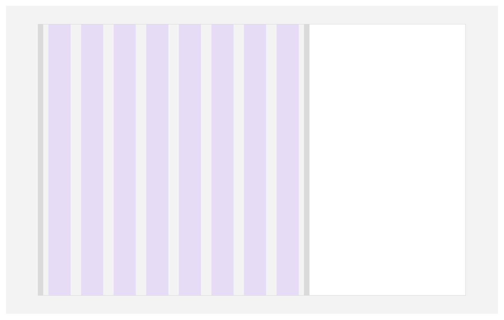
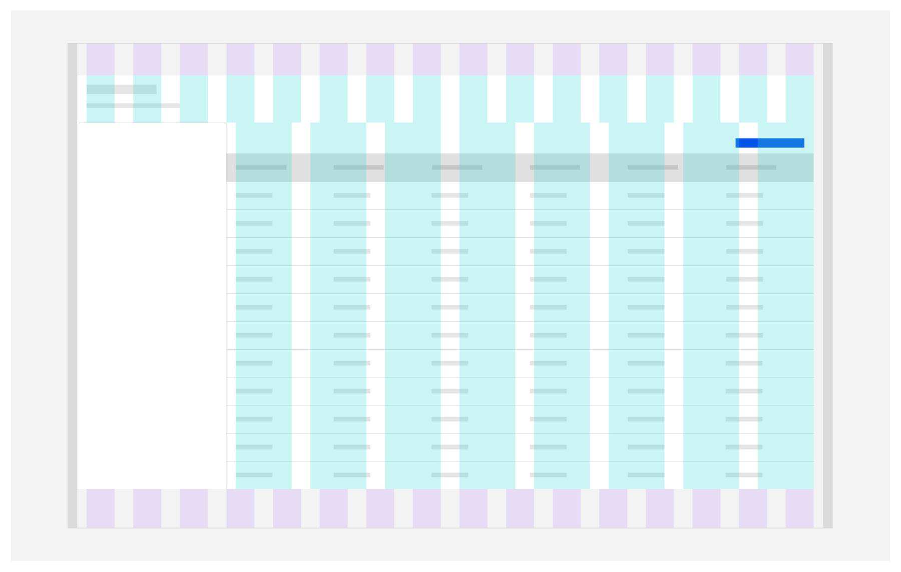
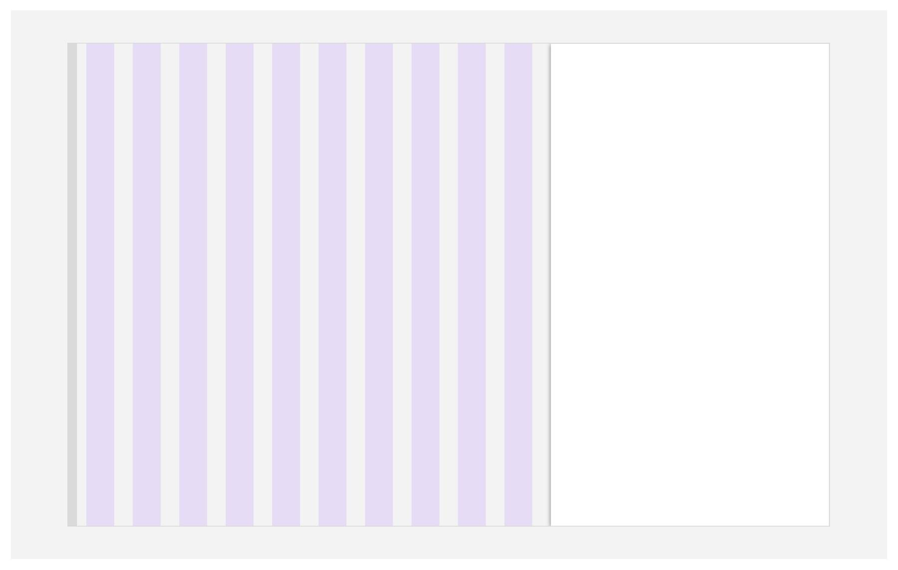
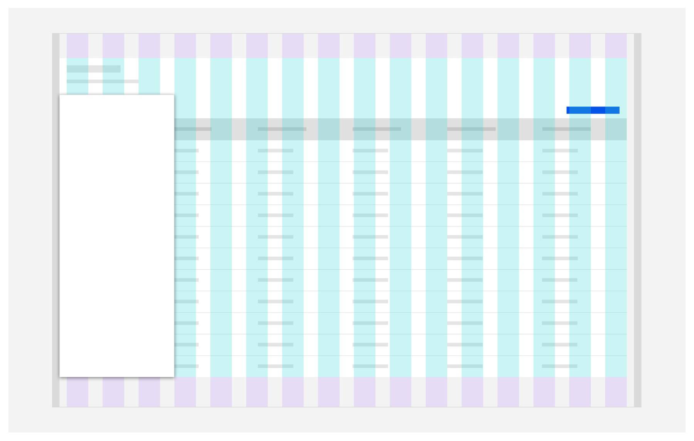

<PageDescription>

_Side panels_ keep users in-context of a page while performing tasks like navigating, editing, viewing details, or configuring something new.
</PageDescription>

<AnchorLinks>
  <AnchorLink>Overview</AnchorLink>
  <AnchorLink>Formatting</AnchorLink>
  <AnchorLink>Content</AnchorLink>
  <AnchorLink>Behaviors</AnchorLink>
  <AnchorLink>Modifers</AnchorLink>
  <AnchorLink>Best practices</AnchorLink>
  <AnchorLink>Related</AnchorLink>
</AnchorLinks>

<Row>
<Column colMd={8} colLg={8}>

</Column>
</Row>

## Overview

Side panels help users perform actions like editing tables, creating objects, filtering, navigating component content or referencing details without leaving page context. 

<Row>
<Column colMd={8} colLg={10}>

- There are two side panel types: _Slide-over and Slide-in._  A slide-in panel pushes the page content while a slide-over panel overlays the page content.

- Depending on the use-case, you can use one of the five sizes of side panels available: Extra small, Small, Medium, Large & Max.

- Side panels fix to the left and right edges of the screen or page component content area. 

</Column>
</Row>

### When to use

<Row>
<Column colMd={8} colLg={8}>

Side panels are a fluid component and found in a few primary use-cases used for various reasons. The user needs to see the panel information in the context of the page for reference, the second being for configuration flows that affect the content on the page, and *simple create flows*. There are variants for these use-cases that require different widths and behaviors based on the content within them.

#### Slide-in
Use a slide-in panel when the user needs to reference all page-level along with panel information to complete a task. And if the user needs perform actions on the main page content while the panel is open. Use a slide-in panel for dynamic filtering and naviagtional experiences.

#### Slide-over
Use a slide-over panel when the user does not need to interact or reference the main page below the panel. Slide-over panels are a singular focus task-based experiences that are temporary additives to the user's workflow.

</Column>
<Column colMd={2} colLg={3} offsetMd={1} offsetLg={1}>

  <Aside>
Think of slide-in panels as additive to the page's main user experience. The user needs the ability to interact with the panel alongside of the page content.  </Aside>

  

<Aside>
Think of slide-over panels as the primary user experience on the page when open. The user should have their focus on the panel and completing the workflow within it. </Aside>
</Column>
</Row>

### When not to use

We have different methods of revealing sets of information and task-based flows to the user. 

<Row>
<Column colMd={8} colLg={10}>

- Do not use a side panel for simple one task edits; look into in-line editing options.

- Consider using a [tearsheet](https://pages.github.ibm.com/cdai-design/pal/components/tearsheet/usage) if the information being referenced is complex or if launching an extensive create flow.

- Consider using a [modal](https://www.carbondesignsystem.com/components/modal/usage) if the information being reference is simple or if launching a simple create or edit flow.

- Consider using a new page or page state change if needing a complex edit or create flow.

</Column>
</Row>

## Formatting
### Anatomy
<Row>
<Column colMd={8} colLg={8}>

</Column>
</Row>
<Row>
<Column colMd={8} colLg={8}>

#### 1. Title block (optional)
The title block contains navigational elements such as closing, go back, and pop out, along with header text and description that describes the side panel's purpose.

#### 2. Action toolbar (optional)
The action toolbar is a set of global secondary action buttons the user can perform with the side panel's content. 

#### 3. Body content
The body content area displays various informational and editable elements based on the use-case. The body content is the only scrollable area within the side panel.

#### 4. Primary actions (optional)
This area is for significant actions the user needs to take on within the sidebar; they are useful in creating, editing, and confirmation use-cases. The primary actions will always remain visible to the user.

</Column>

<Column colMd={2} colLg={3} offsetMd={1} offsetLg={1}>
  
<Aside>
Body content is the only required content block for the side panel.
</Aside>

</Column>
</Row>

### Sizing
There are five side panel widths available for use. Panel content, interactions, and user intention should drive the panel width used. Extra small and small panels are commonly used for left-aligned navigational and filtering experiences. Use Large and Max widths for complex right-aligned create, reference, and edit flows.

<Row>
<Column colMd={8} colLg={8}>

</Column>
</Row>

_See style section for layout and sizing specifications._

### Placement

#### Slide-in
Slide-in panels are grid influencers. See how they affect page and componet grids below.

<Tabs>
<Tab label="Left">
<Column colLg='8' noGutterMdLeft>

<GifPlayer color='dark'>

</GifPlayer>

</Column>

</Tab>
<Tab label="Right">
<Column colLg='8' noGutterMdLeft>

<GifPlayer color='dark'>

</GifPlayer>

</Column>

</Tab>
<Tab label="Component">
<Column colLg='8' noGutterMdLeft>

<GifPlayer color='dark'>

</GifPlayer>
</Column>
</Tab>
</Tabs>

#### Slide-over
Slide-over panels lay on top of the grid.

<Tabs>
<Tab label="Left">
<Column colLg='8' noGutterMdLeft>

<GifPlayer color='dark'>

</GifPlayer>

</Column>

</Tab>
<Tab label="Right">
<Column colLg='8' noGutterMdLeft>

<GifPlayer color='dark'>

</GifPlayer>

</Column>

</Tab>
<Tab label="Component">
<Column colLg='8' noGutterMdLeft>

<GifPlayer color='dark'>

</GifPlayer>

</Column>

</Tab>
</Tabs>

## Content
### Main elements
**Title**

- The title should be brief, using a verb plus noun combination that clearly describes the side panel’s task or purpose.

- You can use an optional label above the title to set the context for the information in the panel. Panel's without titles should have the panel launch action attached to panel.

**Body copy**

- A panel can include only content relevant to completing the current task or supplentary information to add more context to the content on page.

**Footer**

- Use descriptive words for the actions such as Add, Delete, and Save. Avoid vague words like Done or OK. For a list of approved action labels, see Carbon’s content guidelines.

- If you need to include a “docs” or other non-primary action, include it as a link in the panel’s body.

### Further guidance
For further content guidance, see [Carbon’s content guidelines](https://www.carbondesignsystem.com/guidelines/content/overview/) and our own [content guide](../../../content/overview/overview).

## Behaviors

### Trigger

Panels are triggered as a result of a user’s action and are not system generated. Common components that can trigger a panel include card, table row, button, link, or icon. On a keyboard, selecting `Enter` or `Space` should launch the panel. The trigger should disable while the panel is open.

### Focus

Once the panel is open, set the initial focus to the first location that accepts user input. Focus should then remain trapped in the slide-over panel until it is closed. However, focus does not need to remian trapped in a slide-in panel.

### Scrolling
The panel component height is dependant on the screen height. If the panel content is longer than the screen height, then the body content section should scroll vertically with the title, action toolbar, and primary action sections remaining fixed in the view.

Upon scroll, the panel title will adjust to the condensed size, move to one line truncation, and a horizontal border appears underneath the action toolbar or title depending on section usage.

<Row>
<Column colMd={8} colLg={8}>

<GifPlayer color='dark'>

</GifPlayer>
</Column>
</Row>

### Navigation

<Row>
<Column colMd={8} colLg={8}>
When your panel has multiple levels of information that the user can access, you will need to use this navigational component to allow your user to go back to the top level. Upon hover, over the back button, a tooltip should appear informing the user of where the button will take them.

  

Panels should not stack upon each other but act as a panel state change when working with navigational flows within panels. 

This is not confused with the panel creation flow pattern when users are moving through multiple steps. If that is your use case, please reference the [create flow pattern](https://www.carbondesignsystem.com/community/patterns/create-flows/).
</Column>
<Column colMd={2} colLg={3} offsetMd={1} offsetLg={1}>

  <Aside>
Recommendation: Keep content levels within panels as concise as possible.
</Aside>
</Column>
</Row>

<Row>
<Column colMd={8} colLg={8}>

<GifPlayer color='dark'>

</GifPlayer>
</Column>
</Row>

## Modifiers

### Light & Dark theming
Side panels use the same UI tokens for Grey 10 and Grey 100 themes.

 <Row>
 <Column colMd={8} colLg={8}>

</Column>
</Row>

_See style section for theme color token specifications._

### Overlay background usage (optional)
<Row>
<Column colMd={8} colLg={8}>

</Column>
<Column colMd={2} colLg={3} offsetMd={1} offsetLg={1}>
  <Aside>
Overlay backgrounds are more commonly found in mobile or smaller screen size expereinces when using panels due to reduced page real-estate.  </Aside>
</Column>
</Row>
<Row>
<Column colMd={8} colLg={10}>

**When to use**

- Only use with slide-over panels

- Use when the user does not need to perform actions within the page to complete the panel workflow. 

- If using overlay BG consider using a *tearsheet* or *modal* dialog instead.

</Column>
</Row>

## Best practices

### Do's

- Wrap title text two lines before truncation. See how this shifts on scroll in behaviors section.

- Show full title in tooltip on hover if title truncated.

### Don'ts

- Do not place a side panel on the top edge or bottom edge of the screen.

## Related

- [Dialog](https://www.carbondesignsystem.com/patterns/dialog-pattern)
- [Tearsheet](https://pages.github.ibm.com/cdai-design/pal/components/tearsheet/style/)
- [Modal](https://www.carbondesignsystem.com/components/modal/usage/)
- [Create](https://pages.github.ibm.com/cdai-design/pal/patterns/creation-flows/usage)
- [UI Shell left panel](https://www.carbondesignsystem.com/components/UI-shell-left-panel/usage)
- [UI Shell right panel](https://www.carbondesignsystem.com/components/UI-shell-right-panel/usage)
- [Buttons](https://www.carbondesignsystem.com/components/button/usage)
