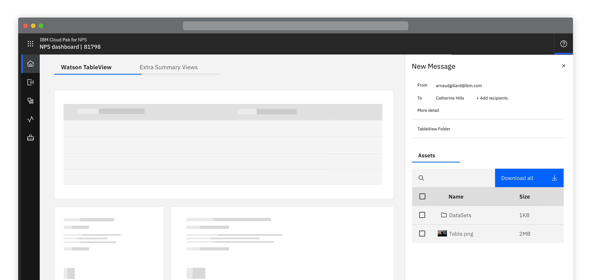
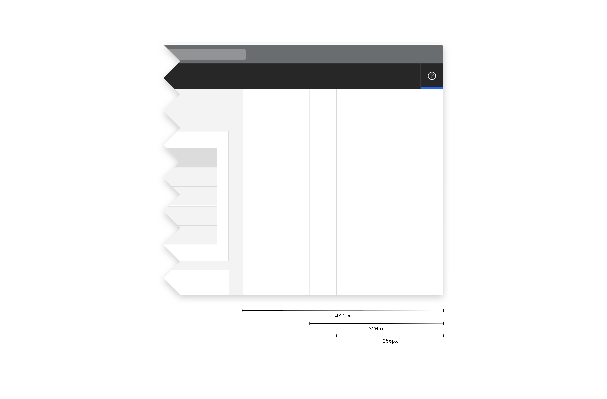
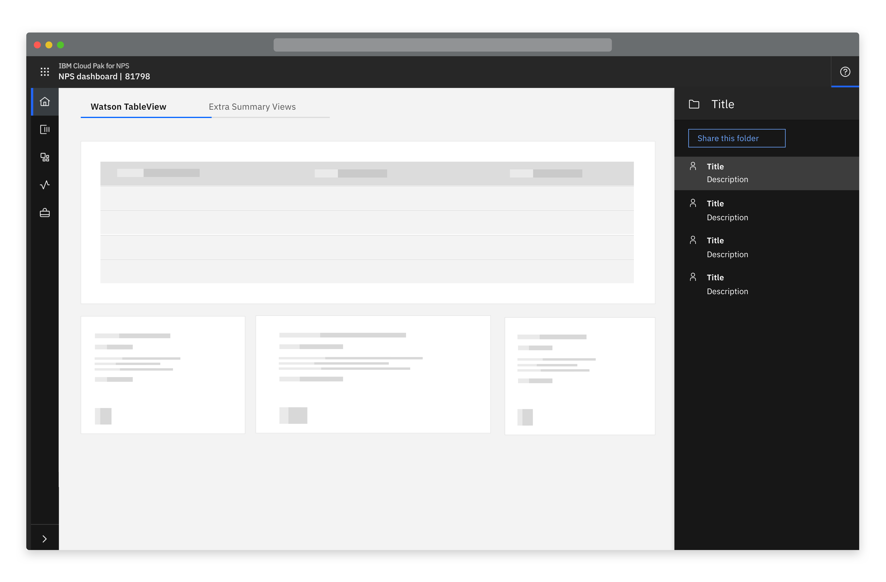

<Row>
  <Column colLg={8}>

  </Column>
</Row>

## Things to consider
- Using this component requires the main page to be responsive
- How much content will be contained inside the panel?
- Is dark or light theme more appropriate?

#### Options

<AnchorLinks>
  <AnchorLink>Overview</AnchorLink>
  <AnchorLink>Sizing</AnchorLink>
  <AnchorLink>Themes</AnchorLink>
</AnchorLinks>

## Overview

Opens as the result of a user action. This component is an empty framework of
which the content should be determined as required by products.

<InlineNotification>

  This requires the main page content to be responsive so that the panel may slide in. For a non-responsive alternative, it is
  recommended to use the "Slide Over Panel"

</InlineNotification>

## Sizing

There are two sizes (small and medium), products should decide which size is appropriate depending on the content within the
side panel.
Bare in mind the content of the main page will be pushed to accommodate the panel, this should be considered when selecting
which size of panel should be used.

<AnchorLinks>
  <AnchorLink>Small</AnchorLink>
  <AnchorLink>Medium</AnchorLink>
</AnchorLinks>

### Small

<Row>
  <Column colLg={8}>

  </Column>
</Row>

### Medium

<Row>
  <Column colLg={8}>

  </Column>
</Row>

## Themes

The component will be available in the light and dark themes.
The recommendation is for products to use the light theme and Paks to use the
dark theme.

### Dark Theme (Pak)

<Row>
  <Column colLg={8}>

  </Column>
</Row>

## Linked to

[Downloading](../../common-patterns/downloading)
