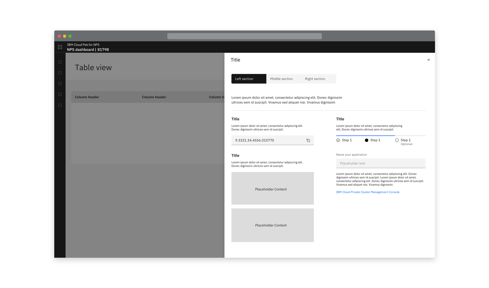
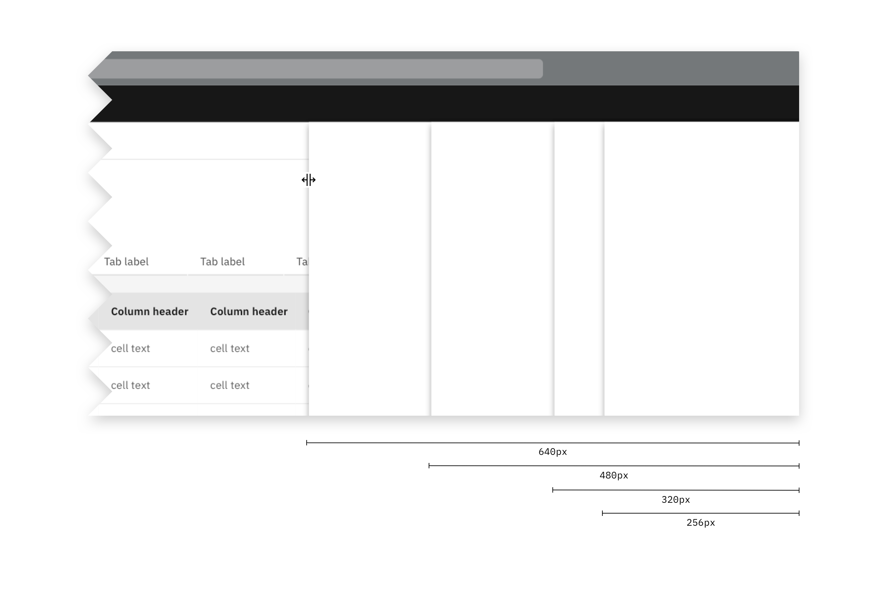

The slide over panel opens as the result of a user
action and can be opened from anywhere in the product UI. It will overlay the
main page content. 

This component is an empty framework that can have product-defined context
relevant content.

## Things to consider
- This component will overlay on top of the main page content
- How much content will be contained inside the panel?
- Should the user still be able to interact with the main page content?

<AnchorLinks>
  <AnchorLink>Sizes</AnchorLink>
  <AnchorLink>Overlay</AnchorLink>
</AnchorLinks>

## Sizes
There are three fixed sizes (small, medium and large), products should decide
which size is appropriate depending on the content required within the side
panel. 

<AnchorLinks small>
  <AnchorLink>Small</AnchorLink>
  <AnchorLink>Medium</AnchorLink>
  <AnchorLink>Large</AnchorLink>
</AnchorLinks>

### Small

<Row>
  <Column colLg={8}>

  </Column>
</Row>
<Row>
  <Column colLg={8}>

  </Column>
</Row>

### Medium

<Row>
  <Column colLg={8}>

  </Column>
</Row>

### Large

<Row>
  <Column colLg={8}>

  </Column>
</Row>

## Overlay

When using this component consider whether the user should be able to continue interacting with the main page content or if interaction with the main page content should be prevented.

Overlays should be used when all interactions with the main page’s content needs to be blocked, so the user’s attention is focused on the actions or content in the side panel.

Do not use an overlay in cases when a side panel remains visible while a user interacts with primary content, such as viewing the details of a row of data in table or structured list.

<Row>
  <Column colLg={8}>

<Caption>Example of a slide-over panel without an overlay, where the user can navigate side panel content through the table.</Caption>
  </Column>
</Row>

## Linked to

[Downloading](../../common-patterns/downloading)
