import { Tag } from "carbon-components-react";

<Row>
<Column colMd={8} colLg={8}>

<Tag type="purple">Carbon 11 only</Tag>

<PageDescription>

A tag overflow is the use of an interactive tag with the addition of a toggletip to show additional content.

</PageDescription>

<AnchorLinks>
  <AnchorLink>When to use</AnchorLink>
  <AnchorLink>Showing additional items</AnchorLink>
  <AnchorLink>Showing truncation</AnchorLink>
  <AnchorLink>Accessibility</AnchorLink>
  <AnchorLink>Feedback</AnchorLink>
</AnchorLinks>

</Column>

<Column colMd={2} colLg={3} offsetMd={1} offsetLg={1}>
  <Aside>

**Carbon 10 support**  
Tag overflow is a Carbon 11 component, extending on the previous Carbon 10 component, tag set.   
For products still on Carbon 10, refer to the [tag set](https://pages.github.ibm.com/cdai-design/pal/components/tag-set/usage) guidance for supported functionality.

  </Aside>
</Column>
</Row>

## When to use

Use tag overflow when there isn’t space to show all items associated with an object. On click, a list of the additional items would be shown in a toggletip.

<Row>
  <Column colLg={8}>

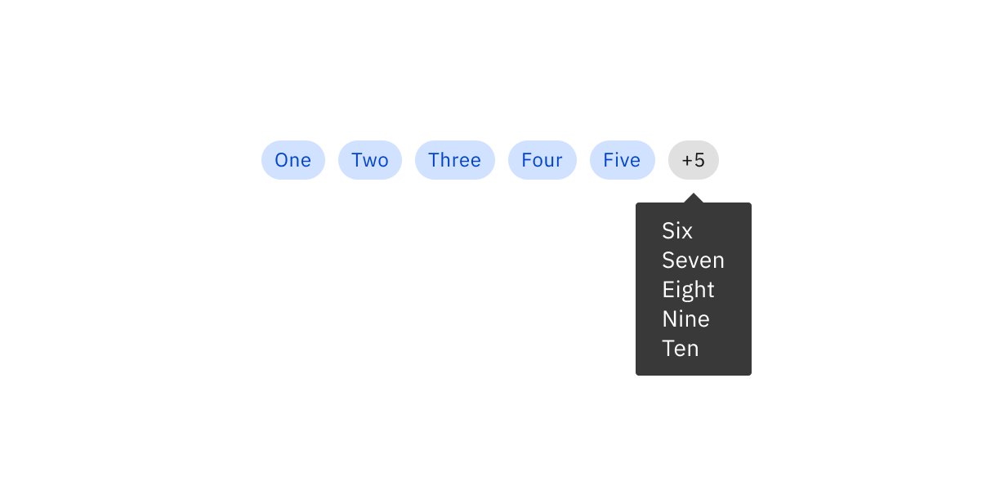

  </Column>
</Row>

Tag overflows can also be used when the content of the tag itself cannot fit in the allocated space. On hover, the full content of the tag would be shown.

<Row>
  <Column colLg={8}>

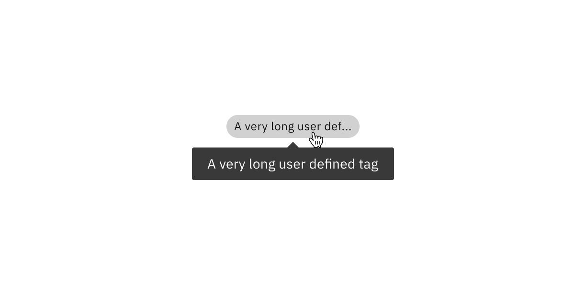

  </Column>
</Row>

A tag overflow differs from a typical read-only tag with the addition of a hover state to indicate interactivity.

## Showing additional items
The need to show additional items related to an object will occur in small spaces in the UI. Examples of where this could be needed are in data table rows, cards, page headers or on screens using small breakpoints. Tag overflows can be applied to a group of tags, or other UI elements, detailed in the following sections. 

### Groups of tags
A tag overflow count can be used with a group of tags when there is not enough space to show all tags related to an object. A tag overflow count should use the gray tag, regardless of the colors used for the tags it is grouped with. 

For a tag overflow to be used, there must be at least one additional tag before the overflowed content.

<Row>
  <Column colLg={4}>

<DoDontExample type="do">

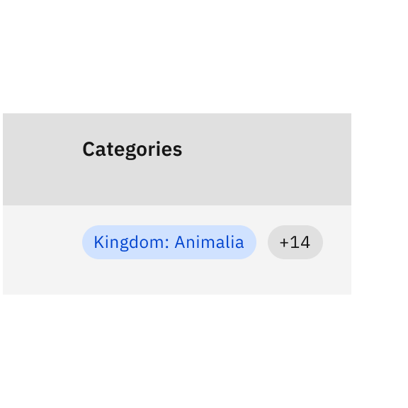

</DoDontExample>
  </Column>

  <Column colLg={4}>

<DoDontExample type="dont">

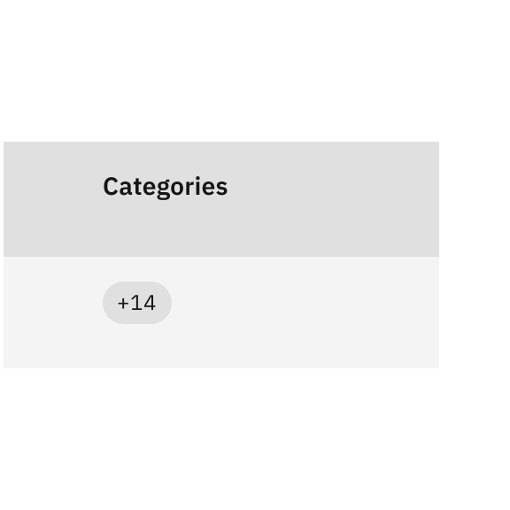

</DoDontExample>
  </Column>
</Row>

Clicking on the tag overflow presents a toggletip that lists up to 10 additional tags.

If there are more than 10 additional tags, the toggletip also includes a link to view all tags. When the user clicks on this link, a modal opens with a list of all the tags associated with the object.

<Row>
  <Column colLg={8}>

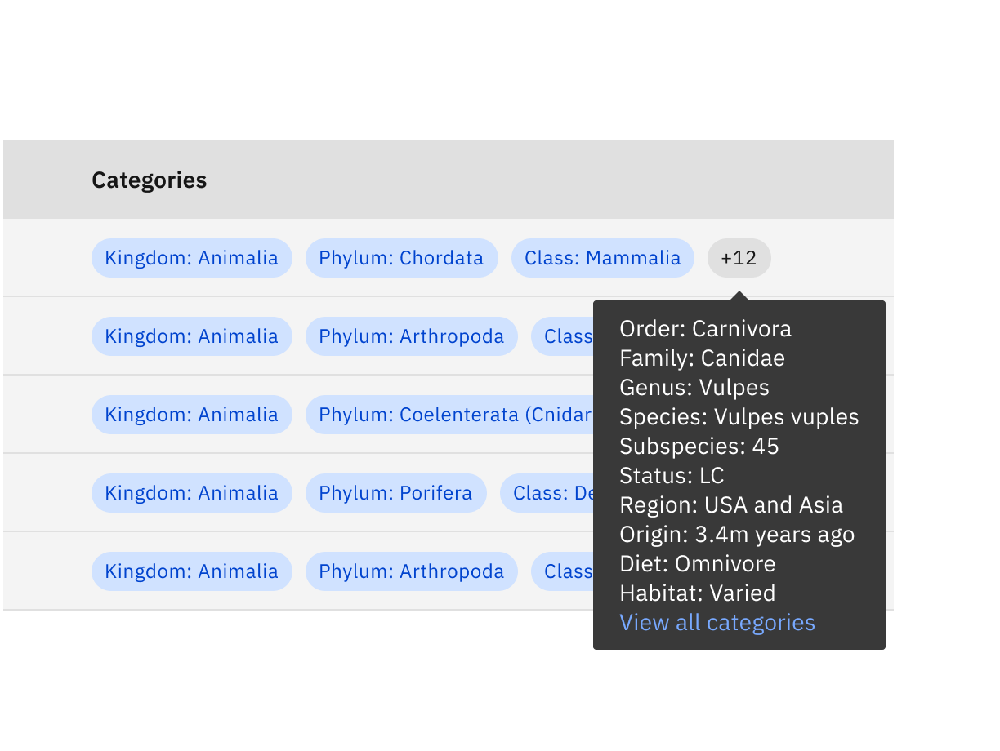

  </Column>
</Row>

<Caption>
In this use case, there are 15 categories that a specific animal is tagged with. 10 of the 12 remaining categories are listed in the toggletip, with the others being available after selecting “View all categories.” 
</Caption>

<Title>View all modal</Title>

Launched from the toggletip, the view all modal lists all the tags associated with the object. A search bar can optionally be added to aid discoverability when faced with a large number of tags.

<Row>
  <Column colLg={8}>

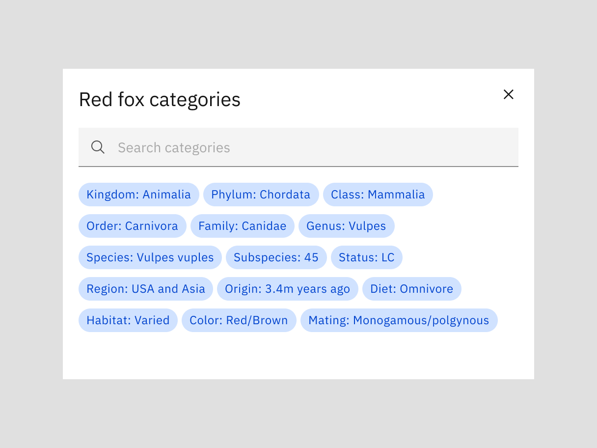

  </Column>
</Row>

### Styling
The styling of the tag overflow toggletip varies depending on the behavior of the tags it is grouped with.

<Title> Read-only tags </Title>

When tags in the UI are being used as read-only descriptors of an object, such as categories or labels, the items in the toggletip should appear as read-only text. The only area within the toggletip which is clickable is the "view all tags" link, which launches the view all modal if the tag number exceeds 10.
<Row>
  <Column colLg={8}>

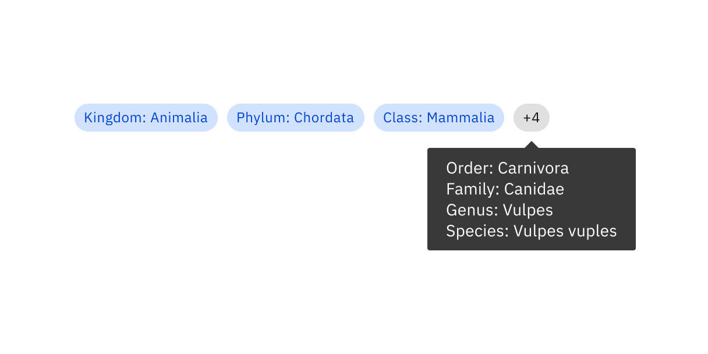

  </Column>
</Row>

<Title> Interactive tags </Title>

When tags in the UI are interactive (i.e., filter tags), the toggletip should show a list of interactive tags. These tags would share the same behavior as in the UI.

<Row>
  <Column colLg={8}>

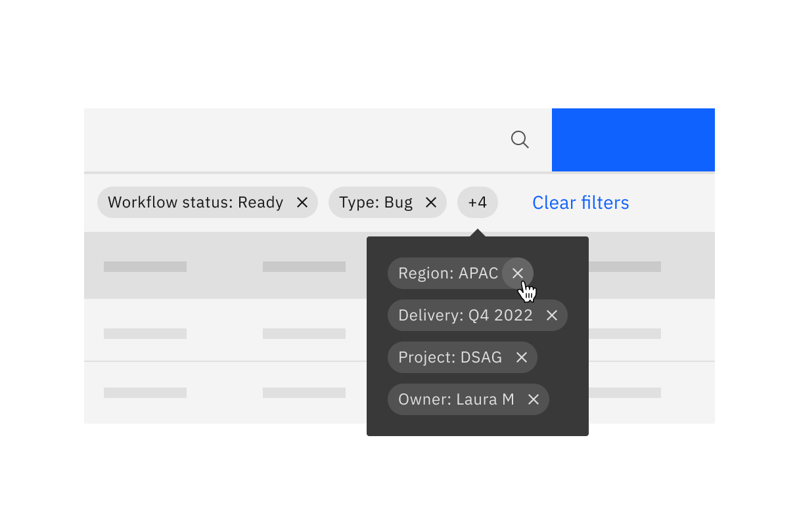

  </Column>
</Row>

<Caption>In this example, user could remove tags from the toggletip using the `x` at the end of each tag, in the same way they would do in the data table filter summary bar.</Caption>

### Best practices
- Use Gray 100 themed tags in the overflow toggletip (or Gray 10 for dark themed UIs).
- Match the size of tags in the overflow toggletip to those used in the UI.
- Wrap the toggletip to the longest tag in the list.

### Other UI elements
A tag overflow can also be used with groups of other items, such as user avatars. The behavior would be the same as for tags, where on click, the remaining items (up to 10) would be listed in the toggletip.

<Row>
  <Column colLg={8}>

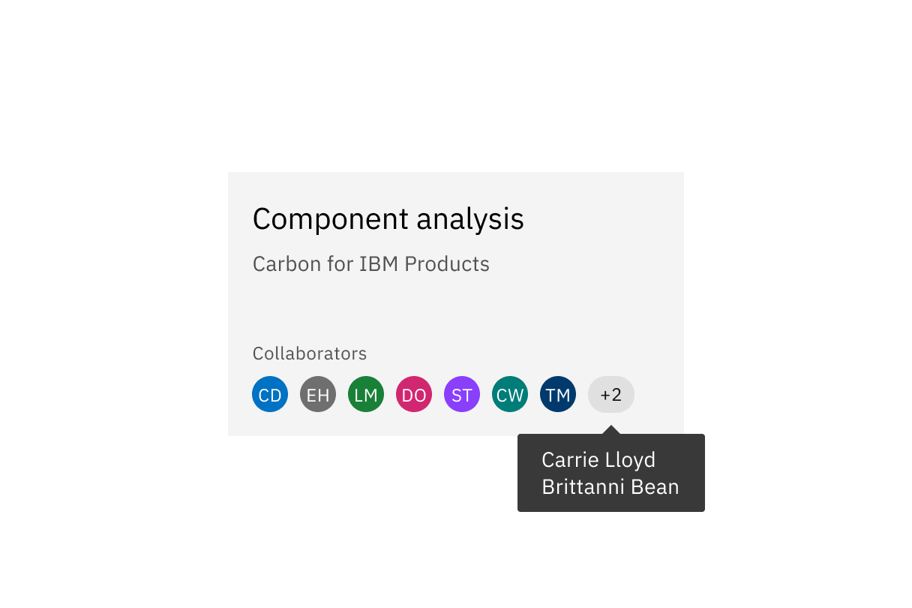

  </Column>
</Row>

When using a tag overflow for other items, text should be used in the toggletip to display the remaining items. Using text in the toggletip ensures the content is accessible. 

<Row>
  <Column colLg={4}>

<DoDontExample type="do">

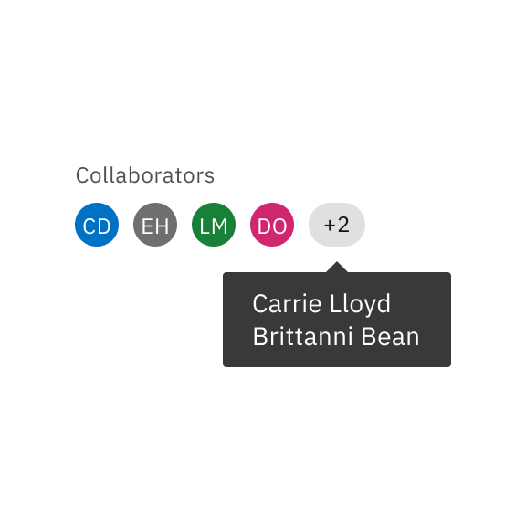

</DoDontExample>
  </Column>

  <Column colLg={4}>

<DoDontExample type="dont">

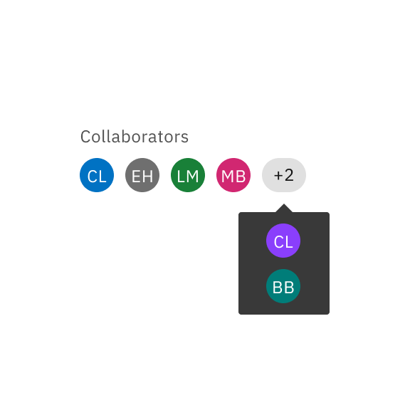

</DoDontExample>
  </Column>
</Row>

<Caption>As the colors on the user avatars are system generated, some color combinations wouldn't provide sufficient contrast.</Caption>

Its also important to group the tag overflow count with items of the same size:
- Use the small tag with items that are 16px/20px in height.
- Use the medium tag with items up to 24px in height.
- Do not use the tag overflow for items above 24px in height.

<Row>
  <Column colLg={4}>

<DoDontExample type="do">

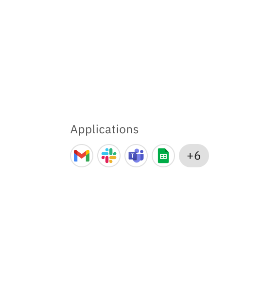

</DoDontExample>
  </Column>

  <Column colLg={4}>

<DoDontExample type="dont">

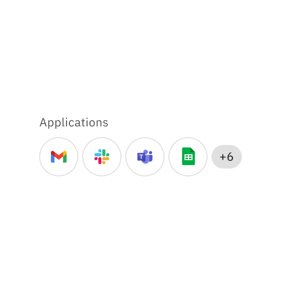

</DoDontExample>
  </Column>
</Row>

## Showing truncation
Another use of a tag overflow is to show the full name of a tag that doesn't fit in the allocated space. This could be due to a small browser size reducing the usable space, a long tag name, or both.

[Carbon tag guidance](https://carbondesignsystem.com/components/tag/usage) outlines a two word maximum for tags, which we should follow whenever possible. However, we acknowledge that some products allow for users to define their own tags, so truncation may be necessary to handle these tags. 

A tag showing truncation can be used on its own, or alongside a tag overflow count if there are more tags that need to be displayed.

### Behavior
On hover (or on click on a touch screen), a Carbon toggletip would appear with the full name of the tag.

<Row>
  <Column colLg={8}>

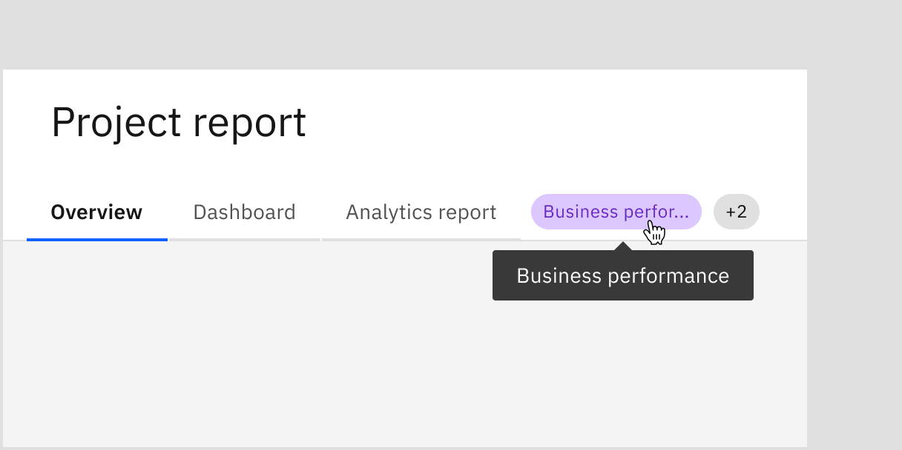

  </Column>
</Row>

### Best practices
- Only include long content in tags when absolutely necessary (i.e. user defined names of categories).
- Hug the toggletip width and height to the content. The maximum width for a toggletip is 288px, so do use multiple lines if needed.

## Accessibility
Toggletips showing additional content should be activated on click rather than hover, in order to be accessible via a keyboard.

Users can trigger the toggletip by pressing `Enter` or `Space` while the overflow tag has focus. Users can dismiss the toggletip by pressing `Escape`.

For toggletips showing truncation, the toggletip should appear on both hover and focus.

## Feedback

Help us improve this pattern by providing feedback, asking questions, and leaving any other comments on <a href="https://github.ibm.com/CDAI-design/pal/issues/new/choose">GitHub</a>.

For questions about code, reach out in <a href="https://ibm-casdesign.slack.com/archives/C013ZTX0N6B">#ibmproducts-pal-dev</a> or open an issue on the `@carbon/ibm-products` <a href="https://github.com/carbon-design-system/ibm-products/issues/new/choose">GitHub</a>.

## Contributors

Laura Marshall 

**Last updated**  
Feb 17, 2023
