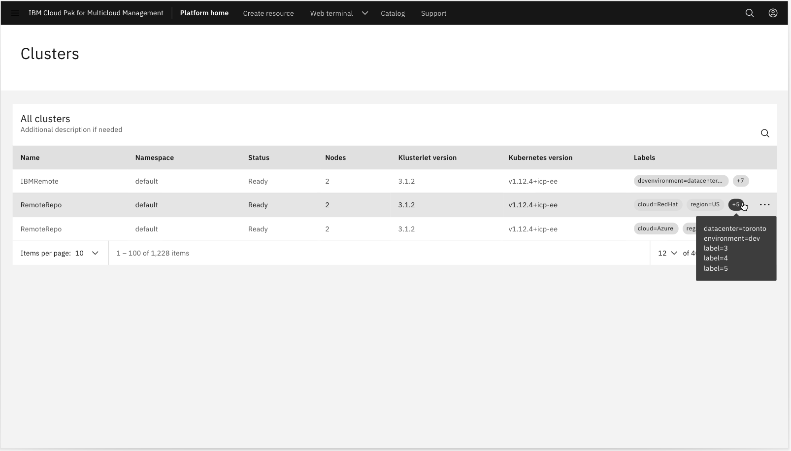
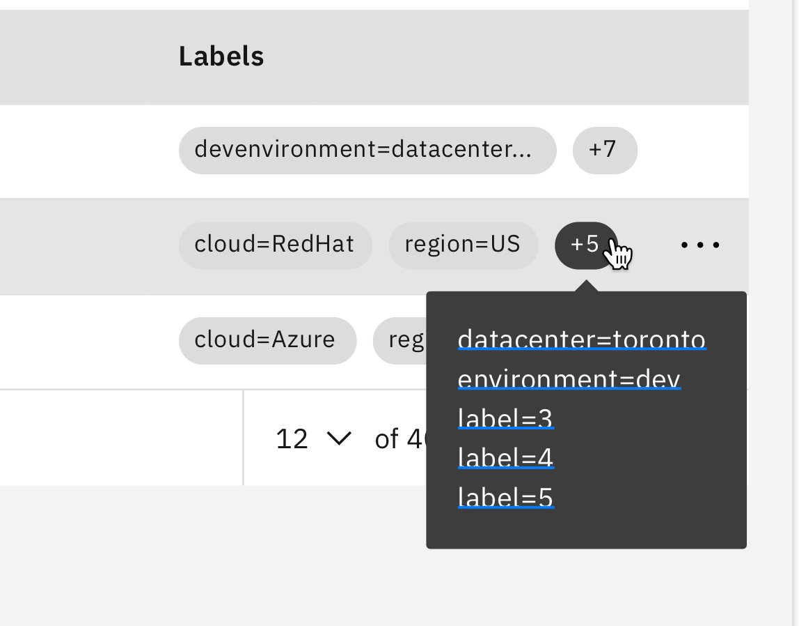
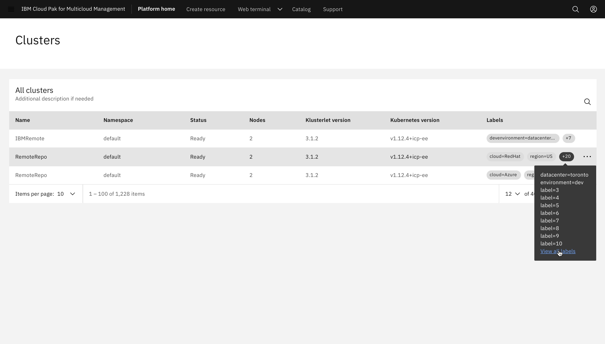
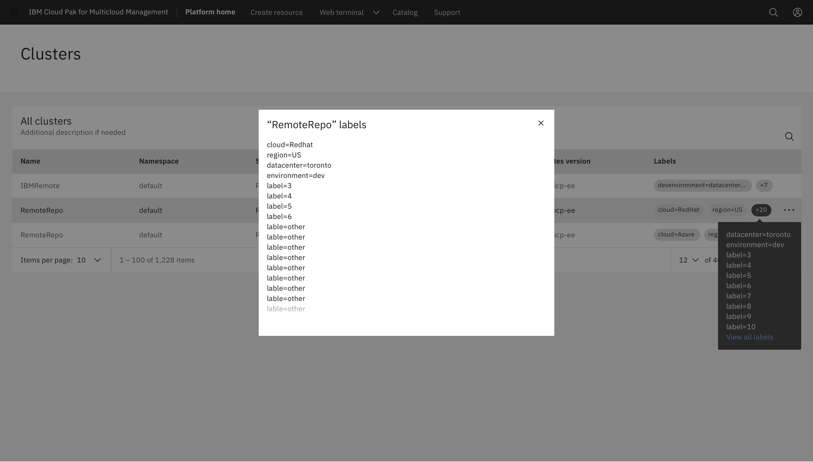

---

title: Tag set

---

<PageDescription>

The _Tag set_ component allows users to see all the labels of a cluster in areas where all tags may not be visible at one time. They provide the ability to see how many additional labels exist and what they are.

</PageDescription>

<AnchorLinks>
  <AnchorLink>Overview</AnchorLink>
  <AnchorLink>Behavior</AnchorLink>
  <AnchorLink>Accessibility</AnchorLink>
  <AnchorLink>Related</AnchorLink>
  <AnchorLink>Feedback</AnchorLink>
</AnchorLinks>

## Overview

The **Additional tag** feature is used when not all the tags fit in the allotted space. It allows users to see all the labels associated with a cluster. This additional tag feature looks like a regular tag but is indicated with a plus sign and a number (the number of additional labels not seen). 

## Behavior

Hovering over the tag brings up a tooltip which provides the list of additional labels. This tooltip includes a list of up to 10 additional labels. If there are more than 10 additional labels, the tooltip includes a link text to **view all labels**. When the user clicks on this link a modal opens with a list of all the labels.

<Row>
  <Column colLg={4}>

  </Column>
</Row>

## Structure and functionality 

The additional labels tag is the last tag shown, if there is no space to list all of the labels. A “+#” shows how many additional tags there are.
- When users hover over the “+” tag, it changes to a gray 90 tag color
- When hovering on the tag, a tooltip list will appear underneath the tag
- The tooltip in the example is a Gray 10 theme
- If there are more than 10 additional labels, the tooltip includes link text in Blue 50.
- When the user hovers over this link text in the tooltip, an underline appears on the text
- When the user clicks on the "view all labels" link, a modal appears with a list of all the labels

### Best practices

- Do use when there is no other space available
- Do list at least 1 tag before using the “additional tag”
- Do not use 1 “additonal tag” in place of putting any tags
- Do only use this component when there is absolutely no space

**Other use cases**
The example shown is of a table with not enough space to show all the tags. However, this component can be used outside of a table as well. The use of the “additional tag” is solely dependent on amount of space available.

## Accessibility

This component uses existing Carbon 10 color combinations and font sizes so the accessibility is unchanged.

## Related

**Tag**
The hover state for this tag is not just an “x” appearing on the right. The whole tag will change to a darker color on hover. In the example, the tag is a Gray 10 component and is #DCDCDC and on hover it is #3D3D3D which is the same color as the tooltip that would appear on hover. The color of the tag will depend on the color theme of the page

**Tooltip**
The example includes a Carbon 10 Gray 90 tooltip. The color of the tooltip will depend on the color theme of the page.

**Link text in tooltip**
If there are more than 10 additional labels, the tooltip will include a link to "View all labels". This link is in Blue 50 (#4589ff). On hover, the link is underlined.

## Feedback

Help us improve this pattern by providing feedback, asking questions, and leaving any other comments on GitHub.
