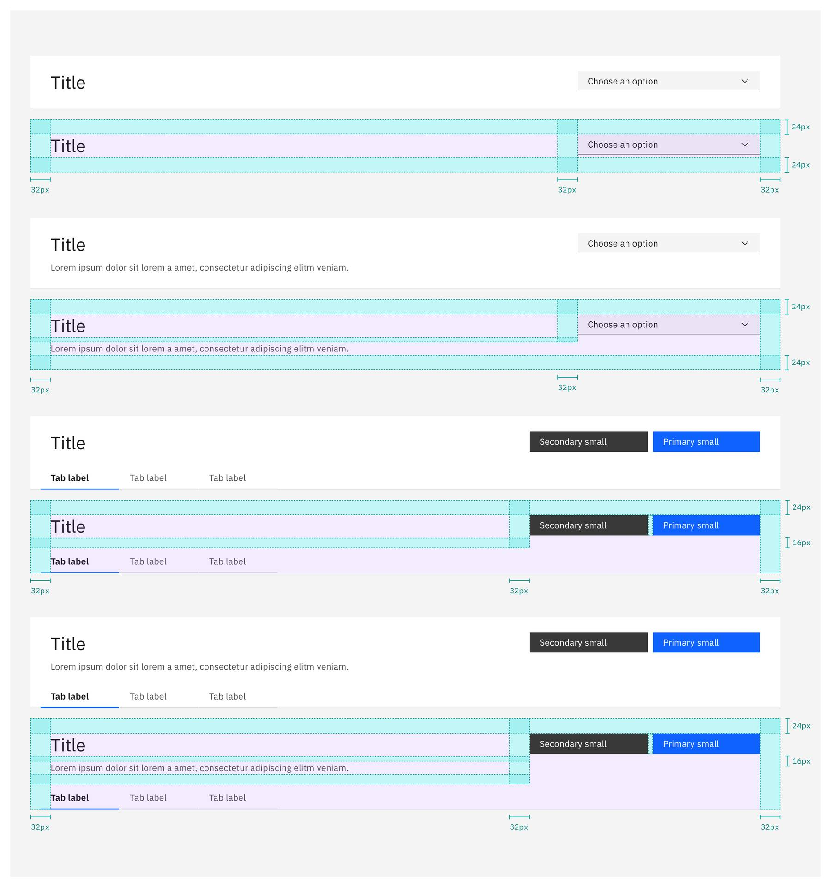
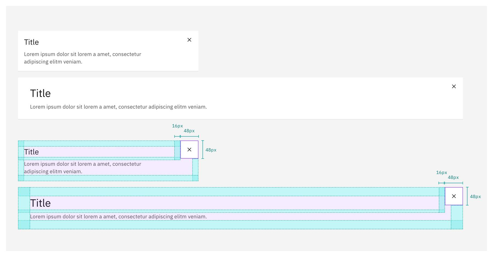
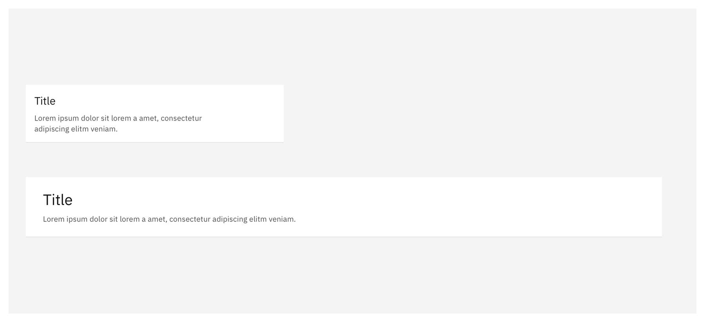
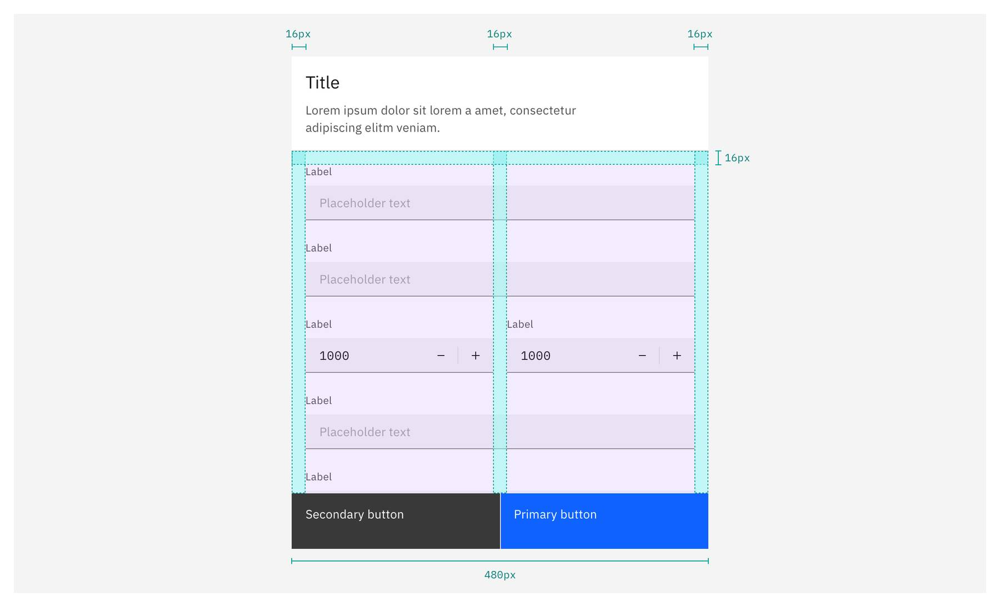
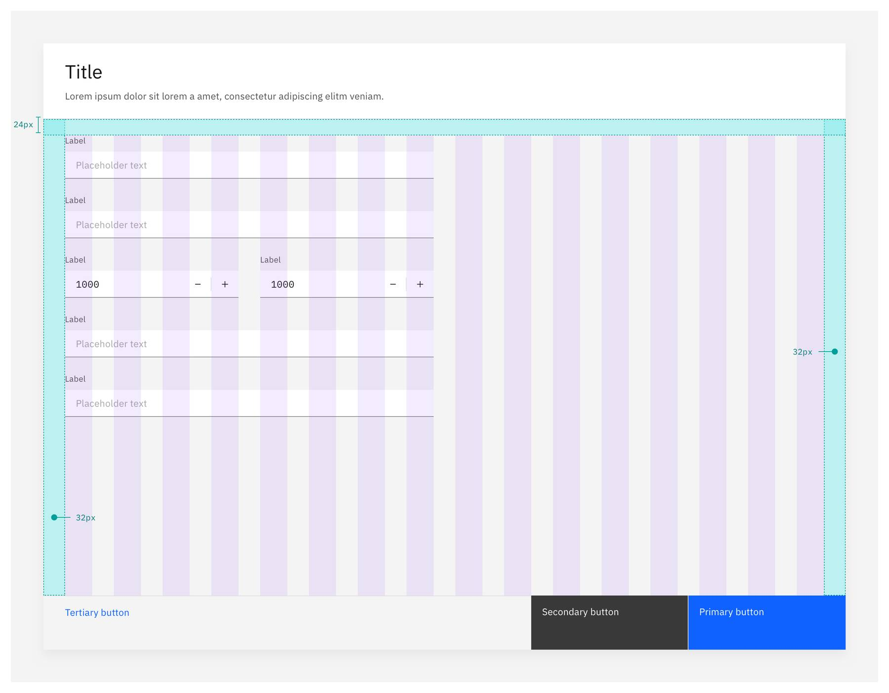
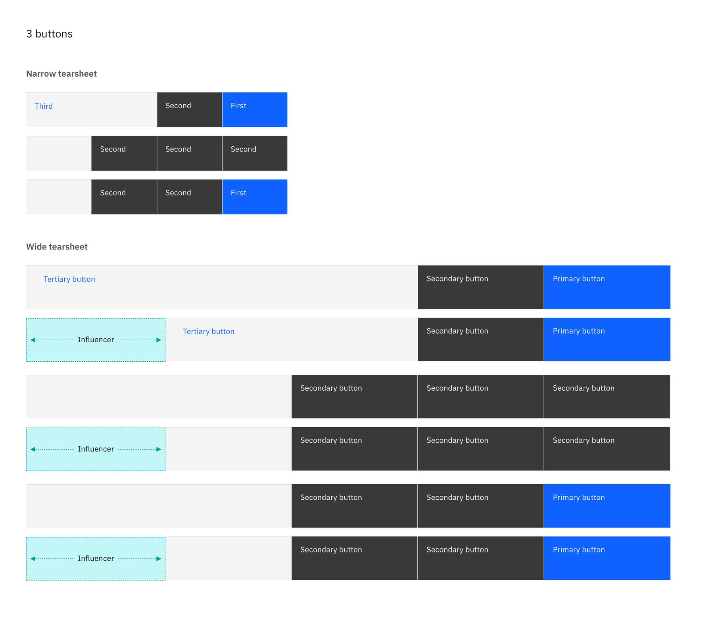
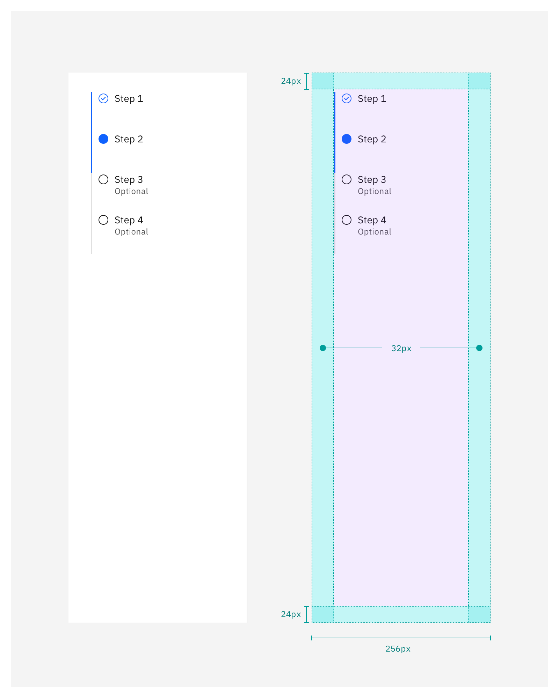
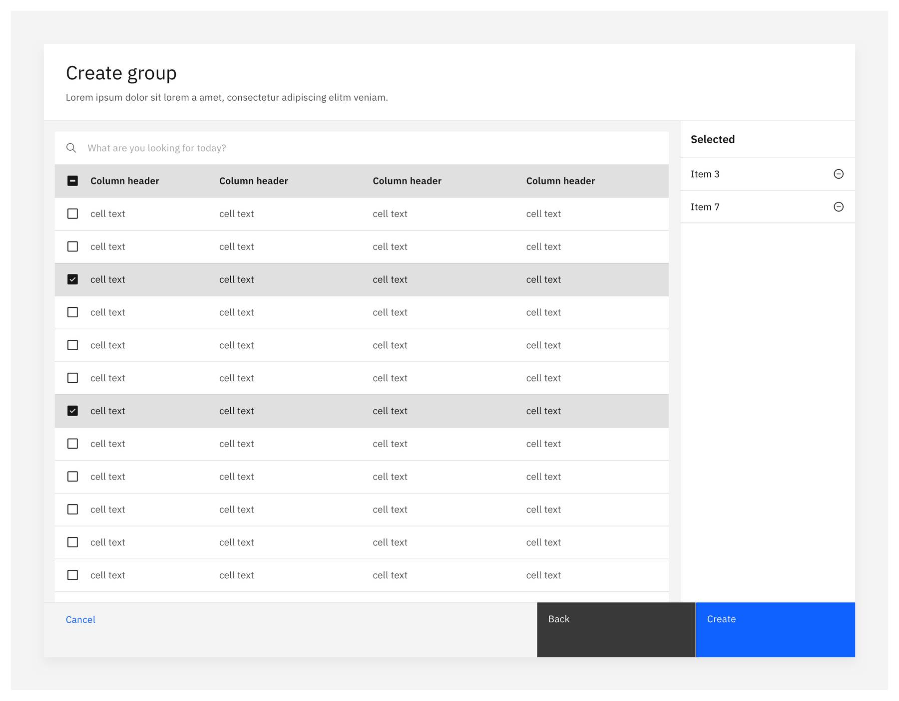
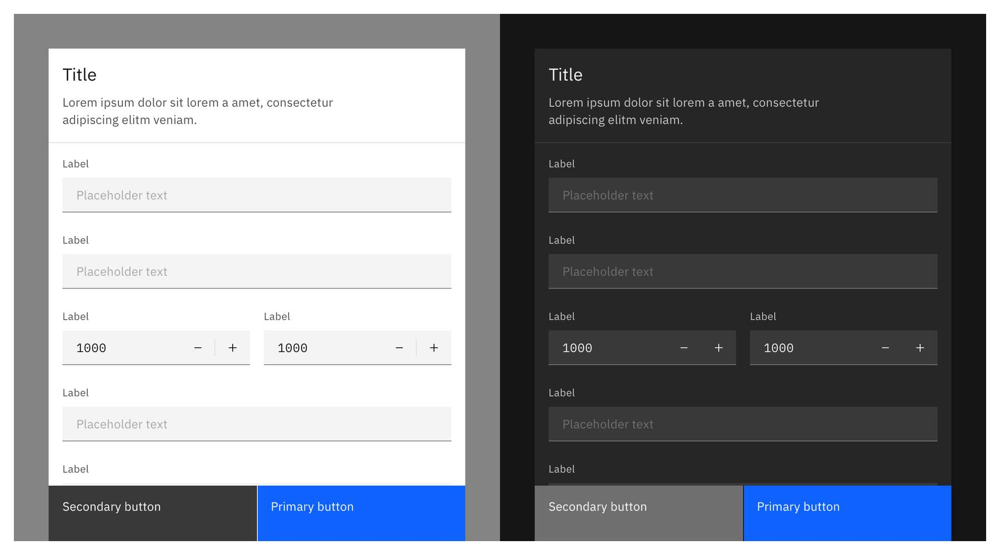
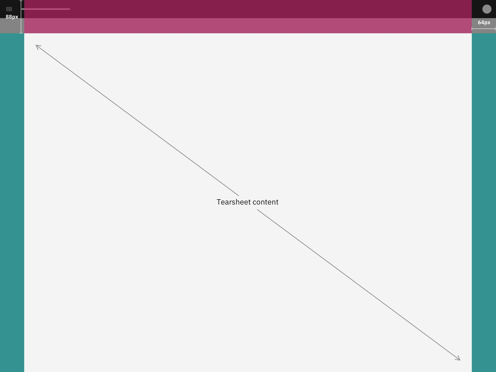

<AnchorLinks>
    <AnchorLink>Structure</AnchorLink>
    <AnchorLink>Theming</AnchorLink>
    <AnchorLink>Placement</AnchorLink>
    <AnchorLink>Motion</AnchorLink>
</AnchorLinks>

## Structure

<Row>
<Column colMd={8} colLg={8}>

</Column>
</Row>

### 1. Headers

The header may include elements such as an optional label, a description, tabs, or even some action buttons. Header examples below are suggestions to follow. Do not put back buttons (i.e. navigational buttons) in the header zone.

<Accordion>

<AccordionItem title="Spacing & alignment">

<Row>
<Column colMd={8} colLg={8}>

_With title_

 

_With description_

 

_With tabs_

 

_With actions_

Few scenarios would acitons be required to include in the header. Include 32px padding from the right of the container when using actions in the header. This would only be applicable to wide tearsheets.

Due to the space utilized by the header and the nature of tearsheets removing 88px from the top, we encourage you to use small components.

 

_Using an X action button_

In some tearsheets, an X action button may be placed in the top right corner. By default, the typical tearsheet would not include this. However, when present this is the styling that it may include.

Use a 20px x 20px `$close` icon with a 48px x 48px button container that touches the top and right edges of the tearsheet.

</Column>
</Row>

</AccordionItem>

<AccordionItem title="Styling">

<Row>
<Column colMd={8} colLg={8}>

Tearsheet titles and labels should be set in sentence case. Keep all titles and labels concise and to the point. Tearsheet labels are optional.

_Color_

| Class                             | Property         | Type token    |
| :---------------------------      | :--------------- | :------------ |
| `.bx--modal-header__heading`      | text color       | `$text-01`    |
| `.bx--modal-header__description`  | text color       | `$text-02`    |
| `.bx--modal-container`            | background-color | `$ui-01`      |
| `.bx--modal-close__icon`          | fill             | `$icon-01`    |
| `.bx--modal-close:hover`          | background-color | `$hover-ui`   |

_Type_

| Tearsheet type | Class                            | Font-size (px/rem) | Font-weight   | Type token      |
| :------------- | :---------------------------     | :----------------- | :------------ | :-------------- |
| Narrow         | `.bx--modal-header__heading`     | 20 / 1.25          | Regular / 400 | `$heading-03`   |
| Narrow         | `.bx--modal-header__description` | 14 / 0.875         | Regular / 400 | `$body-long-01` |
| Wide           | `.bx--modal-header__heading`     | 28 / 1.75          | Regular / 400 | `$heading-04`   |
| Wide           | `.bx--modal-header__description` | 14 / 0.875         | Regular / 400 | `$body-long-01` |

</Column>
</Row>

</AccordionItem>

</Accordion>

### 2. Main content area

This typically contains forms, tables, and items that a user may interact with. This must always be available in a tearsheet.

<Accordion>

<AccordionItem title="Spacing & alignment">

<Row>
<Column colMd={8} colLg={8}>

_Narrow tearsheet_

Some flows in narrow tearsheets include multiple steps. The header zone exists on all steps but there can be additional content below it that scrolls beneath the header zone. This would be the title of the step in the flow. It can also include it's own description. See [create flows](https://www.carbondesignsystem.com/community/patterns/create-flows/) for further details. For understanding how the grid may be applied, visit the [grid behaviors](https://pages.github.ibm.com/cdai-design/pal/patterns/grid-influencers/style#wide-tearsheet-grid) pattern.

For these sub-titles, use `$productive-heading-02` with color `$text-01`. They may also include descriptions as well.

 

_Wide tearsheet_

Content that sits in the Main content area (i.e the space with the grid outside of the influencer) is mainly up to the teams to decide how content is laid out. Keep in mind there is `32px` padding on left and right and `24px` padding on top and bottom of the main content area.

As a rule of thumb, we keep the space between columns 32px always and columns are always wider than the space between them (greater than 32px.) Thus, the amount of columns present should adjust if columns become less than 32px in width. 
For guidance on how to apply the grid to wide tearsheets, visit the [grid behaviors](https://pages.github.ibm.com/cdai-design/pal/patterns/grid-influencers/style/#wide-tearsheet-grid) pattern.

</Column>
</Row>

</AccordionItem>

</Accordion>

### 3. Navigation buttons

(Optional but typically the default) Use these to navigate the flow and to finalize/complete the steps required. Buttons may include icons if required by the experience and would follow suit with side panels and modals for how they behave.

<Accordion>

<AccordionItem title="Combinations, spacing & alignment">

<Row>
<Column colMd={8} colLg={8}>

Button combinations will follow suit similarly to that of modals and side panels. Keep in mind we have a modified "Tiertiary" button that sits 16px away from the left of the tearsheet edge or influencer edge.

Avoid using "Done" as a button. Actions should be reserved for specific tasks (Save, Cancel, etc). Done is not inidactive of what will happen and can be replaced all together by using the "passive" tearsheet type (uses an X in the top right corner instead of a navigation button in the bottom right).

Often, there may need to be a trigger to initiate a "save progress" function so users may return to complete a form. Use a "Save progress" as a navigational button. Wording may vary.

 

_1 button_

Typically this would not appear as tearsheets are mainly for taking action, in which you would typically have a Cancel button.

 

_2 buttons_

This is the most widely used button combination for narrow tearsheets. In wide tearsheets, having the Cancel button as a tertiary type button is hard to see, therefore it is only recommended to use a tertiary button in a narrow tearsheet as a fall back option if the first pairing type is not applicable.

 

_3 buttons_

This type is the most widely used button combination for wide tearsheets. It is not recommended to use for narrow tearsheets.

 

_4 buttons_

Rarely should cases use 4 buttons. The more buttons, the harder it is for users to make decisions on what to click. Attempt to reduce the number of options available. Avoid using this amount of buttons for narrow tearsheets as it is difficult to wrap text or fit text that becomes long when translated.

 

Buttons have a max-width of `232px` but may shrink based on percentage for wide tearsheets. Narrow tearsheets use a percentage.

</Column>
</Row>

</AccordionItem>

<AccordionItem title="Button size">

<Row>
<Column colMd={8} colLg={8}>

Narrow tearsheet navigation buttons are 64px tall. Wide tearsheet navigation buttons are 80px tall. In wide tearsheers, the tertiary button remains the same size as the other buttons but as 16px extra margin on the left side.

| Tearsheet type   | Height | 1 button | 2 buttons | 3 buttons | 4 buttons | Max-width |
| :-------         | :--    | :--      | :--       | :--       | :--       | :--       |
| Narrow tearsheet | 64px   | 50%      | 50%       | 25%       | 25%       | 50%       |
| Wide tearsheet   | 80px   | 25%      | 25%       | 25%       | 25%       | 232px     |

</Column>
</Row>

</AccordionItem>

<AccordionItem title="Styling">

<Row>
<Column colMd={8} colLg={8}>

| BG-color         | Border-color     | Border-size (px) |
| :--              | :--              | :--              |
| `$background-ui` | `$decorative-01` | 1                |

</Column>
</Row>

</AccordionItem>

</Accordion>

### 4. Influencers

This is often used for dividing content. Typically, but not limited to, placement on the left side of the wide tearsheet, this space is usually reserved for menus, vertical progress indicators, filters, or "shopping-cart-like experiences". **The narrow tearsheet would not utilize an influencer side panel.**

Additionally, the influencer does not become a part of the tearsheet grid. Instead, it sits outside the tearsheet grid.

<Accordion>

<AccordionItem title="Combinations, spacing & alignment">

<Row>
<Column colMd={8} colLg={8}>

Influencers in the tearsheet utilize `32px` padding on left and right and `24px` padding on top and bottom. They specifically deviate from side panel guidance on padding due to the inset of the tearsheet within another page, requiring alignment to the tearsheet title (`32px` padding on the left of the title.)

These can be used in, but not limited to, the following situations. Use these to guide your work.

 

_Menus_

Menus can include sections to divide items up further and icons within each menu item. Refer to in-page navigation pattern for guidance.

 

_Progress indicators_

This utilizes the default vertical progress [indicator component](https://www.carbondesignsystem.com/components/progress-indicator/usage/).

 

_Filters_

This is left up to the product as many tearsheet experiences may include varying filtering content.

 

_Shopping cart_

Often used for previewing what contents are selected from a view (typically a table that cannot reveal all selections without scrolling or hiding content). Contents in a panel on the right do not have to adhere to 32px side gutters and instead may use 16px since the tearsheet title is not on the right side.

 

_Previews_

This can be utilized for viewing metadata about an object that's selected in the same view.

</Column>
</Row>

</AccordionItem>

</Accordion>

## Theming

Tearsheets use the same UI tokens for Grey 10 and Grey 100 themes. For more guidance around themes visit [Carbon’s color guidelines](https://www.carbondesignsystem.com/guidelines/color/usage).

<Row>
<Column colMd={8} colLg={8}>

_Narrow Tearsheet_

 

_Wide tearsheet_

< br />

| Tearsheet type | BG-color            | Title area     | Sidepanel      |
| :--            | :--                 | :--            | :--            |
| Narrow         | `$ui-01`            | `$ui-01`       | `$ui-01`       |
| Wide           | `$ui-background`    | `$ui-01`       | `$ui-01`       |

</Column>
</Row>

## Placement

To learn more about the grid, check out [grid behaviors](https://pages.github.ibm.com/cdai-design/pal/components/grid-behaviors).

Both tearsheet types start **88px from the top** of the viewport (i.e. the browser window.) Additionally, the wide tearsheet remains **64px from the left and right sides** of the viewport. The narrow tearsheet follows the percentage width pattern of the small modal.

<Row>
<Column colMd={8} colLg={8}>

</Column>
</Row>

## Motion

When the tearsheet is activated, the component will slide from the bottom of the view and the background will fade to the dark overlay. The deactivated version is the reverse.

<Accordion>

<AccordionItem title="1 Layer">

<Row>
<Column colMd={8} colLg={8}>

When a tearsheet is activated, this is considered the "first layer". Use this as the default experience for most cases.

_Entrance and exit_

| Piece              | Transitioning elements | Animation type |
| :----------------- | :--------------------- | :------------- |
| Card               | Position (X, Y)        | Expressive     |
| Background overlay | Opacity                | Productive     |

</Column>
</Row>

</AccordionItem>

<AccordionItem title="2 Layers (stack)">

<Row>
<Column colMd={8} colLg={8}>

In order to achieve the illusion of depth, layer 1 card layer will animate on a z-axis backwards to make “room” for the second layer to slide in from the bottom. The first layer will have a faded overlay to reduce its prominence and reinforce the layering effect. The second layer will assume the same animations, positioning, and scale as the first layer.

| Piece         | Transitioning elements            | Animation type |
| :------------ | :-------------------------------- | :------------- |
| Card 1        | Position (X, Y, Z), Width, Height | Expressive     |
| Dimming layer | Opacity                           | Expressive     |
| Card 2        | Position (X, Y)                   | Expressive     |

</Column>
</Row>

</AccordionItem>

</Accordion>

 

<Row className="resource-card-group">
  <Column colMd={4} colLg={4}>
    <ResourceCard
      subTitle="Tearsheet sketch file"
      href="https://sketch.cloud/s/db71ec37-fbf5-4895-9b90-7a9f5b269d5a">
    </ResourceCard>
  </Column>
</Row>
