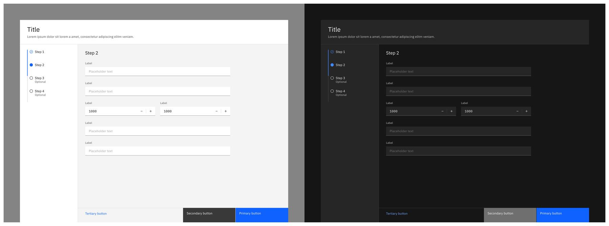

<AnchorLinks>
    <AnchorLink>Structure</AnchorLink>
    <AnchorLink>Theming</AnchorLink>
    <AnchorLink>Layout</AnchorLink>
    <AnchorLink>Motion</AnchorLink>
</AnchorLinks>

## Structure

### 1. Header

The header may include elements such as an optional label, a description, or even some actions buttons.

<Accordion>

<AccordionItem title="Spacing & alignment">

<Row>
<Column colMd={8} colLg={8}>

</Column>
</Row>

</AccordionItem>

<AccordionItem title="Styling">

<Row>
<Column colMd={8} colLg={8}>

Tearsheet titles and labels should be set in sentence case. Keep all titles and labels concise and to the point. Tearsheet labels are optional.

_Color_

| Class                        | Property         | Type token    |
| :--------------------------- | :--------------- | :------------ |
| `.bx--modal-container`       | background-color | `$ui-01`      |
| `.bx--modal-header__label`   | text color       | `$text-02`    |
| `.bx--modal-header__heading` | text color       | `$text-01`    |
| `.bx--modal-content`         | text color       | `$text-01`    |
| `.bx--modal-close__icon`     | fill             | `$icon-01`    |
| `.bx--modal-close:hover`     | background-color | `$hover-ui`   |
| Overlay                      | color            | `$overlay-01` |

_Type_

| Tearsheet type | Class                            | Font-size (px/rem) | Font-weight   | Type token      |
| :------------- | :---------------------------     | :----------------- | :------------ | :-------------- |
| Narrow         | `.bx--modal-header__label`       | 12 / 0.75          | Regular / 400 | `$label-01`     |
| Narrow         | `.bx--modal-header__heading`     | 20 / 1.25          | Regular / 400 | `$heading-03`   |
| Narrow         | `.bx--modal-header__description` | 14 / 0.875         | Regular / 400 | `$body-long-01` |
| Wide           | `.bx--modal-header__label`       | 12 / 0.75          | Regular / 400 | `$label-01`     |
| Wide           | `.bx--modal-header__heading`     | 20 / 1.25          | Regular / 400 | `$heading-03`   |
| Narrow         | `.bx--modal-header__description` | 14 / 0.875         | Regular / 400 | `$body-long-01` |

</Column>
</Row>

</AccordionItem>

</Accordion>

### 2. Main content area

This typically contains forms, tables, and items that a user may interact with. This must always be available in a tearsheet.

<Accordion>

<AccordionItem title="Spacing & alignment">

<Row>
<Column colMd={8} colLg={8}>

_Narrow tearsheet_

 

_Wide tearsheet_

</Column>
</Row>

</AccordionItem>

</Accordion>

### 3. Navigation buttons

(Optional but typically the default) Use these to navigate the flow and to finalize/complete the steps required.

<Accordion>

<AccordionItem title="Spacing & alignment">

<Row>

<Column colMd={8} colLg={8}>

</Column>

</Row>

</AccordionItem>

<AccordionItem title="Button size">

<Row>

<Column colMd={8} colLg={8}>

All navigation buttons are 64px tall. In wide tearsheers, the tertiary button remains the same size as the other buttons but as 16px extra margin on the left side.

</Column>

</Row>

</AccordionItem>

<AccordionItem title="Combinations">

<Row>

<Column colMd={8} colLg={8}>

</Column>

</Row>

</AccordionItem>

<AccordionItem title="Styling">

<Row>

<Column colMd={8} colLg={8}>

| BG-color         | Border-color     | Border-size (px) |
| :--              | :--              | :--              |
| `$background-ui` | `$decorative-01` | 1                |

</Column>

</Row>

</AccordionItem>

</Accordion>

### 4. Influencers

This is often used for dividing content. Typically, but not limited to, placement on the left side of the wide tearsheet, this space is usually reserved for a menu, vertical progress indicator, or filters. The narrow tearsheet would not utilize a side panel.

<Accordion>

<AccordionItem title="Spacing & alignment">

<Row>
<Column colMd={8} colLg={8}>

</Column>
</Row>

</AccordionItem>

<AccordionItem title="Variations">

<Row>
<Column colMd={8} colLg={8}>

</Column>
</Row>

</AccordionItem>

</Accordion>

## Theming

Tearsheets use the same UI tokens for Grey 10 and Grey 100 themes. For more guidance around themes visit [Carbon’s color guidelines](https://www.carbondesignsystem.com/guidelines/color/usage).

<Row>
<Column colMd={8} colLg={8}>

_Narrow Tearsheet_

 

_Wide tearsheet_

< br />

| Tearsheet type | BG-color            | Title area     | Sidepanel      |
| :--            | :--                 | :--            | :--            |
| Narrow         | `$ui-01`            | —              | —              |
| Wide           | `$ui-background`    | `$ui-01`       | `$ui-01`       |

</Column>
</Row>

## Layout

To learn more about the grid, check out [grid behaviors](https://pages.github.ibm.com/cdai-design/pal/components/grid-behaviors).

### Placement

Both tearsheets types start **88px from the top** of the viewport (i.e the browser window.) Additionally, the wide tearsheet remains **64px from the left and right sides** of the viewport. The narrow tearsheet follows the percentage width pattern of the small modal.

<Row>
<Column colMd={8} colLg={8}>

</Column>
</Row>

## Motion

When the tearsheet is activated, the component will slide from the bottom of the view and the background will fade to the dark overlay. The deactivated version is the reverse.

<Accordion>

<AccordionItem title="1 Layer">

<Row>
<Column colMd={8} colLg={8}>

When a tearsheet is activated, this is considered the "first layer". Use this as the default experience for most cases.

_Entrance and exit_

| Piece              | Transitioning elements | Animation type |
| :----------------- | :--------------------- | :------------- |
| Card               | Position (X, Y)        | Expressive     |
| Background overlay | Opacity                | Productive     |

</Column>
</Row>

</AccordionItem>

<AccordionItem title="2 Layers (stack)">

<Row>
<Column colMd={8} colLg={8}>

In order to achieve the illusion of depth, layer 1 card layer will animate on a z-axis backwards to make “room” for the second layer to slide in from the bottom. The first layer will have a faded overlay to reduce its prominence and reinforce the layering effect. The second layer will assume the same animations, positioning, and scale as the first layer.

| Piece         | Transitioning elements            | Animation type |
| :------------ | :-------------------------------- | :------------- |
| Card 1        | Position (X, Y, Z), Width, Height | Expressive     |
| Dimming layer | Opacity                           | Expressive     |
| Card 2        | Position (X, Y)                   | Expressive     |

</Column>
</Row>

</AccordionItem>

</Accordion>

 

<Row className="resource-card-group">
  <Column colMd={4} colLg={4}>
    <ResourceCard
      subTitle="Tearsheet sketch file"
      href="https://???">
    </ResourceCard>
  </Column>
</Row>
