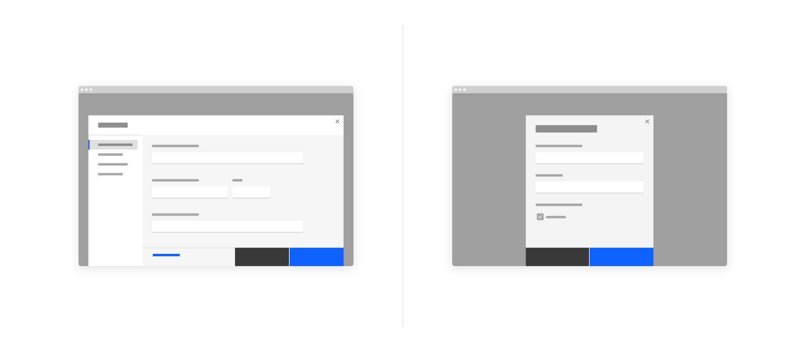
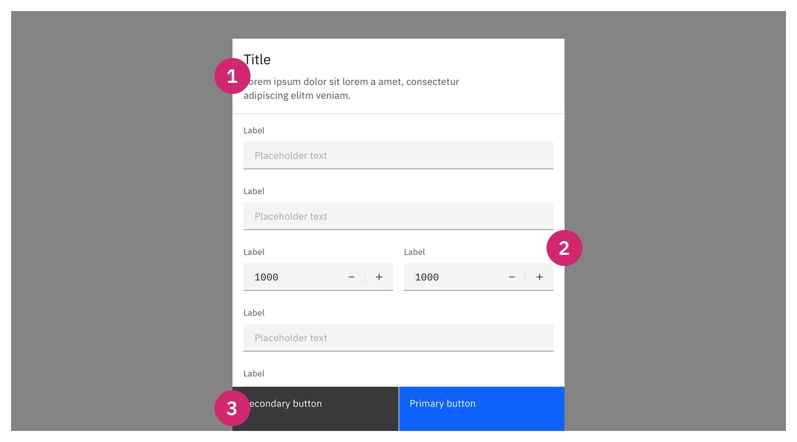
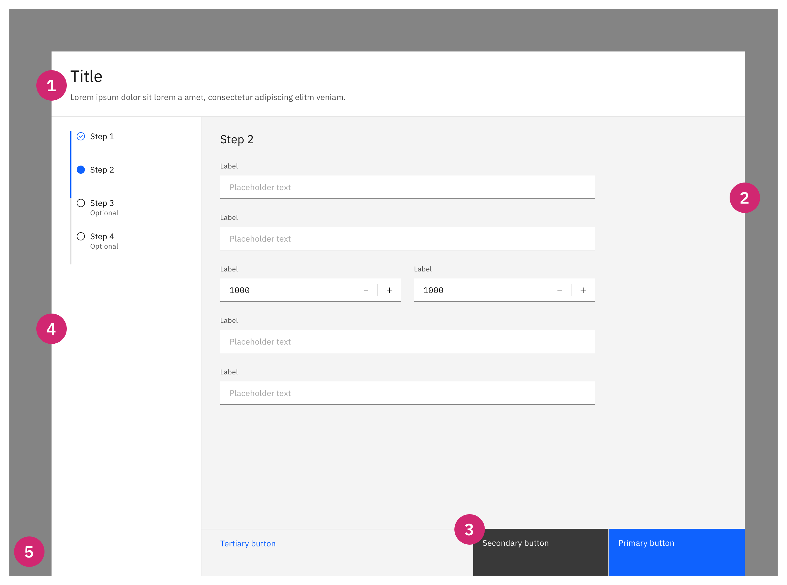
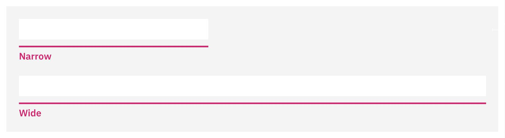
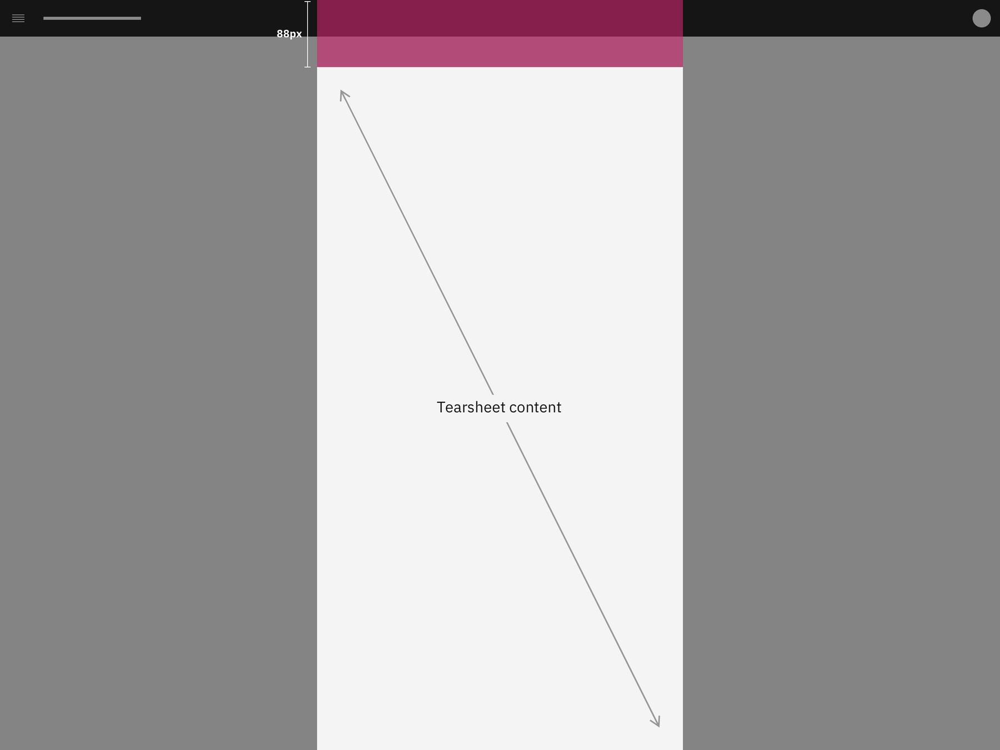
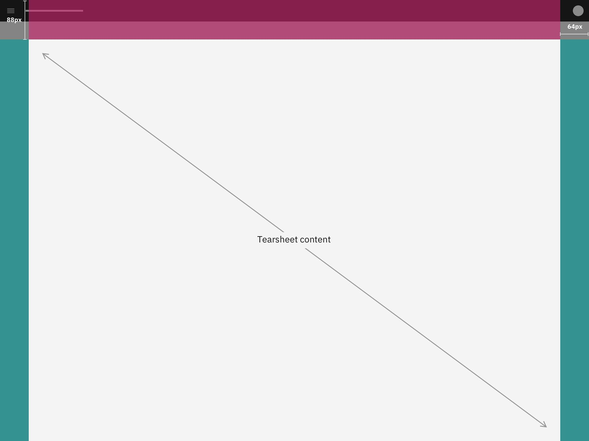
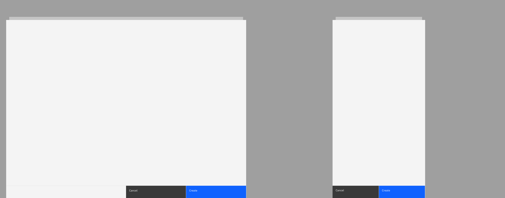
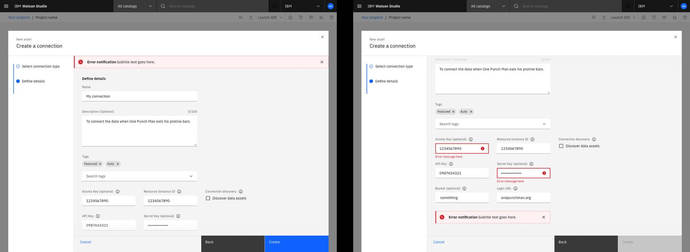
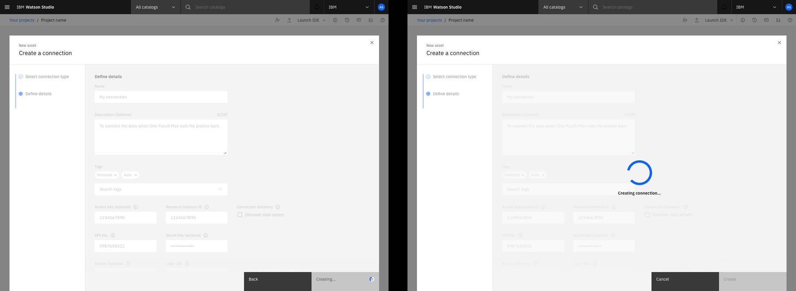

<PageDescription>

A tearsheet is a mostly full-screen type of dialog that keeps users in-context and focused by bringing actionable content front and center while revealing parts of the UI behind it.

</PageDescription>

<AnchorLinks>
   <AnchorLink>Overview</AnchorLink>
   <AnchorLink>Formatting</AnchorLink>
   <AnchorLink>Content</AnchorLink>
   <AnchorLink>Behaviors</AnchorLink>
   <AnchorLink>Modifiers</AnchorLink>
   <AnchorLink>Best practices</AnchorLink>
   <AnchorLink>Related</AnchorLink>
</AnchorLinks>

<Row>
<Column colMd={8} colLg={8}>

</Column>
</Row>

## Overview

Tearsheets help users focus on content and preform actions such as editing, creating, importing, exporting, and previewing, objects without leaving a page's context. Temporary flows such as creation and editing typically do not have a permanent location and therefore can be a module (via tearsheets) injected into multiple instances instead of taking the user into a new page, changing the mental model.

Tearsheets are malleable to what is allowed to live inside them. You can use them for forms, wizards, and more complex experiences such as iframming other existing experiences. There are two sizes of tearsheets: **Narrow** and **wide**. Both overlay content like modals and do not push like side panels.

Tearsheets start by default 88px from the top of the viewport. Wide tearsheets are inset **64px** from the left and right sides of a viewport and stretch when the viewport changes width, while narrow tearsheets mimic small modal behaviors except they stretch to the bottom of the screen.

The additional aspect of the tearsheet is that a second tearsheet layer may be shown on top of the originally initiated layer, creating what we call a _stack_. The goal is to keep the stacks to 2 layers at most, 3 if absolutely necessary.

### When to use

#### Context and focus

The most useful aspect of the tearsheet is that it enables the user to jump in and out of complex contexts quickly. The need to load a new webpage in order to display options becomes cumbersome when a user must repeat this action numerous times or might want to complete this action quickly. Accessing said content without reloading a page can speed up users' workflows and manage the users mental model seamlessly. Developers may consider this option when attempting to “iFrame” one web view in another.

If the user does not need to see the full-page content in conjunction with the flow being activated, use a tearsheet. This covers the page with an overlay background and a component, focusing the user's attention.

#### Object model hierarchy

Create, import, modify, select, and preview are experiences that don’t necessarily fit in the object model paradigm. Using the tearsheet allows us to save full-page experiences for objects (i.e projects, assets, any sandbox or container) and intermediate steps for things like create, import, edit, modify, select, and preview.

Use tearsheets to enable the user in accomplishing a goal, not showing system objects. Assets are objects while creating an asset is a UX segue to get to that object.

#### Lots of content

For experiences that require a display of a data table, you may be inclined to use tearsheets. Narrow and wide tearsheets are ideal for scrolling content as they allow for more screen realestate. 

### When not to use

#### Limited content

Unless there are parallel flows that coordinate with similar expectations by the user (i.e New asset flow to select any type of tool in Watson Studio projects), you should reserve simple experiences for modals. Try using the modal if there is limited content such as a name change of an object. Do not use _modals_ for scrollable content.

#### Simple actions and forms

Tearsheets are supportive of complex actions and long forms. Singular tasks that do not require multiple steps should utilize modals.

#### User must interact with content behind tearsheet

Consider using a side panel or in-line edit for actions that require parallelism between modification and user interaction. Tearsheets cover the main view’s content area and thus disable a user from interacting with anything that’s not in the tearsheet.

#### Single input edits or very short form edits

Consider using in-line editing to modify inputs or settings. A dialog of any sort is cumbersome for a small effort.

Try these questions before making a decision:

- Is this a really simple action or is a warning dialog type that can fit in a modal? -> **Modal**
- Is it too much content for a modal and requires scrolling? -> **Narrow tearsheet**
- Would the user benefit from seeing a complex screen inside the previous context that can't fit in a narrow tearsheet? -> **Wide tearsheet**

### Other use cases

#### Use inline editing instead

Some experience require the editing for a single property. Having a tearsheet would be too cumbersome to include for a small task. Consider using an inline editing function instead of a dialog (modal, tearsheet, sidepanel).

#### Use modals instead

For experiences that include very small forms, require user attention (i.e something urgent), or do not require the injection (iFraming) of one context into another, the design should use other means such as modals. Modals should typically be used for covering content when the user's input is required such as warning dialogs but not require a lot of user manipulation.

#### Use side panels instead

Experiences that require a user to view the full screen content besides the content in a dialog, consider using this. Side panels are great for comparing content and disclosing or configuring supplementary details for content from the current screen.

## Formatting

### Anatomy

<Row>
<Column colMd={8} colLg={8}>

</Column>
</Row>

 

| Number | Anatomy item                                   | Description                                                                                                                                               |
| :----- | :------------------------------------- | :-------------------------------------------------------------------------------------------------------------------------------------------------------- |
| 1      | Header                         | Includes a title, an optional label, an optional description or a combination of any of the three (always includes a title). The context-label (same as modals) is the overarching flow name and first step of the flow as well (I.e the new asset flow, “Create new asset” is the title of the flow in the tearsheet and the second step this becomes the context-label. A title must always be present. Typically includes the close button “X” if there are no actions in the bottom right or the view is read-only content. |
| 2      | Main content area                   | This typically contains forms, tables, and items that a user may interact with. This must always be available in a tearsheet. |
| 3      | Navigation buttons                  | (Optional but typically the default) Use these to navigate the flow and to finalize/complete the steps required. |
| 4      | Influencer _(Optional)_             | This is often used for dividing content. Typically, but not limited to, placement on the left side of the tearsheet, this space is usually reserved for a menu, vertical progress indicator, or filters. We advise not to use 2 influencers at the same time due to the lack of available screen space. |
| 5      | Background overlay                  | Screen overlay that obscures the on page content. Same as modals. |

 

#### 1. Header zone

 

- **Title**: Used to designate the overarching flow of the tearsheet.
- **Description**: Used to describe the flow if need be.
- **Tearsheet header label** (context label): Used to maintain the flow's while also showing the title of a major step in the flow. (I.e New asset -> Notebook, "New asset" would be the context label)
- **Tabs**: Used to switch between content.
- **Actions**: Buttons may be allowed but are typically not advised. These may include buttons or dropdowns.
- **Close button** (Passive tearsheet only): Used to close a tearsheet that is read-only or does not include actions in the bottom right.

You may use this space to host content that should not be hidden. Anything below this scrolls below the header. The header itself does not scroll.

 

#### 2. Main content area

 

This zone is mostly left up to the designers of said experience and should follow standard page/content standards. Follow guidance on this website [for grid usage](https://pages.github.ibm.com/cdai-design/pal/components/grid-behaviors).

 

#### 3. Navigation buttons

 

These are always positioned at the bottom of the tearsheet main content area. Clicking the primary button moves the user to the next step or completes the current step and closes the tearsheet. Clicking the secondary button (if available) returns the user to the previous step or cancels the flow.

For flows with progress indicators (creation flows), keep the Cancel, Back button, and Primary (Next/Create) button persistent. Disable the Back button on the first step.

- Primary = Action button
- Secondary = Back button
- Ghost = Cancel button

Flows with 1 step, use a Cancel button and Primary button combo.

- Primary = Action button
- Secondary = Cancel button

Flows with 2 steps, use a Cancel button, a Back button, and a Primary button combo.

- Primary = Action button
- Secondary = Back button
- Ghost = Cancel button

Content area buttons, however, may take a user to a new context by initiating a new tearsheet layer on top of the main tearsheet layer (stack). These can live in the main content zone, the influencer zone, or the header zone. Buttons are set at 25% the content area width, not the full dialog container.

 

##### Primary button
- The primary button should always be displayed in the bottom right corner. 
- Avoid using primary buttons to state “Close/Done” or “Cancel”. Use an X in the top right corner for passive tearsheet types.

 

##### Secondary button
- The secondary button should be reserved for “Back” when there are multiple steps in a flow, otherwise use this for the "Cancel" button. The button should always be shown in the bottom right, next to the primary action.
- The Back button if available should be disabled but present on the first step.
- Do not make a Back button change into a cancel button when a user navigates a flow.

 

##### Tertiary button
- In tearsheets, this would typically be a ghost button on the left that is used for a "Cancel" button.
- "Cancel" buttons are always 1 button type below a "Back" button, which is one step below a Primary button.

 

Here are a few types of navigation buttons you may use. Content is up to the platform:

| Action        | Use-case                                                                                                                                                                                                                                                                                                                                                             | Label example                                |
| :------------ | :------------------------------------------------------------------------------------------------------------------------------------------------------------------------------------------------------------------------------------------------------------------------------------------------------------------------------------------------------------------- | :------------------------------------------- |
| Back          | Only allow the user to go back a step in the flow.                                                                                                                                                                                                                                                                                                                   | Back, Previous                               |
| Next          | Allow the user to click this to move to the next step.                                                                                                                                                                                                                                                                                                               | Next, Continue                               |
| Completion    | Act as the last step in the tearsheet flows.                                                                                                                                                                                                                                                                                                                         | Save, Create, Add, Export, Complete, Connect |
| Cancel        | Cancel button is the default method to exit the tearsheet in a flow that is not passive. Use this to explicitly state what happens to a flow when a user decides to exit and not save progress. This can be either a secondary button or tertiary button. If a tertiary button, it shall remain left aligned to the left influencer or bottom left of the tearsheet. | Cancel, Cancel and discard                   |
| Save progress | Use this action to save the state of a flow when a user decides to leave it and wants to save the progress made. Use a secondary button to the bottom right of the tearsheet button set.                                                                                                                                                                             | Save as draft, Save and close                |

 

#### 4. Influencers

 

Use an influencer to help divide up content in wide tearsheets only. Showing an influencer also helps make alternative options discoverable or guide the user through a flow. When there is little room for content and the influencer with a sidemenu, the sidemenu becomes a dropdown filter.

There are many types of influencers that may be present in tearsheets, the top 3 most common would be:

- **Menu**: Used to navigate options. Only one can be selected at once. 
- **Progress indicator**: When the user should be guided through a flow in chronological order, use this type of influencer.
- **Filter**: Use to affect the content in the main content view by changing content prosperities.    

Typically, the standard influencer sizes included are 256px or 320px. See [side panel](https://pages.github.ibm.com/cdai-design/pal/components/side-panel/usage) guidance for more details.

### Sizing

<Row>
<Column colMd={8} colLg={8}>

</Column>
</Row>

There are two tearsheet widths available for use. Tearsheet content, interactions, and user intention should drive the panel width used. Use **narrow tearsheets** for experiences that include simplistic content and may require scrolling or simple tables. Use **wide tearsheets** for complex experiences and elongated flows. For the need to scroll larger tables, to complete operations that require many options, to guide the user and separate content with deeper navigation, wide tearsheets are more appropriate.

### Placement

<Row>
<Column colMd={8} colLg={8}>

</Column>
</Row>

Both tearsheet sizes should appear centered in the viewport. They should adjust according to the grid guidance, but will always remain **88px from the top of the viewport**. This is to ensure users may see enough content (i.e the top level navigation and breadcrumbs) to understand they have not yet been removed from the previous context entirely. There is a prop to allow for a different height, but it is discouraged from being used unless there is a future need.

## Behaviors

### Trigger

Tearsheets can only be initiated by the user clicking or tapping cards, table rows, buttons, or icons. On rare occasions, tearsheets may be initiated by the system when it requests immediate attention.

### Focus

Once the tearsheet is open, set the initial focus to the first location that accepts user input. Focus should then remain trapped in the tearsheet until it is closed.

### Scrolling

Headers, sidemenu influencers, and actions in the bottom right are static in placement. Content inside the main body may move in the directions needed. Typically this is only a vertical scroll. In the event that this is a large table with many columns, allow for side scrolling. Side-menu influencers that require scrolling due to long list of content will have separate scrolling behavior from the main body content. Sidemenus are not to scroll with main body content.

Actions in the bottom right do not to scroll with the main body content. Instead, they sit above the body content and include a background.

### Navigation

A unique element to the tearsheet (for both narrow and wide) is the idea of **stacking**. This helps add depth within the UI, simplifying the user’s mental model during complex flows. Only use a stack when a user needs to complete a micro-task inside a flow when a single tearsheet layer is present. We are attempting to keep stacking to a maximum of 2 layers. It is recommended not use a modal component on top of the tearsheet. Only use tearsheet layers. Only warnings may be presented as a modal on top of a tearsheet.

<Row>
<Column colMd={8} colLg={8}>

</Column>
</Row>

The tearsheet's main layer starts at a fix distance from the top of the screen. But when a stack is initiated, i.e an additional tearsheet layer, the original layer moves backwards in the Z-space, and seemingly up in positioning as well as narrower in width.

### When to use

If the main tearsheet is creating a singular directional mental model, the second layer may be utilized to quickly jump the user out of the single direction and into another one.

For example, if you are selecting a tool from a list (step 1) and filling out asset details (step 2), you may want to select optional data to include. Because it is optional, it makes sense to allow the users to select this action at whichever point they are comfortable with and animate from the bottom of the viewport a new layer. Once this task is complete, the second layer animates down and returns the user to the original flow.

### When not to use

Bottom right actions are reserved for moving in flows (forwards, backwards) and completing or exiting (confirm, cancel). Their location is indicative of the expected mental modal. A few exceptions are applicable for these bottom right actions (i.e Save as draft, etc).

## Modifiers

### Light & Dark theming

Tearsheets use the same UI tokens for Grey 10 and Grey 100 themes.

_See style section for theme color token specifications._

## Best practices

### Tearsheet variants

 

| Type          | Use-case                                                                                                                                                                                                                | Example                                                                 |
| :------------ | :---------------------------------------------------------------------------------------------------------------------------------------------------------------------------------------------------------------------- | :---------------------------------------------------------------------- |
| Passive       | Presents information the user needs to be aware of concerning their current workflow. Contains no actions for the user to take. This utilizes an X to close the tearsheet.                                              | Previewing a data table of a CSV or an image with no actions available. |
| Transactional | Requires an action to be taken in order for the modal to be completed and closed. Contains a cancel and primary action buttons. This utilizes the cancel button to close the tearsheet and stop the changes being made. | Creating or editing an object.                                          |
| Danger        | A specific type of transactional modal used for destructive or irreversible actions. This is required to use a cancel button instead of an X in the top right to stop and discard the changes.                          | Disconnecting a service or Deleting a user from a system.               |
| Progress      | Requires several steps to be completed before it can be closed. Contains a cancel, previous, and next/completion buttons.                                                                                               | Wizard flows such as creating a job.                                    |

### When to use and not to use X “Close” action button

In some flows, we do not want the user to be able to exit without explicit confirmation. Therefore, we use the Cancel button in the flow. Clicking this explicitly describes the action of canceling the flow and therefore does not require a dialog to warn the user because this is a dialog. Use the Cancel button for flows that include taking action on objects or system level modifications.

Use the X "Close" button instead of the Cancel button ONLY in passive flows. Examples of this include "About" modals describing products, previews of data where the user is not modifying an object like a preview of a dataset, etc.

A simplified overview of the X button vs Cancel button usage can be seen in [Carbon for IBM Products specifications](https://pages.github.ibm.com/cdai-design/pal/overview/carbon-specifications).

<InlineNotification kind="info">

The pattern guidance of the X button vs Cancel button usage has been approved by the DSIT but may not appear on all parts of CCS. For more information, contact Andrew Smith or Alex Swain.

</InlineNotification>

### Data loss

If there is a need in a flow to save progress so the user may close the tearsheet and reopen it later (such as for filling out extraneous forms when creating a new connection for example), indicate the progress is saved within the UI. Otherwise, it would be implied that the user will not retain data changes once the Cancel button is pressed.

Never use the X button to close a tearsheet that includes the ability to modify data. Tearsheets with the X button instead of a cancel button are considered Passive tearsheets.

### Error states

Errors for forms can be displayed in-line with the form items such as using the actual inputs to indicate where an error has occurred, or with an inline notification in close proximity to the form. Additionally an inline notification may be displayed at the top of the tearsheet under the header zone.

### Completion experience

When a user clicks the final completion action in a flow such as “Done”, “Save”, or “Create”, the tearsheet shall close and then the page will load to the context the user should be taken to.

In some experiences, there is a period of “waiting” where the user must rely on the speed of the system to execute the action, causing some latency before the tearsheet can close. To alleviate the user of any confusion, a loading indicator along with descriptive text on the progress of completion can be included.

### Latency (loading)

Some flow include a loading process because the immediate confirmation by the user is followed by the system understanding what the user has asked it to do and now is loading to complete this action. Default to the guidance in the dialog/modal pattern/component for indicating loading.

### Mental models

Use as simple of a mental model as possible to allow the user to achieve their task. Typically, we advise mental models to mimic directional patterns such as moving to the right without deviating in the main tearsheet. The user may scroll up and down to see more, the next “step” is awaiting on one side (the right side), and the previous step is waiting on the other (the left side). If a progress indicator is required, the mental model becomes vertical, according to the direction of the progress indicator component (typically in tearsheets, to reserve space, we use a vertical progress indicator).

Having the users complete a “micro-task” in the main flow might require a slightly new context. Therefore, the second tearsheet layer slides up from the bottom of the viewport, covering the main tearsheet, and allowing the user to complete that micro-task without cancelling the main objective.

## Accessibility

The accessibility implementation remains the same as it would for a normal web page and follows standard guidance for visual accessibility.

Using the `esc` key allows the user to close the tearsheet if there is an X close button available. Otherwise, it would highlight the “Cancel” button and allow the user to click `Enter` to activate that function.

Users should still be able to `TAB` to the next input field, side menus, or actions. Pressing `ENTER` activates that input or button.

Accessibility patterns should mimic the modal guidance.

## Related

- [Modal component](https://www.carbondesignsystem.com/components/modal/usage)
- [Dialog pattern](https://www.carbondesignsystem.com/patterns/dialog-pattern)
- [Side panel](https://pages.github.ibm.com/cdai-design/pal/components/side-panel/usage)
- [In page navigation](https://pages.github.ibm.com/cdai-design/pal/wip/in-page-navigation/usage/)
- [Progress indicator](https://www.carbondesignsystem.com/components/progress-indicator/usage)
- [Creation pattern](https://www.carbondesignsystem.com/community/patterns/create-flows)
- [Buttons](https://www.carbondesignsystem.com/components/button/usage)
- [Security's tearsheet](https://carbon-for-ibm-products.netlify.app/?path=/story/security-patterns-tearsheet-legacy--with-open-close)

