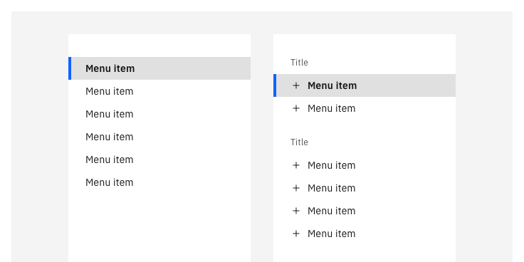

<PageDescription>

A *tearsheet* is a mostly full-screen type of dialog that keeps users in-context and focused by bringing actionable content front and center while revealing parts of the UI behind it.

</PageDescription>

<AnchorLinks>
  <AnchorLink>Overview</AnchorLink>
  <AnchorLink>Anatomy</AnchorLink>
  <AnchorLink>Related</AnchorLink>
  <AnchorLink>References</AnchorLink>
</AnchorLinks>

## Overview

Tearsheets help users focus on content and preform actions such as editing, creating, importing, exporting, previewing, objects without leaving a page's context. The content shown in a tearsheet does not sit within the object hierarchy, considering the object model (i.e Project = container, Assets tab = child container, Asset = child object, etc). Temporary flows such as creation and editing typically do not have a permanent location and therefore can be a module injected into multiple instances instead of taking the user into a new mental model.

- Tearsheets are malleable to what is allowed to live inside them. You can use them for forms, wizards, and more complex experiences such as iframming other pages. 
There are two sizes of tearsheets: Narrow and wide. Both overlay content and do not push.
- Tearsheets start by default 48px from the top of the viewport  but have a prop to enable an additional 40 px of space to reveal breadcrumbs or action bar navigation (88px total). Wide tearsheets are inset 32px from the left and right sides of a viewport and stretch when the viewport changes width, while narrow tearsheets mimic small modal behaviors except they stretch to the bottom of the screen.
- The additional aspect of the tearsheet is that a second layer may be shown on top, creating what we call a “stack”. The goal is to keep the stacks to 2 layers at most, 3 if absolutely necessary.

### When to use

#### Context and focus
- The most useful aspect of the tearsheet is that it enables the user to jump in and out of complex contexts quickly. The need to load a new webpage in order to display options becomes cumbersome when a user must repeat this action numerous times or might want to complete this action quickly. Accessing said content without reloading a page can speed up users' workflows and manage the users mental model seamlessly. Developers may consider this option when attempting to “iFrame” one web view in another. 
- If the user does not need to see the full-page content in conjunction with the flow being activated, use a tearsheet. This covers the page with an overlay background and a component, focusing the user's attention.

#### Object model hierarchy
- Create, import, modify, select, and preview are experiences that don’t necessarily fit in the object model paradigm. Using the tearsheet allows us to save full-page experiences for objects (i.e projects, assets, any sandbox or container) and intermediate steps for things like create, import, edit, modify, select, and preview.
- Use tearsheets to enable the user in accomplishing a goal, not showing system objects. Assets are objects while creating an asset is a UX segue to get to that object.

#### Tearsheet widths
- Use **Narrow** for modes that don't include overly complex content or forms but may require scrolling or simple tables.
- Use **Wide** for complex experiences and elongated flows. For the need to scroll larger tables, to complete operations that require many options, to guide the user and separate content with deeper navigation, wide tearsheets are more appropriate.

### When not to use

#### Limited content
Unless there are parallel flows that coordinate with similar expectations by the user (i.e New asset flow to select any type of tool in Watson Studio projects), you should reserve simple experiences for modals. Try using the modal if there is limited content such as a name change of an object.

Otherwise, try this order before making a decision:
- Is this a really simple action or is a warning dialog type that can fit in a modal? -> Modal
- If too much content for a modal and requires scrolling, consider a narrow tearsheet. -> Narrow tearsheet.
- Would the user benefit from seeing a complex screen inside the previous context that can't fit in a narrow tearsheet? -> Wide tearsheet.

#### Simple actions and forms
Tearsheets are supportive of complex actions and long forms. Singular tasks that do not require multiple steps should utilize modals.

#### User must interact with content behind tearsheet
Consider using a side panel or in-line edit for actions that require parallelism between modification and user interaction. Tearsheets cover the main view’s content area and thus disable a user from interacting with anything that’s not in the tearsheet.

#### Single input edits or very short form edits
Consider using in-line editing to modify inputs or settings. A dialog of any sort is cumbersome for a small effort.

### Anatomy

1. **Header zone**
Includes a title and optional description—or a combination of any of the three (always includes a title). The context-label (same as modals) is the overarching flow name and first step of the flow as well (I.e the new asset flow, “Create new asset” is the title of the flow in the tearsheet and the second step this becomes the context-label. A title must always be present. Typically includes the close button “X” if there are no actions in the bottom right or the view is read-only content.
2. **Main content area**
This typically contains forms, tables, and items that a user may interact with.This must always be available in a tearsheet.
3. **Navigation buttons**
(Optional but typically the default)
Use these to navigate the flow and to finalize/complete the steps required. Button combinations are listed below.
4. **Influencer** _(Optional)_
This is often present for dividing content. Typically, but not limited to, placement on the left side of the tearsheet, this space is usually reserved for a menu, vertical progress indicator, or filters. We advise not to use 2 influencers at the same time due to the lack of available screen space.
5. **Background overlay**
Screen overlay that obscures the on page content. Same as modals.

Due to the complexity of this component, zones have been established for user needs to facilitate a level of consistency and expected base behaviors that may transcend platforms and business units.

For flows that are simple and quick, use a narrow tearsheet. They do not require a lot of steps, nor are they overwhelming the mental model of the user.

Flows that mimic wizard creations or require more complexity, use a wide tearsheet with a menu or progress indicator. The indicator is recommended on the left size vertically and in some cases horizontally. Some flows in this paradigm may require more hand-holding to ensure some level of context. Therefore, a header zone is available to use. If there is simply a single wizard to implement, the header zone is not required as the largest title size will be in the main content zone and the overarching flow title will be slightly smaller in close proximity to the progress indicator.

#### 1. Header zone

| Item | Description |
|:--|:--|
| Title | Used to designate the overarching flow of the tearsheet. |
| Description | Used to describe the flow if need be. |
| Tearsheet header label (context label) | Used to maintain the flow's while also showing the title of a major step in the flow. (I.e New asset -> Notebook, "New asset" would be the context label) |
| Tabs | Used to switch between content. |
| Close button | Used to close a tearsheet that is read-only or does not include actions in the bottom right. |

Keep in mind that you should maintain a standard height for a single flow in a tearsheet on the first layer. For example, if you have a step and then click next, the header height should remain 112px tall if it was in the previous step. If a user activates a second layer (a stack) then the second layer may use a different height than the original layer.

You may use this space to host content that should not be hidden. Anything below this scrolls below the header. The header itself does not scroll. A user may also include actions elements within this space. 

#### 2. Main content area
This zone is mostly left up to the designers of said experience and should follow standard page/content standards. Follow guidance in this document for grid usage.

#### 3. Navigation buttons
These are always positioned at the bottom of the tearsheet main content area. Clicking the primary button moves the user to the next step or completes the current step and closes the tearsheet. Clicking the secondary button (if available) returns the user to the previous step or cancels the flow.

For flows with progress indicators (creation flows), keep the Cancel, Back button, and Primary (Next/Create) button persistent. Disable the Back button on the first step.
- Primary = Action button
- Secondary = Back button
- Ghost = Cancel button

Flows with 1 step, use a Cancel button and Primary button combo.
- Primary = Action button
- Secondary = Cancel button

Content area buttons, however, may take a user to a new context by initiating a new tearsheet layer on top of the main tearsheet layer (stack). These can live in the main content zone, the influencer zone, or the header zone. Buttons are set at 25% the content area width, not the full dialog container. The max-width they stretch to is 312px. See more details below in **Behaviors, Structure, and Functionality > Stacking**.

Additionally, buttons do not include any type of fade. They simply use a ui-background color behind the buttons to match the main content area background and a ui-03 divider at the top edge of the footer.

For narrow tearsheet, follow button guidance from the [modal component](https://www.carbondesignsystem.com/components/modal/usage).

| Type | Use-case |
|:--|:--|
| Primary button | • The primary button should always be displayed in the bottom right corner. If the user can select an option without having to also select the primary button, remove the primary button. This may only occur on multi-step flows. Otherwise, keep the primary button disabled in the bottom right.   • Do not use a primary button to state “close” or “cancel”. Use an X in the top right corner for read-only views. |
| Secondary button | • The secondary button should be reserved for “Back” when there are multiple steps in a flow, otherwise use this for the Cancel button. The button should always be shown in the bottom right, next to the primary action. If there is no primary action in the bottom right, then this button should also not exist.   • The Back button if available should be disabled but present on the first step.   • Do not make a Back button change into a cancel button when a user navigates a flow. |
| Tertiary button | • In tearsheets, this would typically be a ghost button on the left that acts like a Cancel button. |

Here are a few types of navigation buttons you may use. Content is up to the platform:

| Type | Use-case | Label example |
|:--|:--|:--|
| Back | Only allow the user to go back a step in the flow. | Back, Previous |
| Next | Allow the user to click this to move to the next step. | Next, Continue |
| Completion | Act as the last step in the tearsheet flows. | Save, Create, Add, Export, Complete, Connect |
| Cancel | Cancel button is the default method to exit the tearsheet in a flow that is not passive. Use this to explicitly state what happens to a flow when a user decides to exit and not save progress. This can be either a secondary button or tertiary button. If a tertiary button, it shall remain left aligned to the left influencer or bottom left of the tearsheet. | Cancel, Cancel and discard |
| Save progress | Use this action to save the state of a flow when a user decides to leave it and wants to save the progress made. Use a secondary button to the bottom right of the tearsheet button set. | Save as draft, Save and close |

#### 4. Influencers
Use an influencer to help divide up content in wide tearsheets only. Showing an influencer also helps make alternative options discoverable or guide the user through a flow. When there is little room for content and the influencer with a sidemenu, the sidemenu becomes a dropdown filter.

Typically, the standard influencer sizes included are 256px or 320px.

| Type | Use-case | Example |
|:--|:--|:--|
| Menu | Used to navigate options. Only one can be selected at once. |  |
| Progress indicator | When the user should be guided through a flow in chronological order, use this type of influencer. |  |
| Filter | Use to affect the content in the main content view by changing content prosperities. |  |

### Behaviors, structure, and functionality

#### Scrolling
Headers, sidemenu influencers, and actions in the bottom right are static in placement. Content inside the main body may move in the directions needed. Typically this is only a vertical scroll. In the event that this is a large table with many columns, allow for side scrolling. Side-menu influencers that require scrolling due to long list of content will have separate scrolling behavior from the main body content. Sidemenus are not to scroll with main body content.

Actions in the bottom right are not to scroll with the main body content. In fact, these sit above the body content and include a background.

#### Grid types
Only the wide tearsheet is applicable to the grid changing. The narrow tearsheet has one grid size and never uses an influencer.

| Type | Use-case | Example |
|:--|:--|:--|
| Full-width | Utilizes the full width of the tearsheet. |  |
| Influencer (256px and 320px) | Influencer may appear on left or right of main body content area. Used for menus, progress indicators, and filtering. The width of this sidemenu does not grow or shrink. It remains constant. |  |

#### Stacking
A unique element to the tearsheet (for both narrow and wide) is the idea of “stacking”. This helps add depth within the UI, simplifying the user’s mental model during complex flows. Only use a stack when a user needs to complete a micro-task inside a flow when a single tearsheet layer is present. We are attempting to keep stacking to a maximum of 2 layers. It is recommended not use a modal component on top of the tearsheet. Only use tearsheet layers. Only warnings may be presented as a modal on top of a tearsheet. 

The tearsheet main layer starts at a fix distance from the top of the screen (in Watson Studio’s case 88px from the edge of the viewport on top and 32px on each side left and right). But when a stack is initiated, it moves the main layer back in the Z-space, and seemingly up in positioning and narrower in width.

##### When to use
**Different directions**
- If the main tearsheet is creating a singular directional mental model, the second layer may be utilized to quickly jump the user out of the single direction and into another one.
- For example, if you are selecting a tool from a list (step 1) and filling out asset details (step 2), you may want to select optional data to include. Because it is optional, it makes sense to allow the users to select this action at whichever point they are comfortable with and animate from the bottom of the viewport a new layer. Once this task is complete, the second layer animates down and returns the user to the original flow.
**Actions are not implicit of direction**
- Sometimes the bottom right actions are not the best choice. In cases where the primary action on the screen isn’t the intent of the screen, a second layer may be initiated.
**Action lives in the main body area**
- Actions laid in the main body area should initiate a second layer instead of moving to another step directionally.

##### When not to use
**Don’t confuse bottom right actions with body actions**
- Bottom right actions are reserved for moving in flows (forwards, backwards) and completing or exiting (confirm, cancel). Their location is indicative of the expected mental modal. A few exceptions are applicable for these bottom right actions (i.e Save as draft, etc).

### Best practices

#### Flow types

| Type | Use-case | Example |
|:--|:--|:--|
| Single page | Use to present information that does not require additional navigation. |  Previewing a data asset while in a tool. This gives a user an understanding without the need to take action.|
| Simple navigation | Use to present information with 2-3 steps at most. Some flows may deviate from this if it’s clear the user may navigate forward and backwards. | Typically used for click and create things like selecting a tool and filling out the necessary creation form. |
| Wizard | Typically used to present a flow that requires more than 2-3 steps. This will include a progress indicator. | Users can go back and forth between steps that require separation because of the length of forms to fill out. |

#### Types
| Type | Use-case | Example |
|:--|:--|:--|
| Passive | Presents information the user needs to be aware of concerning their current workflow. Contains no actions for the user to take. This utilizes an X to close the tearsheet. | Previewing a data table of a CSV or an image with no actions available. |
| Transactional | Requires an action to be taken in order for the modal to be completed and closed. Contains a cancel and primary action buttons. This utilizes the cancel button to close the tearsheet and stop the changes being made. | Creating or editing an object. |
| Danger | A specific type of transactional modal used for destructive or irreversible actions. This is required to use a cancel button instead of an X in the top right to stop and discard the changes.| Disconnecting a service or Deleting a user from a system. |
| Progress | Requires several steps to be completed before it can be closed. Contains a cancel, previous, and next/completion buttons. | Wizard flows such as creating a job. |

#### Data loss
If there is a need in a flow to save progress so the user may close the tearsheet and reopen it later (such as for filling out extraneous forms when creating a new connection for example), indicate the progress is saved within the UI. Otherwise, it would be implied that the user will not retain data changes once the Cancel button is pressed.

Warning a user when they may be a data loss is the only current exception to including a modal in the flow with a tearsheet layer below it. Try to avoid using this. Modals are great to prevent users from focusing on any other aspect of the context but can overwhelm users if it sits on top of a tearsheet which is already a dialog type.

When the user clicks on the X “close” action, a modal will close. Because the X is used only during passive instances, the user will not need to be warned if data is reverted. No need to warn the user.

#### Error states
Errors for forms can be displayed in-line with the form items such as using the actual inputs to indicate where an error has occurred, or with an inline notification in close proximity to the form. Additionally an inline notification may be displayed at the top of the tearsheet under the header zone.

#### Completion experience
When a user clicks the final completion action in a flow such as “Done”, “Save”, or “Create”, the tearsheet shall close and then the page will load to the context the user should be taken to.

In some experiences, there is a period of “waiting” where the user must rely on the speed of the system to execute the action, causing some latency before the tearsheet can close. To alleviate the user of any confusion, a loading indicator along with descriptive text on the progress of completion can be included.

#### Latency (loading)
Some flow include a loading process because the immediate confirmation by the user is followed by the system understanding what the user has asked it to do and now is loading to complete this action. Default to the guidance in the dialog/modal pattern/component for indicating loading.

#### When to use and not to use X “Close” action
In some flows, we do not want the user to be able to exit without explicit confirmation. Therefore, we use the Cancel button in the flow. Clicking this explicitly describes the action of canceling the flow and therefore does not require a dialog to warn the user because this is a dialog. Use the Cancel button for flows that include taking action on objects or system level modifications.

Use the X "Close" button instead of the Cancel button ONLY in passive flows. Examples of this include "About" modals describing products, previews of data where the user is not modifying an object like a preview of a dataset, etc.

#### Mental models
Use as simple of a mental model as possible to allow the user to achieve their task. Typically, we advise mental models to mimic directional patterns such as moving to the right without deviating in the main tearsheet. The user may scroll up and down to see more, the next “step” is awaiting on one side (the right side), and the previous step is waiting on the other (the left side). If a progress indicator is required, the mental model becomes vertical, according to the direction of the progress indicator component (typically in tearsheets, to reserve space, we use a vertical progress indicator).

Having the users complete a “micro-task” in the main flow might require a slightly new context. Therefore, the second tearsheet layer slides up from the bottom of the viewport, covering the main tearsheet, and allowing the user to complete that micro-task without cancelling the main objective.

#### Motion
When the tearsheet is activated, the component will slide from the bottom of the view and the background will fade to the dark overlay. The deactivated version is the reverse.

###### Entrance and exit
| Piece | Transitioning elements | Animation type |
|:--|:--|:--|
| Card | Position (X, Y) | Expressive |
| Background overlay | Opacity | Productive |

###### Stacks
In order to achieve the illusion of depth, the main tearsheet card layer will animate on a z-axis backwards to make “room” for the second tearsheet card to slide in. The main card will have a faded overlay to subdue its prominence and reinforce the layering effect. The second tearsheet layer will assume the same animations as the entrance and exit guidelines.

| Piece | Transitioning elements | Animation type |
|:--|:--|:--|
| Card 1 | Position (X, Y, Z), Width, Height |  |
| Dimming layer | Opacity |  |
| Card 2 | Position (X, Y) |  |

#### Spacing
The default spacing from the top edge of the tearsheet to the top of the viewport is 48px. However, this spacing is overridden by the platform it sits in to reveal the most import navigational elements (i.e a top nav and a tool bar.) For example, in Watson Studio we have a top nav with the platform name and below that a tool bar with breadcrumbs. To keep the user aware that they are not leaving that context, the tearsheet animates to the edge of that tool bar. This means the tearsheet in the Watson Studio platform (Watson Studio + Watson Knowledge Catalog + Watson Machine Learning + Watson OpenScale) shall be 88px from the top of the viewport (top nav = 48px, action bar = 40px).

#### Responsiveness
When the viewport shrinks, so does the tearsheet. Because the wide tearsheet maintains at least a width of 32px from he right and let side of the viewport, change the grid to the next breakpoint.

The sidemenu does not shrink, grow, or change in width if the viewport changes width. However, when the tearsheet becomes smaller, the sidemen becomes a dropdown component. Consider how the hierarchy of your sidemenu will collapse into 1 or 2 dropdown.

Buttons have a responsive behavior depending on the breakpoint. They are as wide as 25% of the content area width with a max width of 312px for each button. The Cancel button, however, is a modified button that sits with a 24px left padding inside the button to align to the content area grid.

### Other use cases

#### Inline editing instead
Some experience require the editing for a single property. Having a tearsheet would be too cumbersome to include for a small task. Consider using an inline editing function instead of a dialog (modal, tearsheet, sidepanel).

#### Modals instead
For experiences that include very small forms, require user attention (i.e something urgent), or do not require the injection (iFraming) of one context into another, the design should use other means such as modals. Modals should typically be used for covering content when the user's input is required such as warning dialogs but not require a lot of user manipulation.

#### Side panels instead
Experiences that require a user to view the full screen content besides the content in a dialog, consider using this. Side panels are great for comparing content and disclosing or configuring supplementary details for content from the current screen.

## Accessibility

The accessibility implementation remains the same as it would for a normal web page and follows standard guidance for visual accessibility. 

Using the `esc` key allows the user to close the tearsheet if there is an X close button available. Otherwise, it would highlight the “Cancel” button and allow the user to click `Enter` to activate that function.

Users should still be able to `TAB` to the next input field, side menus, and actions. Pressing `ENTER` activates that input or button.

## Related

- [Modal component](https://www.carbondesignsystem.com/components/modal/usage) / [Dialog pattern](https://www.carbondesignsystem.com/patterns/dialog-pattern) -> these mostly guide design to accommodate for smaller dialogs as opposed to the tearsheet and it's use-cases.
- [Security's tearsheet](https://ibm-security.carbondesignsystem.com/?path=/story/patterns-tearsheet--with-open-close) -> story book for components
- [Side panel](https://ibm.box.com/s/hnutjfxou29n5lbcb96iy4cngdppfhkm) - these are similar but do not include the same guidance especially for larger flows that require more than 1 step or flows that have multiple out-of-flow-order contexts.
- [In page navigation](https://pages.github.ibm.com/cdai-design/pal/wip/in-page-navigation/usage/) -> Used for influencers that include menus.
- [Progress indicator](https://www.carbondesignsystem.com/components/progress-indicator/usage) -> used for creation flows to guide the user step by step in order.
- [Creation pattern](https://ibm.box.com/s/h28igafq4au8vqvnzzfqkov0k8sk1x4p) -> much of the guidance is derived from that pattern. Contact Andrew Smith or Andrea Garcia for further details..
