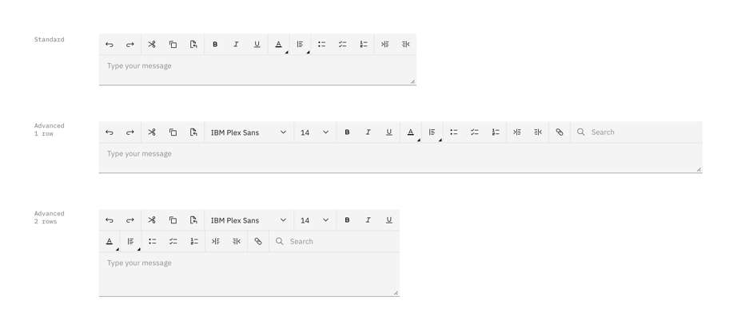
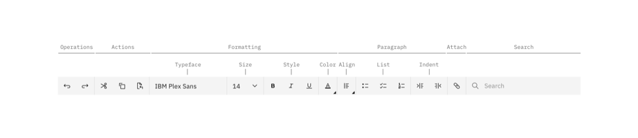
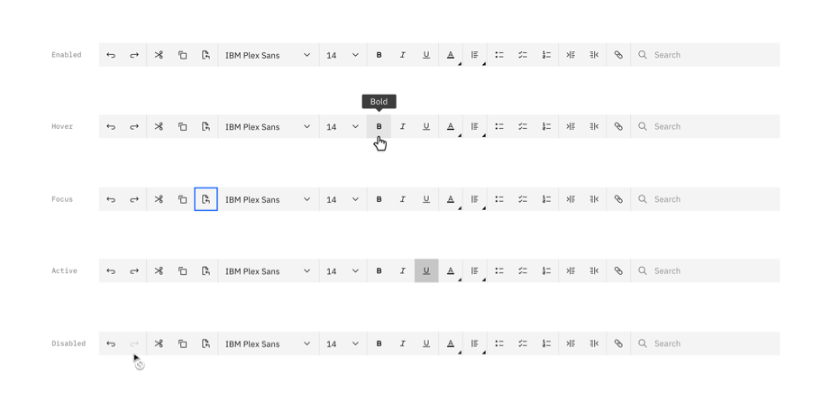
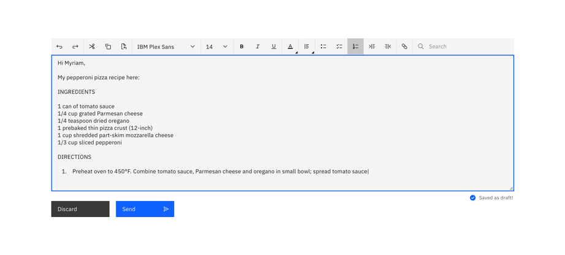

<PageDescription>

Use a text bar when a user would type or edit textual information.

</PageDescription>

<AnchorLinks>
  <AnchorLink>General guidance</AnchorLink>
  <AnchorLink>Anatomy</AnchorLink>
  <AnchorLink>Interaction</AnchorLink>
  <AnchorLink>Common use case</AnchorLink>
</AnchorLinks>

## General guidance

A text bar is a set of icon buttons that facilitates the writing and formatting of the text and can allow in addition to insert attachment or links.

## Anatomy

A text bar is an always-available, easy-to-use component for performing user needs:

#### Operations
The user can use **Undo** and **Redo** to reverse the last typing or the last undo operation.

#### Actions
The user can use **Cut**, **Copy** and **Paste** to move text content to another place on text area, to generate a copy of text content on the clipboard, and to insert the copied text from the clipboard to the place of text area. Tipically to perform these actions, the user needs to select the text content and place the cursor anywhere in the text area. 

#### Formatting
The user can change the typeface, size, style and color of a selected text content. The user can expand the color palette embedded in the icon button with a mini-chevron for the color selection.

#### Paragraph
The user can align paragraphs, organize paragraphs in bullet, checked or numbered list, and indent and outdent the paragraphs. The user can expand the sub-bar embedded in the icon button with a mini-chevron for the alignment selection.

#### Attachment
The user can add a file in the text of the text area. For example, the user can upload a .pdf file browsing own computer to find the file to upload. A **Loading** component appears when selected file is actually being uploaded. Subsequently, the user can remove the uploaded file using **Close**.

#### Search
The user can search key words in the text area. The search results are being displayed with highlight labels on the text area. The number of search results or **no result** is displayed with tag in the search bar. The user can clear the search using **Close**.A text bar is a set of icon buttons that facilitates the writing and formatting of the text and can allow in addition to insert attachment or links.

## Interaction  

The text bar respects the standard interactions used for Button component. Most of the icon set has 5 interaction states (enabled, hover, focus, active and disabled). The typeface and size selections adopt the **Inline dropdown** component. Differently, the text color selection has a palette and the text alignment selection displays a contextual sub-bar.

## Common use cases

Essentially, the text bar could be part of the widest range of products where it is necessary to write text, type guided tasks or runbook, send message, or give format to the textual content, ect.

A text bar can be customized by adding or deleting icon buttons based on specific user needs. 
Generally, this is accompanied by a text area (or text box) designed to allow the user to enter text information that will be used by the software.

The text bar typically is positioned under the menu bar when it is part of a software’s interface. Differently, the user can move it to the desired part of the screen using the drag handle (if available).
