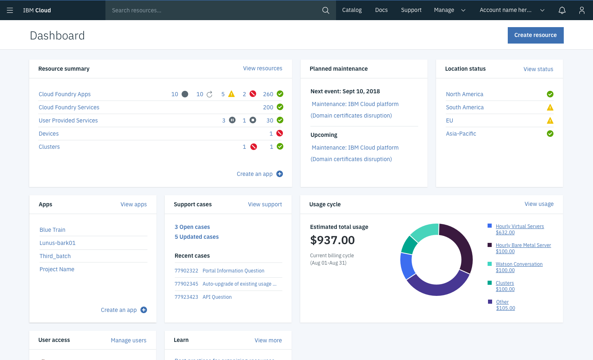
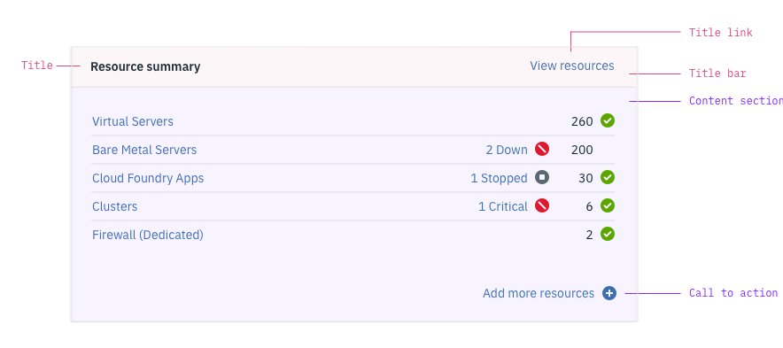
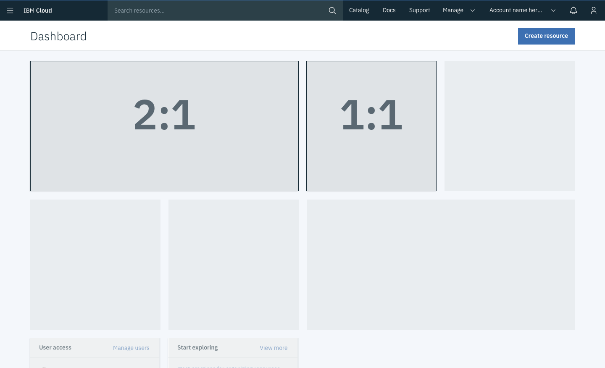

<AnchorLinks>
<AnchorLink>Anatomy</AnchorLink>
<AnchorLink>Widget size</AnchorLink>
<AnchorLink>Core widget</AnchorLink>
<AnchorLink>Service widget</AnchorLink>
</AnchorLinks>

## General guidelines

A <b>dashboard widget</b> provides a summary of a platform functionality, status, or individual service. The goal of a widget is to provide actionable information that helps the user quickly accomplish a key task or track key metrics. 

## Anatomy

Each widget has a <b>title bar</b> and a <b>content section</b>. The title bar is standard for all widgets, but the content section varies depending on the widget type. 

#### Title
Identifies the widget. Max characters: 23 (includes spaces)

#### Title link
Links users to a more complete view of information summarized in the widget. The title link should be as specific as possible (i.e. "view resources" not "view all"). Max characters: 15

#### Call to action 
Provides the user with a quick action. This element is optional and can incorporate a "plus" icon if appropriate. Max characters: 23

## Variations

| Variation type     | Purpose           | 
| :-------------------|:------------------|
| Small widget (1:1)  | Recommended as the standard.         |
| Large widget (2:1)  | Typicall used to show data visualization        | 
| Core widget        | Displayed on the dashboard by default and show platform          functionality.       |
| Service widget     | Must be actively added to the dashboard by user. | 

### Widget size

Dashboard widgets have <b>two possible sizes</b>, small and large. The height for both sizes is fixed (310px) and neither widget is currently resizable. 

- Small (1:1) - Recommended 
- Large (2:1) - Requires an additional 1:1 design for smaller viewports

### Core widget

Core widgets are designed by the dashboard team, and are displayed on the dashboard by default. They usually display platform functionality, such as maintenance events or support cases. 

### Service widget

Service widgets are designed by service teams, and must be actively added to the dashboard using the customize dashboard feature. Services wishing to propose a widget should follow the widget review process (see Widget approval). 

## Contributors

Arn Hyndman  
Nancy Ching  
Kala Nenkova  
Holman Sze  
Jeff Ng  
Virginia Nicholson  
Denise Heebner  
Courtney Bittner

Edited by: Kaley Coffield 
[#cloud-pal](https://ibm-cloudplatform.slack.com/messages/CGFD1CV4J)

