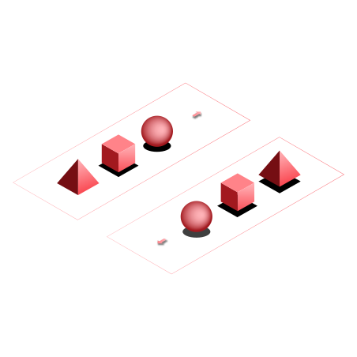
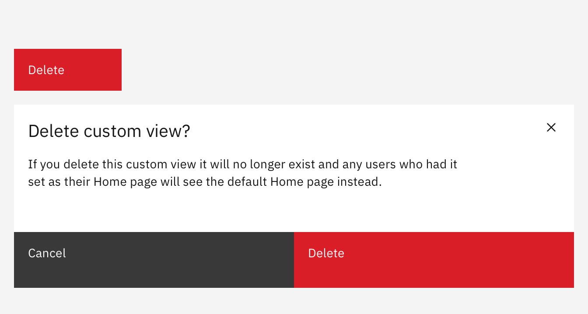
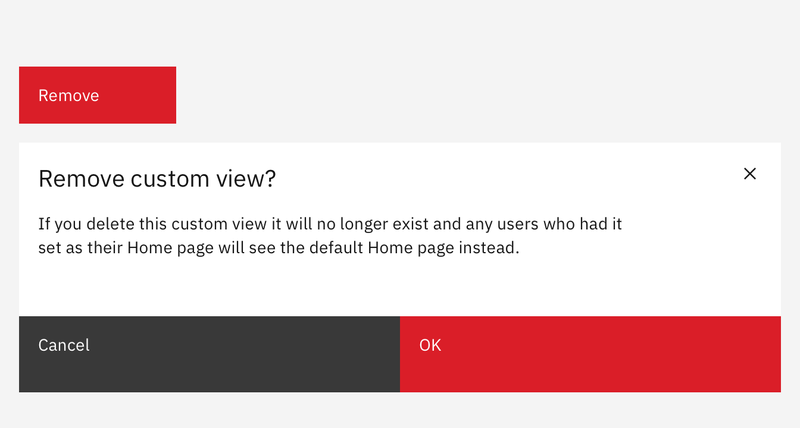

import { Link } from "gatsby";

<BannerQuote
  quote="If horrible and horrific basically mean the same thing, then why are terrible and terrific opposites?"
  backgroundHighlight="#750E13"
>

</BannerQuote>

<AnchorLinks>
  <AnchorLink>Grammar and structure</AnchorLink>
  <AnchorLink>Capitalization</AnchorLink>
  <AnchorLink>Punctuation and symbols</AnchorLink>
  <AnchorLink>Terminology</AnchorLink>
</AnchorLinks>

## Grammar and structure

When people click on UI buttons they are looking to do something, so button labels should predominantly use **verbs**.

- Use as few words as possible (but remain clear).
- Ideally UI button labels should be one or two words in length.
- Where there is more than one button (for example, a modal with both a _Cancel_ and a _Submit_ button), positive actions should be displayed on the right, negative actions on the left.

<DoDontRow>
  <DoDont text="Sign up" aspectRatio="" />
  <DoDont text="Yes, sign me up for the free trial" type="dont" aspectRatio="" />
</DoDontRow>

## Capitalization

Use sentence case capitalization. See the <Link to="/content/capitalization">Capitalization</Link> section for more details.

<DoDontRow>
  <DoDont text="Log in" aspectRatio="" />
  <DoDont text="Log In" type="dont" aspectRatio="" />
</DoDontRow>

## Punctuation and symbols

Don’t use periods, ellipses, or other symbols in button labels.  
The only exception being the use of an ampersand, which is permitted in button labels.

<DoDontRow>
  <DoDont text="Publish app" aspectRatio="" />
  <DoDont text="Publish app." type="dont" aspectRatio="" />
</DoDontRow>

<DoDontRow>
  <DoDont text="Preferences" aspectRatio="" />
  <DoDont text="Preferences..." type="dont" aspectRatio="" />
</DoDontRow>

<DoDontRow>
  <DoDont text="Save & continue" aspectRatio="" />
  <DoDont text="Save + continue" type="dont" aspectRatio="" />
</DoDontRow>

## Terminology

UI buttons are not the place to express your unbounded creativity. See the <Link to="/content/terminology/approved-terms">Terminology</Link> page to 
ensure you are using standard button labels.

- Keep dialog titles, confirmation text, and button labels consistent.
- Only use the generic term "OK" if there is not a more obvious verb available.

**Examples:**

<Row>
<Column colMd={8} colLg={8}>

<DoDontExample
  type="do"
  captionTitle=""
  caption=""
>

</DoDontExample>

<Caption fullWidth>
Correct example: Here there is consistency between the label of the original button, the text within 
the corresponding modal, and the confirmation button.
</Caption>
&nbsp;
</Column>
</Row>

<Row>
<Column colMd={8} colLg={8}>

<DoDontExample
  captionTitle=""
  caption=""
>

</DoDontExample>

<Caption fullWidth>
Incorrect example: Here the UI button label is “Remove” yet the confirmation text then uses the term “delete”, 
and the confirmation button is “OK”. This is inconsistent and confusing.
</Caption>

</Column>
</Row>