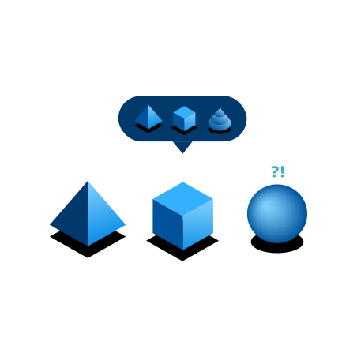

import { Link } from "gatsby";

<BannerQuote
  quote="It appears that autocorrect has become my own worst enema."
  backgroundHighlight="#003A6D"
>

</BannerQuote>

<AnchorLinks>
  <AnchorLink>Overview</AnchorLink>
  <AnchorLink>1) Content hierarchy</AnchorLink>
  <AnchorLink>2) Terminology</AnchorLink>
  <AnchorLink>3) Content that guides users</AnchorLink>
  <AnchorLink>4) Content that helps users if they get stuck</AnchorLink>
  <AnchorLink>5) Formatting and style</AnchorLink>
</AnchorLinks>

## Overview
The content heuristics on this page are provided to help IBM teams develop engaging, user-centered 
content that is consistent within the IBM brand and which helps our clients succeed. 

We’ve grouped the individual heuristics into 5 logical sections, which match to both:
- the product UI sections of the **IBM Experience Standards > <a className="noLinkPadding" href="https://w3.ibm.com/design/experience-standards/content/overview/measure-success">Content</a>** standard, and
- the sections used to assess the **content quality dimension** in our product <a className="noLinkPadding" href="https://pages.github.ibm.com/cdai-design/dux/">D&UX program</a> reviews

### Related education
If you’d like to learn more about these content heuristics and how you can use them in your UX writing, 
then do check out the following education course, which is also structured around these same 5 themes:

<Row className="resource-card-group">
  <Column colMd={4} colLg={4} noGutterSm>
    <ResourceCard
      subTitle="Self-paced online education course"
      title="IBM UX writing course"
      href="https://ibm.biz/ux-writing-course"
    />
  </Column>
</Row>

## 1) Content hierarchy
The navigation structure helps users understand their immediate context and options as well as the broader 
product ecosystem. Page level content hierarchy helps users scan and find information to make decisions 
quickly and easily.

| # | Heuristic | Related links |
| - | --------- | ------------- |
| 1a | It’s always clear to users where they are within the product and how they can navigate to other parts of the product UI. | > <Link to="/content/ia">Information architecture</Link> |
| 1b | Navigation menu items are distinct, logically grouped, and sensibly ordered. | > <Link to="/content/ia#structure-navigation-options-for-clarity">Structure navigation options for clarity</Link> |
| 1c | Navigation labels match page headings (or section headings) that they link to so that there is no disconnect for users between the two. | > <Link to="/content/navigation-labels#match-link-text-to-page-heading">Match link text to page heading</Link> |
| 1d | Where relevant, headings, subheadings, tabs, bullet-point lists, field labels, and so on are used to break up content and to help users quickly scan the page. | > <Link to="/content/ia#methods-for-organizing-content-within-a-page">Methods for organizing content within a page</Link> > <Link to="/content/ia#headings-and-subheadings">Headings and subheadings</Link> |
| 1e | When users need to make a decision, relevant information is clearly presented and suitable primary options are offered. | |

## 2) Terminology
Terminology used is based on a thorough understanding of target users and their existing mental models 
and vocabulary.

| # | Heuristic | Related links |
| - | --------- | ------------- |
| 2a | Terminology used follows IBM guidance — and therefore is consistent with other IBM products. | > <Link to="/content/terminology/approved-terms">Terminology</Link> |
| 2b | Terminology is appropriate to the target audience. Simple terms are used wherever possible and technical and business jargon is avoided. | > <Link to="/content/content-principles#use-simple-terms">Use simple terms</Link> > <Link to="/content/language-and-grammar#use-simple-verb-forms">Use simple verb forms</Link> > <Link to="/content/language-and-grammar#avoid-jargon">Avoid jargon</Link> |
| 2c | Terminology is used consistently throughout the end-to-end experience. | > <Link to="/content/language-and-grammar#use-one-term-per-concept">Use one term per concept</Link> |
| 2d | Where relevant, concepts, labels, features, and processes are defined and explained in context. | |

## 3) Content that guides users
Based on a thorough understanding of target users and what their goals are, content provided is appropriate 
to the user’s level of expertise and directly helps them achieve their goals.

| # | Heuristic | Related links |
| - | --------- | ------------- |
| 3a | Content is pitched at an appropriate level for the target audience. | |
| 3b | Content is used to guide users through common task flows within the UI. | |
| 3c | UI text is predominantly in the active (not passive) voice and is action-orientated. It is focused on helping users achieve their goals (not merely on describing features or technology). | > <Link to="/content/language-and-grammar/#use-the-active-voice">Use the active voice</Link> > <Link to="/content/content-principles#focus-on-user-action">Focus on user action</Link> |
| 3d | Where relevant, tooltips are provided to help users identify icons, reveal details of truncated text, and to offer brief definitions and explanations of important labels and terms. | |
| 3e | Where relevant, contextual help is provided (for example, through learning panels, WalkMe guides, and so on) so that users rarely need to navigate away from the product UI context. | > <Link to="../../walkme/overview/overview">WalkMe guide</Link> |

## 4) Content that helps users if they get stuck
UI content enables users to do self-service troubleshooting for all common problems. While UI panels 
are kept streamlined, additional information is available to users who might want it.

| # | Heuristic | Related links |
| - | --------- | ------------- |
| 4a | Warning messages alert users to the consequences of any unrecoverable actions before they are committed. | |
| 4b | Error messages are clear, avoid blame, and help users get back on track. | |
| 4c | Where a subset of users might reasonably want access to more detailed information than can be offered in-context, appropriate links are provided (for example, to product docs, tutorials, videos, support communities, and so on). | |
| 4d | Product docs are well structured so that they are easy for users to navigate and to find what they are looking for. | |
| 4e | Individual doc pages are concise and clear. Task instructions are easy to follow. | |

## 5) Formatting and style
Content is well structured and is formatted in accordance with our style guidelines — and therefore is 
consistent with other IBM products.

| # | Heuristic | Related links |
| - | --------- | ------------- |
| 5a | UI content follows our content guidelines and is accurate and free from typos. | > <Link to="/content/overview/overview">Content guide</Link> |
| 5b | UI text embodies our desired personality characteristics: engaging, helpful, and conversational. For example, where relevant, welcome messages are used and text in empty states guides users to action. | > <Link to="/content/our-personality">Our personality</Link> |
| 5c | UI body text is comfortable to read (for example, at full screen, text line lengths are between 32-80 characters in length). | > <Link to="/content/content-principles#set-text-line-lengths">Set text line lengths</Link> |
| 5d | Sentence case capitalization is used consistently throughout the UI. (The names of product features and components should **not** be capitalized unless they are sold separately or are trademarked.) | > <Link to="/content/capitalization">Capitalization</Link> |
| 5e | Where relevant, bold or italic formatting (not underlining) is used to emphasize important text. | > <Link to="/content/content-principles#use-appropriate-formatting">Use appropriate formatting</Link> |
| 5f | Navigation labels are concise (typically 1-3 words) and predominantly use nouns (not verbs). | > <Link to="/content/navigation-labels">Navigation labels</Link> |
| 5g | Button labels are concise (typically 1-2 words) and where possible use standard Carbon action labels. | > [Carbon action labels](https://www.carbondesignsystem.com/guidelines/content/action-labels/) |
