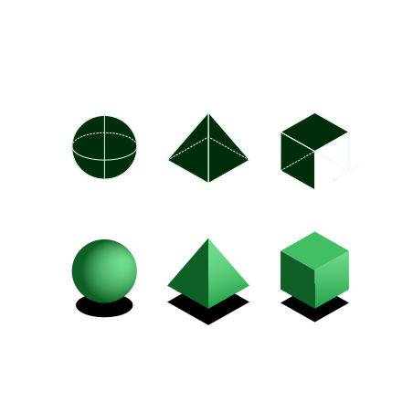
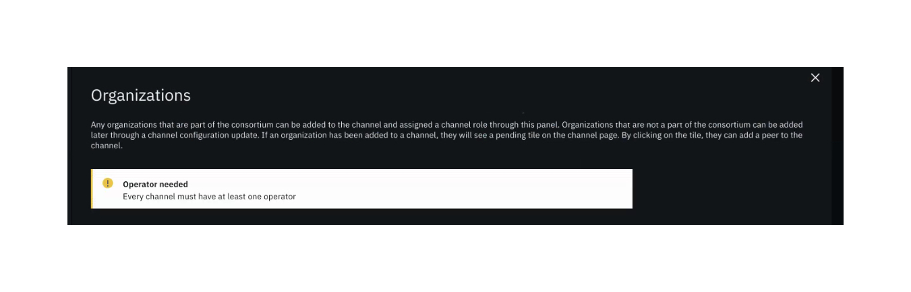

import { Link } from "gatsby";

<BannerQuote
  quote="Easy reading is damn hard writing."
  attribution="Nathaniel Hawthorne"
  backgroundHighlight="#044317"
>

</BannerQuote>

<AnchorLinks>
  <AnchorLink>Show don't tell</AnchorLink>
  <AnchorLink>Focus on user action</AnchorLink>
  <AnchorLink>Speak directly to the user</AnchorLink>
  <AnchorLink>Be clear but concise</AnchorLink>
  <AnchorLink>Use simple terms</AnchorLink>
  <AnchorLink>Be respectful</AnchorLink>
  <AnchorLink>Keep sentences and paragraphs short</AnchorLink>
  <AnchorLink>Set text line lengths</AnchorLink>
  <AnchorLink>Use appropriate formatting</AnchorLink>
</AnchorLinks>

## Show don't tell

The layout, flow, visual design, and microinteractions used in our UIs should all help inform people about how to use our products.
Obviously text has a role to play too, but the presence of lots of explanatory text in a UI should prompt the question:
Is there a better way of conveying this information to the user?

Consider using examples, images, or videos rather than large blocks of text.

## Focus on user action

Like everything we produce, our written content should focus on bringing value to the user.
In general, begin with the user goal (the what), then state how to achieve it.

<Row>
  <Column colMd={4} colLg={4}>
    <DoDontExample
      type="do"
      text="To add a node into your flow, drag the node icon onto the canvas."
      caption="This version speaks directly to the user's goal and is action-orientated."
      aspectRatio="1:1"
    />
  </Column>
    <Column colMd={4} colLg={4}>
    <DoDontExample
      text="Additional nodes can be added to a flow by using the drag and drop functionality within the canvas."
      caption="While this version contains similar information, it focuses more on how the product works, rather
      than on the user's goal. It is also written in the passive voice, which makes it wordier."
      aspectRatio="1:1"
    />
  </Column>
</Row>

## Speak directly to the user

In general, speak directly to the user. Much of the time this will result in using the second person 
pronoun ("you"). This helps create an engaging and conversational tone.

Compare the following examples:
> You can change this setting at any time by going to the Cluster settings page.

> It is possible to change this setting at any time from the Cluster settings page.

While neither version is wrong, the first speaks more directly to the user and provides a warmer, more engaging tone.

#### Addressing the user by name
In contexts such as product UI welcome messages or product generated emails, feel free to address the user by 
name, which adds another level of personalization to the user experience.

<Row>
  <Column colMd={4} colLg={4}>
    <DoDontExample
      type="do"
      text="Welcome back, Jack. Tip: You can create a copy of an existing flow and use it as the starting point for a new flow."
      aspectRatio="1:1"
    />
  </Column>
</Row>

## Be clear but concise

Only cover what is really essential for the user to know. Omit common introductory phrases such as "you must", "due to the fact that", "in order to", and so on.

<DoDontRow>
  <DoDont text="Save changes?" aspectRatio="1:1" />
  <DoDont text="Would you like to save changes?" type="dont" aspectRatio="1:1" />
</DoDontRow>

Remember that you can make supplementary information available via an expandable section, a tooltip, or a “more information” type link.

## Use simple terms

The terminology we use can have a huge impact on the usability of a product, so give this careful consideration.

- ~~In as far as is humanly possible, endeavor to avoid verboseness and tautology in your written communication.~~
  Use simple, clear, direct language.
- See the <Link to="/content/terminology/approved-terms">Terminology</Link> page for common UI terms and action labels.
- Don't invent words or apply new meanings to standard words.
- Know your user and ask yourself what terms and phrases they use then carry out user research to verify the suitability of these terms.
- When you have determined key terms, use them consistently. Don’t use different terms (or variations of the same term) to refer to the same thing.
- Don’t use complex or lengthy words where simpler, shorter equivalents are available.

**Some examples:**

| ✅ Use simple terms | 🚫 Avoid complex words and phrases |
| ------------------- | --------------------------------- |
| before              | prior to                          |
| buy                 | purchase                          |
| end                 | terminate                         |
| extra               | additional                        |
| help                | assist                            |
| if                  | in the event of                   |
| run                 | execute                           |
| start               | commence / initiate               |
| to                  | in order to                       |
| use                 | leverage / utilize                |

## Be respectful

Sometimes users do unexpected things and errors can occur, but we should never blame our users in our product messages.
Instead, focus on how the user can fix the problem.

<DoDontRow>
  <DoDont text="Please check the email address" aspectRatio="1:1" />
  <DoDont text="You’ve entered an incorrect email" type="dont" aspectRatio="1:1" />
</DoDontRow>

## Keep sentences and paragraphs short

Remember that people don't tend to read web content, they scan it. This is especially true when 
people are presented with lots of text. 

- Consider using bulleted or numbered lists instead of presenting the user with blocks of text.
- Keep sentences short. If a sentence is more than 25 words in length, either shorten it or break 
it up into two sentences.
- Similarly, keep paragraphs short and focused. Within a product UI, paragraphs should rarely be 
more than 1 or 2 sentences in length.

## Set text line lengths
If text line lengths are either too short or too long, they become difficult to read. For example, if 
no text line lengths are set and a user has their browser set to full screen, it can become uncomfortable 
to read the text.

<Row>
<Column colMd={8} colLg={8}>

<DoDontExample
  captionTitle=""
  caption=""
  aspectRatio="16:9"
>

</DoDontExample>

</Column>
</Row>

Therefore, in line with the IBM Design Language [comfortable reading guidance](https://www.ibm.com/design/language/typography/type-basics/#comfortable-reading), set 
text line lengths between 32 and 80 characters in length.

<ImageGallery>
<ImageGalleryImage alt="IBM Design" title="IBM Design" col={8}>

</ImageGalleryImage>
</ImageGallery>

<Caption fullWidth>
View this animated video and further details on the <a href="https://www.ibm.com/design/language/typography/type-basics/#comfortable-reading">IBM Design Langauge</a> site.
</Caption>

## Use appropriate formatting

If you want to emphasize a particular word or phrase within a sentence, use _italic_ or **bold** formatting 
(but not both). Do not underline text that is not a link. 

We suggest the following approach to using **bold** and _italic_ formatting:

**To improve scannabililty, use bold formatting**  
Just as headings, subheadings, bullet-point lists, and labels all help users to quickly scan a page 
and identify the most important pieces of information, so emphasizing important words or clauses in 
**bold** helps those words stand out.

**To add reading emphasis, use italic formatting**  
If you want to add emphasis to the _way_ that something is read, use _italic_ formatting.

You may also be interested in the following article: [How to emphasize key words in your text](https://medium.com/@tomwaterton/how-to-emphasize-key-words-in-your-text-b8738f146972).