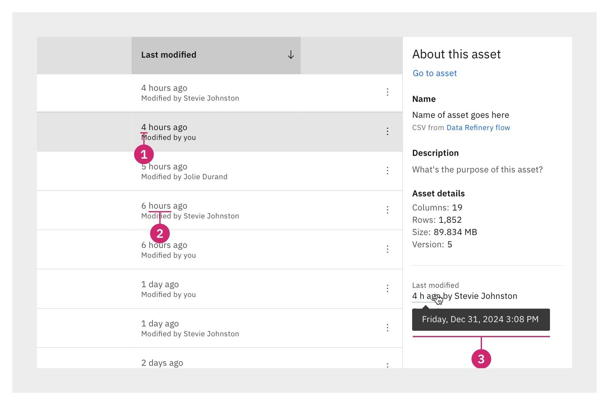
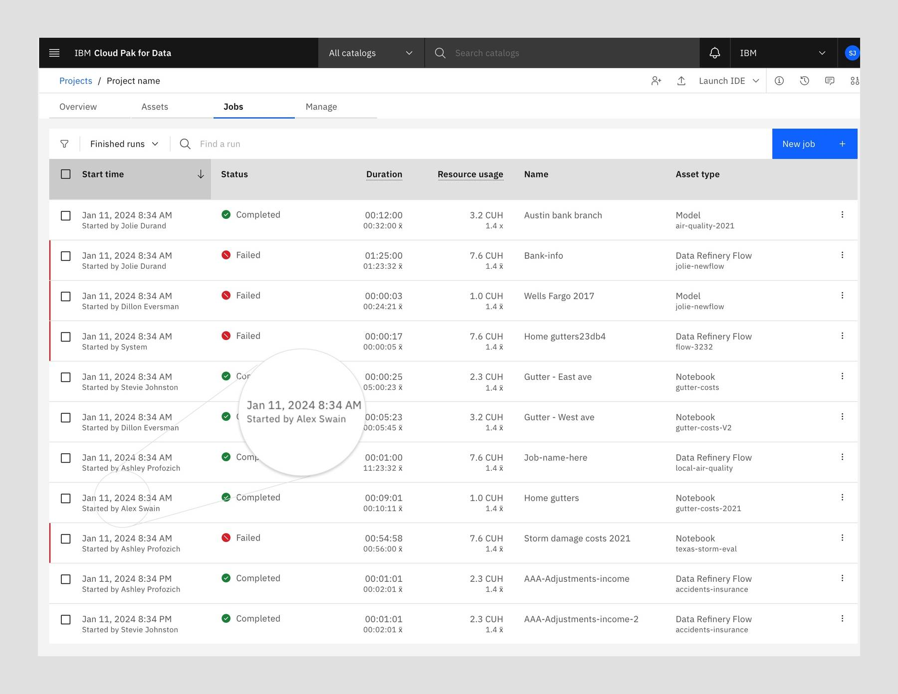

<BannerQuote
  quote="The past, present, and future walked into a bar. It was tense."
  backgroundHighlight="#491D8B"
>

</BannerQuote>

<InlineNotification classname="fixBulletListBug">

**Note:** This date and time guidance was updated in early 2024.  
- It aims to drive greater consistency of date and time formats across IBM products.
- It introduces a relative time format and a date and time tooltip format.
- It also provides additional guidance and examples.

</InlineNotification>

<AnchorLinks>

<AnchorLink>Overview</AnchorLink>
<AnchorLink>Relative time format</AnchorLink>
<AnchorLink>Absolute time format</AnchorLink>
<AnchorLink>Absolute date format</AnchorLink>
<AnchorLink>Absolute date and time format</AnchorLink>
<AnchorLink>Date and time tooltip format</AnchorLink>
<AnchorLink>References</AnchorLink>

</AnchorLinks>

## Overview
This guidance provides standards for five commonly-used product UI date and time formats.

The following summary table shows the five types along with their base format. Further details 
(including permitted variations) are given in the corresponding dedicated sections.

| Type                                                            | Base format                                                             | Examples                      |     |
| --------------------------------------------------------------- | ----------------------------------------------------------------------- | ----------------------------- | --- |
| [Relative time format](#relative-time-format)                   | # &lt;unit&gt; ago  _(See section for permitted variations)_    | 3 minutes ago 2 hours ago |     |
| [Absolute time format](#absolute-time-format)                   | (H)H:MM &lt;AM/PM&gt;  _(See section for permitted variations)_ | 9:30 AM 11:59 PM          |     |
| [Absolute date format](#absolute-date-format)                   | &lt;3-letter month&gt; (D)D, YYYY                                         | Jan 1, 2024 Dec 31, 2024 |     |
| [Absolute date and time format](#absolute-date-and-time-format) | &lt;3-letter month&gt; (D)D, YYYY (H)H:MM &lt;AM/PM&gt;  _(See section for permitted variations)_ | Jan 1, 2024 9:30 AM Dec 31, 2024 11:59 PM |   |
| [Date and time tooltip format](#date-and-time-tooltip-format)   | &lt;Day of the week&gt;, &lt;3-letter month&gt; (D)D, YYYY (H)H:MM &lt;AM/PM&gt;  _(See section for permitted variations)_ | Monday, Jan 1, 2024 9:30 AM Friday, Dec 31, 2024 11:59 PM |   |

## Relative time format

The relative time format (for example, _2 minutes ago_) uses natural language and emphasizes the amount 
of time that has elapsed between an event and the present moment for the user.

Carefully consider whether an absolute time format (for example, _10:23 AM_) or a relative time format 
(for example, _2 minutes ago_) is most suitable for the use case you are designing for.

In general, the relative time format is suited to scenarios where users primarily want to know _how long ago_ 
something happened. For example, when a resource was last edited, or how long a service ticket has been 
open, etc.

### Anatomy
<Row>
  <Column colMd={4} colLg={8}>

  </Column>
</Row>

1. **Number**: A count of the measured unit (for example, _2_ minutes or _4_ hours or _6_ days).
2. **Time unit**: Depending on how much space you have in the UI, the time unit can be written in full (_#&nbsp;minutes ago_) or abbreviated (_#&nbsp;min ago_).
   1. As ever, when you've decided on the most suitable style (standard or abbreviated time units), ensure you apply it consistently within the given context.  
   1. If you use the abbreviated time unit format, ensure you use the correct abbreviations (`min`, `h`, `d`, `wk`, `mo`, `yr`) as defined by [IBM Style](https://ibmdocs-test.dcs.ibm.com/docs/en/ibm-style?topic=measurement-dates-times).  
   1. If you use the abbreviated time unit format, do _not_ add an "s" to indicate plurals.  
3. **Hover tooltip** (optional): Makes the full date and time information available to user on hover via a UI tooltip. See the [Date and time tooltip format](#date-and-time-tooltip-format) section for full details.

<InlineNotification>

It’s not generally necessary or practical to display elapsed time in seconds. Therefore, if less than 
1 minute has elapsed, display the text `Just now` instead of a number and time unit.

</InlineNotification>

### Permitted variations

The time unit can be written in full (_#&nbsp;minutes ago_) or, if space is limited, abbreviated (_#&nbsp;min ago_). 

The following table lists all of the time unit values, their approved abbreviated formats, and explains 
when to use each type.

### Units of time and when to use each type

| Unit   | Description                                                      | Standard format             | Abbreviated format   |
| ------ | ---------------------------------------------------------------- | ------------------------------- | ------------------------ |
| –      | 59 seconds or less                                               | Just now                        | Just now                 |
| Minute | More than 59 seconds, less than 60 minutes                       | 1 minute ago 59 minutes ago | 1 min ago 59 min ago |
| Hour   | More than 59 minutes, less than 24 hours                         | 1 hour ago 23 hours ago     | 1 h ago 23 h ago   |
| Day    | More than 23 hours, less than 7 days                             | 1 day ago 6 days ago        | 1 d ago 6 d ago      |
| Week   | More than 6 days, less than 4 weeks (that is, less than 28 days) | 1 week ago 3 weeks ago      | 1 wk ago 3 wk ago    |
| Month  | More than 3 weeks and 6 days, less than 365 days  _Note that "month" here refers to a 4-week period, not to a named calendar month._ | 1 month ago 11 months ago   | 1 mo ago 11 mo ago   |
| Year   | More than 364 days                                               | 1 year ago 2 years ago      | 1 yr ago 2 yr ago    |

### Product examples

<Row>
  <Column colMd={4} colLg={8}>

<Caption>Example of the relative time format being used in a product UI.</Caption>

<Caption>Example of the relative time format (with abbreviated time units) being used in a product UI.</Caption>

<Caption>Another example of the relative time format (with abbreviated time units) being used in a product UI.</Caption>

  </Column>
</Row>

## Absolute time format
The absolute time format (for example, _9:30 AM_) provides users with a specific time when something 
happened, such as when an object was created or updated or published.

Carefully consider whether an absolute time format (for example, _10:23 AM_) or a relative time format 
(for example, _2 hours ago_) is most suitable for the use case you are designing for.

When using the absolute time format, use the base format (for example, _9:30 AM_) unless users 
are likely to need additional levels of detail in that context.

### Permitted variations

| Variation                                | Format                 | Examples                            |
| ---------------------------------------- | ---------------------- | ----------------------------------- |
| Base format (12-hour time format; hours and minutes only) | (H)H:MM &lt;AM/PM&gt;    | 9:30 AM 11:59 PM                |
| 24-hour time format                      | HH:MM                  | 09:30 23:59                  |
| With seconds                             | _If using the 12-hour time format:_ (H)H:MM:SS &lt;AM/PM&gt;  _If using the 24-hour format:_ HH:MM:SS | 9:30:45 AM 11:59:23 PM  09:30:45 11:59:23 |
| With 2–4 letter time zone abbreviations  | (H)H:MM &lt;AM/PM&gt; &lt;time zone abbreviation&gt;   | 9:30 AM PST 11:59 PM IST        |

Note that the permitted variations shown here can be combined. For example: 
- The base format with seconds and a time zone abbreviation (_9:30:45 AM PST_)
- The 24-hour time format with a time zone abbreviation (_14:30 CET_)
- The 24-hour time format with seconds and a time zone abbreviation (_14:30:12 CET_)
- etc.

### Additional time guidance
**General**
- Wherever possible, keep things simple. That is, don’t provide a greater level of detail than is needed 
simply because you can. For example, only include seconds if users are likely to need that level of precision 
in the given context.
- Use colons to separate hours and minutes (and, if relevant, seconds). Don’t add spaces between the colons 
and the numbers. A couple of correctly written examples:
  - _14:30_
  - _14:30:53_
- To express a time range, use _to_ (not _through_) or use an en dash (–). Do not use a hyphen&nbsp;(-).
- If relevant, show the time zone, using the appropriate internationally recognized [time zone abbreviation](https://en.wikipedia.org/wiki/List_of_time_zone_abbreviations) (such as _PST_ for _Pacific Standard Time_).
- Use the base 12-hour time format or the 24-hour time format as appropriate, but do not mix the two types within the same context.
- If users are likely to want to compare time durations (that is, how long something took) then within a data table the 24-hour time format is useful becasue the leading zero for hours 1–9 means that all hours and minutes (and seconds if relevant) line up vertically. See the [Numbers in data tables](/content/numbers#numbers-in-data-tables) guidance for more details.

**If using the base 12-hour time format**
- Do not add a leading zero before hours 1–9 (_5:30 AM; 5:30 PM_).
- The 12-hour time format always includes AM or PM.
- Use uppercase letters and no periods for the abbreviations AM and PM, and insert a space before these abbreviations (_10:30 AM; 10:30 PM_).
- If showing a time range, include AM or PM in both parts of the time range (_The job ran from 7:30:03 PM to 7:32:12 PM_).

**If using the 24-hour time format**
- Hours are always represented with two digits, so do include a zero before hours 1–9. (_05:30; 17:30_).
- The 24-hour time format runs from 00:00 to 23:59, with 00:00 being midnight and 12:00 being noon.

### Product examples
<Row>
  <Column colMd={4} colLg={8}>

<Caption>Example of the absolute time format being used in a product UI.</Caption>

  </Column>
</Row>

## Absolute date format
For consistency, when displaying an absolute date in a product UI, use the following format:
- `<3-letter month> (D)D, YYYY`
- Examples:
  - Jan 1, 2024
  - Dec 31, 2024

This format avoids the ambiguity that exists when both months and days are represented by numbers, as 
different geographies follow different conventions regarding the order of date elements (see the [Localizing dates](#localizing-dates) section below). 

### Additional date guidance
- Abbreviate the month to its first 3 letters and only capitalize the first letter (for example, write _Jan_, _Feb_, _Mar_ and so on). 
- Do not insert a period after this 3-letter month abbreviation.
- Do not use a leading zero before dates 1-9 of the month (that is, write _Jan 1_ not _Jan 01_).
- Do not use ordinal numerals (that is, numerals that use the abbreviations _st_, _nd_, _rd_, and _th_) to specify a date.
- Always write the year using 4 digits.

### Localizing dates
Remember that different geographies follow different conventions about the order of elements used in dates. 
For example, the following list shows the standard order used in different geographies: 
- month, day, year (United States)
- day, month, year (Europe, South America, and Australia)
- year, month, day (China and Japan)

Therefore, IBM product UIs should localize all date data so that it's displayed to users in the format 
they are used to, based on their location and preferences.

However, for consistency, we recommend that all visual designs (such as product UI mockups in Figma) 
use the United States order (month, day, year) — with the understanding that all date data will be 
correctly localized when the designs are implemented in code.

### Product example
<Row>
  <Column colMd={4} colLg={8}>

<Caption>Example of the absolute date format being used in a product UI.</Caption>

  </Column>
</Row>

## Absolute date and time format
As you might expect, the absolute date and time format is an amalgamation of the absolute date and the 
absolute time formats. 

<InlineNotification classname="fixBulletListBug">

Do read the [absolute time format](#absolute-time-format) and [absolute date format](#absolute-date-format) sections 
above, as the further details provided in each apply to this amalgamated format.

</InlineNotification>

The base format of the absolute date and time format is as follows:
- `<3-letter month> (D)D, YYYY (H)H:MM <AM/PM>`
- Examples:
  - Jan 1, 2024 9:30 AM
  - Dec 31, 2024 11:59 PM

This format is useful in scenarios where users are likely to need precise information — such as when 
needing to distinguish one event from another.

However, do ensure there is a valid reason to show the full date and time information. Don't default to 
using this format if the date or time alone would be sufficient for the use case you are designing for.

### Permitted variations
All of the permitted variations listed in the [absolute time format](#absolute-time-format) section 
also apply here. That is, if there is a valid reason to do so, you may choose to:
- use the 24-hour time format
- include seconds
- include 2–4 letter time zone abbreviations

As ever, ensure you apply one style consistently across a given context.

### Product example
<Row>
  <Column colMd={4} colLg={8}>

<Caption>Example of the absolute date and time format being used in a product UI.</Caption>

  </Column>
</Row>

## Date and time tooltip format
Even in scenarios where you expect the majority of users to only require a simpler date or time format 
(for example, the [relative time format](#relative-time-format)), you may wish to have the full date and 
time details available to any users who do want to access them. If so, the date and time tooltip format is 
a great option as it helps keep the default UI information density lower, while providing a way to 
progressively disclose additional levels of information.

The format of the date and time tooltip is as follows: 
- `<Day of the week>, <3-letter month> (D)D, YYYY (H)H:MM <AM/PM>`
- Examples:
  - Monday, Jan 1, 2024 9:30 AM
  - Friday, Dec 31, 2024 11:59 PM

### Additional guidance
- The day of the week is written in full (with only the first letter capitalized) and followed by a comma.
- The rest of the date and time format follows exactly the base format described in the [absolute time format](#absolute-time-format) 
and [absolute date format](#absolute-date-format) sections above.
- Use the [Carbon definition tooltip](https://carbondesignsystem.com/components/tooltip/usage/#definition-tooltip) component 
to implement this in the product UI.

### Product example
<Row>
  <Column colMd={4} colLg={8}>

<Caption>Example of the date and time tooltip format being used in a product UI.</Caption>

  </Column>
</Row>

## References
- IBM Style > [Dates and times](https://ibmdocs-test.dcs.ibm.com/docs/en/ibm-style?topic=measurement-dates-times) (requires an IBM login).
- Carbon for IBM Products > [Numbers in data tables](/content/numbers#numbers-in-data-tables) guidance.
- Carbon Design System > [Tooltip](https://carbondesignsystem.com/components/tooltip/usage/) component.

### Contributors
- Stevie Johnston
- Tom Waterton
