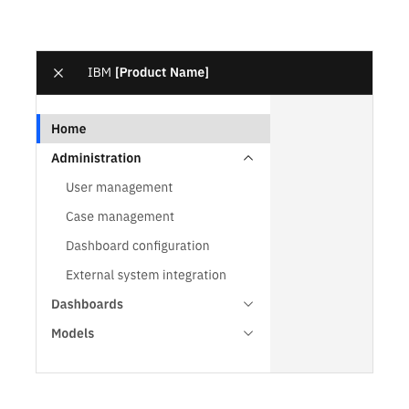

import { Link } from "gatsby";

<BannerQuote
  quote="I think, therefore IA." 
  backgroundHighlight="#004144"
>

</BannerQuote>

<AnchorLinks>
  <AnchorLink>Overview</AnchorLink>
  <AnchorLink>Use the Carbon UI shell components</AnchorLink>
  <AnchorLink>Structure navigation options for clarity</AnchorLink>
  <AnchorLink>Using breadcrumbs</AnchorLink>
  <AnchorLink>Headings and subheadings</AnchorLink>
  <AnchorLink>Methods for organizing content within a page</AnchorLink>
</AnchorLinks>

## Overview
It’s hard to overstate the importance of a product’s information architecture (IA). Here are some of 
the benefits that having a well-structured IA has for our users:

- Reduces cognitive load
- Speeds up the process of finding information
- Makes it easier to stay focused on the task at hand
- Improves understanding of an offering and the relationships between its parts

In short, the less time and effort our customers have to spend searching for information or learning how 
to use a product, the quicker they can achieve their goals.

Information architecture can mean different things, depending on your context. Here we're focused on IA 
defined as the synthesis of organization, labeling, search, and navigation systems. This covers product-level 
IA (such as navigation menus and breadcrumbs) and page-level IA (such as the use of headings, subheadings, 
bulleted lists, and so on).

<!-- START OF NEXT MAJOR SUB-SECTION -->
## Use the Carbon UI shell components
Cloud & Cognitive products should be using common Carbon components to build their UIs. This includes 
using the Carbon [UI shell header](https://www.carbondesignsystem.com/components/UI-shell-header/usage) and 
the [UI shell left panel](https://www.carbondesignsystem.com/components/UI-shell-left-panel/usage/) for navigation.

<Row>
<Column colLg={8}>

<Caption>The Carbon UI shell header and optional left and right panels.</Caption>
</Column>
</Row>

The Carbon UI shells provide our customers with a consistent navigation and help experience and a common 
set of interaction patterns that persist between and across products.

> The UI shell header is the foundation for navigating and orienting your user to the UI. The UI shell 
header can be used by itself or combined with the UI shell left and right panels for more complex UI navigation.

See the Carbon [UI shell header](https://www.carbondesignsystem.com/components/UI-shell-header/usage) and 
the [UI shell left panel](https://www.carbondesignsystem.com/components/UI-shell-left-panel/usage/) components 
for further details.

### Further guidance for products that are surfaced within larger offerings

If you work on a product that is surfaced within one of the Cloud Paks or Platforms, then you'll need to 
work with other product teams to ensure that your combined IA entries work together in the broader context. 

For example, you'll need to work together to ensure that:
- all navigation labels are being used consistently across the various parts of the larger offering
- individual navigation labels fit into logical group headings within the IA of the larger offering
- individual navigation labels follow the same structure (for example, are all noun-based)

As IBM moves from having hundreds of individual software offerings (each with its own IA) to focusing on 
a small number of Paks and Platforms composed of different services, many existing product teams will need 
to adjust their IA models and labels. The priority is to deliver Paks and Platforms with exemplary user 
experiences, and we'll all need to be pragmatic and make compromises to achieve this goal.

<InlineNotification>
<strong>Note:</strong> Some portfolios have additional navigation guidelines: 
— <a href="https://pages.github.ibm.com/automation-base-pak/abp-playbook/cartridges/navigation/navigation/">IBM Automation Foundation navigation guidance</a> 
— <Link to="/cloud-paks/navigation/usage/">Cloud Pak navigation guidance</Link>
</InlineNotification>

<!-- START OF NEXT MAJOR SUB-SECTION -->
## Structure navigation options for clarity
Once you've got your UI shells, you'll want to populate them with navigation options that represent 
where people can go and what they can do.

The following guidance applies to any navigation that presents users with a set of options, whether that 
be a global header, a panel menu, a footer, or any other UI pattern. See also <Link to="/content/navigation-labels">Navigation labels</Link>.  

### a) Make distinctions clear between navigation options
Users will experience confusion and cognitive stress if they encounter multiple options that appear too 
similar. When users can't tell which choice will move them closer to completing their task, the experience 
becomes a guessing game. Here are 3 ways to minimize fuzziness:
- **Evaluate menu choices as a holistic set.** Review specifically for potential points of confusion and overlap. 
Ask: "How else might someone interpret this?" Although more than one navigational path might be valid, the 
key is whether your user is confident about where they're going and that the destination matches expectations.
- **Front-load your labels.** By starting labels with the most important information, we optimize for how 
people scan text. This also helps avoid repetition, which can make options less readily distinct.
- **Beware overused terms.** For example, there's a tendancy in enterprise software to include terms such as 
"Manage", "Configure", and "Customize" in navigation labels, but often these terms aren't really needed. 
(After all, almost anything can be managed / configured / customized in some way — and that's exactly what 
most of our UI pages let the user do.) In short, if a word can be omitted, leave it out.

<Row>
  <Column colMd={4} colLg={4}>

<DoDontExample
type="do"
captionTitle=""
caption=""
>

</DoDontExample>

  </Column>
  <Column colMd={4} colLg={4}>

<DoDontExample
  type="dont"
  captionTitle=""
  caption=""
  >

</DoDontExample>

  </Column>
</Row>

Finally, remember that navigation labels should predominantly use <strong>nouns</strong>. See <Link to="/content/navigation-labels#grammar-and-structure">Navigation labels > Grammar and structure</Link>.

### b) Organize options into groups
Dividing your navigation options into groups or sections can make your product's IA more scannable, 
understandable, and clear.
- **Consider grouping if a navigation menu becomes longer than 6–8 items.** This is more art than science and will depend on your content and your audience. But a list of more than 6–8 options might benefit from merging or grouping.
- **Make sure the boundary between one group and another is unmistakable.** A boundary so subtle as to be invisible will defeat the purpose. 
- **Don't create groups that have only 1 item.**

<Row>
  <Column colMd={4} colLg={4}>

<DoDontExample
type="do"
captionTitle=""
caption=""
>

</DoDontExample>

  </Column>
  <Column colMd={4} colLg={4}>

<DoDontExample
  type="dont"
  captionTitle=""
  caption=""
  >

</DoDontExample>

  </Column>
</Row>

These are good principles for any product IA to follow. However, we do acknowledge that for those delivering 
services surfaced within one or more of the Cloud Paks or Platforms, the highly composable nature of these 
offerings means that different customers will buy and use different capabilities, which will result in users 
seeing different combinations of items listed in the navigation menu. Focus on designing for the most likely use cases.

### c) Order options with intent
The order in which things appear can influence not only how a product is used but also how it is understood.
- **Pay attention to order.** Whatever you do, be intentional. Discuss with your offering team a rationale for the order of options throughout your IA.
- **Organize by logic that fits for your audience and product.** Common approaches include:
  - By importance: Descending order starting with the most important options.
  - By sequence: Present options chronologically or according to a linear flow (for example: _Prepare data_ might be ordered before _Build model_).
  - By frequency of use: Place items that are likely to be used regularly above those that are likely to be used less regularly.

<!-- START OF NEXT MAJOR SUB-SECTION -->
## Using breadcrumbs
Breadcrumbs show users their current location relative to the information architecture and enable them 
to quickly move up to a parent level or previous step.

The Carbon [Breadcrumb](https://www.carbondesignsystem.com/components/breadcrumb/usage) component supports 
two types of breadcrumbs:
- **location-based:** based on the product IA and hierarchy
- **path-based:** showing the path the user took to get to the current page  

<InlineNotification>
Note that the location-based (that is, hierarchical) type of breadcrumb is the type used in nearly all cases across Cloud & Cognitive offerings.
</InlineNotification>

#### Main principles and structure
- Breadcrumbs are made up of two elements: page links and separators.
- Start with the highest level parent page and move deeper into the information architecture as the breadcrumb trail progresses.
- By default, the current page is _not_ listed in the breadcrumb trail.
- Therefore, unless there is a good reason to deviate from the default, the final entry in the breadcrumb trail should be to the parent of the current page.
- Breadcrumb page links should match the page titles they link to. Avoid adding additional words, for example: _Back to &lt;page title&gt;_.  

<Row>
  <Column colMd={8} colLg={8}>
    

      
&lt;parent page name&gt; /

      
&lt;grandparent page name&gt; / &lt;parent page name&gt; /

    

  </Column>
</Row>

#### Capitalization
Breadcrumbs, like all other text in the UI, should <Link to="/content/capitalization#use-sentence-case-capitalization">use sentence style capitalization</Link>. 
(If your navigation labels and page titles follow our capitalization guidance, then they will already be presented in this way in your UI.) Examples:
<Row>
  <Column colMd={8} colLg={8}>
    

      
Connectors / J2EE connectors /

      
User management / Access groups /

    

  </Column>
</Row>

However, if the breadcrumb contains any user-generated strings, then display those strings exactly as the user 
entered them. In the following examples, the final part of each breadcrumb contains a user-generated string:
<Row>
  <Column colMd={8} colLg={8}>
    

      
User management / Access groups / acme_devs /

      
User management / Access groups / ACME_ADMINS /

    

  </Column>
</Row>

#### Truncating breadcrumbs
If your page hierarchy is deep or your page titles are lengthy, then you may need to truncate the breadcrumb 
text. See the Carbon guidance regarding [breadcrumb overflow content](https://www.carbondesignsystem.com/components/breadcrumb/usage#overflow-content) for 
guidance on how best to do this.

#### Breadcrumbs and back buttons
Do not add a custom "Back" button or "Back" link to your breadcrumb navigation. Breadcrumbs already have a well-established 
usage pattern (pages are listed as links in hierarchical order). Plus, all browsers have an explicit back button 
so there is no need to add an additional one.

<!-- START OF NEXT MAJOR SUB-SECTION -->
## Headings and subheadings
Page or panel headings help users to quickly understand what a page or panel is about. Where relevant, 
additional subheadings can be used to further help users identify sections within a page or panel.

#### Keep headings short
- Headings and subheadings work best when they are kept short. 
- Remember that you don’t need to write in full sentences; short phrases of just a few words often make for good headings.
- The Carbon for Cloud & Cognitive <Link to="../../components/page-header/usage/">Page header</Link> component provides the following guidance: 
  - Page headings should generally not exceed 56 characters
  - Page titles should remain on a single line instead of wrapping to multiple lines
  - Use truncation for titles that must exceed the 56 character count or appear in contexts with narrow widths. If you do use truncation, provide a tooltip so that the full page title is available on hover.

#### Be consistent
Your heading or subheadings should following a consistent structure. Some of the most popular structures are 
nouns or verb phrases.  

#### Headings and periods
In general, don’t use periods in headings and subheadings as these are typically made up of short phrases, not complete sentences. 
See <Link to="/content/punctuation#periods">Punctuation > Periods</Link> for more details.

#### The use of question formats
In general, avoid question formats. This is because shorter headings are preferable and question 
format headings can nearly always be shortened if re-written not as questions. Consider the following examples:

<DoDontRow>
  <DoDont text="Operator benefits" aspectRatio="" />
  <DoDont text="What are the benefits of using operators?" type="dont" aspectRatio="" />
</DoDontRow>

<DoDontRow>
  <DoDont text="Kubernetes cluster configuration" aspectRatio="" />
  <DoDont text="How to best configure a Kubernetes cluster?" type="dont" aspectRatio="" />
</DoDontRow>

<DoDontRow>
  <DoDont text="Trial duration" aspectRatio="" />
  <DoDont text="When will my free trial end?" type="dont" aspectRatio="" />
</DoDontRow>

Using non-question format headings also enables you to place the most important words at the beginning of 
the heading (as opposed to question format headings, which necessarily start with _How..._, _Why..._, _What..._, and so on). 
This is significant because users will often scan the page for a particular keyword, and so front-loading 
your heading with a keyword (as in the non-question format examples above) helps users find what they are looking for quicker. 

#### Exceptions
There are a couple of valid exceptions to this general guidance:
1. If you are intentionally wanting to emulate a conversational style interaction between the system and the user, such as in a chatbot dialog.
1. In a confirmation dialog when you are intentionally wanting the user to have to sit up and think quite deliberately about what they really intend to do.

<Row>
  <Column colMd={6} colLg={6}>

<DoDontExample
type="do"
captionTitle=""
caption=""
>

</DoDontExample>

  </Column>
</Row>

<!-- START OF NEXT MAJOR SUB-SECTION -->
## Methods for organizing content within a page
People use our products to get specific tasks done and we should focus on providing enough information 
to help them succeed, without turning our product UIs into documentation manuals. 

In scenarios where there is a lot of information to convey, consider how the information architecture can 
support quick scanning of the content. The following devices can all help with this:
- use headings and subheadings to help users scan and jump to sections
- consider whether an illustration or animation might better convey the information
- use bulleted or numbered lists in place of large blocks of text
- use tooltips to progressively disclose non-essential information
- and remember to <Link to="/content/content-principles#keep-sentences-and-paragraphs-short">keep sentences and paragraphs short</Link>

The following UI elements can also help break up large sections of content into more manageable sections:

### Using tabs
Tabs allow users to navigate easily between views within the same context. They are good for scenarios where 
you have a number of sub-items that are hierarchical peers of one another. For example, in an online shopping 
scenario, a given product could have the following tabs: "Product specification", "Customer reviews", and "Returns policy".

See the Carbon [Tabs](https://www.carbondesignsystem.com/components/tabs/usage) component for more details.

### Using an accordion
Accordions are similar to tabs, but are vertically stacked in expandable sections. Similar to tabs, accordions 
organize related information into peer sections, which can be expanded. Accordions are well suited to scenarios 
where space is at a premium and the content contained is supplimentary rather than crucial for users to read.

See the Carbon [Accordion](https://www.carbondesignsystem.com/components/accordion/usage) component for more details.

### Using a content switcher
Content switchers allow users to toggle between alternate views of similar or related content. Note that only one 
content section is ever visible at a time.

Content switchers are often used to enable users to toggle between different visual representations of the 
same information, such as between a table view and a details view. 
They are also often used to narrow (filter) content groups. For example, use a content switcher if you have a single category, 
such as “Email” and you want to divide it into views such as “All”, “Read”, and “Unread”.

See the Carbon [Content switcher](https://www.carbondesignsystem.com/components/content-switcher/usage) component for more details.

### Using tiles
Carbon offers a highly flexible tile component that can be used to display a wide variety of content, including 
getting started information, how-to content, next steps, and more. Carbon tiles can be read-only or clickable. Tiles are commonly 
used on product welcome pages and in scenarios where the user needs to select a plan, tier, or asset type. 

See the Carbon [Tile](https://www.carbondesignsystem.com/components/tile/usage) component for more details.

### Using a side panel
The Carbon for Cloud & Cognitive site offers a side panel, which is useful for scenerios where the user 
needs to see both the main page content and the panel information at the same time. Side panels can help 
users perform actions such as editing tables, creating objects, filtering, or referencing details without 
leaving the main page context. 

See the Carbon for Cloud & Cognitive [Side panel](https://pages.github.ibm.com/cdai-design/pal/components/side-panel/usage) component for more details.
