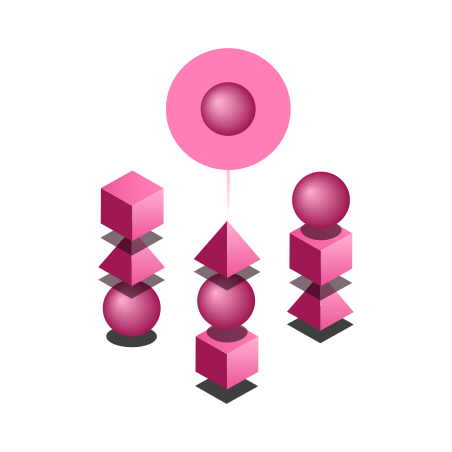

import { Link } from "gatsby";

<BannerQuote
  quote="One day I will find the right words, and they will be simple." 
  attribution="Jack Kerouac"
  backgroundHighlight="#740937"
>

</BannerQuote>

<AnchorLinks>
  <AnchorLink>Words matter</AnchorLink>
  <AnchorLink>Who this guide is for</AnchorLink>
  <AnchorLink>A guide, not a ball and chain</AnchorLink>
  <AnchorLink>We need your input</AnchorLink>
</AnchorLinks>

## Words matter

How we say things is often just as important as what we say. We want our IBM Software products 
to express some personality, and the words we use in our written material are key to creating 
this personality.

When we consistently use a particular voice and tone, people will tend to associate certain qualities 
with us. Consistent voice and tone are crucial for connecting and resonating with users. 

What's the difference between voice and tone? One way to think about it is that voice is always 
consistent, but tone often changes depending on context.

### Voice

Voice is the foundation for communicating about IBM products and delivering brand messages. At IBM, 
our voice expresses the core of our personality, while bringing comfort, ease, and a sense of 
connection to our users. Through careful use of the IBM voice, we help empower users to meet their 
business goals.

### Tone

Tone conveys an attitude toward both the subject matter and the reader. All content — whether it's 
introductory text in the user interface (UI), an error message, or a topic in the docs — tells part 
of a bigger story. Good storytellers are skilled in two main areas: what they are saying (the substantive 
content) and how they say it to any given audience (the style and tone in which it is presented). 
Be a good storyteller.

## Who this guide is for
All product teams at IBM are now invited to use this content guide. 

It was originally written by and for the IBM Software Design org, which covers the following product portfolios:
- AI Applications
- Blockchain
- Business Analytics
- Business Automation
- Cloud Integration
- Cloud Platform
- Information Management
- Security
- Watson AI

## A guide, not a ball and chain
Like our other design resources, the intent is for this content guide to become part of our shared 
vocabulary, helping us sustain a level of flair and consistency across all that we do.

As such, this content guide provides us with a common starting point. It helps set some 
practical parameters to keep us consistent, but there is still plenty of scope for creativity. 
As designers, our primary aim is to delight our users, not to comply with a long list of rules. 
So this is a guide, not a ball and chain.

## We need your input
We want this guide to be useful and to be used. So please do help us to help you.

If you have a question or suggestion about how we could further improve this guide, 
please contact our Content Design Lead [Tom Waterton](https://ibm-casdesign.slack.com/archives/D1ZKKC3CL) or [open an issue](https://github.ibm.com/CDAI-design/pal/issues) in our GitHub repo. 

We look forward to hearing from you.
