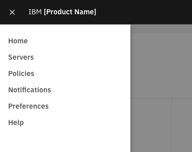
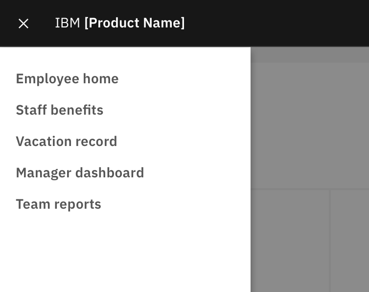
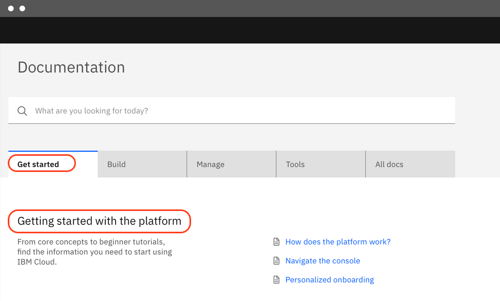

import { Link } from "gatsby";

<BannerQuote
  quote="If a word in the dictionary were misspelled, how would we know?"
  backgroundHighlight="#003A6D"
>

</BannerQuote>

<AnchorLinks>
  <AnchorLink>Grammar and structure</AnchorLink>
  <AnchorLink>Match link text to page heading</AnchorLink>
  <AnchorLink>Capitalization</AnchorLink>
  <AnchorLink>Punctuation and symbols</AnchorLink>
  <AnchorLink>Using abbreviations</AnchorLink>
  <AnchorLink>Use of pronouns</AnchorLink>
</AnchorLinks>

## Grammar and structure

People use UI navigation links to get to a certain place within the product, so navigation labels should 
predominantly use **nouns**. 

(By contrast, people use buttons to perform actions — to add, to edit, to delete, and so on — 
and so button labels use **verbs**. See <Link to="/content/button-labels">Button labels</Link> for more details.)

But back to navigation labels... Of course, sometimes a noun alone is not sufficient. In such cases use an adjective to clarify the noun.

<Row>
  <Column colMd={4} colLg={4}>

<DoDontExample
type="do"
captionTitle=""
caption=""
>

</DoDontExample>

  </Column>
  <Column colMd={4} colLg={4}>

<DoDontExample
  type="do"
  captionTitle=""
  caption=""
  >

</DoDontExample>

  </Column>
</Row>

Use as few words as possible, but remain clear. If your navigation labels are more than three or four words, see if you can shorten them.

<DoDontRow>
  <DoDont text="Support" aspectRatio="2:1" />
  <DoDont text="Getting support" type="dont" aspectRatio="2:1" />
</DoDontRow>

<DoDontRow>
  <DoDont text="Settings" aspectRatio="2:1" />
  <DoDont text="Configuring your settings" type="dont" aspectRatio="2:1" />
</DoDontRow>

<DoDontRow>
  <DoDont text="Appliance dashboard" aspectRatio="2:1" />
  <DoDont text="Appliance management and monitoring dashboard" type="dont" aspectRatio="2:1" />
</DoDontRow>

## Match link text to page heading
In most cases, navigation labels should match the heading of the page that they link to (or the subheading, 
if they link to an anchor section within a page). 

Users can find it confusing if the page that opens has a heading that does not match the link text that 
they clicked on (and perhaps even question whether they clicked the correct link). To avoid this potential 
confusion, match navigation labels with their corresponding page headings.

#### Exception: Tab labels and tab body headings
Tab labels are a type of navigation label in that they take the user to a given place within the product 
(a specific tab in this case), but they differ from other navigation links in that they remain visible 
to the user after they have been clicked. This means that the relationship between the link text (the tab label) 
and the corresponding content that loads (the tab body) is unambiguous because the two are shown together 
in the same context. For this reason, tab labels and tab body headings don’t have to use identical text.

<Row>
<Column colMd={8} colLg={8}>
<DoDontExample
  type="do"
  captionTitle=""
  caption="A valid example where the tab label and tab body heading differ."
  aspect ratio="16:9"
>

</DoDontExample>
</Column>
</Row>

## Capitalization

Use sentence case capitalization for all navigation labels.  
See the <Link to="/content/terminology/approved-terms">Terminology</Link> page for more details.

<DoDontRow>
  <DoDont text="User groups" aspectRatio="2:1" />
  <DoDont text="User Groups" type="dont" aspectRatio="2:1" />
</DoDontRow>

## Punctuation and symbols

Don’t use periods, ellipses, or other symbols in navigation labels.

<DoDontRow>
  <DoDont text="Docs" aspectRatio="2:1" />
  <DoDont text="Docs." type="dont" aspectRatio="2:1" />
</DoDontRow>

<DoDontRow>
  <DoDont text="Preferences" aspectRatio="2:1" />
  <DoDont text="Preferences..." type="dont" aspectRatio="2:1" />
</DoDontRow>

<DoDontRow>
  <DoDont text="Users and groups" aspectRatio="2:1" />
  <DoDont text="Users & groups" type="dont" aspectRatio="2:1" />
</DoDontRow>

## Using abbreviations

Feel free to use common software navigation label abbreviations such as _admin_, _app_, _docs_, _org_, and so on 
but avoid using less well-established abbreviations. If you do use an abbreviation, don’t add a period.

As always, consistency is key, so if you are going to use an abbreviation (for example, _apps_) then ensure 
that it is used throughout your product experience.

<DoDontRow>
  <DoDont text="Published apps" aspectRatio="2:1" />
  <DoDont text="Org settings" aspectRatio="2:1" />
</DoDontRow>

<DoDontRow>
  <DoDont text="Admin console" aspectRatio="2:1" />
  <DoDont text="Admin. console" type="dont" aspectRatio="2:1" />
</DoDontRow>

<DoDontRow>
  <DoDont text="KPI dashboard" aspectRatio="2:1" />
  <DoDont text="KPI dash" type="dont" aspectRatio="2:1" />
</DoDontRow>

<DoDontRow>
  <DoDont text="Kubernetes settings" aspectRatio="2:1" />
  <DoDont text="K8s settings" type="dont" aspectRatio="2:1" />
</DoDontRow>

## Use of pronouns

In general, avoid using pronouns (for example, _My apps_, _Your apps_, and so on) in navigation labels, except where it’s really necessary.
For example, in some contexts it might be necessary to distinguish between the user’s own assets (for example, _My expenses_) and assets belonging to individuals whom they manage (for example, _Team expenses_).

For more information see the article [Is this my interface or yours?](https://medium.com/@jsaito/is-this-my-interface-or-yours-b09a7a795256)

