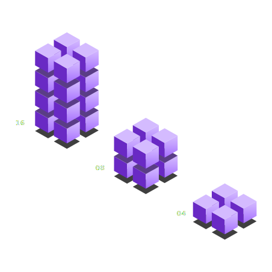
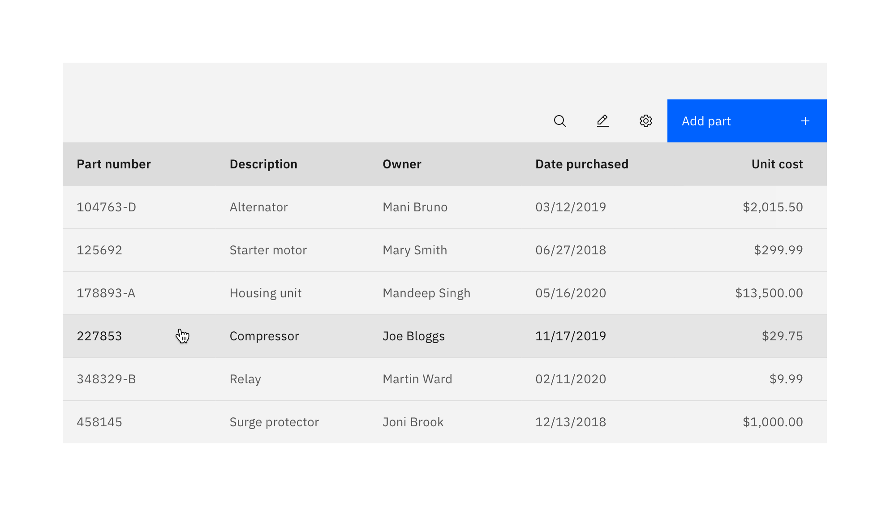
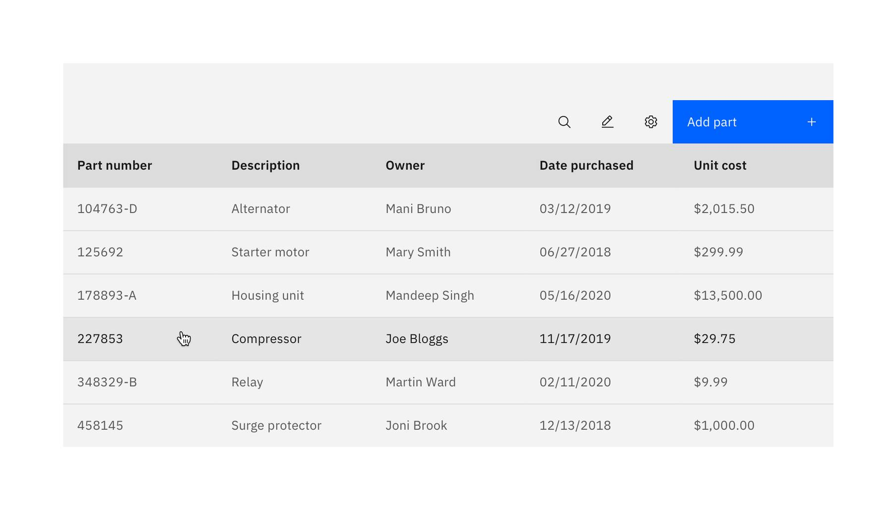

import { Link } from "gatsby";

<BannerQuote
  quote="I will be forever disappointed that the collective noun for squids is not squad."
  backgroundHighlight="#491D8B"
>

</BannerQuote>

<AnchorLinks>

<AnchorLink>Numerals</AnchorLink>
<AnchorLink>Numbers in data tables</AnchorLink>
<AnchorLink>Dates</AnchorLink>
<AnchorLink>Time</AnchorLink>
<AnchorLink>Currency</AnchorLink>

</AnchorLinks>

## Numerals

For all UI content, save screen space and use numerals in place of words for numbers.

<DoDontRow>
  <DoDont text="You can add up to 8 connectors" aspectRatio="" />
  <DoDont text="You can add up to eight connectors" type="dont" aspectRatio="" />
</DoDontRow>

When writing large numbers, use commas for thousand separators (for example, 2,000 and 19,500 and 500,000).

## Numbers in data tables

By default, the Carbon [data table](https://www.carbondesignsystem.com/components/data-table/usage) component 
left-aligns all data. For most data, this is appropriate.

**An example Carbon data table:**

However, when there are numeric values in the data table that represent totals that users might likely 
want to compare, it's easier for them to do so when the numbers are right-aligned so that the units, 
tens, hundreds, and so on line up.

In such cases, the data values should be formatted as numbers (integers) and right-aligned. Remember to 
also use thousand separators for numbers above 999.

**Correct example:**  
_(Here the cost data has been right-aligned, making it easier to compare values.)_
<Row>
<Column colMd={8} colLg={8}>

<DoDontExample
type="do"
captionTitle=""
caption=""
>

</DoDontExample>

</Column>
</Row>

**Incorrect example:**  
_(Here the cost data hasn't been right-aligned, meaning that it's harder to compare values.)_
<Row>
<Column colMd={8} colLg={8}>

<DoDontExample
type="don't"
captionTitle=""
caption=""
>

</DoDontExample>

</Column>
</Row>

Examples of numbers used in data tables that should be right-aligned:
* cost
* time duration
* number of people
* number of resources
* anything else where the numberals represent totals

Examples of numbers used in data tables that should use the default (left-aligned) formatting: 
* dates (even when written as numerals)
* numerals which are not comparative (for example, identification numbers such as employee IDs or machine serial numbers)

## Dates

> In visual designs use US formats for any example dates and times shown — but do ensure that all 
data is correctly localized when the designs are built in code.

In your product UI, be sure to localize all date and time data so that it will be displayed to your 
users in a format that conforms to their culture. 

For example, localization of dates will result in the following formats being displayed:

- Month, Day, Year (United States)
- Day, Month, Year (Europe, South America, Australia)
- Year, Month, Day (China and Japan)

There are multiple valid short and long date formats. Be sure to pick the most suitable format for your context, and be consistent. 

Date component guidance:

- **Day**: If relevant, the day of the week can be included and displayed in full (_Monday_) or abbreviated to the first 3 letters (_Mon_).
- **Date**: The numerical date within the month (_1–31_). Don’t use abbreviations such as _st_, _nd_, _rd_, or _th_ for the day of the month.
- **Month**: Can be displayed in numbers (_1–12_) or written out in full (_September_) or abbreviated to the first 3 letters (_Sep_).
- **Year**: Displayed in 2 digits (_20_) or 4 digits (_2020_).

<InlineNotification kind="warning">
Remember that when writing date or number ranges, an en dash (–) should be used, not a hyphen (-).
</InlineNotification>

Examples of date formats localized for different regions:

| Region: US                | Region: UK              |
| ------------------------- | ----------------------- |
| 9/6/19                    | 06/09/19                |
| 9/6/2019                  | 06/09/2019              |
| Sep 6, 2019               | 06 Sep 2019             |
| Mon, Sep 6, 2019          | Mon 6 Sep 2019          |
| Monday, September 6, 2019 | Monday 6 September 2019 |

## Time

> In visual designs use US formats for any example dates and times shown — but do ensure that all 
data is correctly localized when the designs are built in code.

In your product UI, be sure to localize all date and time data so that it will be displayed to your 
users in a format that conforms to their culture. 

Time format guidance:

- Use colons to separate the different time units (_14:30_). Don’t add spaces between the colons and the numbers.
- The 12-hour time format always includes AM or PM — with a space between the digits and the AM or PM (_5:30 AM; 5:30 PM_).
- The 24-hour time format is always shown using 4 digits (_05:30; 17:30_).
- The 24-hour time format runs from 00:00 to 23:59, with 00:00 being midnight and 12:00 being noon.
- To express a time range, use _to_ or use an en dash. Don’t use _through_. For 12-hour time formats, include AM or PM in both parts of the time range (_The job ran from 7:30:00 PM to 7:32:12 PM_).
- If relevant, show the time zone, using the appropriate internationally recognized [time zone abbreviation](https://en.wikipedia.org/wiki/List_of_time_zone_abbreviations) (such as _PST_ for _Pacific Standard Time_).

Examples of time formats localized for different regions:

| Region: US     | Region: UK   |
| -------------- | ------------ |
| 7:08 AM        | 07:08        |
| 7:08 PM        | 19:08        |
| 7:08:09 AM     | 07:08:09     |
| 7:08:09 AM PST | 07:08:09 PST |

## Currency

Currency format guidance:

- Use a currency symbol, followed by the amount (for example, _$1,000_).
- Then leave a space and display the appropriate internationally recognized [ISO 4217 currency code](https://en.wikipedia.org/wiki/ISO_4217#Active_codes) (such as _USD_ for _US dollars_).
- Don’t abbreviate a number to a letter, such as writing the letter K for _thousand_, or the letter 
M for _million_.

<DoDontRow>
  <DoDont text="$100 USD; $100 AUD; £100 GBP; €100 EUR" aspectRatio="" />
</DoDontRow>

<DoDontRow>
  <DoDont text="The contract is worth $4 million USD" aspectRatio="" />
  <DoDont text="The contract is worth USD 4M" type="dont" aspectRatio="" />
</DoDontRow>

<DoDontRow>
  <DoDont text="The contract is worth $4,000,000 USD" aspectRatio="" />
  <DoDont text="The marketing campaign cost USD 18K" type="dont" aspectRatio="" />
</DoDontRow>