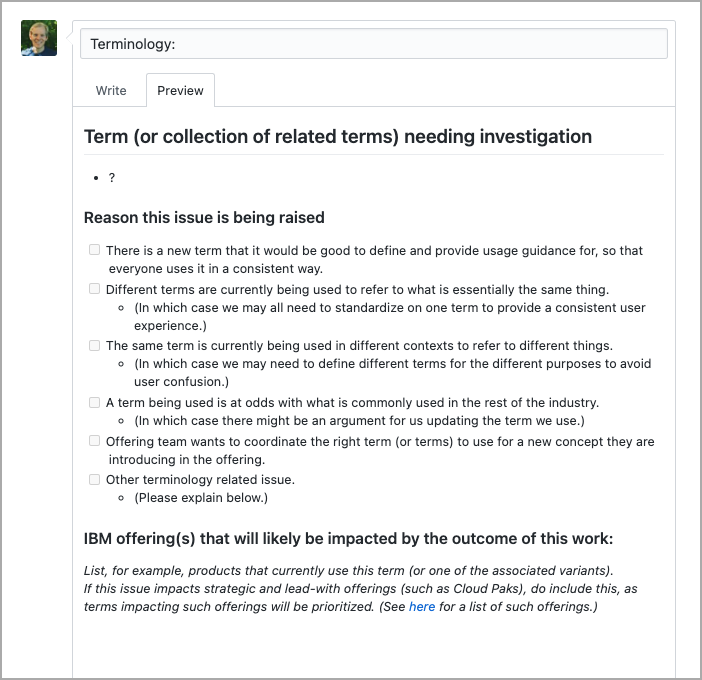

import { Launch16 } from '@carbon/icons-react';
import { Link } from "gatsby";

<InlineNotification kind="info">

This information was last updated on June 24, 2021.

</InlineNotification>

<PageDescription>

  How to raise and contribute to terminology issues.

</PageDescription>

<AnchorLinks small>
  <AnchorLink>Overview, scope, and purpose</AnchorLink>
  <AnchorLink>Process for Cloud Pak related terminology issues</AnchorLink>
  <AnchorLink>Process for all other terminology issues</AnchorLink>
  <AnchorLink>Related links</AnchorLink>
</AnchorLinks>

## Overview, scope, and purpose
Terminology is an almost infinite topic and we are **not** trying to cover it all!

Instead, we are focused on providing guidance the most common UI terms and the most important concepts 
within our offerings.

Note that the process for raising a terminology issue varies depending on whether it impacts any of 
the Cloud Paks or not:
- [Process for Cloud Pak related terminology issues](#process-for-cloud-pak-related-terminology-issues)
- [Process for all other terminology issues](#process-for-all-other-terminology-issues)

## Process for Cloud Pak related terminology issues
There is a cross-IBM effort to improve consistency across all of our Cloud Paks.

As part of this broader initiative, there is a **Cross Cloud Pak terminology workstream**, led by 
Steven Schwartz. This workstream has representatives from across IBM, including members from the 
C&CS Design org.

If you think there is an issue with a term used in one or more of the Cloud Paks, follow these steps:
1. Check whether there is already published guidance for the term in question by looking at our [Approved terms](./approved-terms) page.
   1. Note you can use the search field or the `Cloud Paks` filter label, which are both available at the top of the data table.
1. If the term is not listed, next check <a href="https://pages.github.ibm.com/IBMPrivateCloud/cloud-paks-content/terms/term_process" target="_blank">this page<Launch16 fill="#0F62FE" style="vertical-align:middle; margin: 0 2px 2px 0"/></a>, which lists the terms that the Cross Cloud Pak terminology group are currently working on.
1. If the term in question was not found in either place, raise an issue in the `/cloud-paks-content` repo <a href="https://github.ibm.com/IBMPrivateCloud/cloud-paks-content/issues" target="_blank">here<Launch16 fill="#0F62FE" style="vertical-align:middle; margin: 0 2px 2px 0"/></a>.
   1. Do provide as much detail as possible about the term when raising the issue.

#### What will happen next?
In time, the **Cross Cloud Pak terminology workstream** will then investigate the term you raised — and will likely ask for your contribution as they do so.

## Process for all other terminology issues
1. Again, do first check our [Approved terms](./approved-terms) page to ensure that there isn’t already guidance for the term in question.
1. If the term is not already covered, raise an issue on our `/pal` repo, using the **Terminology** issue template. 
   1. Again, do provide as much information as possible, using the prompts in the issue template.
1. Once submitted, do share a link to your new issue with anyone who you think might be able to contribute to the work. (For example, Design, Dev, or OM colleagues from products that currently use that term or related terms.)

#### What will happen next?
1. All new terminology issues get added to the <a href="https://github.ibm.com/CDAI-design/pal/projects/1" target="_blank">Terminology project board<Launch16 fill="#0F62FE" style="vertical-align:middle; margin: 0 2px 2px 0"/></a> `backlog` column.
1. When a terminology issue has a sufficient number of relevant people prepared to work on it, that group will start meeting to research the use of that term (and related terms) and draft their guidance and recommendations. At this point, the issue will be updated to `in progress`.
1. When the group has progressed the work and drafted relevant guidance, they can submit it for review.
1. When any review recommendations have been resolved, the term and its associated definition and usage guidance will be published on our <Link to="/content/terminology/approved-terms">Approved terms</Link> page and the issue will be closed as resolved.

<Row>
<Column colLg={8}>

<Caption>The GitHub /pal repo "Terminology" issue template.</Caption>
</Column>
</Row>

## Related links
- Our own C&CS Design [approved terms](./approved-terms)
- Cross Cloud Pak terminology workstream [glossary](https://pages.github.ibm.com/IBMPrivateCloud/cloud-paks-content/terms/glossary)
- IBM Style [word usage](https://www-03preprod.ibm.com/support/knowledgecenter/ibm_style/word-usage.html)
- IBM Corporate [terminology database](https://w3.ibm.com/standards/terminology/cgi-bin/lookup.pl?user_group=corporate)