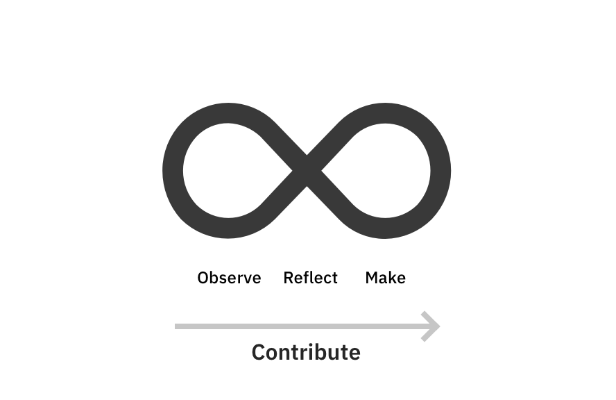
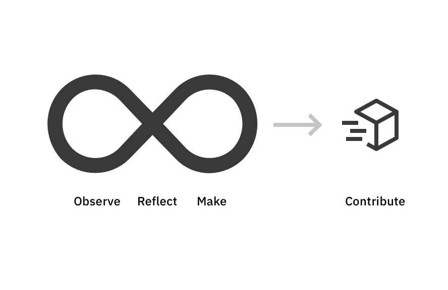

import {
  Office,
  Summit,
  PlayerFlow,
  TargetArea,
  Networking_02,
  CodeSyntax,
} from '@carbon/pictograms-react';

<PageDescription>

Our design system thrives when designers and developers contribute their assets to benefit everyone. This contribution mindset framework provides methods and tools that help create and share new assets. The guidance covers the end-to-end process, from initial research to the design, development, and contribution phases.

</PageDescription>

<AnchorLinks>
  <AnchorLink>The mindset</AnchorLink>
  <AnchorLink>The framework</AnchorLink>
  <AnchorLink>The values</AnchorLink>
</AnchorLinks>

## The mindset

When you are planning on creating a new asset, it's best to start with the mindset that it will be used not only by your product but also contributed to Carbon for IBM Products for others to benefit from.

A common mistake is to put off thinking about the possibility of contributing the new asset until after it has been designed and developed. By adopting a contribution mindset from the outset, you will likely save yourself a lot of work in the long run.

By adopting a contribution mindset, custom assets can be designed, developed, and shared via our design system much more easily and quickly.

<Row>
<Column colLg={6}>
<DoDontExample type="do" caption="Do adopt the contribution mindset from the start of your design and development process.">

</DoDontExample>
</Column>
<Column colLg={6}>
<DoDontExample type="dont" caption="Do not postpone thinking about contributing your asset until the end of the project. Doing so will likely result in more re-work and ultimately make successful contributions less likely.">

</DoDontExample>
</Column>
</Row>

## The framework

The contribution framework is a series of activities that help teams produce new assets that are consistent with our other assets and standards. There are four sections in the framework:

<Row>
  <Column colSm={2} colMd={4} colLg={3} noGutterSmLeft noGutterMdLeft noGutterLgLeft>
    <StepCard
      title="Intent"
      pictogram={PlayerFlow}
      href="../contribution-framework/intent"
    >
      Focus on user empathy by defining clear pain points and problem statements, along with a to-be scenario
    </StepCard>
  </Column>
  <Column colSm={2} colMd={4} colLg={3} noGutterSmLeft noGutterMdLeft noGutterLgLeft>
    <StepCard
      title="Scope"
      pictogram={TargetArea}
      href="../contribution-framework/scope"
    >
      Get to know more about user needs, existing resources, and similar use cases, and sync with the DSAG team
    </StepCard>
  </Column>
  <Column colSm={2} colMd={4} colLg={3} noGutterSmLeft noGutterMdLeft noGutterLgLeft>
    <StepCard
      title="Iterate"
      pictogram={Networking_02}
      href="../contribution-framework/iterate"
    >
      Use the knowledge you gained in the first two sections to iterate on your designs
    </StepCard>
  </Column>
  <Column colSm={2} colMd={4} colLg={3} noGutterSmLeft noGutterMdLeft noGutterLgLeft>
    <StepCard
      title="Develop"
      pictogram={CodeSyntax}
      href="../contribution-framework/develop"
    >
      Build your designs in code, following our best practices
    </StepCard>
  </Column>
</Row>

## The values

<ExpressiveOverview
  title="Cross-organizational alignment"
  pictogram={Office}
  color="blue"
>
  <ExpressiveOverviewCard title="Teamwork">
Adopting a framework allows for clear expectations and fluent alignment between team members.
  </ExpressiveOverviewCard>
  <ExpressiveOverviewCard title="Consistency">
Delivering a seamless user experience across products to our customers.
  </ExpressiveOverviewCard>
  <ExpressiveOverviewCard title="Contribution">
Non-standard assets that aren't contributed to our shared design system lead to inefficiencies as others often go on to create similar assets. And if similar assets are created and shared, your team might well have to adopt those in the future.
  </ExpressiveOverviewCard>
</ExpressiveOverview>

<ExpressiveOverview
  title="Business goals"
  pictogram={Summit}
  color="magenta"
>
  <ExpressiveOverviewCard title="Consistency" href="https://ibm.ent.box.com/file/896146828905?s=8q1f169rrn3d9nvyeuwl7k9cszaoxm1c">
Our value as an organization is rooted in our ability to create meaningful solutions and tools for our customers.
  </ExpressiveOverviewCard>
  <ExpressiveOverviewCard title="D&UX review scores" href="https://pages.github.ibm.com/cdai-design/dux/">
During a D&UX review, the reviewers asses a product's UI and workflow, and highlight anything that doesn't follow predefined guidelines.
  
Getting a review of your custom asset early on will help ensure that it's set up for successful contribution.
  </ExpressiveOverviewCard>
</ExpressiveOverview>
