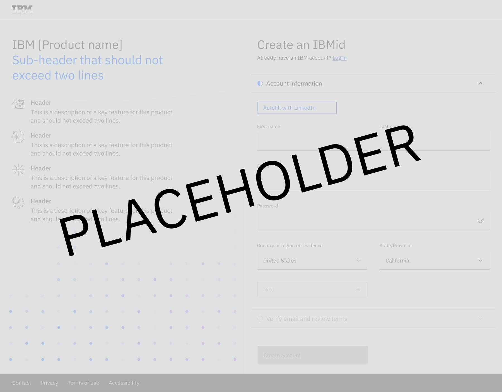

<!-- PLEASE DO NOT DELETE OR MOVE THIS FILE -->

<PageDescription>

This page is a template for the NLG team submitting new and updated pattern flows to PAL.

</PageDescription>

Note: This page is not listed in the navigation menu.

*_note to Content Designers: Be sure to repeat any overlapping/duplicative guidance from any other sections or pages exactly_

## “Flow name + Try offer + user scenario” 
_for example “Onboarding flow for a Sandbox Trial bought on AWS marketplace”_

Add a brief description about the flow here. It should be a short paragraph which answers:
- What goal does it help the user achieve?
- Is there anything to highlight given this user scenario?
- Is there anything else teams should note?

## Milestones of this flow

#### “Milestone name” _for example “Register the user”_

Add a description of the first milestone in the flow here. It should be brief and answer:
- What is the goal we are helping the user achieve?
- Why is this milestone necessary in this particular flow? 
- What patterns and components should be used to achieve this milestone?

    - **“Pattern name”** _for example “URX form”_
    - What are best practices for this component? (Things design/content need to keep in mind)
    - What is the use case(s) to choose this pattern over other options?
    - **“Pattern name”** _for example “Sandbox modal”_
    - What are best practices for this component? (Things design/content need to keep in mind)
    - What is the use case(s) to choose this pattern over other options?

    

#### “Milestone name” _for example “Welcome the user”_

Add a description of the second milestone in the flow here. It should be brief and answer:
- What is the goal we are helping the user achieve?
- Why is this milestone necessary in this particular flow?
- What patterns and components should be used to achieve this milestone?
    - **“Pattern name”** for example “Welcome modal”
    - What are best practices for this component? (Things design/content need to keep in mind)
    - What is the use case(s) to choose this pattern over other options?
    - **“Pattern name”** for example “Carousel”
    - What are best practices for this component? (Things design/content need to keep in mind)
    - What is the use case(s) to choose this pattern over other options?

    

*_continue same structure for all milestones and patterns_

## Examples to reference
#### **“Product name 1 + pattern name”** _for example “Security inline tip”_
Include a screenshot and brief description why this is a strong example. 

#### **“Product name 2 + pattern name”**
Include a screenshot and brief description why this is a strong example.